# 100 Buckets Solution

## Derk

1. Open the tools folder ---> SysInternals  and then run Procmon64

    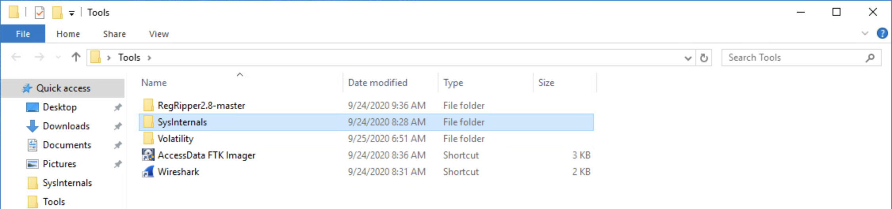

    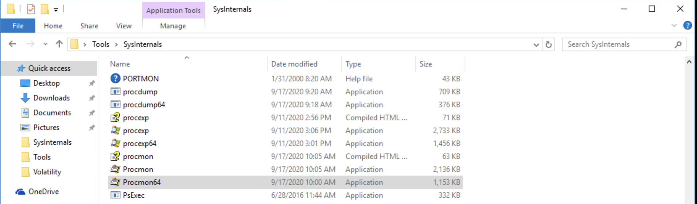

2. Search Procmon64 output for `HKCU\Software\Microsoft\SkyDrive\bkf`

    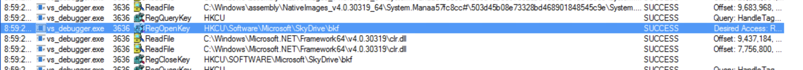

3. Open regedit and navigate to the registry folder identified in Procmon64

    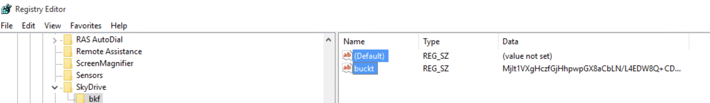

3. Copy the encryption key text from the "buckt" registry's value

    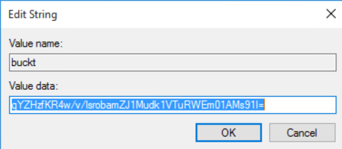

4. As depicted in the picture below, open Powershell and use `Import-Module` on `decrypt_file.ps1`. Then use the key to decrypt the `aaa_master.txt.buckt` file.
    
    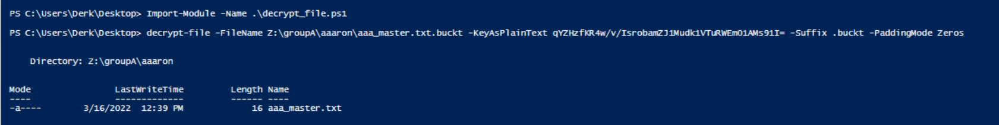

5. Open the `aaa_master.txt` file to obtain the answer:
    - `fZMMouATLEZ4`

## Lydia

1. Open wireshark and observe traffic with your ip address.

    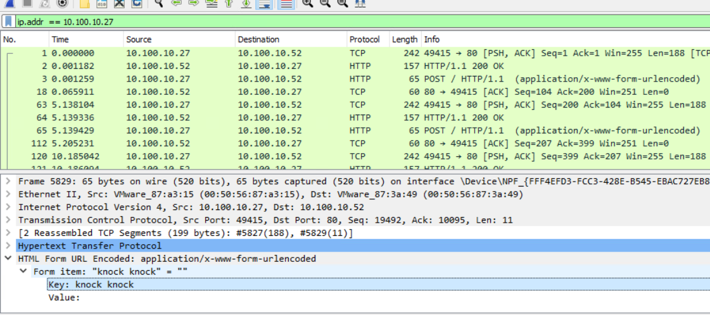

2. Notice the HTTP POST requests going out to `10.100.10.52`. The key is in the User Agent string of the request

    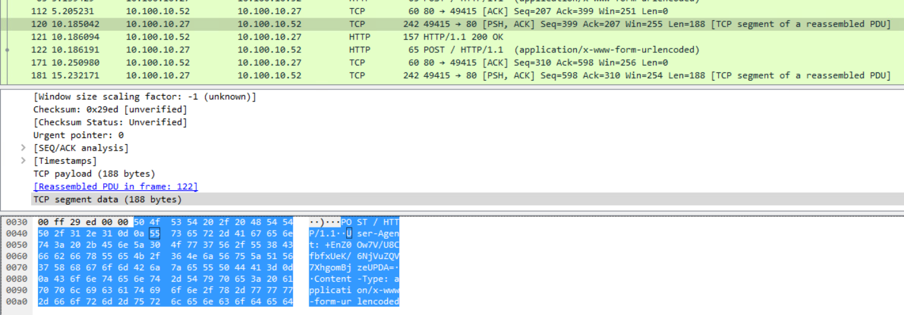

3. Same as the previous challenge section, open Powershell and use `Import-Module` on `decrypt_file.ps1`. Then use the key to decrypt the `aaa_master.txt.buckt` file.
    
    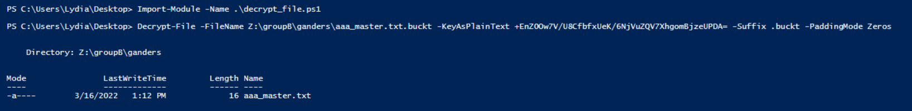

6. Open the `aaa_master.txt` file to obtain the answer:
    - `JmFIhPiDrUMI`

## Axel

1. Capture a memory image of the machine using FTK Imager 

    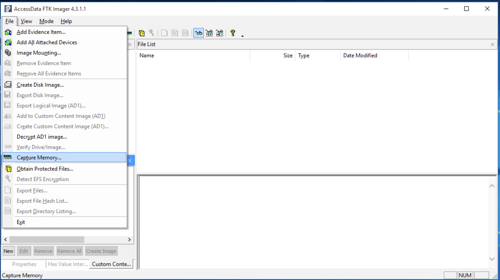

    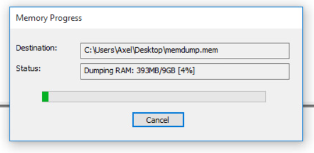

2. Open a command prompt and use Bulk Extractor to carve out the AES keys

    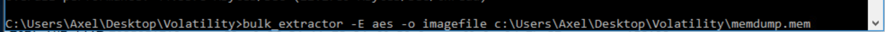

3. Navigate to the Bulk Extractor output folder that was created and open the AES text document.

    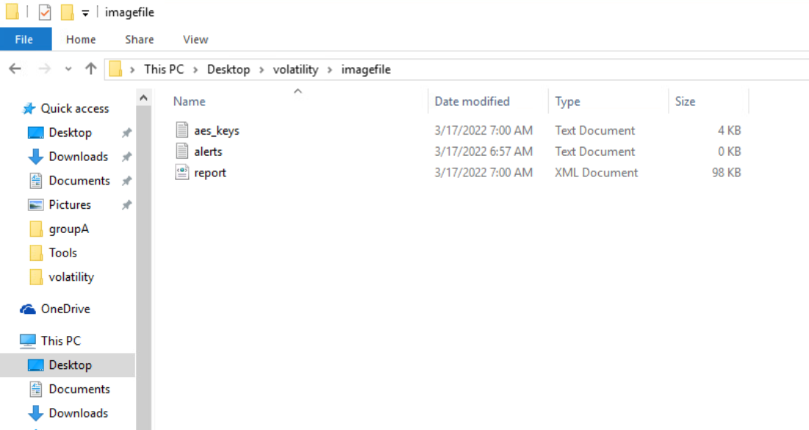

    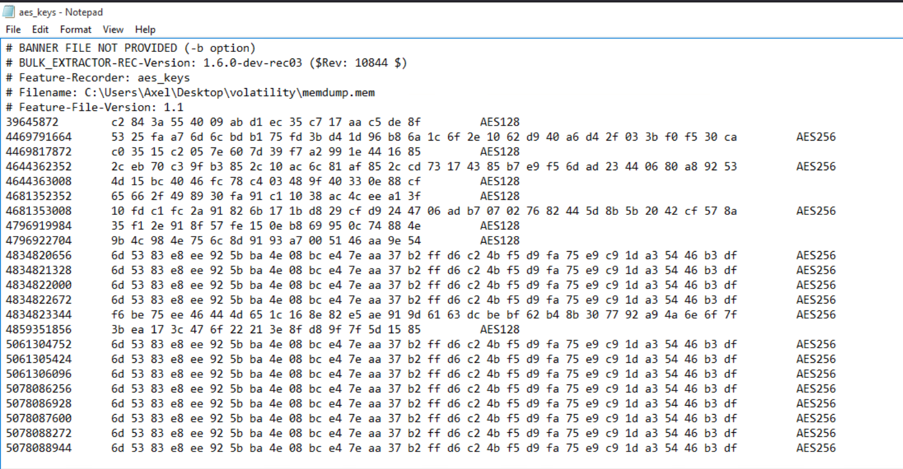

4. Decode AES hex key(s) from the text file into Base64. This can be done offline 
    - e.g. base64.guru/converter/encode/hex

5. Same as the previous challenge section, open Powershell and use `Import-Module` on `decrypt_file.ps1`. Then use the Base64 key from the last step to decrypt the `aaa_master.txt.buckt` file.

6. Open the `aaa_master.txt` file to obtain the answer:
    - `UBfutmi2Si5w`
