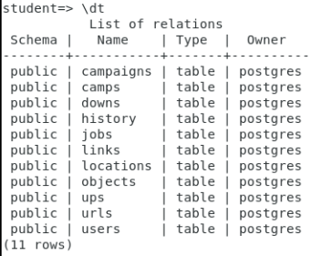
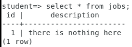
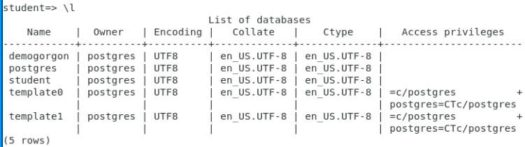
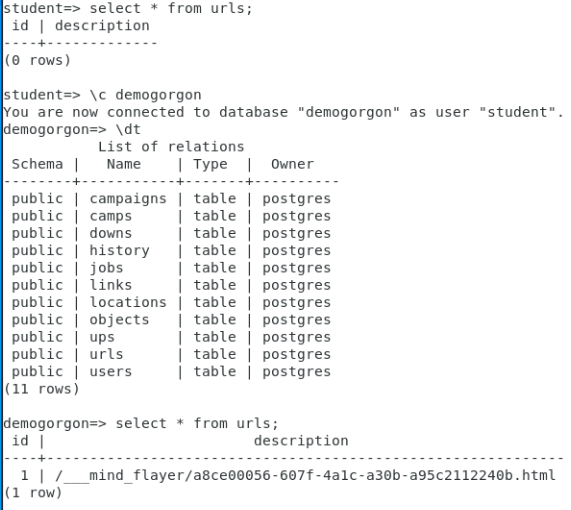

# Hawkins Solution

## 1. Connect to home box

    Find help.txt file in Downloads directory

    open help.txt

How do you block a search engine spider? Ah, robots.txt!

## 2. robots.txt

    $ curl http://2.17.192.220/robots.txt  > robots.txt
    $ sha1sum robots.txt

Returns: 9e70712072c309c9035cc9beede119883f647d29
Cipher is Baconian (mk) and returns: mkultra

which provides your first link: http://2.17.192.220/9e70712072c309c9035cc9beede119883f647d29mkultra

## 3.First link

Nothing on page, so view page source, indicates need to find other directories, but no indication how.
OK, look at referenced files, image is just an image, style has one strange entry: a95b4c55e-f05e-4e0e-a815-660519437ee1

http://2.17.192.220/a95b4c55e-f05e-4e0e-a815-660519437ee1

## 4. Second link

Looks just like first link, but image url is reversed. This image hides a message for third link, write some steganography code in python to decode:

http://2.17.192.220/a7a95fd99-32be-47dd-80bb-accd93617221/a7a95fd99-32be-47dd-80bc-accd93617²21.html

1. Download image
2. Write some simple python (run as root in the hosted environment VM):

```
from stegano import lsb

print(lsb.reveal("i.png"))
```

## 5. Third link


"warning! The login is controlled. severe punishment for misuse."

Hmm, what else is in the source?

<form action="login.html"></form>

## 6. Forth link

http://2.17.192.220/a7a95fd99-32be-47dd-80bb-accd93617221/login.html

Hmm, text is not normal.

ImZyaWVuZHMgZG9uJ3QgbGlrZSIgc2FpZCBBbGV4ZWkuIEFsZXhlaSBhbHNvIHNhaWQgdGhhdCBoYXdraW5zIGlzIGxpa2UgYXJ0ZWsuIG9uY2UgaSB3ZW50IHRvIHlvdW5nIHBpb25lZXIgY2FtcCBhdCBhcnRlayBvbiB0aGUgYmxhY2sgc2VhIGFuZCBzYXcgd2hhdCBpIGNvdWxkIGJlY29tZS4KeW91IG1pZ2h0IHNheSB3ZSBoYXZlIGNvbWUgZnVsbCBjaXJjbGUuIHRoZSBpbWFnZSBoaWRlcyB0aGUgbmV4dCBnYXRlLg

base64 to text -->

"friends don't like" said Alexei. Alexei also said that hawkins is like artek. once i went to young pioneer camp at artek on the black sea and saw what i could become.
you might say we have come full circle. the image hides the next gate.

Python:

```
from stegano import lsb

print(lsb.reveal("j.png"))
```

Shows:

```
Purpx Qngnonfr ba freire. Gur bar obear bhg bs gur bevtvany Vaterf cebwrpg.
```

decode rot13:

```
Check Database on server. The one borne out of the original Ingres project.
```

## 7. Postgres Database

    $ psql -h 2.17.192.220 -U student









## 8. Final link

`http://2.17.192.220/___mind_flayer/a8ce00056-607f-4a1c-a30b-a95c2112240b.html`

Shall we play a game?

A string:

1.  Fifth letter of last name of CMU alumni that wrote filemon and procmon
    MARK RUSS*I*NOVICH
2.  Third letter of programming language created by van Rossum
    PY*T*HON
3.  Fifth letter of name of community linux distribution supported by Red Hat, not Debian
    FEDO*R*A
4.  Third letter of first name of famous security reporter Krebs
    BR*I*AN
5.  Last letter of last name of current NSA director
    NAKASON*E*
6.  First letter of the last name of the inventor of the famous WW2 German encryption machine
    ARTHUR *S*CHERBIUS
7.  Fourth letter of first name of famous MIT academic papers hacker
    AAR*O*N SWARTZ
8.  First letter of three-letter unix language for pattern scanning and processing
    *A*WK
9.  First letter of 5 letter American nonprofit organization responsible for databases related to DNS
    *I*CANN
10. Last letter of four-letter protocol used to serve the original usenet
    NNT*P*
11. First letter of SQL command that gets specific data from a specific table
    *S*ELECT
12. GOLANG is \_-ally typed (fifth letter)
    Stat*i*cally
13. Last letter of last name of Perl programming language creator
    Larry WAL*L*
14. First letter of the name of a free and open-source network scanner created by Fyodor Vaskovich
    *N*MSP
15. Fifth letter in curl creator's first name
    DANI*E*L STENBERG
16. First letter of missing verb: GET, HEAD, POST, PATCH, PUT, TRACE, CONNECT, OPTIONS, \_
    *D*ELETE
17. Rake files in Ruby were modeled off this predecessor - first letter
    *M*AKE
18. Famous complex malware that targets nuclear centrifuges - fifth letter
    STUX*N*ET
19. First letter of the subject line in the lovebug worm made famous at the turn of the century
    *I*LOVEYOU
20. Single letter flag for active connections when using netstat
    `-*N*`
21. Last letter of acronym indicating Windows global address system, often a good source for spamming
    GA*L*
22. Last letter of Windows Visual Basic script files extension
    VB*S*
23. Second letter of Andreessen's first web browser
    M*o*siac
24. Last letter of famous worm that prompted the creation of CERT
    MORRI*S*
25. First letter of 8 bits
    *B*YTE
26. Third letter in Ross Ulbricht's nick
    DR*E*AD PIRATE ROBERTS

    `itriesoaipsilnedmninlsosbe`

## 9. Rail cipher

```
itriesoaipsilnedmninlsosbe ==> interdimensionalispossible

itriesoanedmninlipsilsosbe/interdimensionalispossible.zip

interdimensionalispossible
```

## 10. Unlock final zip

1. Find zip = http://2.17.192.220/itriesoaipsilnedmninlsosbe/interdimensionalispossible.zip
2. Enter password `interdimensionalispossible`
3. Text file!

## FLAGS

Player will likely get in sequence:

```
1. hawkins{9e70712072c309c9035cc9beede119883f647d29mkultra}
2. hawkins{a95b4c55e-f05e-4e0e-a815-660519437ee1}
3. hawkins{a7a95fd99-32be-47dd-80bc-accd93617^221}
4. hawkins{f7023200-6d44-4d1d-ba3b-e9262b9e75383c011c65-55b7-4f5b-b2a2-ad43e595f174}
5. hawkins{ef1cb9f6-ec1f-42fc-8f67-000929e23163f0dd9ea4-3d67-461a-b29a-45b9169e01431e36a889-ac5b-4ab3-be65-d5af2c2d016b}
```
