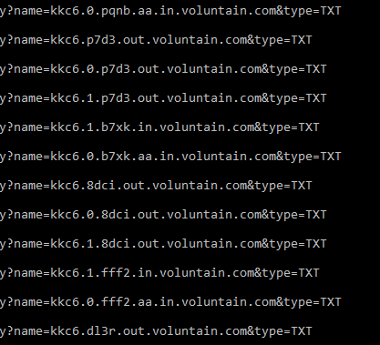
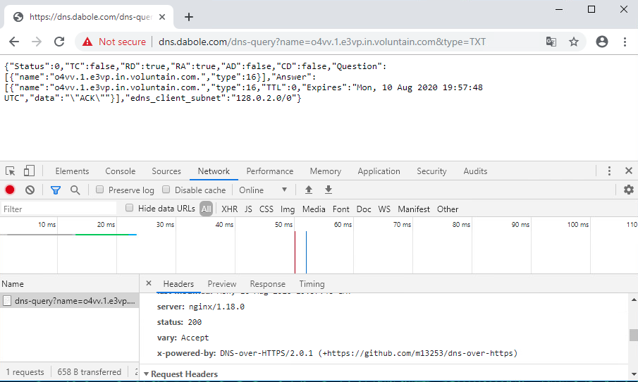

# Kill the Red Paladin Solution

1. Login to Betty's workstation and after a few minutes a task will start. It will establish a C2 connection getting its DNS via an HTTPS connection, but it won't be obvious where the DNS queries are occurring:

   

   Team has access to a local version of wireshark to confirm queries.

2. Queries to dns.dabole.com show the DNS address used by the malware to connect to its C2 (which one cannot see in the malware window), and can be confirmed by taking one of these queries to Chrome and observing its response:

   

   Whereas the dns domain (1) voluntain.com is contained in the body, as is (2) edns_client_subnet.

3. The server software and version (3) is in the response headers as x-powered-by.

4. Can you force that dns software to reveal an error code? What is that error hash code?

   The dns server expects queries to be in the format of hash.number.hash.in|out.voluntain.com. So any query of the form hash.non-number.hash will cause it to error, for example:

   `x.hello.y.in.voluntain.com`
