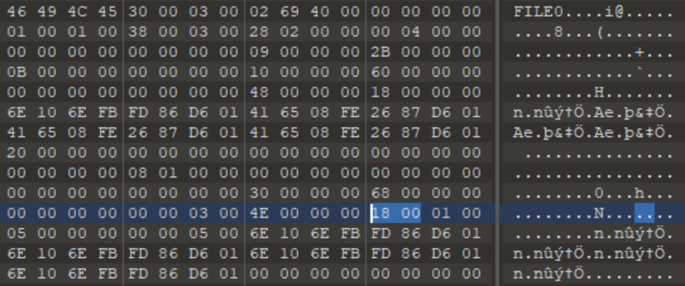
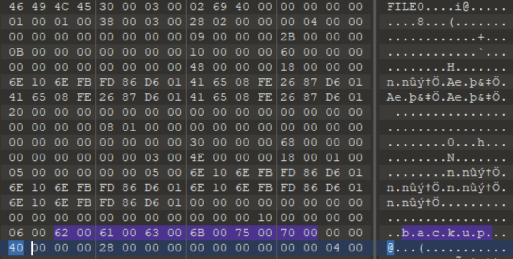

# Treasure Hunt Solution

The first step is to determine the file system for both images. Open the drives in `autopsy` and find that both images are APFS formatted.

## Question 1

**Find data from file slack.** File slack, which is also called slack space, is the leftover space that exists on the hard disk when a file does not use/need all the of the space allocated to it by the OS. 

1. Find the image(png/jpeg) files located in `/Users/johnsmith/Downloads/` folder in the `laptopimage.dd`.

   There are four such images.

2. Click on one of the images, and then select `File Metadata` from the bottom section.

3. Look for `Starting address` and `length` information from the metadata section.

   

   Starting address defines the block number where the file content starts on the disk, and length is the number of blocks it uses. 

   So, for `Chocolate-Raspberry Cake.jpeg` the starting address or block number is `988280` and it uses `21` blocks.

   This same information can also be found using just the sleuthkit tools that are also loaded on the Windows analyst VM.

4. Find the block size for this disk. Sleuthkit tools will be needed to do so. 

   

   1. Run `mmls` against the `laptopimage.dd` to view the partition table. Find the offset where the APFS container is starting which in this case is `409640` sector. 
   2. Use the offset for APFS container and run `pstat` against the disk. The output will determine the block size for the container which in this case is `4096` bytes.

5. Note that the starting block address that was found earlier is from the start of the APFS container (sector 409640). 

6. Next, find the starting byte offset for the file `Chocolate-Raspberry Cake.jpeg`

   - `409640*512 + 988280*4096` = `4257730560`
      - (starting sector of APFS container * sector size    +    starting block number * block size)

7. Similarly, find the ending byte offset for this file.

   - `409640*512 + (988280+21)*4096`= `4257816576`
      - (starting sector of APFS container * sector size    +    (starting block number + length) * block size)

   This is to say that the `Chocolate-Raspberry Cake.jpeg` file is saved from `4257730560` to `4257816575` byte on the disk. 

8. Open the disk in a hex editor, and jump to the ending byte offset `4257816576`. 

   

   Use the Goto arrow from the top menu, type in the byte offset at the bottom left corner, and make sure to select Decimal next to it.

   The last byte allocated to this file is  `4257816575`. Check the last 2-4 bytes to find a part of the answer string. This file stores `per`. 

   Similarly, hidden data can be found in the other 3 jpeg/png files, then concatenate the data based on ASCII order of filenames.

## Question 2  

According to the challenge description, it says that the data is hidden in NTFS Alternate Data Streams. Neither image is NTFS formatted, and there are no files in the APFS formatted USB drive. Looking at the dates for the USB Drive it shows it was formatted 2 days before it was acquired. 

Maybe the USB drive was previously formatted with NTFS? Check to see if that is the case and if there are any remnants of the previous file system.

Master File Table (MFT) is a database that stores information about every file and folder in an NTFS file system. There is an MFT entry for each file and folder stored in the NTFS volume. The magic number or file signature for an MFT entry is `FILE`.

1. Open the USB image using a hex editor and search for the hex bytes corresponding to `FILE` which are `46 49 4C 45`

   

   There are a lot of occurrences. Not all but a lot of them are for MFT entries. That shows that the drive was previously formatted as NTFS. 

   Now look for Alternate Data Streams. Each MFT entry will have to be analyzed. Since there are a lot, it is better to script this part of the challenge. The idea is to know how to parse an MFT entry to find if there is any alternate data stream present in the file/folder represented by the MFT entry.

2. Following is the analysis of a single MFT entry:

   For the explanation, we'll refer to this [basic concepts of NTFS page](https://flylib.com/books/en/2.48.1/basic_concepts.html).

   1. Each MFT entry is 1024 bytes in size and contains an MFT header and attributes. Each attribute contains an attribute header and attribute contents.
      - Refer to figure 13.2 in the link for a picture of an MFT entry containing MFT header, attribute headers, attribute contents.

   2. The MFT header looks like the following - _refer to table 13.1_

      1. Byte offset 0-3 contains the file signature, which is `FILE` for MFT entry

      2. Byte offset 20-21 determines the offset to first attribute

      3. Byte offset 22-23 determines if it is a file or a directory and if it is allocated or deleted

         

      4. From the MFT header, we get to know about file/directory and if it is allocated/deleted. We also know the offset to the first attribute.

   3. At this time, we need to start looking into attributes. First, look at attribute header which is 16 bytes long. _Refer to table 13.2_

      1. Byte offset 0-3 determines the attribute type. 
            - We are looking for just $FILE_NAME attribute and $DATA attribute. $FILE_NAME attribute as this contains the filename or folder name, and $DATA attribute to extract the alternate data stream.

            - The attribute type identifier for $FILE_NAME is `48` which in hex is `30`

            - The attribute type identifier for $DATA is `128` which in hex is `80`

            - Keep in mind that an MFT entry for file contains a $DATA attribute which represents the file's contents. It doesn't matter whether the file contents are resident in the MFT entry or not. The MFT entry for a folder does not contain any $DATA attribute. Therefore, if an MFT entry for a file contains more than one $DATA attribute or an MFT entry for a folder contains any $DATA attribute, that means that that file/folder contains an alternate data stream.

      2. Byte offset 4-7 contains the total length of the attribute.

      3. Byte offset 8 tells if the attribute is resident in the MFT entry or not. 
         - `0x00` means resident 
         - `0x01` means non-resident.

      4. If it is a resident attribute then follow the data structure at _table 13.3_, and if it a non-resident attribute then follow the data structure at table _13.4_.

      5. Use _table 13.7_ in this [standard file attributes page](https://flylib.com/books/en/2.48.1/standard_file_attributes.html) for data structures of the $FILENAME attribute. This is required for finding the filename or folder name. The filename/ foldername length in unicode characters is present at byte offset 64 and the filename and folder name itself starts at byte offset 66.

   Take this example of an MFT entry: 

   Here is the initial part of an MFT entry from the USB drive.

   

   1. Byte 0-3 contains the file signature (`FILE`)

      

   2. Byte 20-21 after reversing the order becomes `0x0038`, which in decimal becomes `56`. That means the 1st attribute starts at the 56th byte. 

      

   3. Byte 22-23 after reversing the order becomes `0x0003`. Based on the image above, this represents an allocated directory. So, this is an MFT entry for an allocated directory (directory was in use in the previous file system)

      

   4. Now traverse to the 1st attribute which starts at the 56th byte. 

      

   5. Following _table 13.9_ from the link above, the four bytes (0-3) represents attribute type header which after reversing the order of bytes is `0x00000010`. This in decimal is `16`. Attribute type identifier `16` is for $STD_INFO attribute which can be ignored. 

      

   6. Jump to the next attribute. Find the size of $STD_INFO attribute. This is found in bytes 4-7 as highlighted below which is equal to `0x00000060`. This is `96` in decimal.

      

      That means the highlighted portion below is all of $STD_INFO attribute

      

   7. The next attribute starts right where the $STD_INFO ends.

   8. The first four bytes (0-3) provides the attribute type identifier, which in this case is `0x00000030`. This is `48` in decimal. `48` means it is $FILENAME attribute. It must be analyzed further to get the filename/folder out of it. In this example, it is the folder name. 

      

   9. The next four bytes (4-7) is the length of the attribute which is equal to `0x00000068` (`104` in decimal)

      

   10. Byte 8 represents if it is a resident attribute or not. `0x00` means it is a resident attribute.

       

   11. Byte 20-21 as highlighted below represents the offset to $FILE_NAME attribute content, which is `0x0018` (`24` in decimal). This means that content for $FILE_NAME attribute starts at the 24th bytes from the beginning of $FILE_NAME attribute.

       

   12. The highlighted byte is where $FILE_NAME attribute content starts.

       

   13. At this point, follow the data structure for $FILE_NAME attribute. The 64th byte represents the length of file/ folder name in unicode characters. The 64th byte from the beginning of where $FILE_NAME attribute content starts. 

       It is `0x06` (`6` in decimal) for this example, which means the folder name is 6 characters long in unicode.

       

   14. The file/folder name starts at the 66th byte. The length of file name is 6 characters. Multiply this by 2. Extract 12 bytes starting at the 66th byte. This is also highlighted in the previous screenshot.

       That means the name of the folder is `backup`

   15. Now to get to the next attribute. To do this, jump `104` bytes (refer to point 9 above) from the beginning of the $FILE_NAME attribute. 

   16. The next attribute starts where the $FILE_NAME attribute ends. 

       

   17. Again, the first four bytes (0-3) represent the attribute type identifier (`0x00000040`). Since it is neither $FILE_NAME nor $DATA attribute, this attribute can be ignored.

       

   18. The next four bytes (4-7) provides the size of this attribute (`0x00000028` = `40`). Jump `40` bytes from the beginning of this attribute to get to the next attribute. 

       

   19. Highlighted bytes are what represent the attribute type identifier for this next attribute which is `0x00000080` (= `128`), which is equivalent to the $DATA attribute. As mentioned above, an MFT entry for a folder does not have a $DATA attribute, and if it does then it is an alternate data stream. Analyze this attribute further.

       

   20. Byte 16-19 represents the size of the content, which is `0x00000006` (= `6`), and byte 20-21 represents the offset where the content starts (`0x0020` = `32`).

       

   21. 6 bytes from the 32nd byte is highlighted below. The highlighted text is what was added to the alternate data stream of the `backup` folder. 

       

       Similarly, all of the MFT entries that are present in the USB Drive need to be analyzed. 

       It will be easier to write a script to parse each MFT entry and verify if there is any Alternate Data Stream (ADS) present in any file or folder. If so, extract the ADS and the file name. 

   Afterwards, concatenate the ADS found from multiple files/folders by arranging them in ASCII order of file/folder names. 

   An [example solution script](./example_solution.py) is available for review.

## Submission

1. `perseverance`
2. `_r1sht3-m31n.t0h_hum)tumhar3(b44p*l4gt3!ha1n_`
