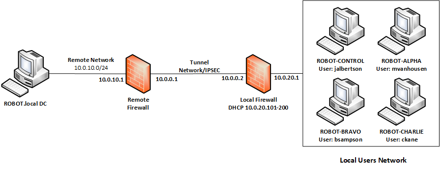

# Worst. Network. Ever.

In this challenge, the team must integrate a replacement firewall system from scratch and then restore a networking tunnel to a secondary site as well as restore domain connectivity to a set of systems, which may also have a host of networking issues to resolve.

**NICE Work Role:**

  - [Network Operations Specialist](https://niccs.cisa.gov/workforce-development/nice-framework/workroles?name=Network+Operations+Specialist&id=All)

  - [Cyber Defense Infrastructure Support Specialist](https://niccs.cisa.gov/workforce-development/nice-framework/workroles?name=Cyber+Defense+Infrastructure+Support+Specialist&id=All)

**NICE Tasks:**

  - [T0335](https://niccs.cisa.gov/workforce-development/nice-framework/tasks?id=T0335&description=All) - Build, install, configure, and test dedicated cyber defense hardware.

  - [T0081](https://niccs.cisa.gov/workforce-development/nice-framework/tasks?id=T0081&description=All) - Diagnose network connectivity problem.

  - [T0129](https://niccs.cisa.gov/workforce-development/nice-framework/tasks?id=T0129&description=All) - Integrate new systems into existing network architecture.

## IMPORTANT

This challenge does not have any downloadable artifacts. You may complete this challenge in the hosted environment.

## Background

The Robot's Underground Prison and Baseball Card Shop's network was completely decimated during a cyber attack by Fang and Phobos, two interdimensional aliens seeking the destruction of human civilization. Fortunately, no humans were injured during the attack. The same cannot be said about the shop's networking infrastructure and systems.

The shop relies on a remote domain controller, which is only accessible via an IPSEC  tunnel between the local and remote firewalls. The local firewall was completely destroyed and you must configure the replacement, which has only a partially functioning backup to restore to. You must also identify and resolve a series of confounding networking issues on the shop's three workstations. These issues did not appear until the attack, which appears to have altered the systems' networking configurations by use of some digital death ray. Only when these systems can reconnect and logon to the domain successfully will you be able to access the tokens on each desktop. Luckily, a control workstation was left unscathed by the digital death ray and should reconnect to the domain once the firewall is properly configured as a test.

You have been given the following network map image:

The firewall must be fixed first, as there is no connectivity to the DC otherwise. The local firewall was restored from a backup, though it is unclear what state this backup is in, or whether it was taken before or after the attack. You should verify its configuration and resolve any issues first before trying to connect any systems to the domain. The FW should employ a DHCP server for the LAN with an address space of 10.0.20.101-10.0.20.110. This will ensure that the workstations receive a valid address and the remote firewall only accepts traffic from this range. The Control workstation has no networking errors, though you may still need to initially configure an IP address on this system to use the firewall web configurator initially.

The distant firewall also requires an IPSEC tunnel. Ensure the remote gateway and networks are set correctly, but leave all other settings as the default. The secret/pre-shared key is `tartans`. Also use AES256, SHA512, and a 4096-bit Diffie Helman group settings to match the distant encryption settings. You may need to set IPSEC firewall rules as well. If set correctly, the IPSEC tunnel should automatically establish itself. You can verify this under "Status - IPSEC".

If you can ping the remote domain controller from the control workstation, this is a good sign that you should be able to login to the domain using the correct domain user for the Control system. This will verify that the firewall is configured properly in order to continue the challenge. On the Desktop of the control system you will find one token file.

Next, login to each remaining  system using the local admin 'user' account in order to check and fix any local networking issues or misconfigurations. Not all machines afford the same permissions, so you must use what you can to achieve your goal.

Once you can successfully and repeatedly ping the distant domain controller from these systems, you should be safe to logon to the domain with each of the three domain accounts below, according to their respective system. If you can ping the DC, but not login, then there may be a local configuration requirement yet to be resolved. On the Desktop for each user you will find a token file.

You do not have the required administrative privileges to change any domain or domain security policies, or anything controlled by the super admin accounts. This is intentional.

## Winning Conditions

In order to receive full credit for this challenge all four tokens must be retrieved which required restoring connectivity to the DC and logging into four (4) domain workstations using the respective domain accounts.

## Submission Format

Each token found within this challenge will consists of a 12-character string made up of lowercase letter and numbers. The lowercase l and the number 1 have been removed to eliminate any confusion between the two.

## Hints
Think beyond simple IP settings.

Can you ping it?

Can you really ping it?

Can you connect to it?

Remember that the "user" admin account is a local account only, not a domain account, so you must logon as such.
