# Worst. Network. Ever. Solution

## Find and Correct the Various FW Issues and Misconfigurations

First, the team must check the firewall configuration to see what is
correct and what is incorrect. These steps can generally be discovered in any order but some configuration changes will require others to be made first. Remember to save and apply changes often.

Firstly, both gateways are incorrect. One should be removed and the
other should be set to 10.0.0.1.

 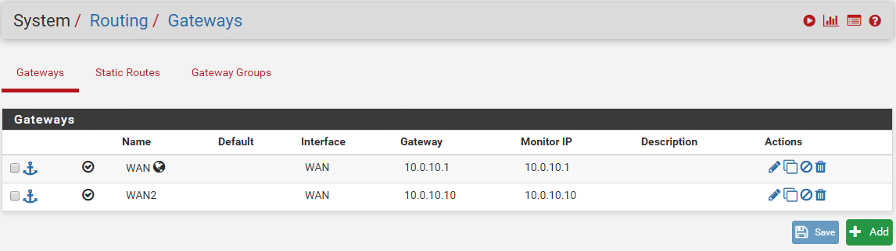

If the team attempts to change the default gateway address to 10.0.0.1,
they will receive the following warning, indicating that the WAN
interface is incorrectly configured.

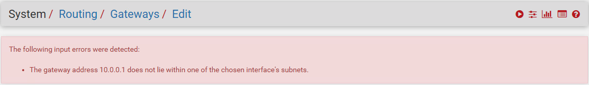

By browsing to Interfaces -> WAN, the team will notice the WAN IP
address is set to 10.0.10.2 and should be 10.0.0.2. Save and apply this
change.

Now the incorrect gateway can be fixed. Change the gateway IP to
10.0.0.1 and also notice that the gateway is marked as down. This should
be unchecked or else the system will not try to use it. Resolve both
issues and then save and apply the changes. Otherwise you must swap to the other gateway and also change the IP of that one.

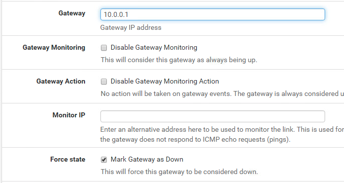

Check the DHCP server by browsing to Services -\> DHCP Server.

The first item of note is that a DHCP server is running on the WAN. This
might not affect the challenge, but it should be disabled for good
measure. Also remove the IP pools to allow the firewall to save the
server being disabled on this interface. The firewall would not allow both to be set to the same range simultaneously.

Next, check the LAN side DHCP service.

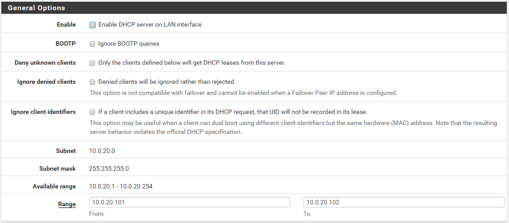

This server must be enabled by checking the top check box. The IP range
is also incorrect and only allows for 2 machines to receive addresses
while 4 machines exist in the network. This is not necessarily a
problem, as you could disconnect systems and allow a new machine to get
a lease, though it would be more annoying than simply fixing the range
to 10.0.20.101-10.0.20.110. Once these changes are made, save and apply
the changes.

The next thing to configure will be the missing IPSEC tunnel. This was
covered in a previous challenge during round 2, so teams may/should be
aware of it, but is easily looked up online. Some of these details are provided in the challenge guide text. (<https://docs.netgate.com/pfsense/en/latest/vpn/ipsec/configuring-a-site-to-site-ipsec-vpn.html>)

Browse to VPN -\> IPSEC
Click the "Add P1" button

Leave all "General Information" settings the same, but add a remote
gateway of "10.0.0.1"

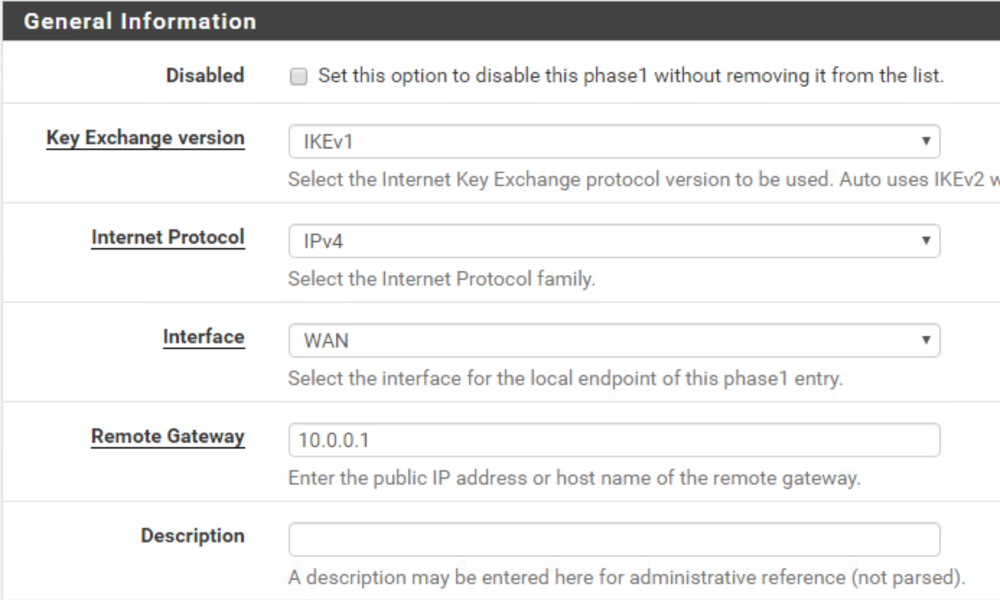

Enter the "Pre-Shared Key" of \`tartans\`

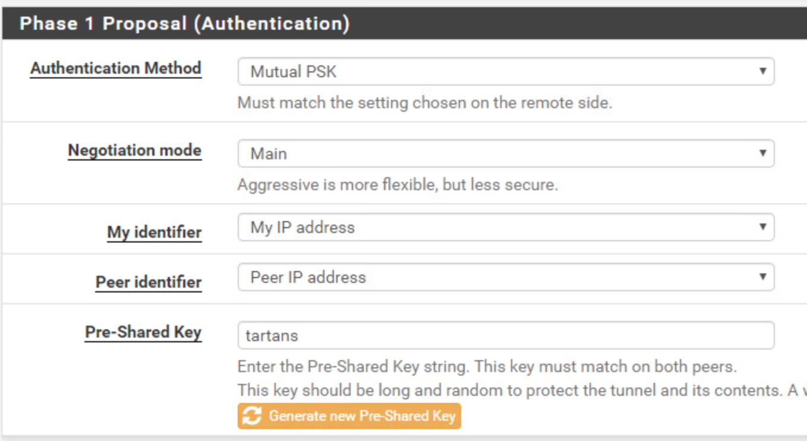

Adjust the various encryption settings to match the challenge guide

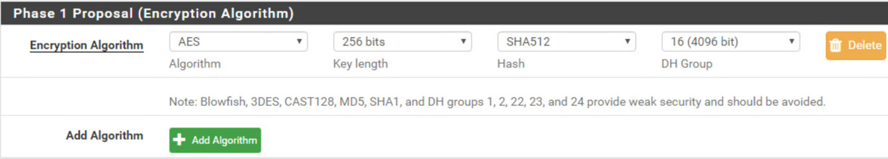

Finally save and apply the changes.

Click the button to "Show Phase 2 Entries" then click "Add P2"

Add the remote network range of 10.0.10.0/24 and leave all other setting
alone in the "General Information" section.
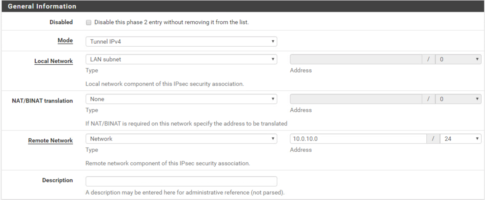

Scroll down and adjust the encryption settings to match the above
settings.

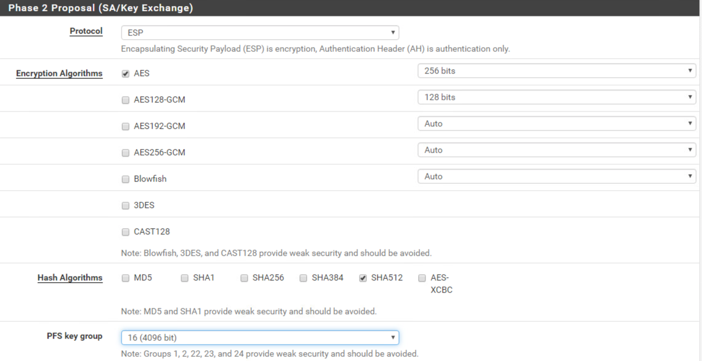

Click save and apply the changes

Browse to Status -\> IPSEC

If done correctly, the IPSEC tunnel should be established. If any of these steps are incorrect the VPN will fail to be established. This is the
only transport mechanism for traffic between the firewalls that the far
end accepts. Traffic not sent over the IPSEC tunnel will be dropped due
to the remote WAN firewall rules. Traffic outside of the DHCP range will also be dropped by the tunnel.

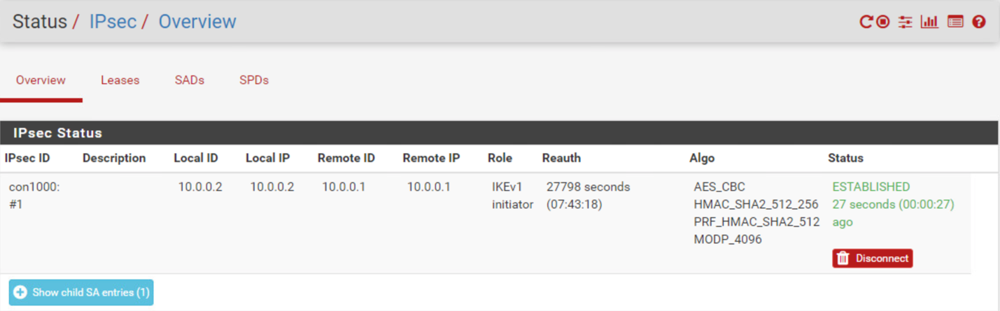

The last "gotcha" is potentially the static route to the remote network,
10.0.10.0/24. This should be configured under System -\> Routing -\>
Static Routes. Save and apply after adding. Usually, however, this is not necessary since the default gateway handles this.

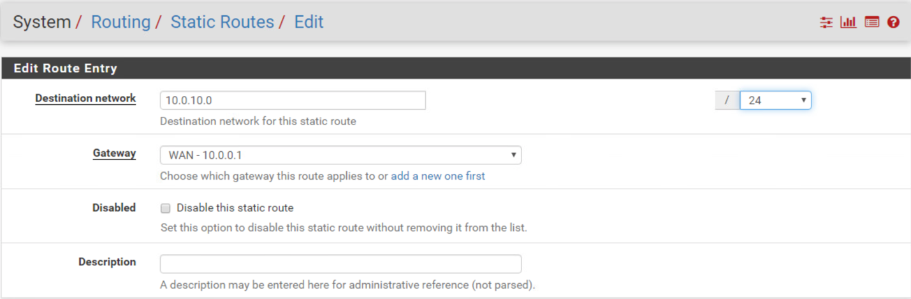

## Getting Jeff's Token

At this point, ROBOT-CONTROL should be able to ping and logon to the
domain (assuming you grabbed or have an IP within the DHCP range). This system acts as the literal control to the network, as it
has no issues to solve and no misconfigurations. As long as the firewall
has been fixed correctly and CONTROL has a valid IP this system can connect and login to the domain.

Login to ROBOT-CONTROL using the domain account `jalbertson` and a
password of `tartans@1`.

On the Desktop you will find Jeff's token file. Simply open it and
record the code for submission.

## Fixing DESKTOP-ALPHA

Logging on to the domain will fail by default, as this system has a
variety of issues to resolve.

Login instead as the local admin user, and ensure you are also logged in
to the local system (DESKTOP-ALPHA).

The system will have a valid DHCP address for the network, but still
won't be able to connect.
Pings to the DC will also fail yet the default gateway is correct.

Domain connections requires name resolution, and the system will check
these four items in order:

1. Check that the name is not itself
2. Check the HOSTS file for an entry
3. If an entry is not found, query the listed DNS server, or use a
cached DNS record
4. Send a query through NETBIOS

In the case of this machine, the DNS server is pointed to the wrong IP and additionally. the hosts files has been altered to point
to the incorrect IP address for the ROBOT domain. Further,
NETBIOS has been turned off and left without a WINS client configured to find it automatically by other means. Resolving either of these issues should allow the system to find the DC by name resolution. It is more likely that teams will discover the hosts file issue, since pinging robot.local would resolve to the
incorrect address, and then the next logical step would be to figure out
why.

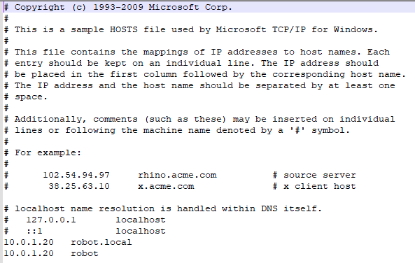

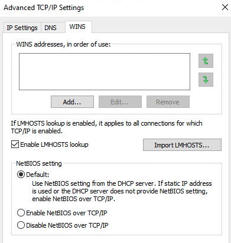

However, there is another issue at hand. A script kicked off by the user's logon actually planted a bad arp cache entry to the arp table. The fact that the system is on the proper network and has the proper gateway set, and the fact that the
Control system can ping and connect to the DC, but this system cannot, means something else is wrong with this specific system. Pings will fail to the DC and the gateway at 10.0.20.1.

It will take some sleuthing and thinking about networking, but checking
the arp cache will display that a bad MAC address is stored for the local gateway. The MAC address listed appears to be completely different from the others and the true MAC can be verified to be different on the Status - Interface section of the firewall web GUI. 

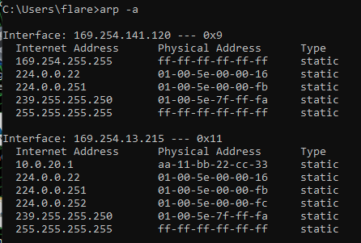
===================================================================================

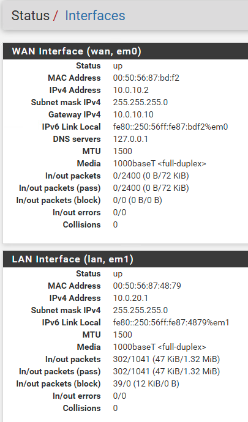

A simple flush of the ARP cache will remove the bad entry.
Further pings will populate the correct entry.

The `arp -d` command will take care of this but must be run in an
elevated command shell. Windows will warn the user of this if they
attempt to run it in the standard command shell. There is, however, no
preventative measure to stop them from doing so and they should do so.

Once this bad arp entry is removed, the system should be able to re-logon
to the domain.

## Getting Milhound's Token

At this point, ROBOT-ALPHA should be able to ping and login to the
domain.

Login to ROBOT-ALPHA using the domain account `mvanhousen` and a
password of `tartans@1`.

On the Desktop you will find Milhound's token file. Simply open it and
record the code for submission.

## Fixing DESKTOP-BRAVO

Logging on to the domain will fail by default, as this system has a
variety of issues to resolve.

Login instead as the local admin user, and ensure you are also logged in
to the local system (DESKTOP-BRAVO).

The system will have a valid DHCP address for the network, but still
won't be able to connect.

Pings to the DC will also fail yet the default gateway is correct.

Again, some sleuthing and thinking about networking will resolve this
one. The issue here is that there are bad static routes assigned to this
system. Teams may find this simply by checking the routing table, or if
they attempt to \`tracert\` to the DC, the traffic never even leaves the
local machine (you'd expect it to at least make it to 10.0.20.1).

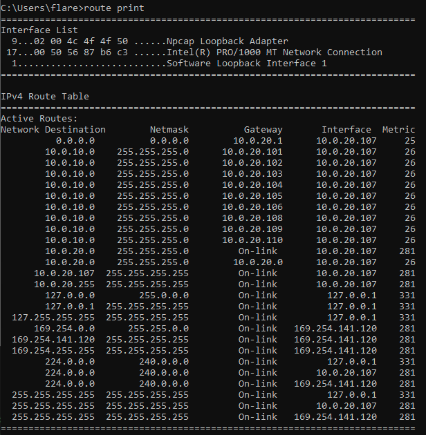

The bad part about this is that there are so many random static routes
assigned and also that the traffic is routed back to the machine itself.
This is why tracert's go nowhere.

Similar to the ARP issue above, the team can run \`route -f\` to clear
the routing table to default back to using the default gateway. Windows
will warn the user of elevated privileges if they attempt to run it in
the standard shell. There is, however, no preventative measure to stop
them from doing so.

Note that after doing so, the default gateway must be added back in. You
can do this by simply disabling/re-enabling the interface to grab the
gateway from the DHCP lease or you can add the route by the command
`route ADD 0.0.0.0 MASK 0.0.0.0 10.0.20.1`.

This will allow the machine to ping the DC, but there is still more at
play. If the team tried to logon to the domain they will still receive
the message that the DC cannot be reached.

One thing to investigate would be whether the machine can ping the
domain at robot or robot.local. The system can't and therefore DNS might
be a good next place to look.

This system happens to not have any DNS servers set and should be
pointing to the DC at 10.0.10.20. Once this entry is added to the
interface options, the system should be able to reach the DC.

## Getting Brat's Token

At this point, ROBOT-BRAVO should be able to ping and login to the
domain.

Login to ROBOT-BRAVO using the domain account `bsampson` and a
password of `tartans@1`.

On the Desktop you will find Brat's token file. Simply open it and
record the code for submission.

## Fixing DESKTOP-CHARLIE

Logging on to the domain will fail by default, as this system has a
variety of issues to resolve.

Login instead as the local admin user, and ensure you are also logged in
to the local system (DESKTOP-CHARLIE).

Once this happens however, the system is set to automatically assign the
loopback adapter as the DC's IP. Unless the team runs `ipconfig` immediately or
looks at the loopback adapter setting, they won't catch this.

What's confusing is that the system will appear to ping the DC at the start, but it
actually won't, since it is simply pinging the loopback adapter.

Firstly, the network adapter is disabled and must be re-enabled. Unlike the other two systems, this system will not come up with an IPv4
IP address. It will come up with an IPv6 address, which is unnecessary. The idea is that the team will enable
IPv4 and then set the interface to grab a DHCP address.

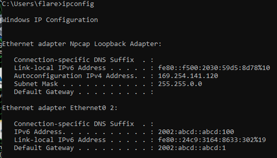

However, the firewall has an old lease tied to the MAC of this system, providing it with a bad IP outside of the allowable range at the far-end firewall. The IP must be between 10.0.20.101 and 10.0.20.110. Since the ability to adjust the IP is disabled for this machine only, the team must resolve this via the firewall's DHCP lease settings. Lease settings can be viewed under Status - DHCP Leases.

The firewall lease cannot simply be deleted via the GUI. But the lease will also not allow a user to change the IP address to one within the configured DHCP range. Therefore, the team must adjust the DHCP range, say to 10.0.20.101-10.0.20.109 and then manually adjust the lease for CHARLIE to use 10.0.20.110. Then the team must disable/enable the adapter again, or reboot the system, to grab this newly leased address. Afterwards, the system should be able to contact the DC.

## Getting Claude's Token

At this point, ROBOT-CHARLIE should be able to ping and login to the
domain.

Login to ROBOT-CHARLIE using the domain account `ckane` and a password
of `tartans@1`.

On the Desktop you will find Claude's token file. Simply open it and
record the code for submission.
