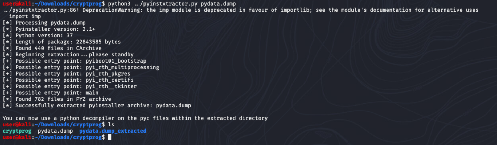
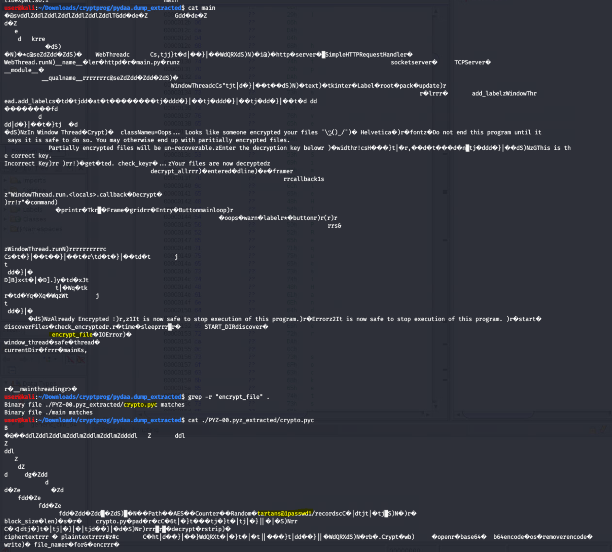

# Hospital Solution

## Reverse Engineering Malware

In order to remediate the ransomware infection, we must extract the key that is used for encryption and determine how the ransomware is propagating.  We will use the provided `pyinstxtractor` program for this. Pyinstxtractor is a program that will turn a binary file packed with PyInstaller into Python byte code. 

To use PyInstxtractor with a Linux ELF file, we must first extract the Python data from the binary:

```
objcopy --dump-section pydata=pydata.dump cryptprog
```

Once the required data is dumped, you can use the PyInstractor program to extract the Python Byte Code:

```
python3 pyinstxtractor.py pydata.dump
```

This will result in a directory that contains pyc files. 

   

Notice that the program indicates `main` as a potential entry point. We will look at that file in the next section.

## Looking at Python Byte Code

Change directories into the folder that was created in the previous step.

We can extract what we need from ASCII strings in the byte code without fully decompiling it. 

Run the following command to view the contents of the file `main`:

```
cat main
```

Notice a reference to `encrypt_file`. This could be an interesting method. We can look for more references to this string by using grep:
```
grep -r "encrypt_file" .
```  

Notice where that string is referenced in other files. 

Change directories into `PYZ-00.pyz_extracted`. There are many files in this directory (these are imported into the main script).  View the contents of the `crypto.pyc` file as you did before.  Notice a string in this file which appears to be a password: `tartans@1passwd1`. Users should be tipped off by "tartans" since that is a commonly used password in this competition. 
   
   

<br></br>


> Use the password `tartans@1passwd1` to decrypt the targeted files.

<br></br>

We can also examine the imports in this directory and notice that the `paramiko` library is used. This is an SSH library for Python and is a clue that SSH is used for migration. 

Also notice the `migrate.pyc` file and examine its contents as before. This file references SSH (with references to "user" and "tartans") as well as references Thinkphp. These are the 2 propagation methods that the malware uses. This instructs the user which services to look at for propagation. 

## Mitigating further propagation

The machines in the environment are configured with SSH, ThinkPHP, or both services enabled. You can disable these services to prevent future infection:

```
sudo systemctl stop ssh
```
 or 

```
sudo systemctl stop apache2
```
