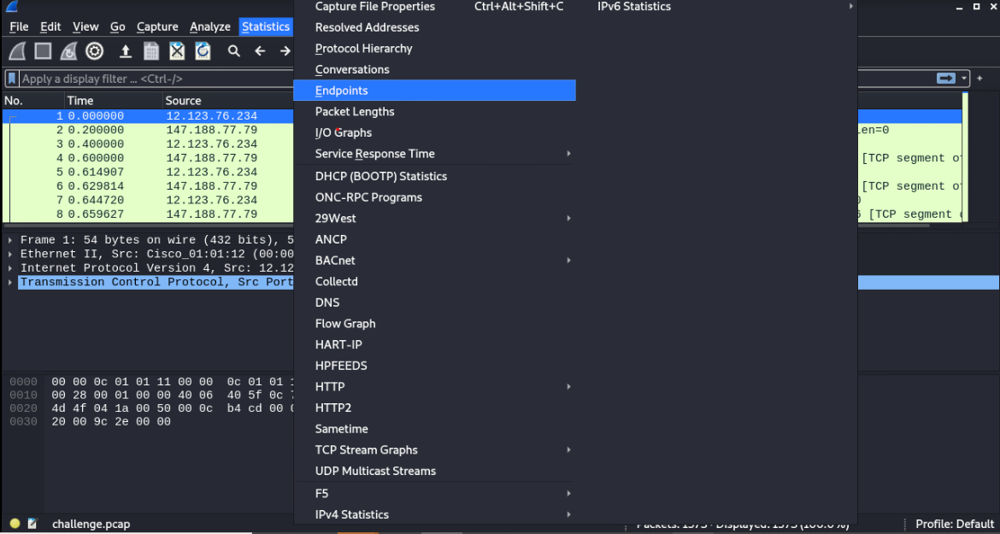
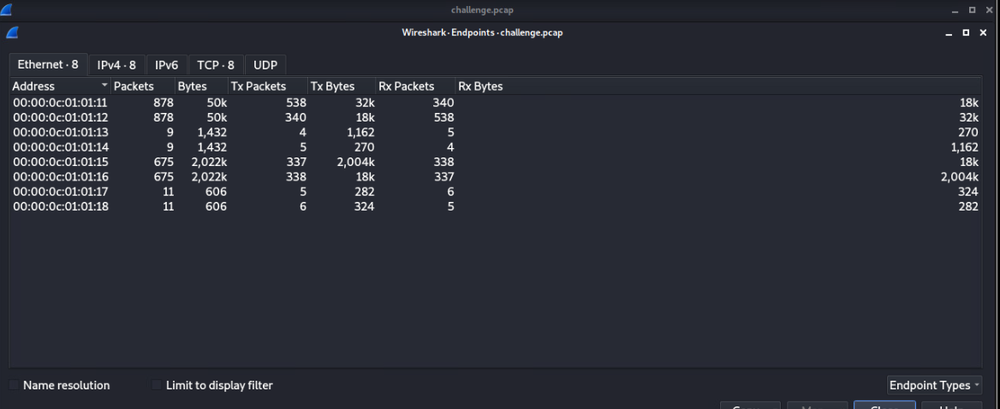

# Analyze This! Solution

## Setup

You can analyze the pcap file using any tools. This guide shows how to use [Wireshark](https://www.wireshark.org/download.html) for this challenge.

## Walkthrough 

1. Open the pcap file in challenges with wireshark
2. Go to the statistics tab and click on endpoints

3. Click on `IPv4`
4. To answer question 1 click on `Rx Packets` (column six) twice to sort it in decreasing order

5. The IP address at the top is the answer to question 1
6. For question 2 single click `Tx packets` (column four) and enter the IP address at the top into question 2 

7. For question 3 double click `bytes` (column three) enter the IP address at the top into question 3

