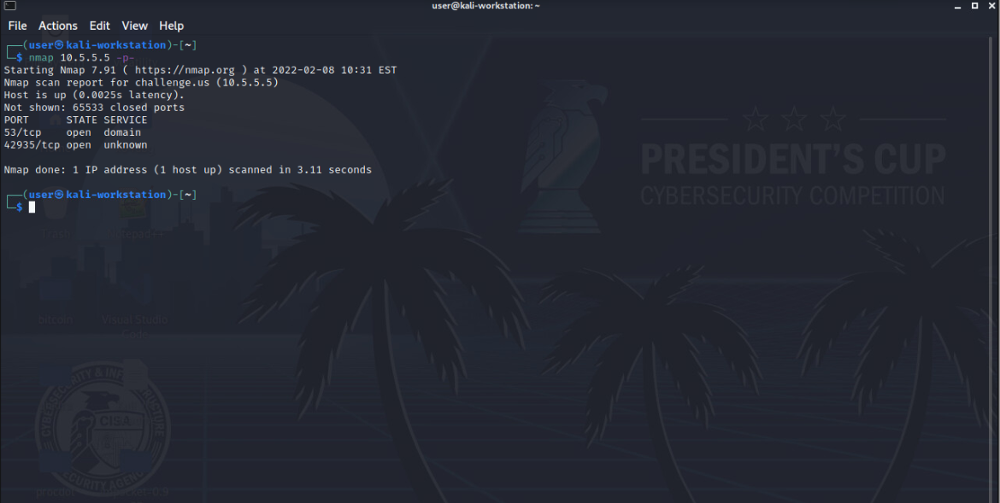

# Where's the Site Solution

## Setup
You can use any tool for the port scanning however, this solution guide will be using nmap.

## Walkthrough
1. Since the website can be hosted on any port we will have to scan from 0 to 65,535. To do this we will type the following command:

```bash
nmap <your-ip-address> -p-
```

2. Once you complete the port scan it will show the port that is hosting the website. Use this to answer question 1. If there are multiple ports shown by the scan the largest one is most likely the one needed for the challenge(if not you can test the others with the following steps)



3. In your web browser type http://your_ip_address:portnumber and it should take you to a page that allows you to download a tokenfile

4. Open the tokenfile and the hex value in the file is the answer to question 2