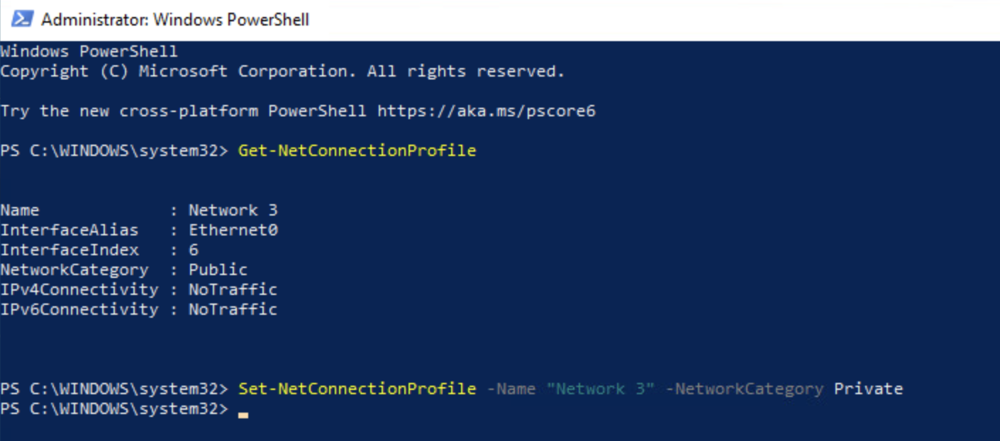
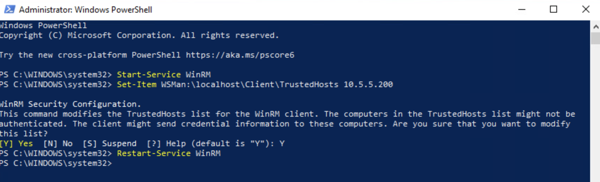
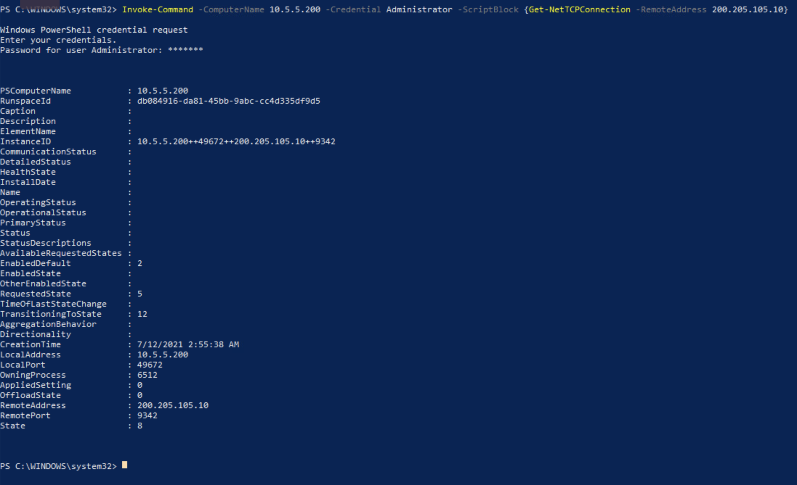
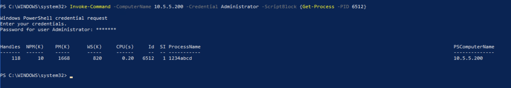
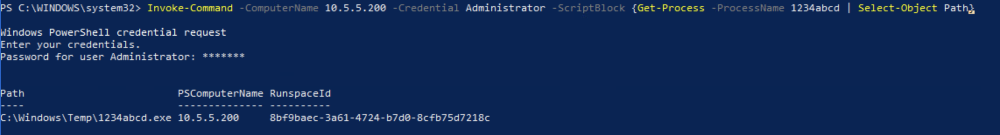
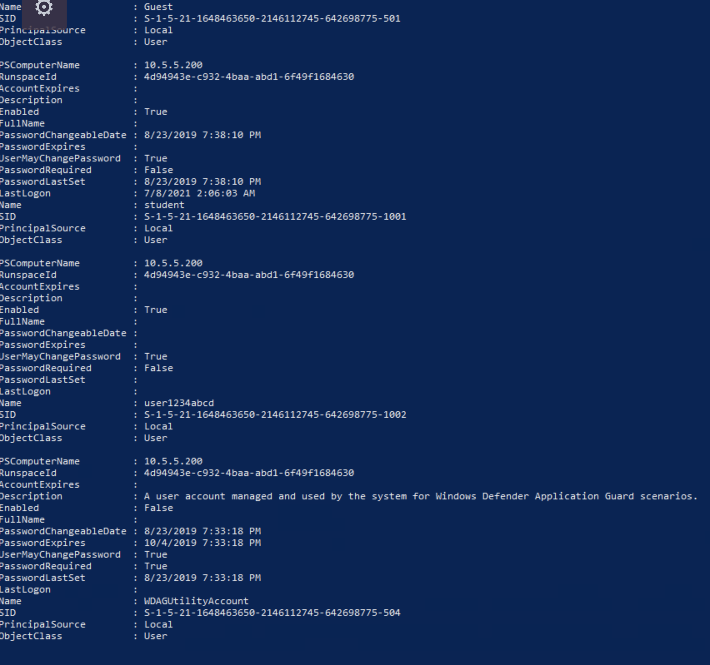
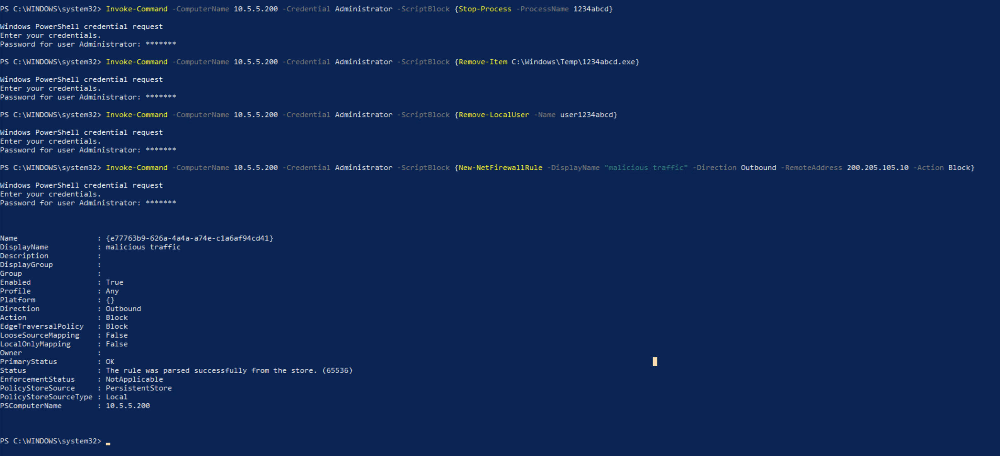

# Remote Ruction Remediation Solution

**Please note** - This challenge does not include any downloadable artifacts. This challenge can only be completed in the hosted environment.

### Prep Analyst VM

The first step is to prep the `analyst` VM so that it can remotely connect to the `infected` VM

1. Since both the systems are not on the domain, configure the network connection profile as private. To do so we first need to find the network Name for the connection profile. Type the following command to find information about connection profile

   ```
   Get-NetConnectionProfile
   ```

2. Find the network name from the previous command result and use that in the following command to configure network as private

   ```
   Set-NetConnectionProfile -Name "<name>" -NetworkCategory Private
   ```


3. Start WinRM service

   ```
   Start-Service WinRM
   ```

4. Configure trusted hosts settings to include the IP address of the infected system

   ```
   Set-Item WSMan:\localhost\Client\TrustedHosts 10.5.5.200
   ```

5. Restart WinRM service for trusted hosts setting to take effect

   ```
   Restart-Service WinRM
   ```


### Analyze IOCs

From the challenge description and intel we know that 10.5.5.200 is the IP of the infected system and it has a connection with the malicious IP 200.205.105.10.

1. Let's verify the connection

```
Invoke-Command -ComputerName 10.5.5.200 -Credential Administrator -ScriptBlock {netstat -ant}
```

With the above command we are making a remote connection to the infected system and running `netstat -ant` on it. When prompted for password, enter `tartans`

Analyze the result. You'll notice the connection with the malicious IP

2. Next, we need to find the process associated with this connection

```
Invoke-Command -ComputerName 10.5.5.200 -Credential Administrator -ScriptBlock {Get-NetTCPConnection -RemoteAddress 200.205.105.10}
```



Analyze `OwningProcess` within the output. This is the process ID for the process associated with this connection. In my case it is 6512. For you, it may be different.

3. Use the process ID to find the process name. Make sure to replace it with your process ID.

```
Invoke-Command -ComputerName 10.5.5.200 -Credential Administrator -ScriptBlock {Get-Process -PID 6512}
```



Analyze the output. In my case the process name is `1234abcd`. Process Name will also be different for you.

4. Find the process executable location. Make sure to use your process name in the following command

```
Invoke-Command -ComputerName 10.5.5.200 -Credential Administrator -ScriptBlock {Get-Process -ProcessName 1234abcd | Select-Object Path}
```



5. Lastly, verify the existence of malicious user account

```
Invoke-Command -ComputerName 10.5.5.200 -Credential Administrator -ScriptBlock {Get-LocalUser}
```


Analyze the output and look for the user with the above identified malicious process name in its account name

### Clean Infected System

1. Type the following command to stop the malicious process. Replace the process name with the malicious process present in your gamespace.

   ```
   Invoke-Command -ComputerName 10.5.5.200 -Credential Administrator -ScriptBlock {Stop-Process -ProcessName 1234abcd
   ```

2. Remove the malicious executable. Again, type in the name of the malicious executable present in your gamespace

   ```
   Invoke-Command -ComputerName 10.5.5.200 -Credential Administrator -ScriptBlock {Remove-Item C:\Windows\Temp\1234abcd.exe}
   ```

3. Remove the malicious user. Type in the name of the malicious user present in your gamespace

   ```
   Invoke-Command -ComputerName 10.5.5.200 -Credential Administrator -ScriptBlock {Remove-LocalUser -Name user1234abcd}
   ```

4. Create an outbound firewall rule to block any traffic going to the malicious IP

   ```
   Invoke-Command -ComputerName 10.5.5.200 -Credential Administrator -ScriptBlock {New-NetFirewallRule -DisplayName "malicious traffic" -Direction Outbound -RemoteAddress 200.205.105.10 -Action Block}
   ```

   
## Answers
Answer to each grading check is a randomly generated string comprising of 8 hexadecimal characters.


