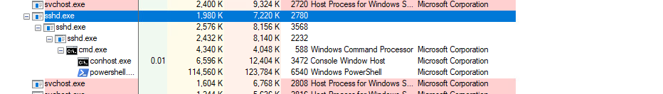
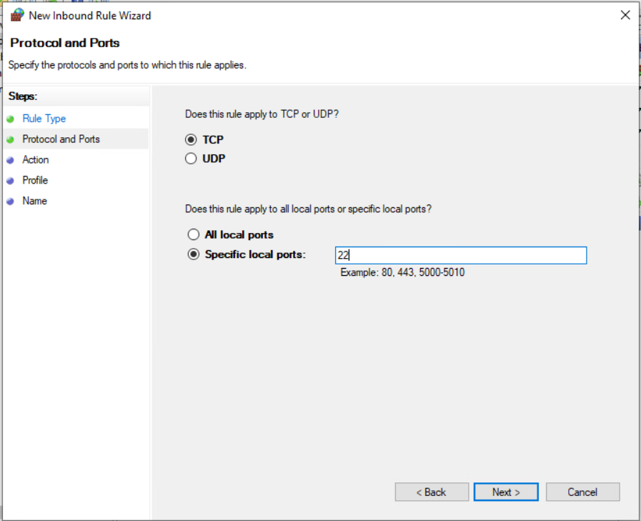
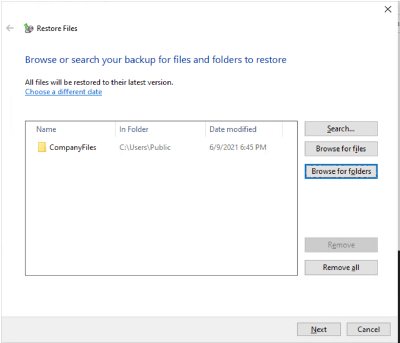
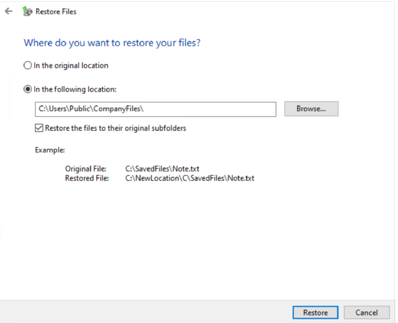
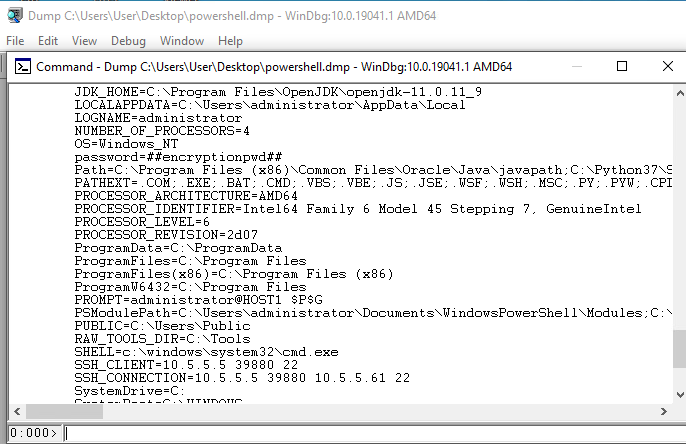
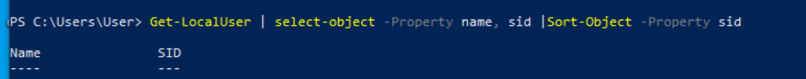

# What a Wonderful Day Solution

## Solution

   In this challenge, you are given a Windows VM that has a file backup preinstalled on the machine, along with that the Windows VM will include a file folder that has been encrypted using 7zip encryption.

   Throughout this guide, you will see snippets from the memory dump, process manager, firewall services and backup manger.

 1. Open the Windows VM and immediately create a memory dump, do this by going to procexp application, find where the powershell process that the attackers are using is. Right click -> create dump -> Create Full Dump. 

 2. You are going to want to start by going to services and stop the 'OpenSSH SSH Server'. Next you are going to want to go back to 'procexp' and kill the powershell process to ensure that the ransomware stops running on your device. (Right click -> Kill Process)

      

 3. You will block the port that the attacker has used to access your device. Open Windows Defender Firewall and navigate to Advanced Settings. Click on inbound rule and add a New Rule -> Port -> 22 -> Block the connection -> All applications -> Name the Rule and Finish. 
   
      

 4. After blocking the port, creating a firewall rule and creating a memory dump of the ransomware process, you are safe to perform a File Restore. Go to Control Panel\All Control Panel Items\Backup and Restore (Windows 7) Under 'Restore', select "Restore my files" -> Browse for files -> Select Backup on \\Host1\c\Users\Public\Recovery and navigate to path C:\Users\Public\CompanyFiles

      

      Choose where you want to restore your files. If saving to temp or other location, they will need to be copied into C:\Users\Public\CompanyFiles for the grading check to successfully validate the restore. Immediately after doing this, go to challenge.us to get your flag for this portion.

      
 
  5. To find the encryption password: Open WinDbg application -> File -> Open crash dump -> powershell.dmp (or whatever you saved the memory dump as). In the search bar at the bottom of the page you can type !peb to search for environmental variables. This will bring you to the encryption password.

      

      Navigate to C:\Users\Public\ and you will see the 7zip encrypted file. Right click on that file and go to 7-Zip -> Archive to CompanyFolder and type in the encryption password. This will create a new unlocked file with the files in its original unlocked state.

   6. The final step will be removing the user that the attacker has added to allow themself a backdoor into the system. To find the most recently added local user, use the command "Get-LocalUser | select-object -Property name, sid | Sort-Object -Property sid". Look for the user added with the highest SID and that will be the backdoor that the attacker has added. To remove the user: "Remove-LocalUser -Name "Whatever name the infinity token generated"

      

# Submission

This challenge uses _Infinity_  so every submission will be a different random string. You should visit `challenge.us` in game and click `Grade` button to receive your submission tokens that will be received by following the necessary steps. One submission token for properly restoring files on the machine, one submission token for blocking port 22 on the firewall. The other 2 tokens will be the "name" of the local user added and the final token is the encrypted password.

