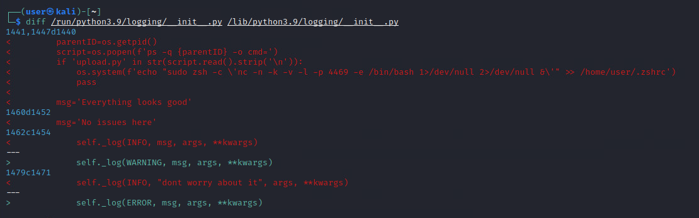
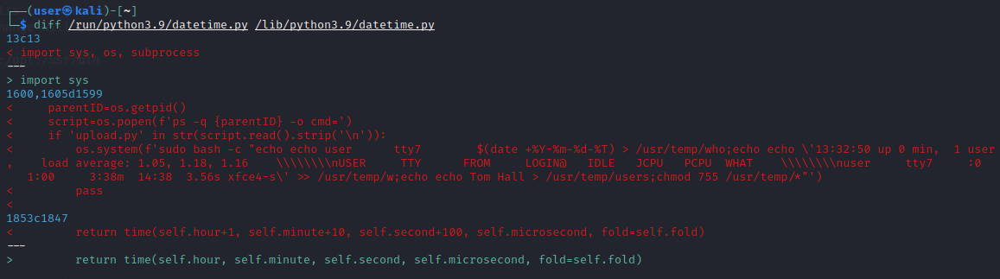
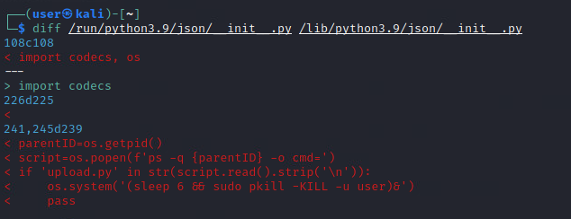
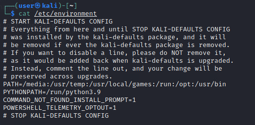

# Sneaky Snake Solution 

For this challenge there will be four tasks that you are graded on. You will need to find the three (3) python libraries (files) that have been injected with malicious code and the path that has been written to environment variables that will run these attacks. All the files that have been manipulated are python libraries that are used in the `upload.py` script on the kali machine.   
The python libraries with injected code are three of the following: `subprocess.py`, `random.py`, `datetime.py`, `json/__init__.py`, and `logging/__init__.py`.

## Overview

The libraries being manipulated are all located in the `python3.9` module. The entire `python3.9` folder is copied to a new location based on the new `$PATH` variable and then, the malicious code is injected. The original `python3.9` files can be found in `/lib/python3.9`.

Execution of the `upload.py` script will cause all the injected scripts to be executed, and so, the user will be logged out. The script itself has no issues and nothing "off" about it. The challenger should analyze the libraries and paths used within the script that manipulate its outcome.

There is also an external host that will attempt to connect to the netcat backdoor. If it is able to connect, it will create its own user. The challenger may not see this occur as custom command files were created to help to hide it.

You will need to analyze the `$PYTHONPATH` entry to find where to look for the `python3.9` directory that is being used. 

From here you will need to analyze the python libraries code and metadata to determine which ones have been altered. Look at the files `subprocess.py`, `random.py`, `datetime.py`, `json/__init__.py`, and `logging/__init__.py`.

## Malicious Code

### Netcat Backdoor

This injected code is meant to open a persistent backdoor bash shell using Netcat without the user knowing. Once you start the challenge you have the ability to determine that Netcat is running by using the command `netstat -tulpn`. 
This will display all ports that are open and listening. Netcat will be listening on a random port between `2000` and `8000`. You will need to analyze your machine to determine which is being used.



### File Creation 

The inserted code that will create files in the directory `/usr/local/games/` for the commands `who`, `w`, and `users`.
This is done so that the threat actor attempting to connect to the machine via Netcat can hide his tracks. The `upload.py` script will be running commands to provide information about who is logged on, status, etc. Therefore, this file was created to help hide what was actually occurring. 

If you test the commands being executed in the `upload.py` script, you will begin to notice irregularities in the output, which should 
help provide a hint to start looking into the command files.



### User Logout

A basic command to kill the user session was injected into one of the files. This is intended to make it more difficult for the user to find the location of the files.



## Environment Variables
The environment variables are manipulated via the `/etc/environment` file. 

```
cat /etc/environment
```


The line that says "PYTHONPATH= [path]" will be the answer to the first question.

### $PATH environment variable

The `$PATH` variable will be overwritten from its default entry. Any custom scripts will be called first to replace any real programs from being executed.
This pertains to the malicious code used for `File Creation`. Those files created will be placed in a directory that is referenced in the `$PATH`. The actual files located in `/usr/bin/` cannot be called. Running `echo $PATH` will show the altered path. 

### $PYTHONPATH environment variable

This environment variable has a default path used when it is called/executed. It is only available when you’re running python3. Otherwise, `$PYTHONPATH` does not have a natural environment variable and will show an empty string if you attempt to call it. 

Considering `upload.py` is causing issues, despite the script seeming harmless, competitors should check if `$PYTHONPATH` has been manipulated.

## Solution

1. Run the following command to view the environment variables:
    ```
    cat /etc/environment
    ```
    The line that says "PYTHONPATH= [path]" will be the answer to the first question.

2. View the difference between the original python 3.9 files and the altered ones. Replace [path] in the commands below with the path found in step 1. 
    ```
    diff [path]/random.py /lib/python3.9/random.py
    diff [path]/datetime.py /lib/python3.9/datetime.py
    diff [path]/subprocess.py /lib/python3.9/subprocess.py
    diff [path]/json/__init__.py /lib/python3.9/json/__init__.py
    diff [path]/logging/__init__.py /lib/python3.9/logging/__init__.py
    ```

    The path to the files altered will be the answers to questions 2-4. 