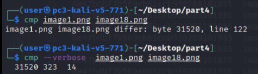

# Worth 1111101000 Words Solution

For this challenge, players must analyze image (picture) files in order to
discover hidden flags that have been inserted or embedded in various
ways.

Using a Kali Linux system is likely preferred due to the ease of use of
python and other local tools.

To begin the challenge, the player should open the challenge folder provided. The 
challenge folder will have 4 zip folders containing the challenge artifacts, separated 
by part, and one python script for use in parts 1 and 2.

Solving Part 1
==============

Part 1 requires the player to find the hex value of the color of the
changed pixels in the affected image.

The folder for part 1 contains 8 image files - 4 original and 4
potentially modified files. The four images used will always be the
same. During the competition the image that was modified was selected at random and
so was the color value. This won't be the case for this open sourced state.

Part 1 first requires that the player determine which of the four images
has been altered . This is easily done by diffing each pair of files
until a difference is discovered.

In this case, image 4 is the one that differs from its original.

The next step is to modify the provided python code to get the RGB
values of each pixel in the image. The current code requires the
additional two lines to iterate over the entire image but defines
everything else for the player. The code takes in the image filename as
the only argument. The player could manually define x and y to test the
code if desired first by providing a valid coordinate pair, e.g. (1,1).

The simplest addition is to iterate over the width and height.

In order to compare the output, it is recommended to store the output of
the script to a file for each file in question.

Once both files are created, simply diff the two to see the differences.

For part 1, the only requirement is to determine what the new color
value was. Every true white pixel was changed to the randomly chosen
color to make it stand out, depending on the randomly chosen color the
change may even be visible when viewing the image itself. In this case,
the color RGB value was (144, 237, 0).

The last step is to convert this value to a 6-character hex code using a
calculator, online resource, code, or simple math.

144 = 90, 237 = ed, and 0 = 0

Therefore, the code for submission for this part would be "90ed00".

Solving Part 2
==============

Part 2 requires the player to find the hex value of the offset of a
color change for 4 specific pixels in the affected image. Players are 
only required to find the offset for one of the four pixels as the same 
value is used for each.

The folder for part 2 contains 11 image files; 1 original and 10
potentially modified files. In competition, the image used was randomly selected from a
pool of 12 possible image files. The specific numbered file used, the
four pixels changed, and the new color were also chosen at random. In this open source form, the player's specifics should match the guide.

Part 2 also first requires that the player determine which of the image
files has been altered . This is easily done by diffing each files
against the original until a difference is discovered.

In this case, the modified image file was image5.png.

Similarly to part 1, the player must get the RGB color values of every
pixel in the original and modified image files to compare them to each
other in order to find the four different pixels.

Once the two output files have been created using the python script,
diff them as before. This time, since only four pixels were changed,
there should only be four listings.

The main difference this time is that four very specific pixels were 
changed by a unique amount. The player must calculate the offset between the
new value and the old value for each of the four pixels. Also, any
offset calculation must take into account the fact that any single RGB
value would wrap around the max value of 255 if the new value is less
than the old one, as mentioned in the guide. For example, if the old value was
240 and the new value is 10, the offset would be (256-240) + 10 = 26.

In this case, the calculations work out to the following:

|                                       |R value | G value | B value|
|-------------------------------|------------------------|--------------------------|------------------|
| Pixel 1 original| 45          |       22    |             48|
| Pixel 1 new|            120|                 253 |                18|
| Pixel 1 offset value|   120-45 = 75     |    253-22 = 231   |    (256-48)+18 = 226|
| Pixel 2 original|       18      |           16    |             37|
| Pixel 2 new|            93  |               247    |             7|
| Pixel 2 offset value|   93-18 = 75      |  247-16 = 231       |(256-37)+7 = 226|
| Pixel 3 original|       145        |          24          |        3|
| Pixel 3 new|            220       |           255       |          229|
| Pixel 3 offset value|   220-145 = 75  | 255-24 = 231   |     229-3 = 226|
| Pixel 4 original|       130      |           24       |           0|
| Pixel 4 new|205|          |       255      |            226|
| Pixel 4 offset value |  205-130 = 75   |    255-24 = 231  | 226-0 = 226|

Then the RGB values must be converted to Hex

|                        | R value | G value | B value |  Hex   |
| :--------------------: | :-----: | :-----: | :-----: | :----: |
| Pixel 1 offset decimal |    75    |   231   |    226    |        |
|      Pixel 1 hex       |   4b    |   e7    |   e2    | 4be7e2 |
| Pixel 2 offset decimal |   75    |   231   |   226   |        |
|      Pixel 2 hex       |   4b    |   e7    |   e2    | 4be7e2 |
| Pixel 3 offset decimal |   75   |   231   |   226    |        |
|      Pixel 3 hex       |   4b    |   e7    |   e2    | 4be7e2 |
| Pixel 4 offset decimal |   75    |   231   |   226    |        |
|      Pixel 4 hex       |   4b    |   e7    |   e2    | 4be7e2 |

All of the offset values will be the same for the four pixels. A player must only 
calculate the offset for one of the four pixels, but might calculate others to 
corroborate the correct value before submitting.

The answer/token is simply the 6-character or 3-byte string 
corresponding to the offset value (which, again, is the same for all four 
pixels).

Solving Part 3
==============

Part 3 requires the player to find the hidden flag within the set of
images provided. Not much more info is given, though there are some
context clues based on what is provided.

The folder for part 3 contains 24 image files and one hash list. Two
images will differ when their hash is compared. The two images used are
chosen at random, though to ensure there are no collisions, the image
with the password embedded will always be found between image1 and
image12, and the flag will be embedded in a file between image13 and
image24. 

First, the player should compile a list of hashes for the images
contained within the folder. An easy way is to create a simple bash
script to iterate over each file and find the md5 hash using md5sum or similar tool.

Then diff or compare the two files side by side to identify the two
affected image files.

In this case, image7.png and image21.png are the ones that have been
changed or altered.

The guide mentions that in this part the data has been embedded
directly. Players will have to dig a little deeper into these two files
in question to find the data. This part is entirely dependent on the
player figuring out where/how the data is hidden.

Assuming they do some sort of hex, string, or binary analysis of the
files, both pieces should stand out.

In the case of this guide, image7.png is the file hiding the password.
Either a string dump or a hex dump--using xxd or some other tool--will
display the password.

This only gives them part of the solution, however, as the player must
still find what the password goes to.

In this case, image21.png contains the password protected file. Strings
or xxd will not help here. The player must do some sort of binary
analysis of the file--using something like binwalk--to find the hidden
file and then extract it.

To extract the zip file, simply run binwalk again using the '-e' flag.

Once the zip file is extracted, use the password to further extract the
secret.txt file.

The flag located in the `secret.txt` file is your flag for submission.

Solving Part 4
==============

Part 4 requires the player to analyze the binary of three files and compare them to an original. The instructions mention that the flag for submission is the offset plus the byte value, so this should get them looking in the right direction.

The folder for part 4 contains 100 image files and one hash file of the original image. Three
images will differ when their hash is compared. The three images used were
chosen at random, though the code ensures there were no collisions which might result in the same file being changed twice. The specific offset and byte values were also determined at random.

First, the player should compile a list of hashes for the images
contained within the folder. An easy way to do this is to create a simple bash
script that iterates over each file and find the md5 hash using md5sum or similar tool.
Below is a picture of the `hashmyfiles.sh` script utilized earlier in part 3 having been 
edited for use here.

Once an overall hash list is compiled, look for the image files that do not match the hash of the original image file provided or each other.

Once the three files have been identified, players must do some type of binary comparison to one of the original copies. Using 'cmp' is probably the easiest method.

Cmp's output will point you to the relative location of the offset, and if you use the verbose flag, it will even tell you the old and new value of the byte in decimal form. However, cmp and its output seems to be the victim of an off-by-one bug, as the actual offset of the byte changed will be one less than what the output says. Therefore, the player should/must also verify this in the binary of the file itself.

Players can dump the hex of the binary using xxd, or use a hex editor to view the binary in full.

In this case, the byte listed is byte 31520, which is byte 7b20 in hex. However, due to the one-off fault, the actual byte is 7b1f, which can be verified by looking at this byte in the two files.

When investigating this line, you can tell that byte 7b1f is the one that differs, where the value is "d3" in the new file and is "0c" in the original.

Now that the offset or byte and its new value are known, the flag for this particular file would be "7b1fd3" since each flag is the offset or byte in question plus its new value.

Players must then repeat this process for the remaining two files that were changed.

Only one file in each range (e.g. image1-33, image34-66, image67-100) has been modified. 

Check Yourself
--------
The answers to the different parts of the challenge can be found within this solution folder in the text file named `answers.txt`.

