# AWeSome

During the competition, the competitors were provided with an instance of a SOF-ELK VM and a Windows 10 VM to remotely access the SOF-ELK VM. Both CloudTrail and VPC Flow logs were already imported into the ELK stack on the SOF-ELK VM. **You are free to use any SIEM/tool available at your disposal to analyze the log files. However, this solution guide will utilize SOF-ELK for analyzing the log files.**  SOF-ELK stands for Security Operations and Forensics Elasticsearch, Logstash, Kibana. You may read more about this VM [here](https://github.com/philhagen/sof-elk/blob/main/VM_README.md). 


## Importing logs in SOF-ELK
1. Place the cloudtrail logs `cloudtrail.json` into the `/logstash/aws/` folder in the SOF-ELK VM. 
2. Place all of the vpcflow log files into the `/logstash/nfarch/` folder in the SOF-ELK VM.
3. Wait a couple of minutes (~5 min) for logstash to parse all of the logs. 
4. Kibana is accessible in the SOF-ELK VM  by browsing to `http://<sof-elk IP>:5601`. To view the CloudTrail logs, select the index pattern `aws-*`. To view the vpc flow logs, select the index pattern `netflow-*`. 
    <br><br>
    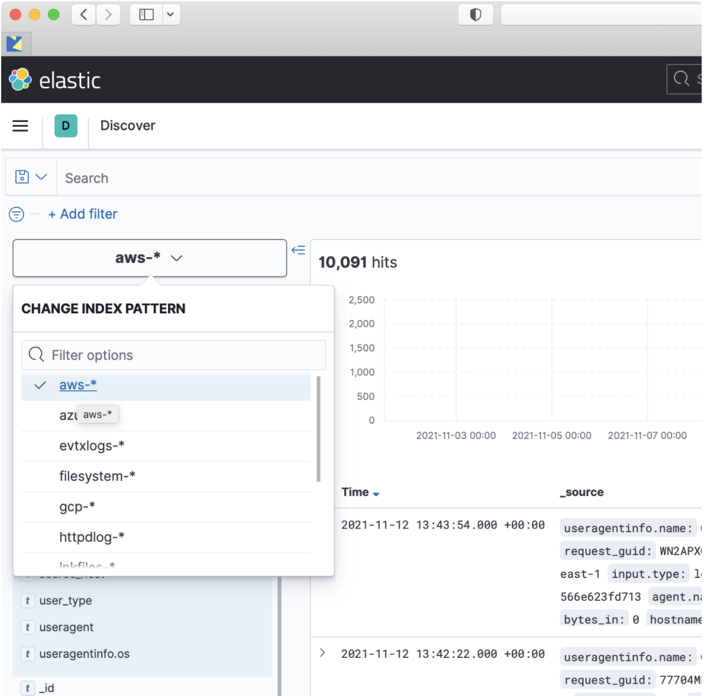

Once all the logs are parsed, you'll see `8100` cloudtrail log entries and `628,580` netflow (vpc flow) log entries in Kibana.

## Solution

### Question 1 - Provide the IP address from where the users of this AWS account usually login to AWS web console.

1. Access the Kibana dashboard by browsing to `http://<sof-elk IP>:5601`.

2. Click the hamburger button in top left hand corner, and then click `Discover`.
    <br><br>
   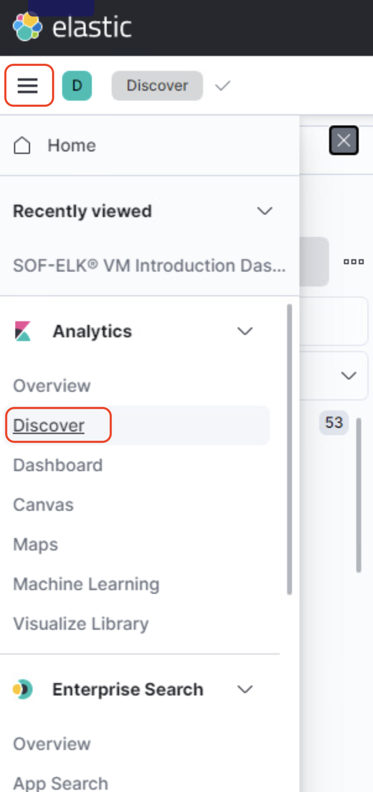

3. The answer to this question is in the cloudtrail logs. Select `aws-* as the index pattern.
    <br><br>
   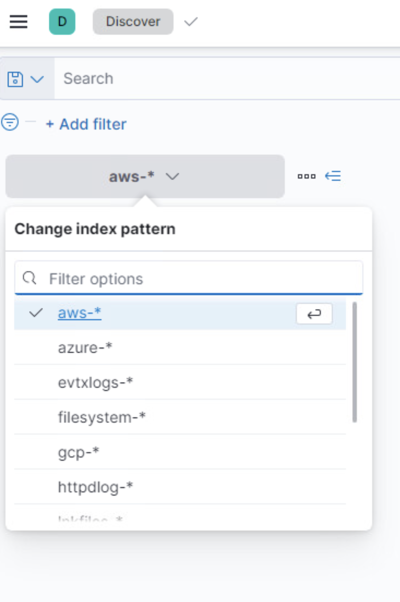

4. Select date range as `14th at 00:00 - 16th at 23:59 November 2021`.  Click `Update`.

   You'll notice a total of `8100` events.
    <br><br>
   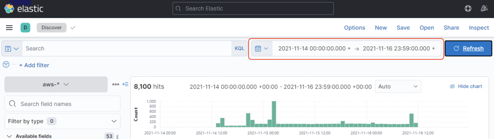

5. To answer this question, we need to search for logs associated with logins to the AWS web console. Using the button on the top left, add a filter `event_source: signin.amazonaws.com`. You may also use the `+ Add Filter` link below the search box.

   You'll notice `4` hits.
    <br><br>
   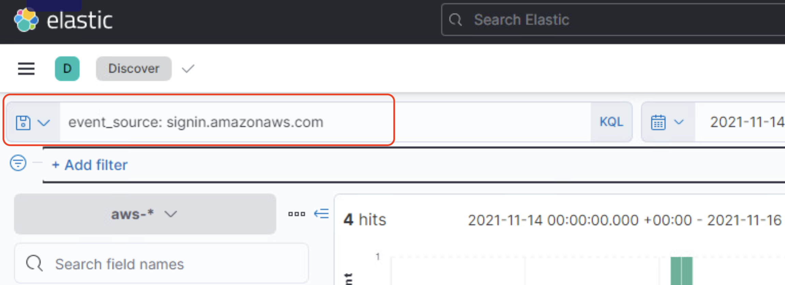

6. Next select `event_source`, `event_name`, `event_type`, `source_host`, `arn`, and `user_type` from the `Available fields` by clicking the `+` sign next to each option. The fields will then show up under `Selected fields`.
    <br><br>
   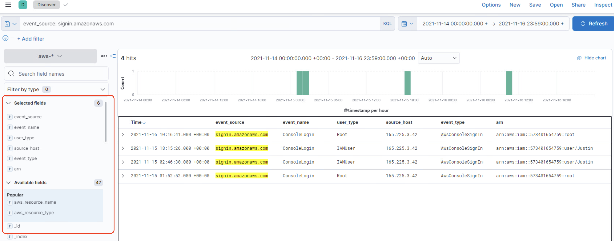

   The answer to question 1 is `165.225.3.42`. This is where the authorized login requests are coming from.

   You'll notice there are two requests from root user and two from IAMUser Justin.

### Question 2 - Our suspicion is that one of the API keys associated with the IAMUser had been stolen and was utilized in the incident. How many files did the unauthorized user download from the S3 bucket?

7. Let's focus on activity performed by IAMUser. Change the search to `user_type : IAMUser`. You'll notice `346` hits.

   Fields should already be selected from before, but add a few more fields named `aws_resource_name`, `access_key_id`, `useragent`, and `bucket_name`. 
    <br><br>
   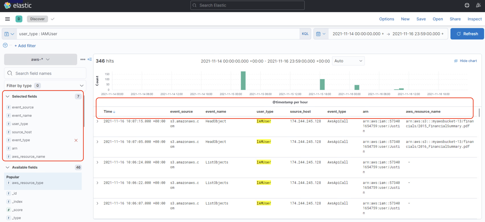

8. Click on `source_host` under `Selected fields`.
    <br><br>
   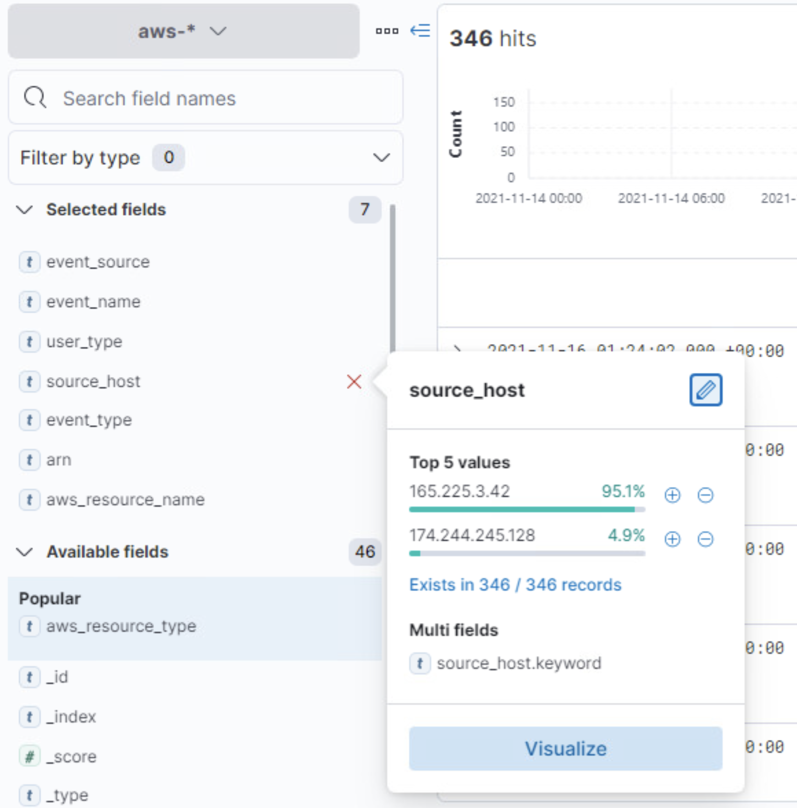

   You'll notice the IAMUser activity is coming from 2 IPs, and 1 of those is where the legitimate account users usually login from. The unauthorized activity is coming from the other IP. 

9. Let's focus only on the unauthorized activity by clicking `-` sign next to the known IP or `+` sign next to the newly discovered IP.
    <br><br>
   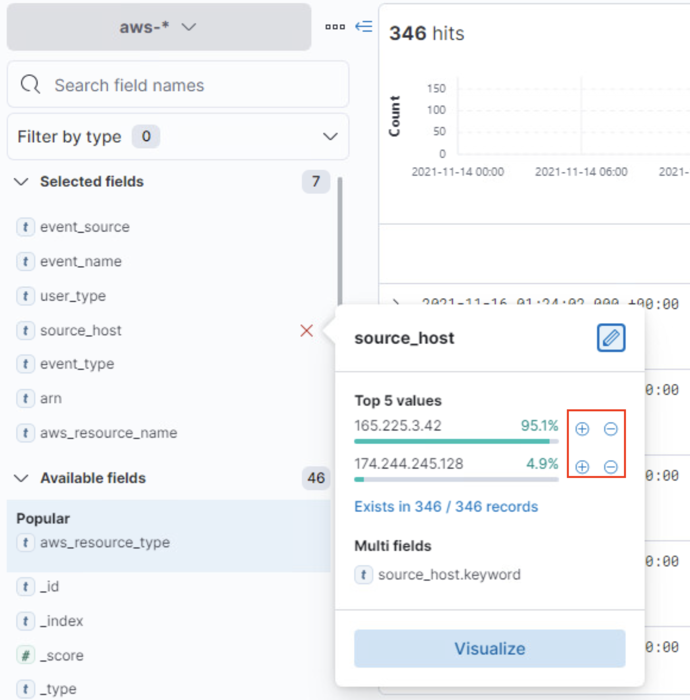

   A filter will be added accordingly. You'll notice 17 hits in the search results.
    <br><br>
   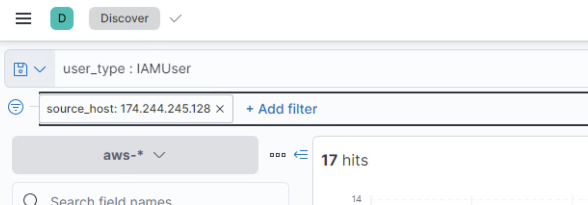 

10. Review the search results. You'll notice that the aws cli and API key were used in all of these calls (`event_type`, `access_key_id`, `useragent`). Scroll down to the bottom and focus on `event_name`. The unauthorized user started by enumerating the account summary and policies and permissions attached to the IAMUser account that he is using to connect to AWS. He then listed all of the buckets in the AWS account, listed files/folders in `myinfrastructurebucket-1`, and downloaded 2 files  named `infra.pem` and `infraresources.numbers` from the S3 bucket `myinfrastructurebucket-1` (`event_name` as `GetObject`). Thereafter, he listed files in three other buckets and viewed metadata for 2 more files (`event_name` as `HeadObject`). 

    To answer this question, 2 files were downloaded.

    Based on file names, the files downloaded provide information about the infrastructure resources (maybe EC2 instances??) and a key pair (`.pem`). The `.pem` file may consist of a set of credentials used to prove identity when connecting to an EC2 instance. 

    These two files may have helped the unauthorized user gain access to the EC2 instances. 

### Question 3 - The unauthorized user accessed a number of EC2 instances. Provide the instance ID of the EC2 instance that was accessed the most or for the longest duration overall. (The unauthorized user is using 2 different IPs in /10 network to connect to AWS resources).

This question says that the unauthorized user did access a number of EC2 instances, and that the unauthorized user is coming from 2 different IPs in /10 network. We already know one of those IPs - 174.244.245.128. 

11. Let's find the range of IP addresses associated with the unauthorized user. Browse to https://www.calculator.net/ip-subnet-calculator.html. 

12. Select subnet as /10 and enter the IP address that we already know. Hit Calculate.
    <br><br>
    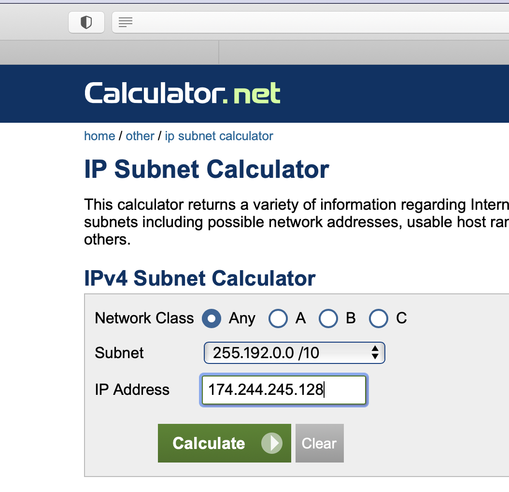 

    The IP Range will be `174.192.0.1 - 174.255.255.254`
    <br><br>
    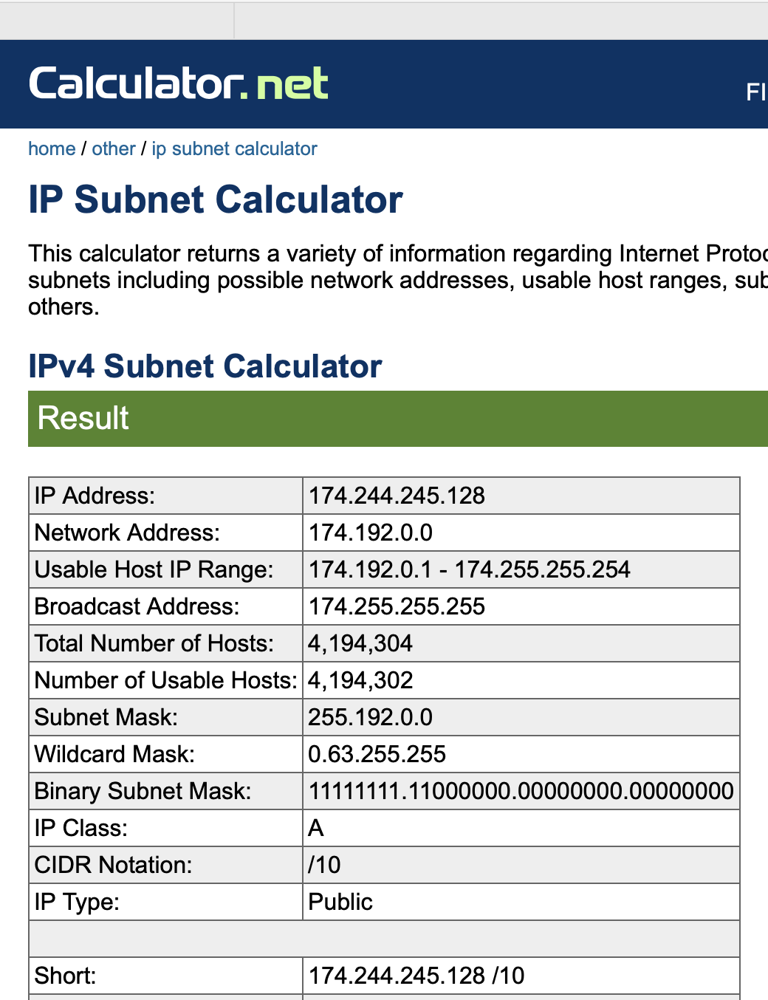 

    This is the IP range that we will use for source IPs.

    So far we have reviewed all activity that came from 174.244.245.128 for the IAMUser in the cloudtrail logs. We did not find any evidence of an unauthorized user connecting to the EC2 instances using aws-cli. We know that that user downloaded a `.pem` file. The `.pem` file is usually used for SSHing to an EC2 instance. With that in mind, let's switch to the VPC Flow logs. 

13. Firstly, remove the search filter.

14. Select `netflow-*` as the index pattern.

    You'll notice a total of 628,580 log entries.
    <br><br>
    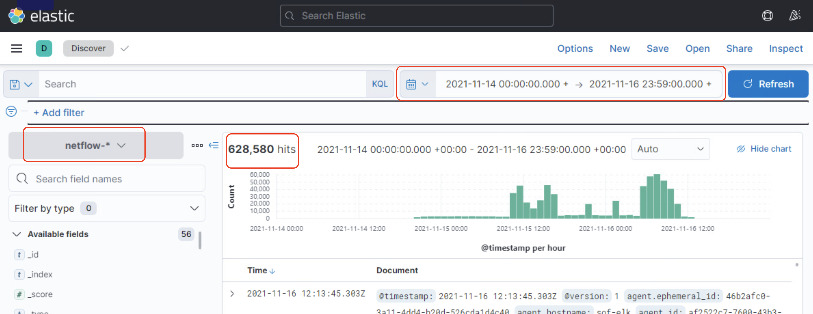 

15. Click the `+ Add Filter` link and create a query for the source IP range. You'll notice a total of 11 hits.
    <br><br>
    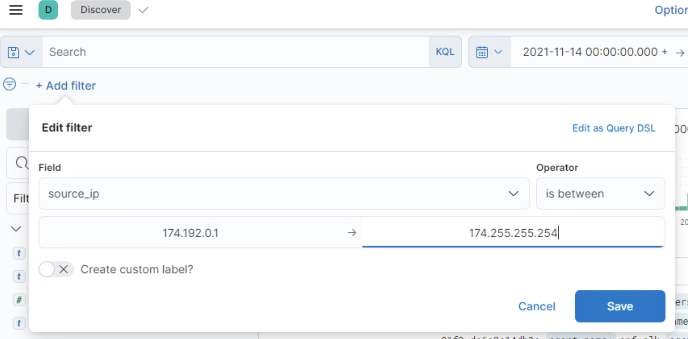 

16. Select the following fields - `source_ip`, `source_port`, `destination_ip`, and `destination_port`. You'll notice the other IP the unauthorized user is coming from is `174.196.138.215`. The destination port for all of the hits is `22`, which is the default SSH port.
    <br><br>
    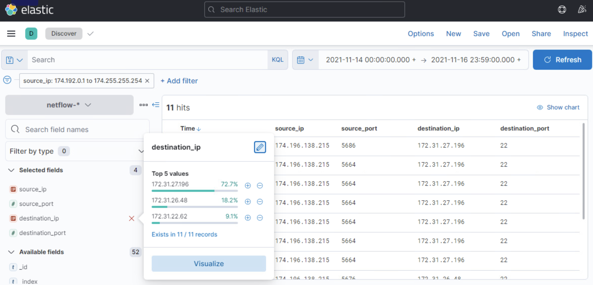 

    At this point, we don't know for sure if the destination IPs (`172.31.27.196`, `172.31.26.48`, `172.31.22.62`) are EC2 instances, but based on all of the information, these IPs might be EC2 instances.

    The netflow data only contains flow related data. To figure out if these IPs belong to EC2 instances, we need to go back to the cloudtrail logs.

17. You can search the cloudtrail logs in Kibana for those three IPs or other EC2 related events (event_name as RunInstances or DescribeInstance, etc.), but you won't be able to find that mapping. The information is present in the cloudtrail logs, but not all fields within the log entries are parsed and loaded into Kibana. Therefore, let's search for the raw cloudtrail log file on the `SOF-ELK` VM.

18. SSH into the `SOF-ELK` VM.

19. Search the cloudtrail log file for all three IPs (`172.31.27.196`, `172.31.26.48`, `172.31.22.62`) one by one.

    ```
    cat /logstash/aws/a13-cloudtrail.json | grep 172.31.27.196
    ```


    <br><br>
    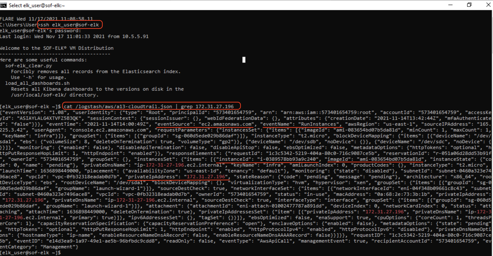 

    In the search results, review `eventSource`, `eventName`, `instanceID`, `imageID`, and `privateIPAddress`. Overall the results imply that 172.31.27.196 is the private IP or the internal IP of the EC2 instance with instanceID `i-0389578bb93a9c240`. Similarly, you can search other IPs, and you'll notice that those IPs are also associated with other EC2 instances.

    The question is asking for instanceID of the EC2 instances that was accessed the most or for the overall longest duration.

20. Go back to tge Kibana dashboard. Make sure you have the search results from step 15. 

21. Add the `flow_duration` field.
    <br><br>
    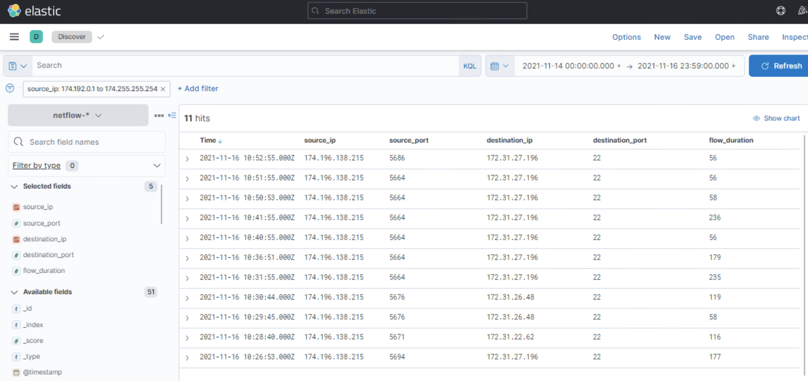 

    You'll notice that `172.31.27.196` is the IP that was accessed for the longest duration. The instance ID associated with this IP is `i-0389578bb93a9c240`.

### Question 4 - The unauthorized user exfiltrated ~10MB of data from the EC2 instance (identified in the previous question) to a system on the internet. Provide the IP address of the remote system.

For this question, we know that approximately 10MB of data was exfiltrated from the EC2 instance identified in the previous question (IP - `172.31.27.196`, instanceID - `i-0389578bb93a9c240`)

22. Click on the hamburger button, and then click on `Visualize Library`.
    <br><br>
    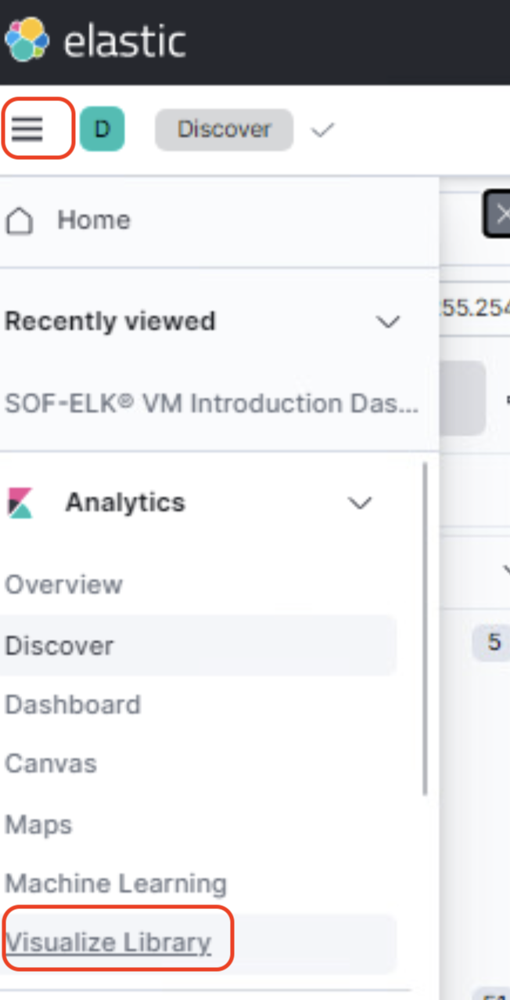 

23. In the search bar, type `netflow statistics`, and next click on `Netflow Statistics by Destination IP`.
    <br><br>
    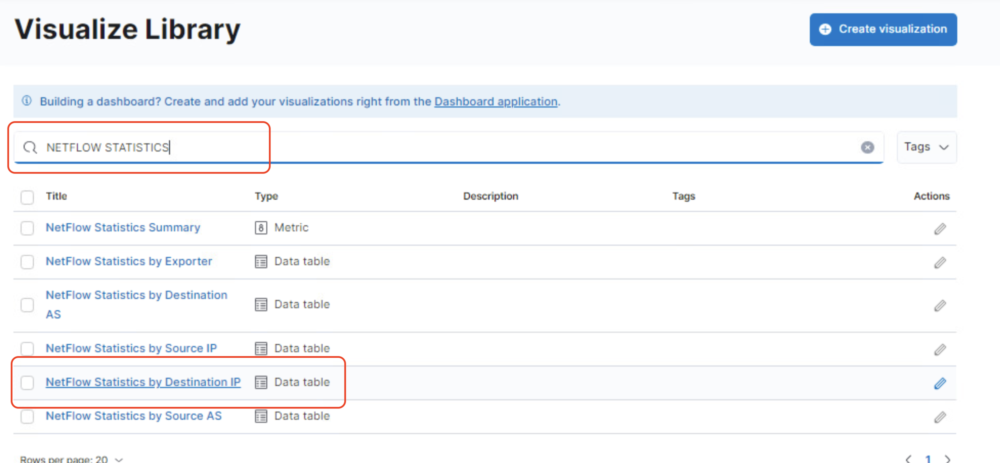 

24. Finally, add a filter for the source IP of the EC2 instance, `172.31.27.196`.
    <br><br>
    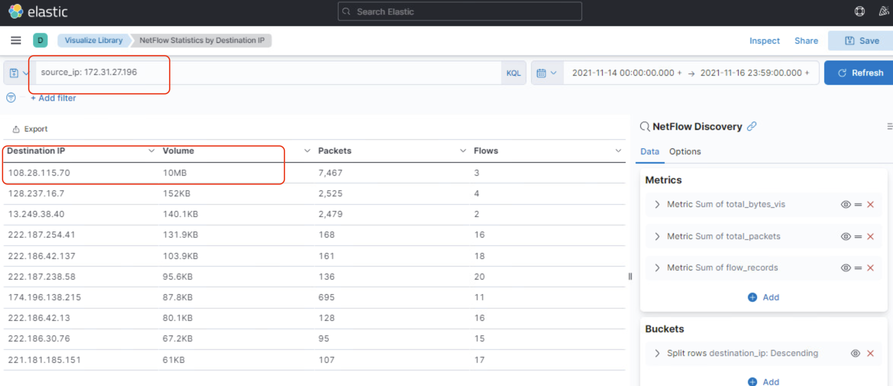 

    10MB of data was exfiltrated to `108.28.115.70`

## Answers
Q1 - 165.225.3.42

Q2 - 2

Q3 - i-0389578bb93a9c240

Q4 - 108.28.115.70