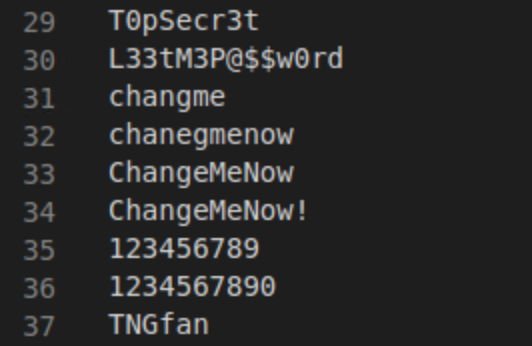

# Going Nuts in Romania: Solution

Solution guide note: Times and names may vary slightly in the final
version of the challenge. This guide was written during a test of the
final activities, though will match the processes required to solve the
challenge in full.

## How many times was a stored procedure called during the SQL injection attempt?

IDS alerts will confirm three distinct times the xp_cmdshell procedure
was called, denoted by the CNT value of 3.

You can quick query this event by right-clicking and view each
individual alert/event as well as the packet data, which will help with
the next question. You can also run a string search for "xp_cmdshell" when looking in the packet capture at the packet bytes.

## What was the original password for the \'domadmin\' account that was obtained by the attacker?

Find the packets associated with the three SQL injection commands above
by looking at their respective timestamps. The third will show the
command plus what happened as a results of it, e.g. the TFTP transfer.

Either follow this stream to view the packet contents or simply view
them in the standard Wireshark viewer.

Either script hashing all of the lines in the provided crack.txt file,
or use a password cracker with the list. The hash of the domadmin
account will match the value of the password "ChangeMeNow!"

One example of a script could leverage:

while read -r line; do printf %s \"\$line\" \| md5sum \| cut -f1 -d\'
\'; done \< passwordlist.txt \> hashlist.txt

this will hash each line of the wordlist and write them to a new file.
Then you can search for the hash that matches the one in the packet,
find the line, and match this to the text password in the wordlist.

Obviously, players can use any method or tool they want for this piece
but since the wordlist is rather small, a simple script is sufficient.

## How did the insider access the DC?

For this question, players must use the domain controller security logs,
more specifically the Security event log file. Simply copy the file to
the Windows 10 analysis system, Vlad, and either view the file in Notepad/Notepad++ or use Timeline Explorer. On Sanguine, you could use OpenOffice Calc.

Players will have to confirm with event logs when the domadmin account
first logged in/on during the period of the events. The first login
after the SQL injection and supposed cracking of the password was around
15 minutes or so after the injection takes place. Note that the Logon
Type listed in the logs is a type 10, which correlates to:
RemoteInteractive. Therefore, a user logged on to this computer remotely
using Terminal Services or Remote Desktop.

Keep in mind that 'domadmin' is logging on to ALPHA, not his DESKTOP
machine, which will have logs in the minutes prior to this event. The
first logon message for the DC/ALPHA will be the one shown below.

## Which user was elevated to domain admin?

During this session, continue looking for events triggered by 'domadmin' and check
for any related to account management. Shortly after the logon, three
events will show that domadmin elevated the user 'ppen' to domain
administrator.

## Who, presumably, is the insider?

A logical first step might be to see who even had profiles on the
Romanian compromised system, meaning they are a user of and have logged
in in the past. As franklin, logon using 'Tartans\@1' and see who has
user accounts.

Looking again at the domain logon events, only a few users logged in to
systems AFTER the password was compromised/SQL injection was initiated.
Beethoven (a.k.a. Shroeder) is one of these users. He was the first, in
fact, to login after the password hash was stolen which can be verified
by checking the timestamp of the TFTP traffic and then seeing who the
next user to logon was. Logging in as him and checking the Desktop will
show a note he carelessly left detailing his actions to take.

Looking at his Desktop the note he left reads:\
\

Realistically, you could logon as each user and search around for this clue.

## What is the path containing the script that was used to maintain persistence on the compromised user (in the native language)?

This one is somewhat a guessing game. Unfortunately, logs are not all
that helpful, and due to an error in design, the task had to be
retrofitted by setting the clock back. Recent apps will show that Task
Scheduler was the last application used by ppen. When viewing task scheduler, the task will
show that it was created at \~01:18 AM during the end of the incident
time window.

Trace the task's file path to the directory in question to verify that
it includes the program and also appears to include a copy of netcat.
The program is making a call back to the attacker IP via a reverse shell
(though, admittedly, this doesn't actually do anything in the challenge
environment).
