# Grreat!

## Solution

**Please note** - This challenge does not include any downloadable artifacts. This challenge can only be completed in the hosted environment.

This challenge involves remotely analyzing and cleaning a system using GRR Rapid Response.

1. Login to the `analyst` VM.

2. Browse to the GRR Web Console at `http://192.168.10.100:8000`. Login with `admin/tartans`.

3. Click on the search icon in the top right corner to view the client machines reporting to GRR Server. 

   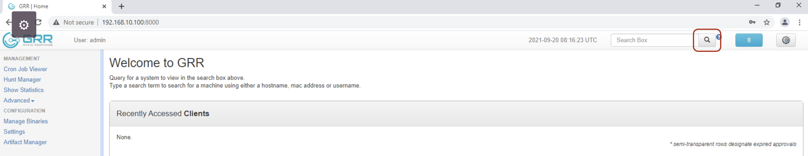

There should be just one machine listed here which is the system in question. The hostname is `WIN-GRR-01`

4. Click on that system.

#### Question 1  - Provide the username used in connecting to the suspicious remote IP (100.200.100.200)

This information is saved in event log file `Microsoft-Windows-TerminalServices-RDPClient%4Operational.evtx` saved at `C:\Windows\System32\winevt\Logs\`

5. Click `Browse Virtual Filesystem` from the left pane

6. From the right pane, navigate to `fs\os\C:\Windows\System32\winevt\Logs\`, clicking the `Refresh Directory` button at each directory level in the path.

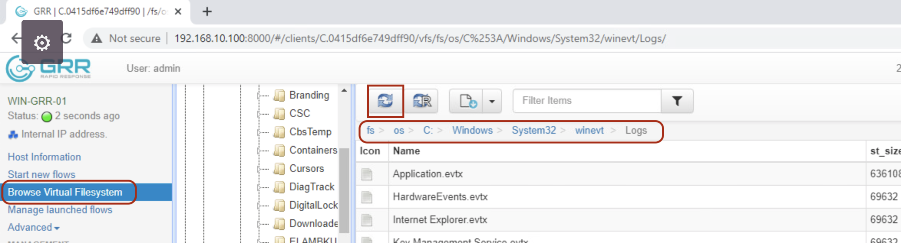

Refresh directory button triggers a refresh of the contents of the current directory as collected from the client.

7. Select `Microsoft-Windows-TerminalServices-RDPClient%4Operational.evtx` file
8. From the lower pane, click on `Download` and then `Collect from the client`

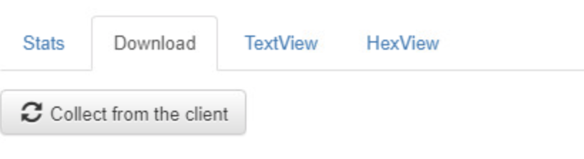

9. Next click on `Download (.... bytes)` to download the file on the `analyst` workstation

   On the `analyst` VM, we will use `Event Viewer` to open this file 

10. Open `Event Viewer` application

11. Under `Actions` on the right side, click `Open saved log...`

12. Browse to `Downloads` folder and select the downloaded file

13. Click OK

14. The event ID that we are looking for is 1029

    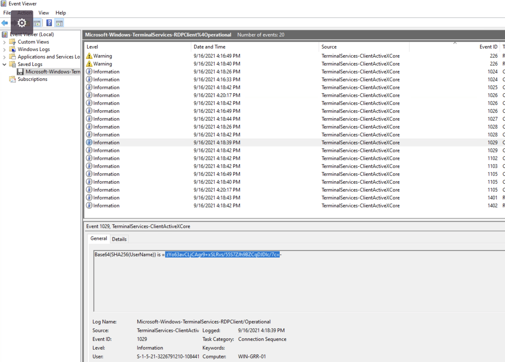

    The Details section of the event contains the base64 of SHA256 of the username

15. Copy that encoded hashed username excluding the hyphen in the end as shown in the above screenshot.

    Next we need to crack that username. There is a python script named `1029_crack.py` that is present on the Desktop of the analyst VM. There is also a wordlist named `rockyou.txt` present on the Desktop of the analyst VM.

16. Update the hash and wordlist in 1029_crack.py as shown below

    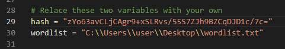

17. Run the script. The username is `muffin`

    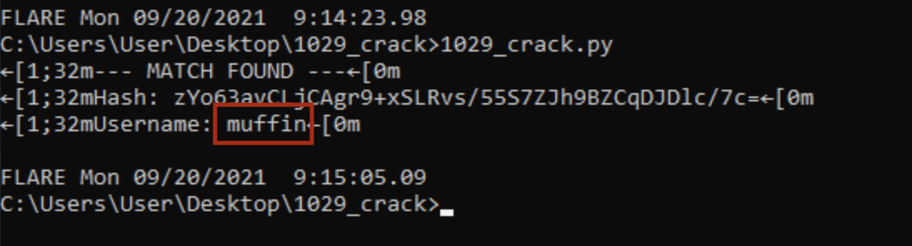

#### Question 2  - Provide the name of the only folder present on the Desktop of the suspicious remote system (100.200.100.200)

To answer this question we need to analyze RDP cache. It is located at `C:\Users\<Username>\AppData\Local\Microsoft\Terminal Server Client\Cache` 

18. Click `Browse Virtual Filesystem` from the left pane
19. From the right pane, navigate to `fs\os\C:\Users\<Username>\AppData\Local\Microsoft\Terminal Server Client\Cache`, clicking the `Refresh Directory` button at each directory level in the path.

20. Download the file `Cache0000.bin` to the `analyst` VM

    Next we will use the bitmap cache parser (`bmc-tools`) present on the Desktop of the analyst workstation

21. Create a folder named `output` on the Desktop

22. Run the `bmc-tools.py` script against the cache file

    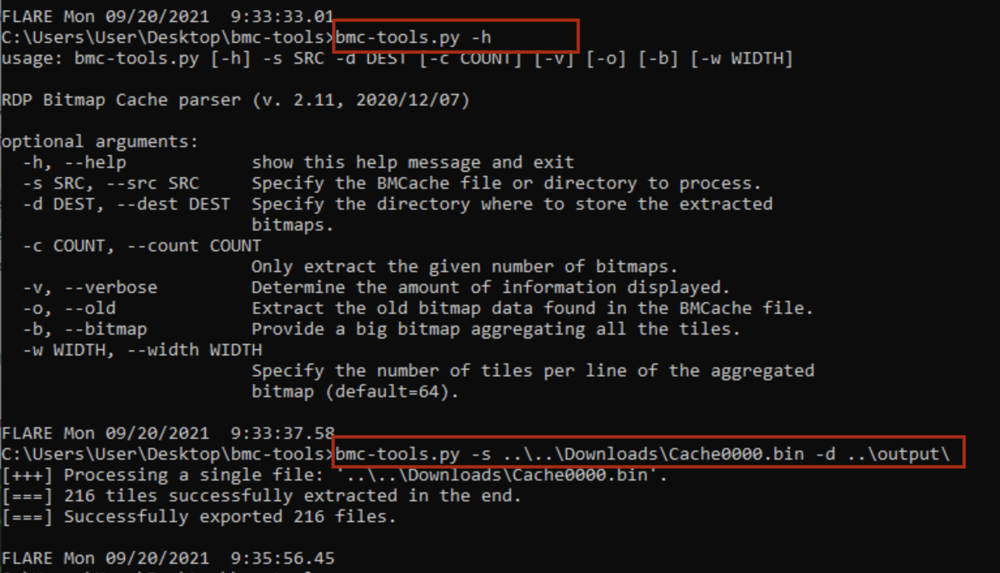

23. Analyze the output folder. You'll notice only one folder present on the Desktop of the remote system and it is named `tools21` . 

    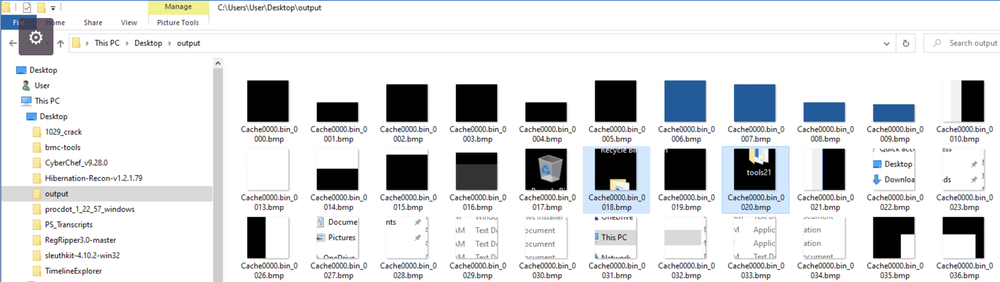

#### Question 3 - Two files were copied from the suspicious remote system to the same folder on the system under investigation. Name the exe file that was copied.

To answer this question, we will analyze $MFT file 

24. Use `Browse Virtual Filesystem` and navigate to `fs\tsk\Volume{.......}\`

25. Download `$MFT` file on the `analyst` workstation

26. Parse the downloaded `$MFT` using `MFTECmd` tool present on the analyst workstation

    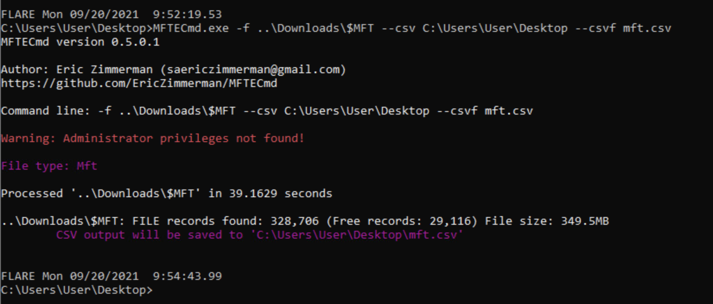

27. Open the output file `mft.csv` using `Timeline Explorer` tools present on the Desktop of the analyst workstation

28. Filter `Created0x10` column for Sep 16th 2021, and `Filename` column for `exe`

    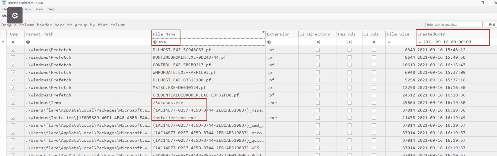

    you'll notice two .exe files were created on that date

29. Now, follow the folder location of both .exe files, you'll notice the exe located in C:\Windows\Temp is the correct one as that folder also contains an .msi file that was created around the same time on sep 16th 2021.

    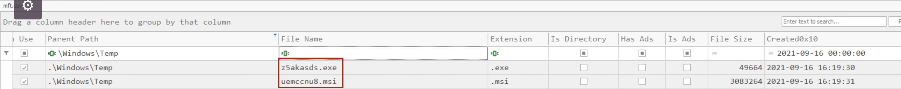

    These are two files that we need to delete for Grading Check 1. 
30. For now, download the `uemccnu8.msi` file on the analyst workstation as this will be needed when working on Grading Check 2. Using `Browse Virtual Filesystem` navigate to `C:\Windows\Temp` and download the file.

    Answer to this question is `z5akasds.exe`.

    #### Grading Check 1

    The next task is to clean the infected system. For the most part, to do any clean up activity we will need to enable the `ADVANCED` mode within GRR. To do so,

31. Click on the gear icon in the top right corner.

    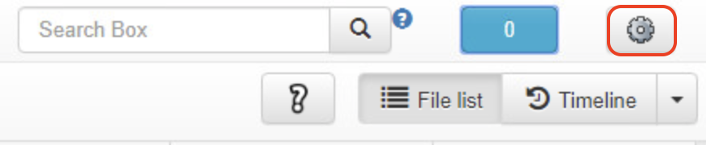

32. In the `Settings` windows, select `mode` as `ADVANCED`, and click `Apply`.

    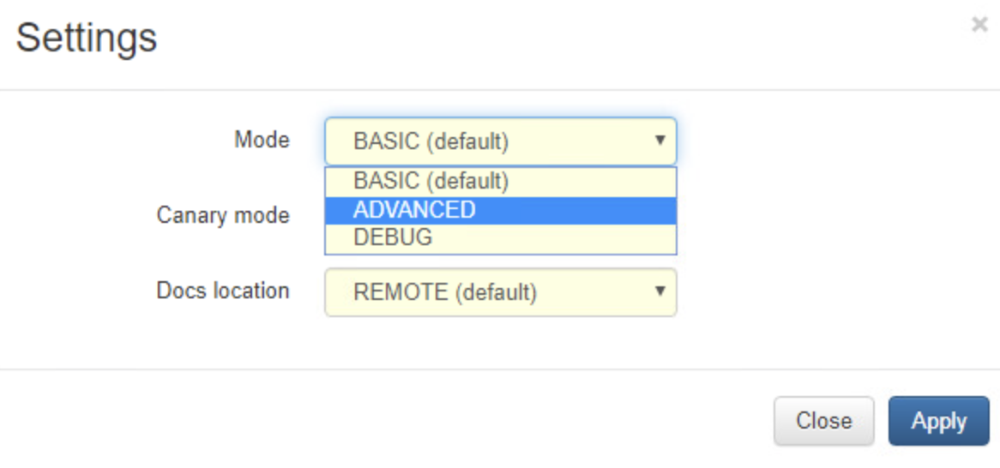

    For performing any clean up activity, we will use the `ExecutePythonHack` flow that allows execution of signed python scripts on the client machine.

    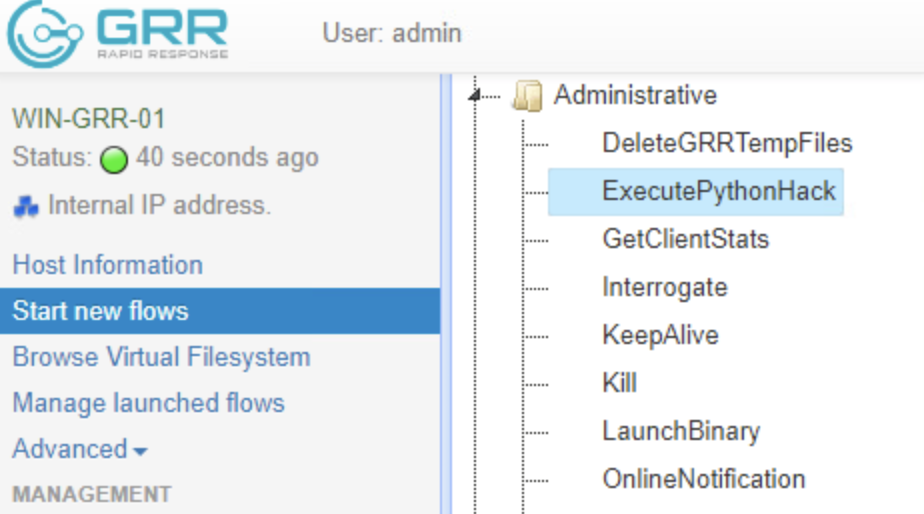

    This means we will write short python scripts for deleting files copied through the RDP session, and uninstalling the application. We can write these scripts on the GRR server for easy import into the GRR admin interface.

33. Login to `grr-server` VM

    For check 1 we need to delete the files that were copied from the suspicious remote system. these files were saved in C:\Windows\Temp folder.

34. Create the following script and save it as `deletefiles.py`

    ```
    from os import *
    os.remove("C:\Windows\Temp\z5akasds.exe")
    os.remove("C:\Windows\Temp\uemccnu8.msi")
    ```

35. Sign and convert the python script to protobuf format and upload to the GRR server datastore

    ```
    sudo grr_config_updater upload_python --file=deletefiles.py --platform=windows --arch=amd64
    ```

36. When asked, enter password as `tartans` By default, all uploaded python files are accessible from the `Manage Binaries` section on the GRR interface.

37. Use the `ExecutePythonHack` flow and execute `windows/deletefiles.py` script. Click Launch.

    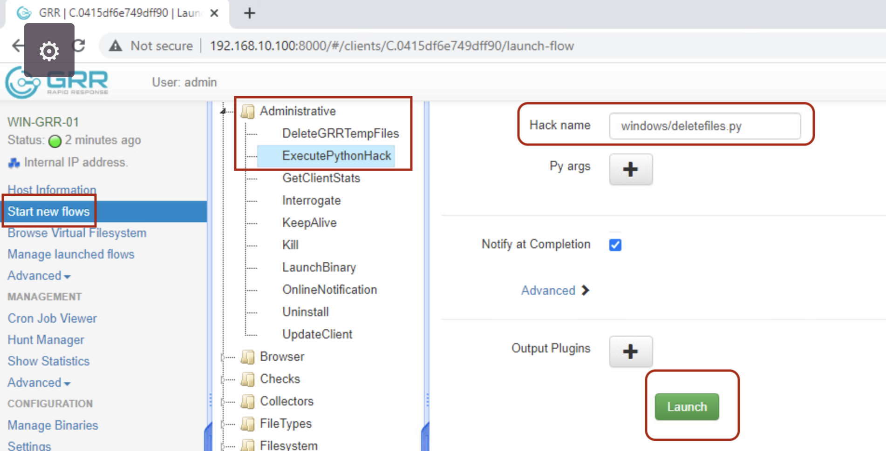

    The result of the flow can be viewed in `Manage launched flows` section. Make sure the flow was successful.

    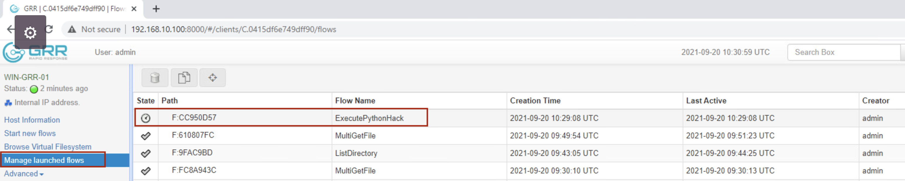

    If it is successful, it will show a check mark next to it or else you can dig into the flow information section in the bottom pane to see why it did not work. 

    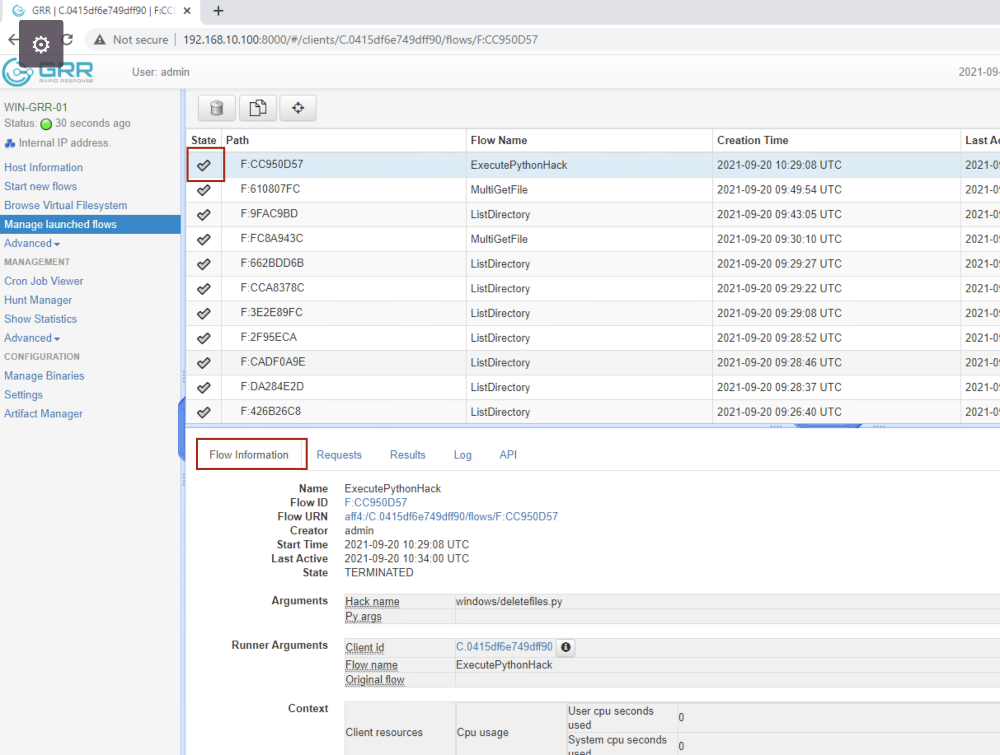

    At this point, access `http://challenge.us` from the analyst workstation and grade the challenge.


#### Grading Check 2

For this grading check we need to know which application was installed on 16th Sep. 
38. Install the `uemccnu8.msi` on the analyst workstation. This file was downloaded on the analyst workstation in step 30 above.

    You'll notice that it is PuTTY application.

39. To find the exact name of the app, open `Control Panel` -> `Programs and Features` 
    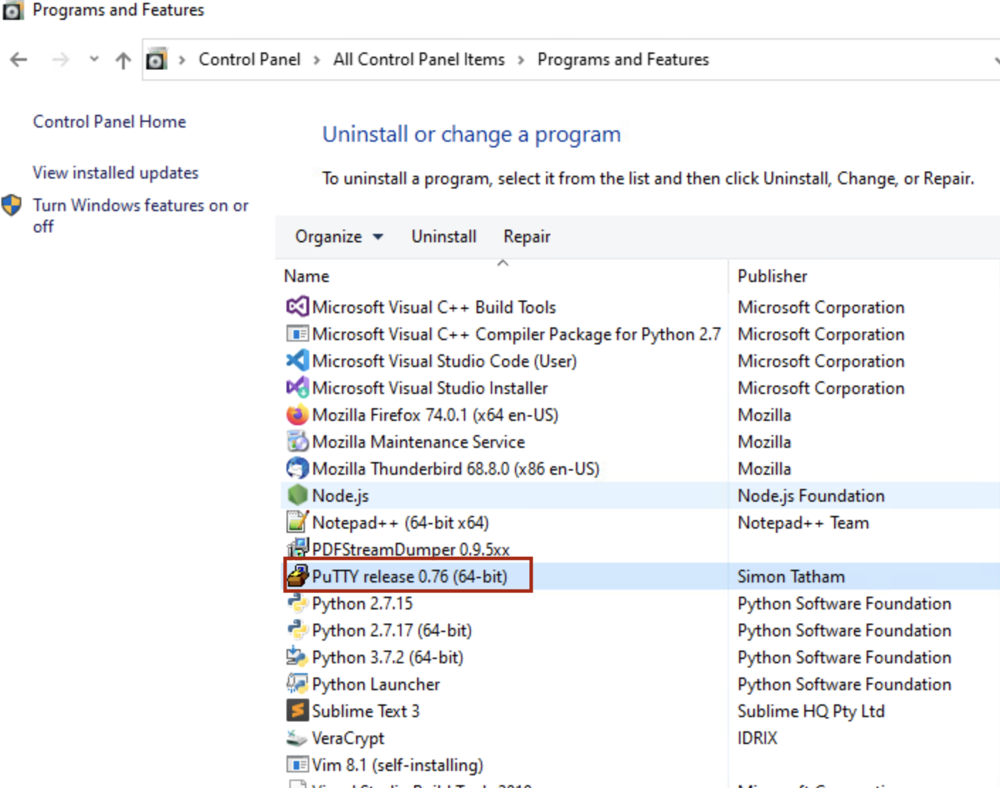
    To verify this app is installed on the system under investigation, we can look for presence of Putty application at `HKEY_LOCAL_MACHINE\SOFTWARE\Microsoft\Windows\CurrentVersion\Uninstall`

40. Use `Browse Virtual Filesystem` functionality and navigate to `fs\tsk\\\?\Volume{....}\Windows\System32\config` folder

41. Download SOFTWARE hive file to the analyst workstation
    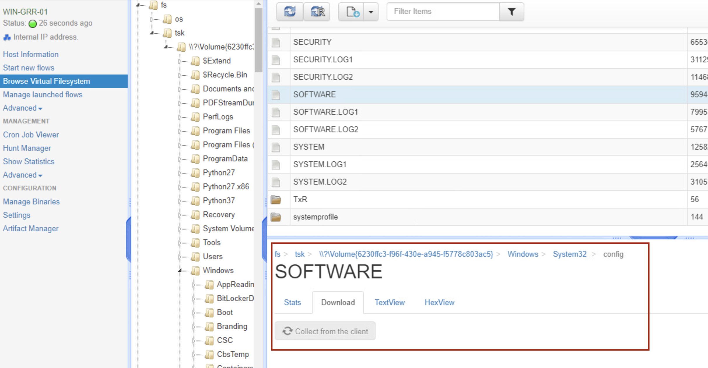

42. Open the downloaded hive using `Registry Viewer`

43. Navigate to `SOFTWARE\Microsoft\Windows\CurrentVersion\Uninstall`

44. Check each key within it looking for applications installed on 16th September 2021
    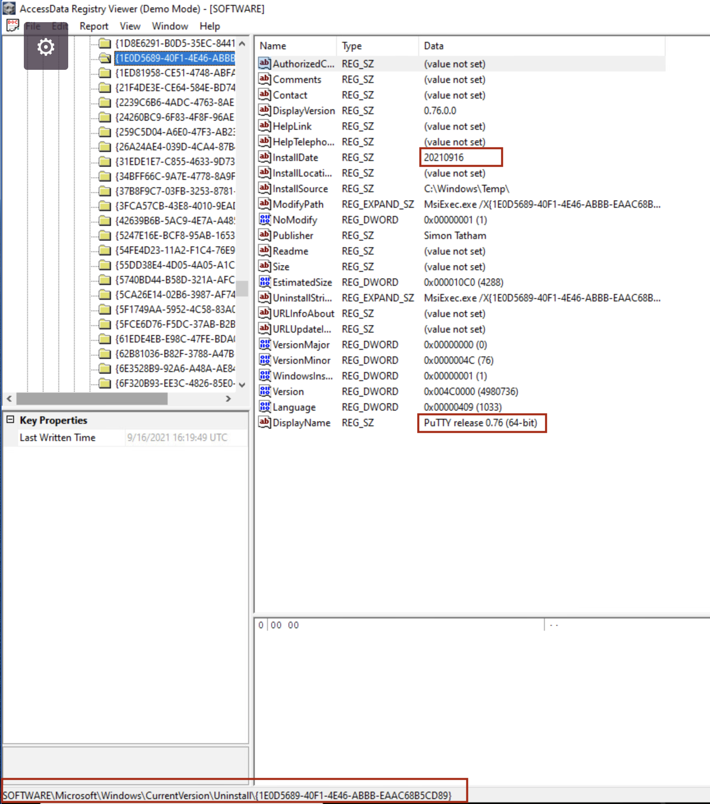
    You'll find PuTTY was installed on that date. You'll also find the full name of the application.

Following is the script that will uninstall the app from the system. Follow the same procedure as Grading check 1 - create the script on the grr-server, sign it, upload it to grr datastore, run it remotely on the system under investigation.
```
import subprocess
subprocess.call(r"powershell.exe (Get-WmiObject -Class Win32_Product -Filter \"Name = 'PuTTY release 0.76 (64-bit)'\").Uninstall()", shell=True)
```

## Answers
Q1 - muffin

Q2 - tools21

Q3 - z5akasds.exe

Grading Check 1 - randomly generated 8 characters hex value

Grading Check 2 - randomly generated 8 characters hex value