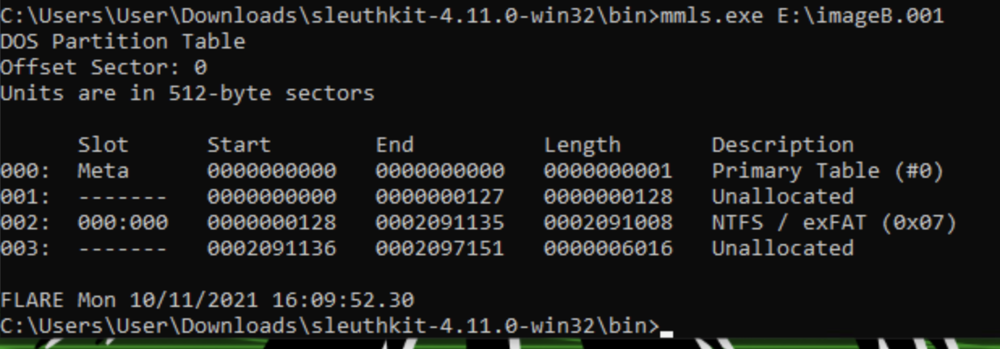

# Not that Facile System (NTFS)

Perform file system forensics.

**NICE Work Role:**

- [Cyber Defense Forensics Analyst](https://niccs.cisa.gov/workforce-development/nice-framework/workroles?name=Cyber+Defense+Forensics+Analyst&id=All)

**NICE Tasks:**

- [T0532](https://niccs.cisa.gov/workforce-development/nice-framework/tasks?id=T0532&description=All) - Review forensic images and other data sources (e.g., volatile data) for recovery of potentially relevant information.

- [T0286](https://niccs.cisa.gov/workforce-development/nice-framework/tasks?id=T0286&description=All) - Perform file system forensic analysis.

## IMPORTANT

This challenge could only be partially open sourced. This challenge contains two artifacts (`imageA.001` and `imageB.001`), but only `imageB.001` can be downloaded. `imageA.001` is available in the hosted environment. Below is the challenge description as it appeared during the competition.

## ⚠️ Large Files ⚠️
This challenge includes large files as a separate download. Please download
[this zip](https://presidentscup.cisa.gov/files/pc3/individual-a-round3-not-that-facile-system-ntfs-largefiles.zip)
and extract in _this directory_ to get started.

## Background

This challenge is mainly focused on file system forensics.

## Getting Started

You are provided with two analyst workstations - Win10 and SIFT. The evidence iso containing two forensic images (`imageA.001` and `imageB.001`) is attached to both the VMs.

`imageB.001` somehow got corrupted and won't load in autopsy anymore. However, we were able to view the partitions on this disk before it got corrupted. Partition table is as follows -

Also, assume the cluster size for NTFS partition on `imageB.001` is 4096 bytes.

Your end goal is to analyze the forensic images and answer the following questions.

1. A zip file was deleted on 11th Oct, 2021. Provide the time when it was deleted.
2. Provide the md5 of the zip file discussed in Question 1.
3. Provide the five letter word stored at the beginning of the 20th unallocated cluster in the NTFS file system.
4. Provide the name of the file that occupies byte offset 0x121EA4010 on the disk.
5. Provide the md5 of `updatedcapture.pcapng` file present in the NTFS file system. (Hint: the first four characters of MD5 of the file are 73dd)

**Please Note-**
- For questions 1 to 4, analyze `imageA.001`. Within that image, analyze the larger of the two NTFS file systems present on the disk.
- For question 5, analyze `imageB.001`.

## System and Tool Credentials

| system/tool | username | password |
|-------------|----------|----------|
| analyst-win10     |   user    |   tartans |
| analyst-sift   |    user   |  tartans  |
