# Not that Facile System (NTFS) Solution


**Please note** - This challenge could only be partially open sourced. `imageB.001` can be downloaded while `imageA.00` can only be accessed in the hosted environment

## Question 1 - A zip file was deleted on 11th Oct, 2021. Provide the time when it was deleted.

The first place to look for a deleted file is the Recycle Bin. 

1. Open `imageA.001` in autopsy

2. Browse to `C:\$Recycle.Bin`. 

   Within the user folder, you'll find artifacts associated with the deleted zip file. `$I..zip` contains the filename, path, and the time the file was deleted. That time is same as the time this $I file was created. So, the answer is 11:35:07 EDT

   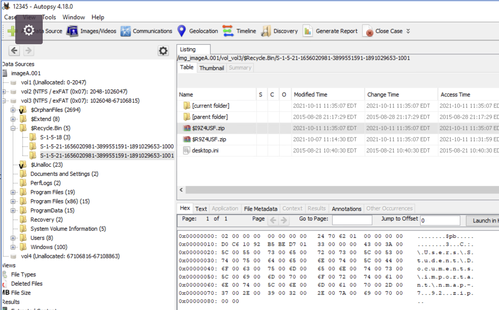

## Question 2 - Provide the md5 of the zip file discussed in Question 1.

3. Corresponding $R file in the Recycle Bin contains the contents of the deleted file.

4. Save that file to your local system by right clicking on it and then selecting `Extract File(s)

5. Open a powershell window

6. Run the following command to find the md5 of the file

   ```
   Get-FileHash -Algorithm MD5 '.\$R9Z4USF.zip'
   ```

   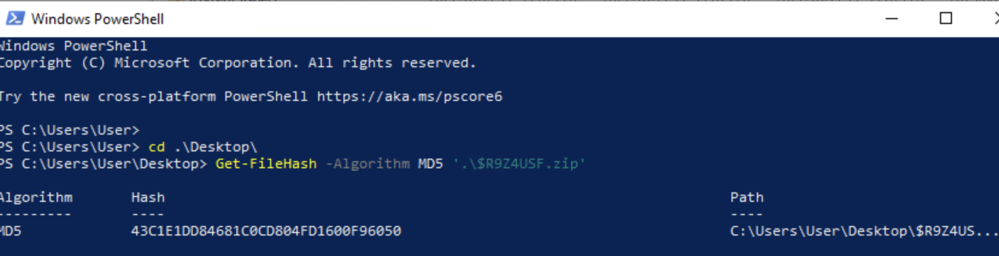

## Question 3 - Provide the five letter word stored at the beginning of the 20th unallocated cluster in the NTFS file system.

7. For this question, we need to analyze contents of $Bitmap file present in the root folder.

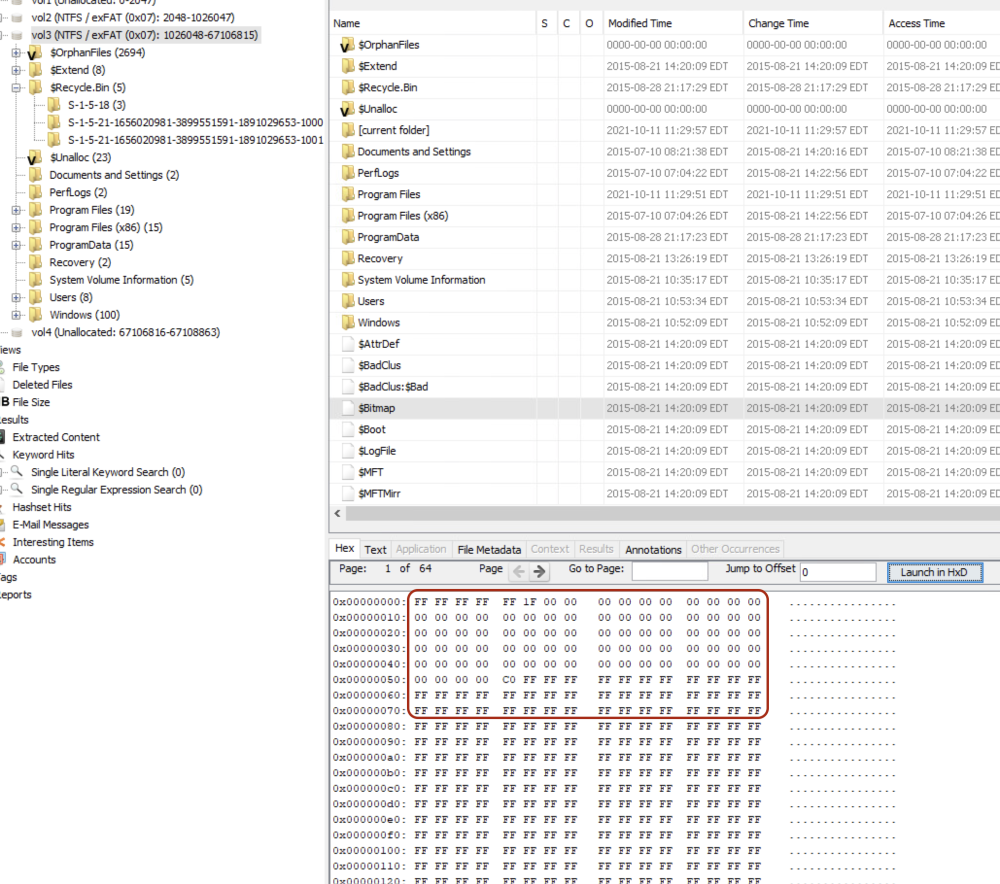

Each bit in the content represents a cluster. If the bit is assigned 1, that means that cluster is allocated. If a bit is assigned 0, it means the cluster is unallocated.

Byte 0 is `FF` which in binary is `11111111`. This means clusters 0 - 7 are allocated. 

Similarly, byte 1 - 4 are `FF`, which means clusters 8 - 39 are also allocated. 

Byte 5 is `1F`, which in binary is `00011111`. This means cluster 40 - 44 are allocated, and 45 - 47 are unallocated. The binary value is read from right to left.

Byte 6 - `00` - `00000000` - clusters 48 - 55 are unallocated.

Byte 7 - `00` - `00000000` - clusters 56 - 63 are unallocated.

Byte 8 - `00` - `00000000` - clusters 64 - 71 are unallocated.

The 20th unallocated cluster is 64th cluster in the NTFS file system. 

Next step is to calculate the byte offset for 64th cluster. 

8. Run `mmls` against the image to learn about different partitions on the disk

   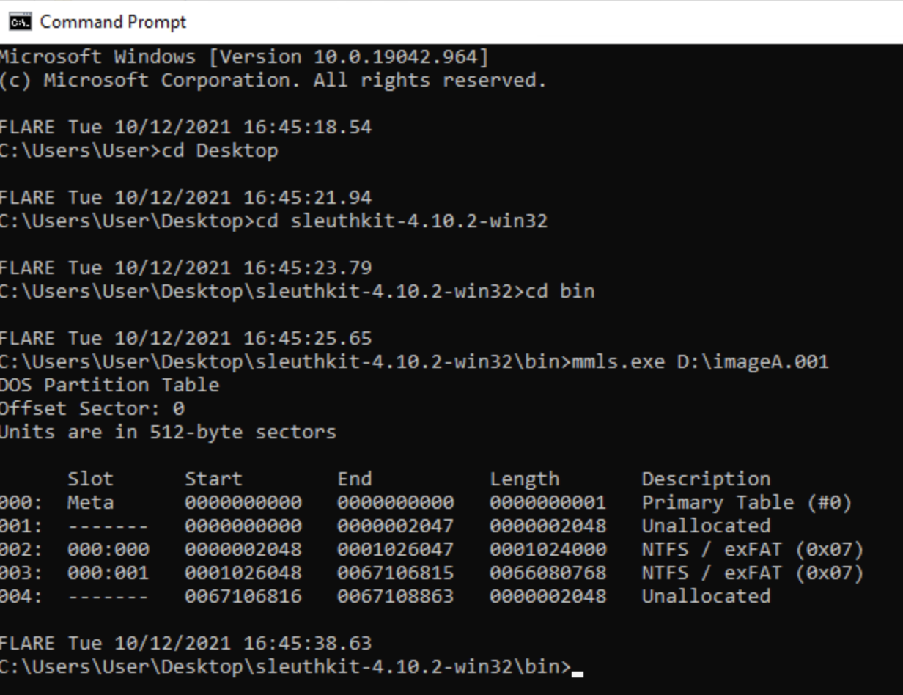

   The NTFS partition starts at sector `1026048`.

9. Run fsstat against the NTFS partition to find cluster size.

   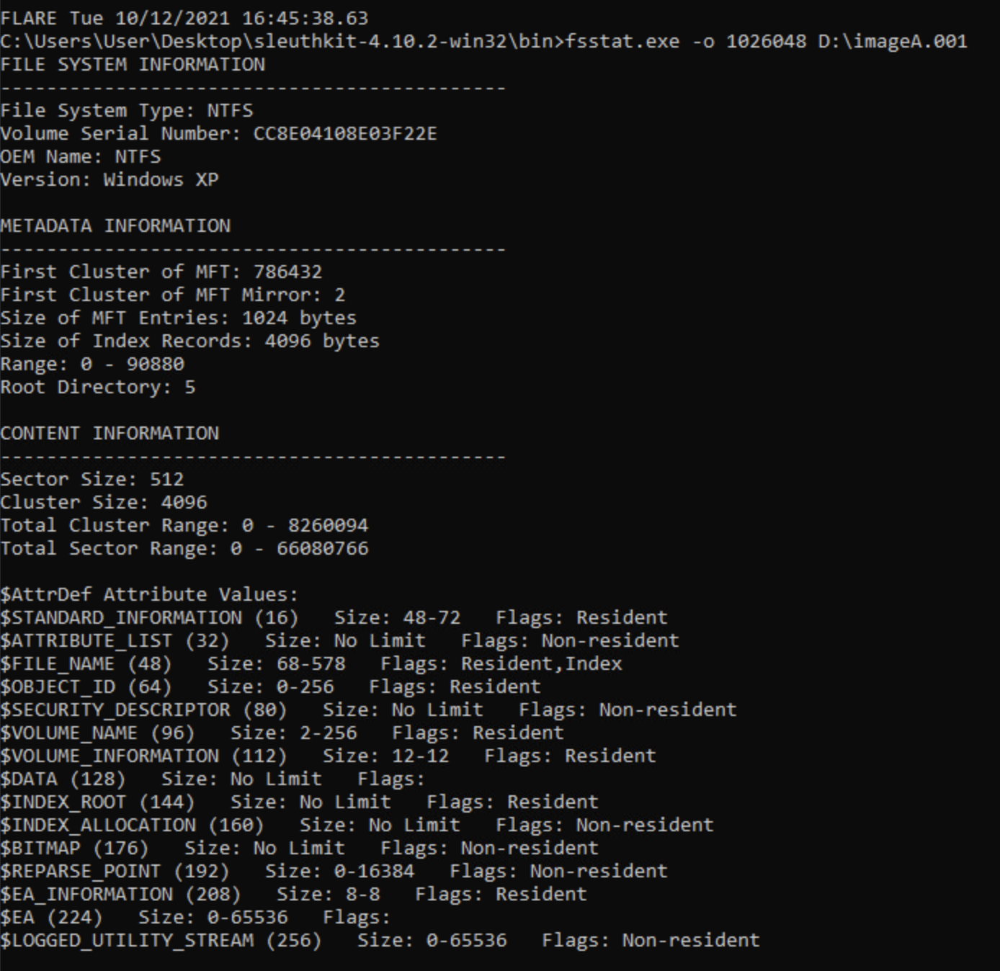

   You'll notice the cluster size is `4096` bytes.

10. The byte offset for 64th cluster in this NTFS file system will be - 

    `1026048*512 + 64*4096` =` 525598720`

11. Use `010 Editor`  to open `imageA.001` 

12. Click `Search` -> `Goto...`

    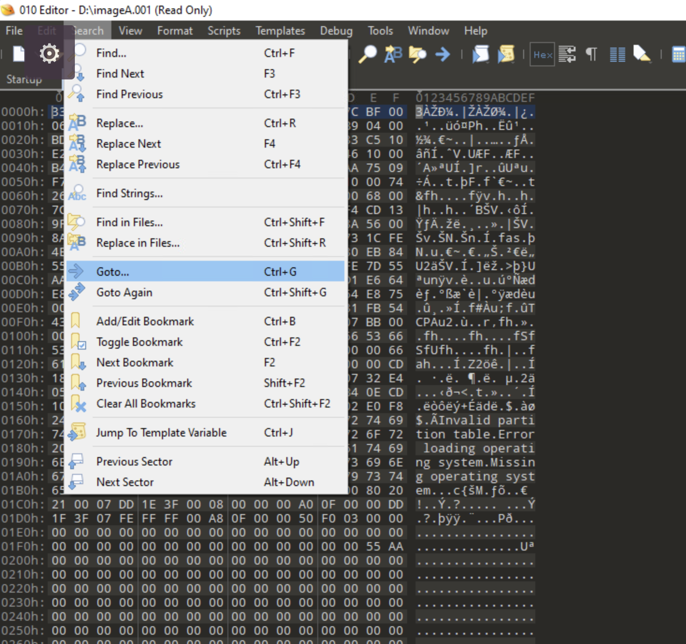

13. Type in the byte offset, and select `Decimal`

    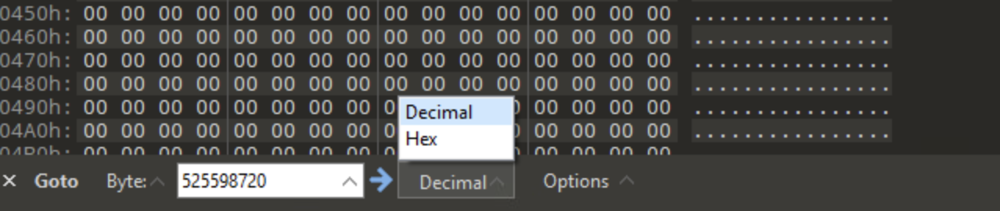

14. At that location, you'll find the 5 letter word - `Bingo`

    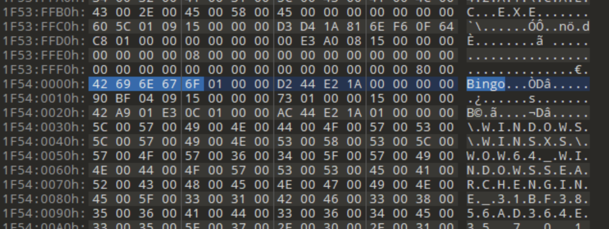

## Question 4 - Provide the name of the file that occupies byte offset 0x121EA4010 on the disk.

For this question, we know the byte offset (`0x121EA4010`). We need to figure out which file does it belong to.

15.  First convert the byte offset to decimal, which is equal to `4863967248`

16. Starting byte offset of the NTFS partition is - 1026048 * 512 = 525336576

17. Subtract the two value to know the byte offset relative to the start of the NTFS partition = 4863967248 - 525336576 = 4338630672

18. To determine the cluster number, divide that value by cluster size -> 4338630672/4096 = 1059236.00391

19. Next use `ifind` command to determine the file inode number that is utilizing that cluster number

    ```
    ifind.exe -o 1026048 -d 1059236 D:\imageA.001
    ```

    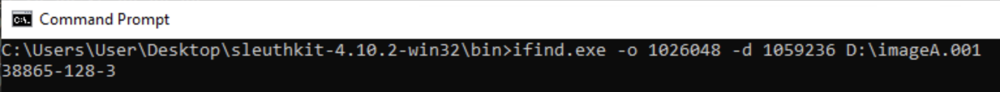

20. Run `istat.exe` against that inode number to determine the filename

    ```
    istat.exe -o 1026048 D:\imageA.001 38865
    ```

    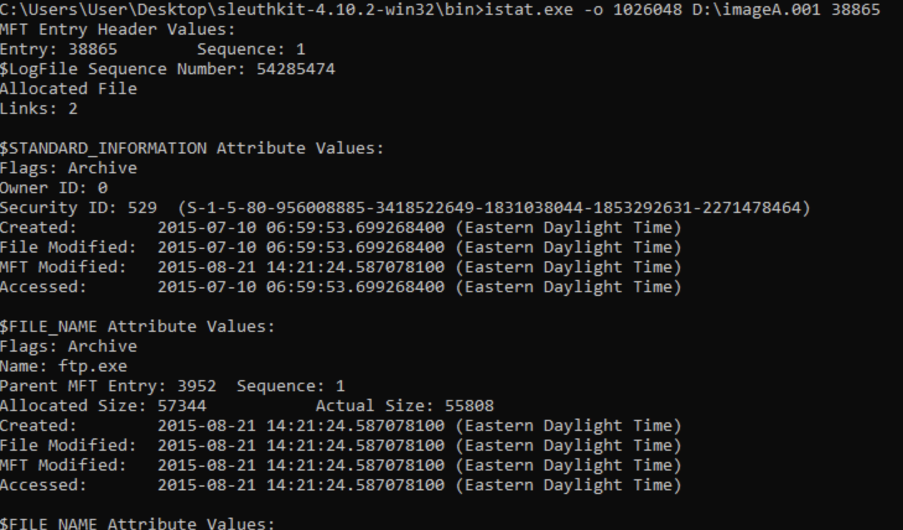

    As can be seen from the output, the filename is `ftp.exe`

## Question 5 - Provide the md5 of `updatedcapture.pcapng` file present in the NTFS file system. (Hint: the first four characters of MD5 of the file are 73dd)

For this question, we'll analyze `imageB.001`.

21. Try loading it in autopsy. You'll notice it won't load.
22. Open the image `imageB.001` in `010 Editor`. 

    Based on the mmls output provided in the challenge description, we know that this image consists of an NTFS partition starting at sector 128. Question says the file `updatedcapture.pcapng` is present in the NTFS filesystem.
    To answer this question, we will first search for the MFT entry corresponding to this file. Then analyze that MFT entry to determine the clusters where the file contents are stored.
23. Select `Search` -> `Find`

    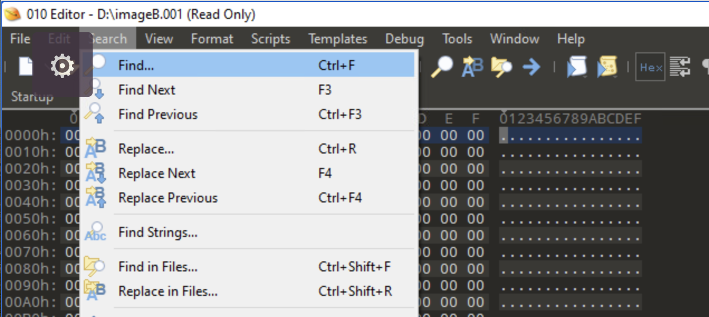

24. Search for the filename and select `Unicode String (u)`
    
    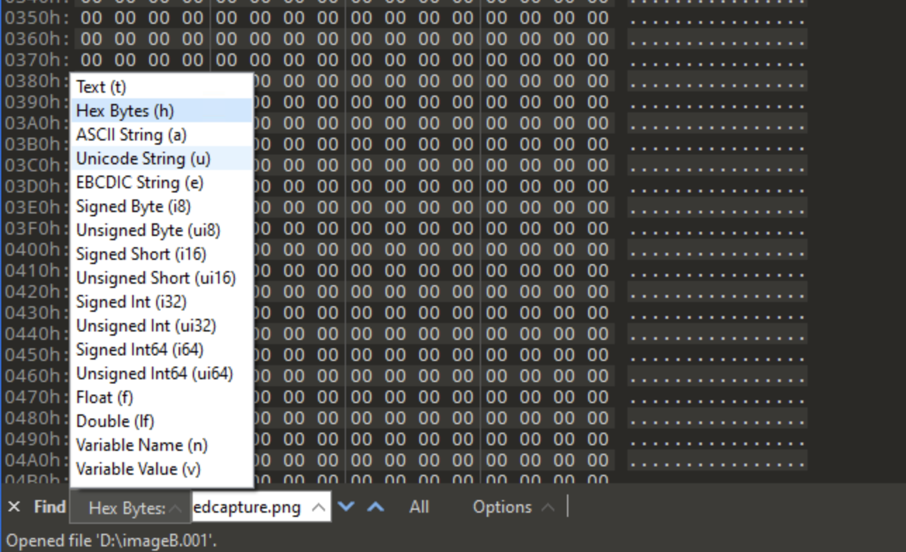

    You'll notice 4 search results. The last one corresponds to an MFT entry because it is starting with `FILE0` file signature.
    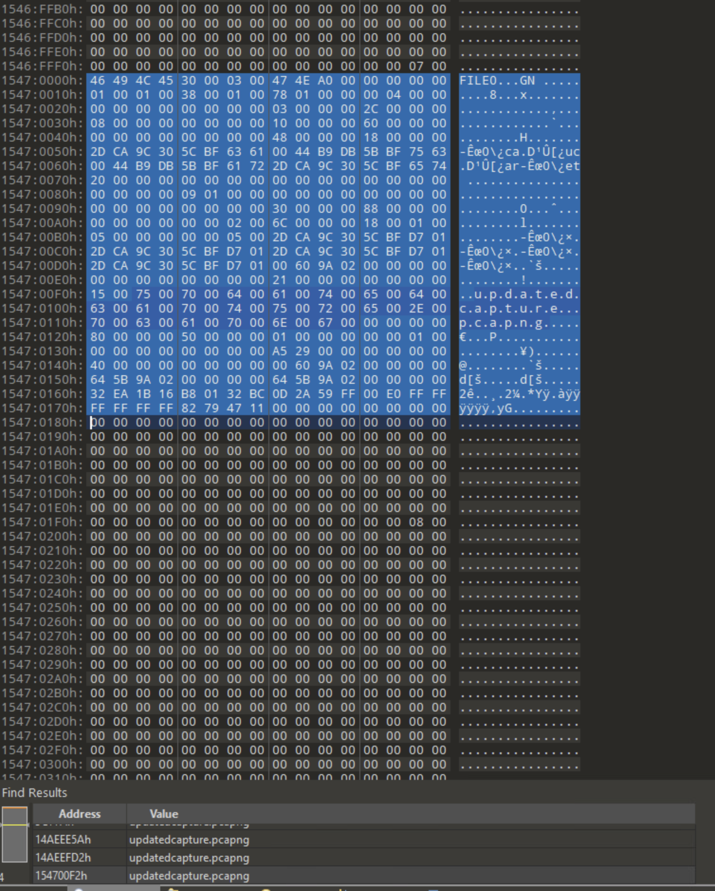
    
25. Let's parse this MFT entry. 
    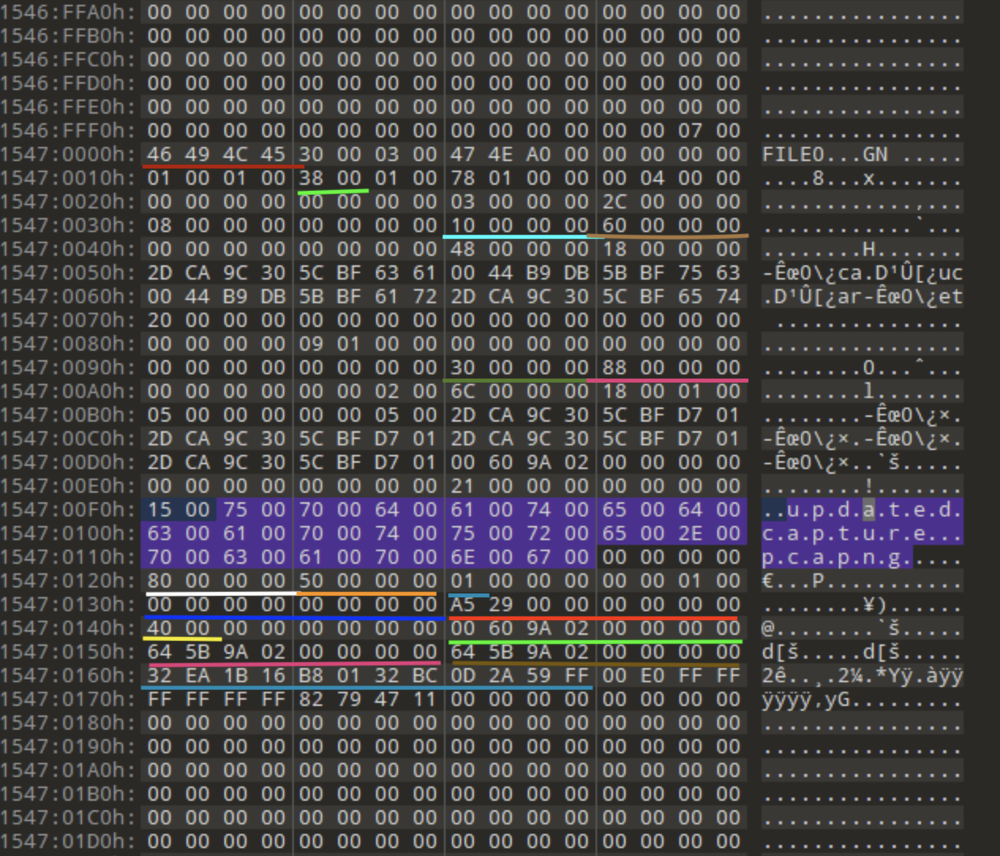
    
    The first 4 bytes highlighted in Red represents the file signature.

Bytes 20-21 highlighted in green provides the offset to first attribute which is equal to 0038 hex -> 56 in decimal 

Moving to first attribute at byte 56. The first four bytes are marked in blue. The first four bytes of an attribute represent the attribute identifier. The value is equal to x10 which is equal to 16 in decimal which means it is $STANDARD_INFORMATION attribute.
Next four bytes highlighted in brown represent the size of this attribute - x60 -> 96 bytes in decimal. <br>

Next attribute starts right after the previous one. Therefore, move 96 bytes from the beginning of the first attribute. <br>

The first four bytes of the next attribute are highlighted in darker green shade -> x30 -> 48 in decimal which means it is $FILENAME attribute. <br>
The size of this attribute is mentioned in the next four bytes highlighted in pink -> x88 -> 136 bytes in decimal.<br>

Move 136 bytes from the beginning of $FILENAME attribute to get to the next attribute <br>
The first four of the third attribute are x80 -> 128 in decimal (underlined in white) which means this is the $DATA attribute and this the one we have to analyze to determine the clusters allocated to this file. <br>

The next four bytes highlighted in orange represents the size of the $DATA attribute which is x50 -> 80 bytes in decimal

Byte 8 (marked in teal) within the attribute determines if it a resident attribute or not. `01` means it is non-resident. <br>
The non-resident information starts at byte 16. <br>
Bytes 16-23 (highlighted in royal blue) represent the starting virtual cluster number (VCN) of the runlist which 0 in this case<br>
Bytes 24-31 (highlighted in red) represents the ending VCN which is x29A5 <br>
Bytes 32-33 represent the offset of the runlist. It is highlighted in yellow and is equal to x40 which means the runlist starts at 64 bytes from the start of the attribute.<br>
Bytes 40-47 (green) represents allocated amount of space for this file - 0x029A6000 (43671552 bytes)
Bytes 48-55 (pink) and 56-63 (brown) are the actual, and initialized amount of space for this file, and in this case both are set to x029A5B64 (43670372 bytes)<br>
In this case, byte 64 is where the run list starts and is mentioned below.<br>
32 EA 1B 16 B8 01 32 BC 0D 2A 59 FF<br>

The first byte in the runlist is organized into the upper and lower 4 bits, which shows how large each of the other fields are.<br>
The lower 4 bits of byte 64 which is equal to 2 show that there are 2 bytes in the field for the runlength<br>
The upper 4 bits of byte 64 which is equal to 3 show that there are 3 bytes in the offset field.<br>

For this section, let's use FTK imager.
Open `imageB.001` in FTK imager.
Search for MFT entry for `updatedcapture.pcapng`

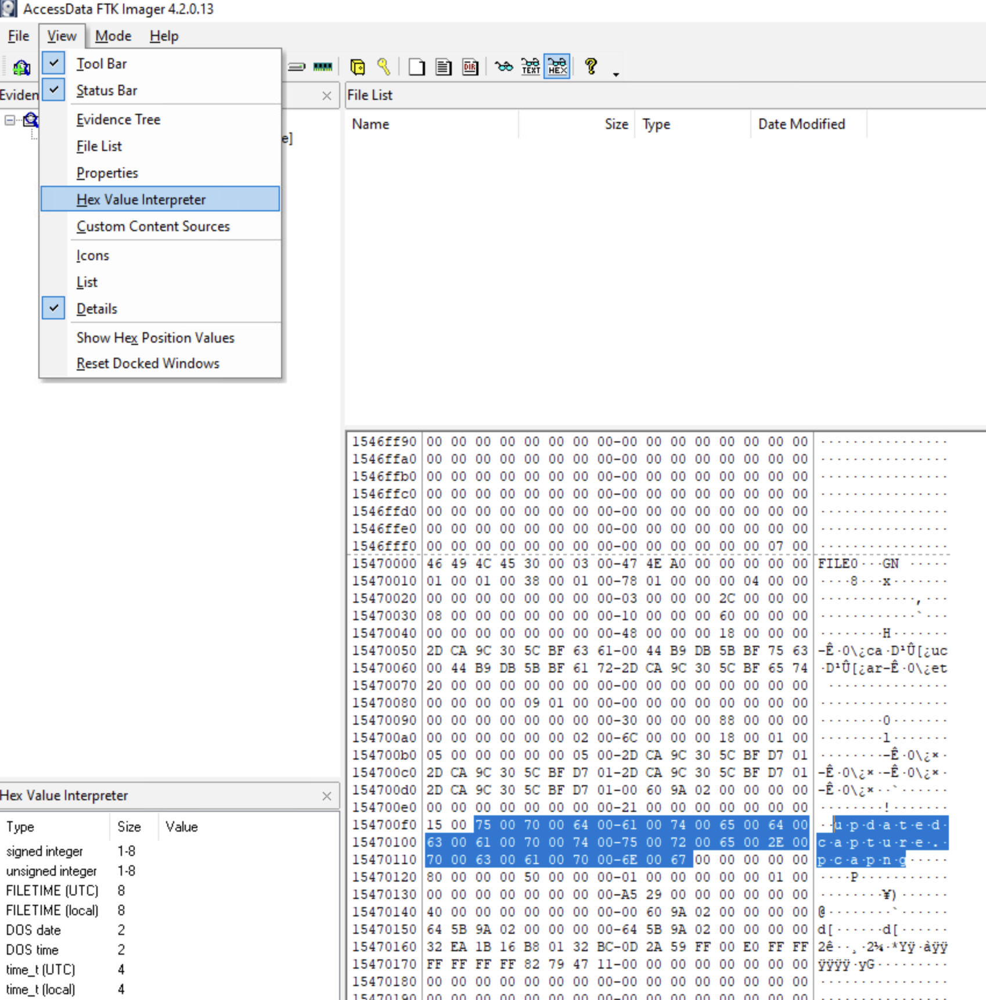

So for first data run, bytes 65 and 66 represents the runlength which is equal to 0x1BEA which is equal to 7146 clusters 
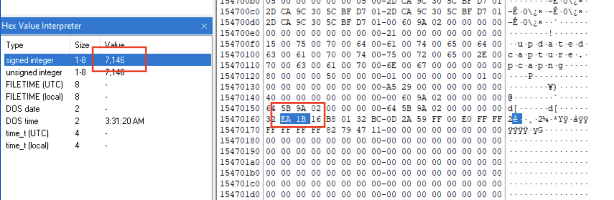

bytes 67, 68, and 69 represent the offset which is equal to 0x01B816 which is equal to cluster 112662.

Right after that starts the next data run. Byte 70 can be broken into lower and upper 4 bits. 
The lower 4 bits of byte 70 which is equal to 2 show that there are 2 bytes in the field for the runlength<br>
The upper 4 bits of byte 70 which is equal to 3 show that there are 3 bytes in the offset field.<br>

So for data run 2, bytes 71, 72 represents the runlength which is equal to 0x0DBC which is equal to 3516 clusters

bytes 73, 74, and 75 represents the offset which is equal to 0xff592A which is equal to -42710 clusters relative to the start of the previous data run.

Byte 76 is 00 which represents the end of runlist.

To summarize,

**Data run 1**

Number of clusters -> 7146 

starting cluster -> 112662

**Data run 2**

Number of clusters -> 3516

starting cluster -> 112662 - 42710 = 69952


Let's convert all this data into bytes.

We know from challenge description that the NTFS file system is starting at sector 128. We also know that the cluster size is 4096 bytes.

**Data Run 1**

Starting byte offset = (File system sector offset * number of bytes per sector) + (cluster offset * cluster size)

                     = (128 * 512) + (112662 * 4096)

                     = 461529088 
Total number of bytes in this data run = Number of clusters * cluster size

                                        = 7146 * 4096

                                        = 29270016 bytes
                     

**Data Run 2**

Starting byte offset = (File system sector offset * number of bytes per sector) + (cluster offset * cluster size)

                     = (128 * 512) + (69952 * 4096)
                     
                     = 286588928
Total number of bytes in this data run = Number of clusters * cluster size

                                        = 3516 * 4096
                                        
                                        = 14401536 bytes
                                        

When adding both values (29270016 + 14401536 = 43671552), it should be same as the total amount of space allocated to this file. We found this value earlier - bytes 40-47.
However, the actual file size is (also found earlier bytes 48-55) 43670372 bytes.

So, we will extract all the bytes from data run 1 and only 14400356 bytes (43670372-29270016 (file size - bytes allocated to data run 1)) from data run 2. Remaining space in data run 2 is slack space.

To extract the file contents, we'll again use `010 Editor`. `imageB.001` should already be loaded into it. 

Click `Edit` -> `Select Range`

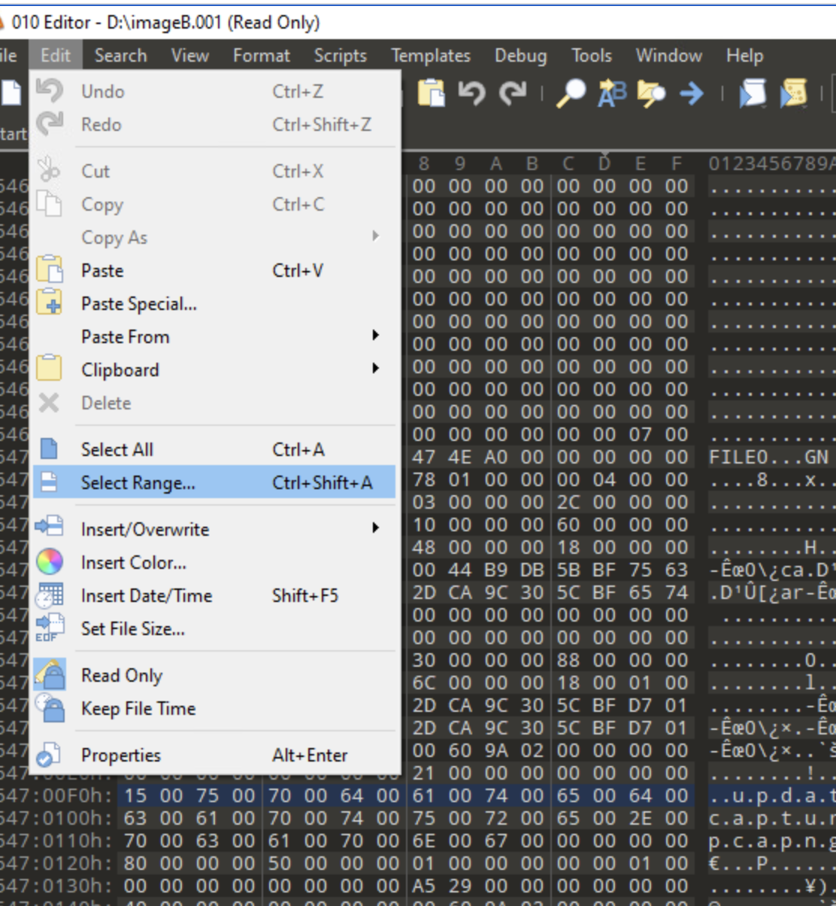

Enter the byte offset and the total number of bytes for data run1. Make sure to select `Decimal`

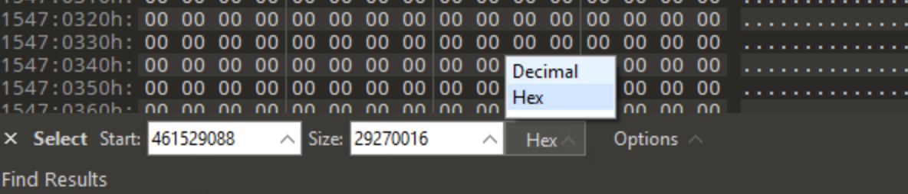

Right click and copy the highlighted text

Select `File` -> `New` -> `New Hex File`

Paste data into new file (right click -> paste)

Go back to `imageB.001` tab. 

Click `Edit` -> `Select Range`

This time enter byte offset for data run2 and number of bytes as 14400356. (Remaining space in this data run is slack space). Make sure to have `Decimal` selected.

Again copy the highlighted text and paste it in the new file that we created just a moment ago. Paste it right after the previous content ended. Do not leave even a byte space in between the two file content chunks as that will change the md5 of the file.

Save this new file as `updatedcapture.pcapng`

Open powershell and find the md5 of this file.

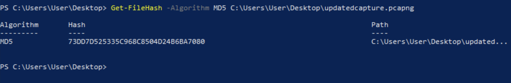

## Answers
1. 11:35:07 EDT
2. 43c1e1dd84681c0cd804fd1600f96050
3. bingo
4. ftp.exe
5. 73dd7d525335c968c8504d24b6ba7080
