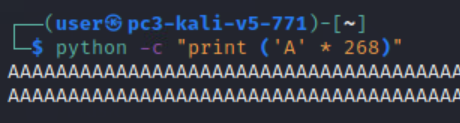
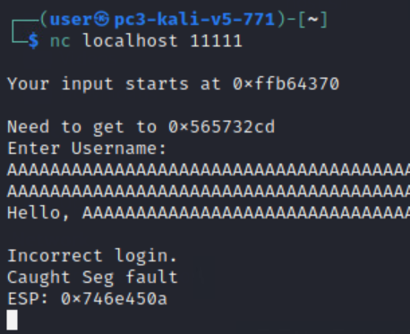
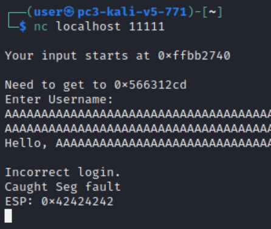
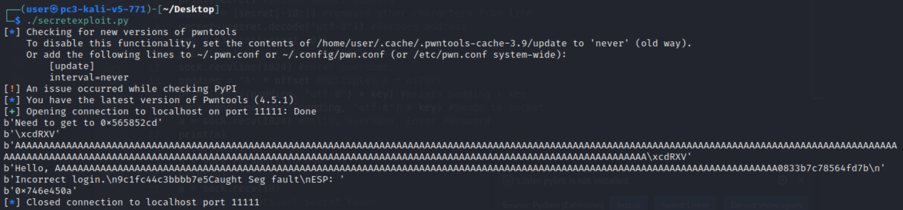
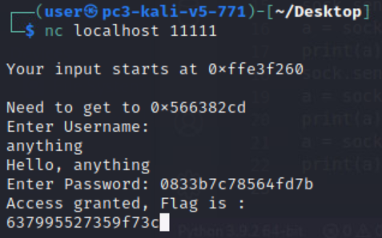
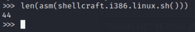
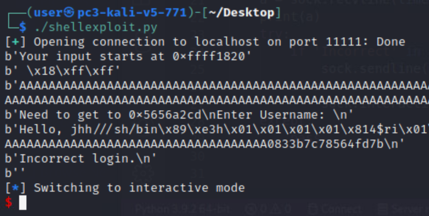
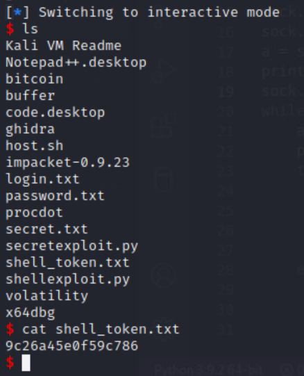

# Walk the Plank Solution

In this challenge, you are given the files to connect to the buffer program through localhost 11111. You can create two python exploits in order to connect to and exploit this program.

The exploits will take advantage of a buffer overflow vulnerability in the program. A buffer overflow is where a program, while writing data to the buffer, overruns the buffer's boundary and overwrites adjacent memory locations. The buffer overflow allows an attacker to return the values from different functions that weren't included in program execution.

Throughout this guide, you will see the python exploits that have been created and snippets from execution of the python scripts and how they affect the program. 

There are 3 tokens in this challenge: 
   - The first token is found by overflowing the program's input buffer. When the buffer is overflowed a 16-character hexadecimal string will be printed by the program. 
   - The second token is found by overflowing the program's input buffer in a way that will call the function `secret()` inside the program. The `secret()` function will print the second token.
   - The third token is found by altering program execution to gain shell access to the server hosting the program. Once you have gained shell access by exploiting the program, you can view the contents of the last token file. 

<br>
<br>

1. You first want to find the right number of characters to input into the program so you can gain control of program execution (this is also called the offset). The ESP is the address at the top of the stack, this is where program execution is trying to go.   
We can find the offset by entering many 'A' characters into the program. If you enter enough A's, the program execution will try to access the address space `0x41414141` (41 is the hex code for the character 'A'), which would cause a segmentation fault at that location. Once you find the precise number of A's to enter into the program to cause a segmentation fault at `0x41414141`, you can replace the last characters with other characters and control program execution


   Open a terminal and enter the following command (replace `###` with a number of your choice): 
   ```
   python -c "print ('A' * ###)"
   ``` 

   The `###` will be how many A's you want to print out. Use trial and error to determine the minimum number of A's to use to cause a segmentation fault where `ESP: 0x41414141`

   

   

   To ensure that you have full control of the buffer, add 4 'B's to the end of the buffer using the line: 
   ```
   python -c "print ('A' * ### + 'BBBB')"
   ```
   This time, the segmentation fault to be at `ESP: 0x42424242`. If ESP still contains '41' characters, remove a few A's incrementally until you see the desired ESP.

   

   This confirms that the offset in this case is set at 268.

   The program itself will tell you the secret function address when it starts its execution. This is the point where you want to overflow the buffer to in order to get the token for that part. Putting that hex value address in the right place will cause the program to execute that function's code. This address should be placed after the offset that was found previously. This exploit is overflowing the username input buffer (the space that is allocated for the user's input into the username field). By overflowing this buffer, your input is being written to places on the program's stack where other things usually are. The important bit is that you know where the return address is (that's what you figured out above when calculating the offset). This is so that you can take control of program execution and cause it go to the secret function by entering its address where the program is looking for its next step (ESP).

2. Open any text editor and create the first exploit to overflow the program to the secret address given at the beginning of program execution.

   An example code can be found in the same folder (./solution) as this README, and it is named `secretexploit.py`

    The example python snippet used the Python pwntools package to interact with the socket. The code can be changed or developed differently in order to come to the answer, but it must be able to find the offset, reverse the secret address, and print those values into the 'username' section of the program in order to correctly overflow.

   To make the program executable and then run it, enter the following commands:
   
   ```bash
   chmod +x secretexploit.py

   python3 secretexploit.py
   ``` 
   
   Example solution program output is below:
   

   In the picture above, you will see that after running the exploit, you will have a string that is length 16 after `Hello, AAAAA....`. This will be the password to the program itself and is how you will receive the first token. Enter the shown password into the program to retrieve the first token:  
   
   


   The second token (received by calling the secret function) is printed in the output between `Incorrect login` and `Caught Seg fault\nESP:`
   

3. To retrieve the last token, you will have to craft an exploit which allows you to access the "host" machine via a shell console; in this open-source form, this is of course *your* computer. In order to do this, you want to send shell code in front of the padding (A's) and the key. Shell code is a set of instructions that executes a command in software to take control of or exploit a compromised program. Shell code is used by an attacker that has limited access to a machine but can exploit a vulnerability in order to gain access to a higher-privileged process. We want to do this in order to access the files on the host machine. 

   Shell code can be generated in Python by using the `pwntools` module:

   ```python
   from pwn import *

   asm(shellcraft.i386.linux.sh())
   ```

   You have to find the length of the shell code that you are adding to the input, and you must subtract that length from the offset size. You can check the length of your shell code by using the Python length function: 

   ```python
   len(asm(shellcraft.i386.linux.sh()))
   ```

   

   Since this shell code is 44 bytes long, you need to subtract 44 from your initial offset in order to accommodate what you are adding to the buffer. In our case 268 - 44 = 224.

4. Write a program that will interact with the socket and exploit it with shell code. An example of this can be found in the form of `shellexploit.py` in the current folder.

   This python exploit is overflowing the same username input buffer as the previous exploit. The return address in this case is the beginning of the username buffer, so you are taking control of program execution and making it go to the location of the shell code (instead of to the location of the secret function). As you can see in the picture, the shell code is entered before the A's in program execution. This means that the shell code will be executed, and you will be sent to an interactive shell.

   The shell code that we are running in this exploit comes from the pwntools pre-built `shellcraft.1386.linux.sh` shell code. There are other forms of shell code that are usable -- you will have to alter the offset size based on the size of the shell code if you choose another type.


5. To make the new exploit executable and then run it, enter the following commands:

   ```bash
   chmod +x shellexploit.py

   ./shellexploit.py
   ```  

   

   This will bring you to an active shell on the machine that is hosting the program. To find the last token, look with:

   ```bash
   cat shell_token.txt
   ```

   

## Further Help
The source code for the buffer file (`buffer.c`) can be found in the current solution folder. It was not provided to the competitors during the competition, but it is provided, here, for clarity.

To compile the source code with gcc, execute the command:
```
gcc -m32 -z execstack -fno-stack-protector -o ./buffer ./buffer.c`
```