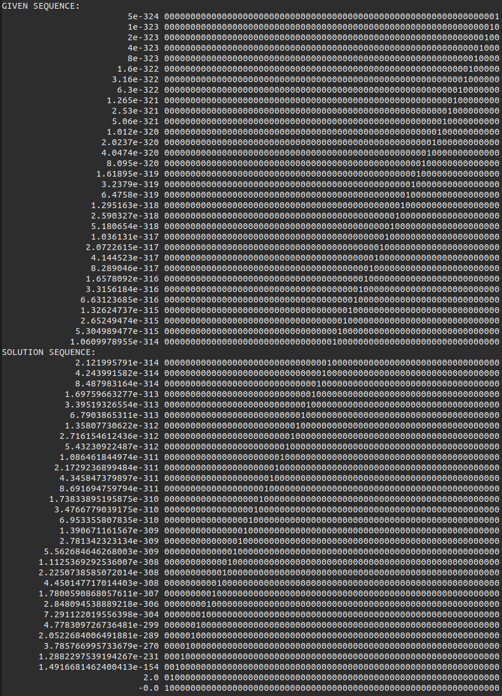

# Fundamentals Solution

1. The solution Python script will retrieve all tokens from the server. Notes:
2. The first problem is a Fibonacci sequence within the space of an 8-bit signed int. This means the number wraps around multiple times, including to negative values. The first several given values are the common start of the Fibonacci sequence, until the number should go above 127. The sequence begins switching back and forth between negative and positive, demonstrating the restricted range of values.
    - In the `fibonacci()` function, note that the standard sequence calculation takes place *mod 256*. This forces the number to wrap into the possible values of an 8-bit integer.
    - Additionally, There is an `if` statement followed by a strange-looking calculation. This is the [Two's complement](https://en.wikipedia.org/wiki/Two%27s_complement) operation to represent negative values in the 8-bit integer space.
3. The second problem is a series of floating point values that do not seem like an obvious sequence. However, the sequence is actually in the representation of the floating point values - they are the values that result when there is exactly one bit set to 1 in a 64-bit value, cast to an IEEE-754 format double. The following screenshot demonstrates the values for each bit position.
    - 
    - The solution script handles the type conversion in `binary_repr()` and `shift_to_double()`, using Python's built-in `struct` module.
4. The third and last problem appears to be a random sequence with no obvious order. However, the user should come to the realization that all of the values fit within a byte, and there is only one value missing.
    - The solution script assumes the user has already determined that the given numbers all fit within a single byte, and that they are just trying to automate finding the remaining one. It uses set subtraction to find the last value that fits within the byte.