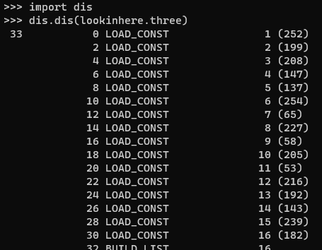

# Introspection Session Solution Script

The `solution.py` script, placed in the same folder as the file `mainmodule.pyd`, will obtain all tokens.

# Introspection Session Solution Guide

1. Open a Command Prompt or Powershell in the same folder as `mainmodule.pyd` and run `python`. This should open a Python interpreter.
1. The first token is a class property attached to the ExamineMe class.
    - 
    - You can find the ExamineMe class by exploring the module's `__dict__` attribute.
    - 
    - Then, use the built-in `help()` function to list any help information about it, which also reveals the first token.
1. The second token requires some form of monkey patching. The `two()` function calls the `decode_or_not()` function without specifying the keyword argument. The above function swap can be done, or it's possible to alter the default argument value through the `__defaults__` attribute of the function.
    - 
    - The `two()` function's help output mentions the `decode_or_not()` function.
    - 
    - This reveals that the `decode_or_not()` function has two arguments, one of which is a default argument. After testing it, the function seems to only respond to its second argument, which two does not provide. It always seems to return False. We can define a new function that always returns True, and swap the new function into the place of the old one, and then call `two()` again. `two()` will use the swapped function instead of the original.
    - After doing this swap, we should swap it back to the original function, or restart the interpreter and import `mainmodule` again. `three()` calls this function, but expects it to be in its original state.
1. The third token's docstring tells the competitor to examine the function's bytecode and determine what arguments to specify to get the token. Analyzing the bytecode will reveal the relationships demonstrated in the script.
    - 
    - The help suggests examining the function's bytecode.
    - 
    - The bytecode can be viewed with Python's built-in `dis` module.
    - 
    - This part is checking if `a != 2*d` and jumping to line 144 if False (that is, if `a == 2*d` it skips a few lines - and the lines following this bytecode force a return).
    - 
    - `if b < 4*a` is the check, and it returns if that is the case.
    - 
    - `if c != 8*b` is the check, and it returns if so.
    - 
    - Finally it checks `d != "8675309"` and returns if True. Note that the quote marks in the bytecode indicate that `d` must be a **string**.
    - Taken together, we can reverse the arguments required to pass all of these return traps. If we set `d = "8675309"`, then we can obtain a valid set of other arguments by setting `a = 2*d`, `b = 4*a`, and `c = 8*b`. Despite the fact that `d` is a string value, these operations work because Python will *concatenate* strings with multiplication operations.
1. The fourth token's docstring suggests that disassembling `mainmodule.pyd` will be necessary. This is because, unlike the first three token functions, `four()` is a compiled Rust function instead of an obfuscated Python script. To get started in solving this one, the file can be opened in IDA or another disassembler and then the provided `mainmodule.pdb` can be loaded. In the disassembler, look for the symbol `four`, which should reveal several symbols containing the word "four". Analyzing the assembly reveals that the three arguments must have the values in the script above in order to decode and return the token.
    - 
    - `help()` for `four()` only mentions examining the assembly of the extension module. `mainmodule.pdb` was provided in the challenge in order to help narrow down the search space greatly by providing debug symbols.
    - 
    - We can have a look through all of the above functions, but the highlighted one is the only one we need.
    - 
    - This block is doing a comparison with a hex constant. Converted to decimal, we get the value `329875398726`.
    - 
    - This block compares to a string constant, `'vblvljken'`.
    - 
    - Finally, there is a comparison to a floating point value, `299792.458`.
    - Together, we can supply these values as arguments to four and get the final token.