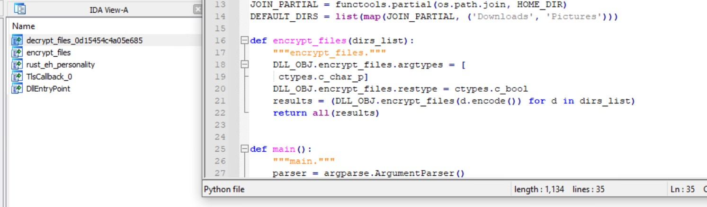

1. Navigate to the `challenge/` folder.
3. Extract `main.zip` somewhere convenient.
4. (Optional) Copy the `pyinstxtractor.py` script you downloaded into `dist/main` in the extracted folder. (In the same folder as `main.exe`)
5. (Optional) Open Powershell or Command Prompt and `cd` into `dist/main` in the extracted folder.
6. (Optional) Run `python pyinstxtractor.py main.exe`.
7. (Optional) `cd` into the folder that was just created. (The folder name should be something like main__extracted)
8. (Optional) Run `uncompyle6 main.pyc` and view the script. This script can be helpful later, so it's a good idea to save a copy.
9. In the start menu, search for "IDA". Run IDA Free, click New on the prompt, and open the `enc.dll` file located in the `dist\main` folder where you extracted the zip.
10. After the autoanalysis finishes (should take less than a minute), switch to the Exports tab and look at the list of functions. The decryption function is listed.
11. Now that you have the name of the decryption function, if you followed the optional steps above and saved a copy of the script, you can replace the calls to `encrypt_files` with the full name of the decryption function. Otherwise you'll need to create a script to call the function.  
  
In the screenshot above, the decryption function name from IDA is shown on the left. On the right is the saved script from the optional steps.  You will need to change line 21 to call the `decrypt_files` function instead of the `encrypt_files` function. *Note that your function name will be different than what is shown here*
12. Create a folder and copy `decrypt.me` into it. Run `python script.py foldername`. `decrypt.me` should now be decrypted.
