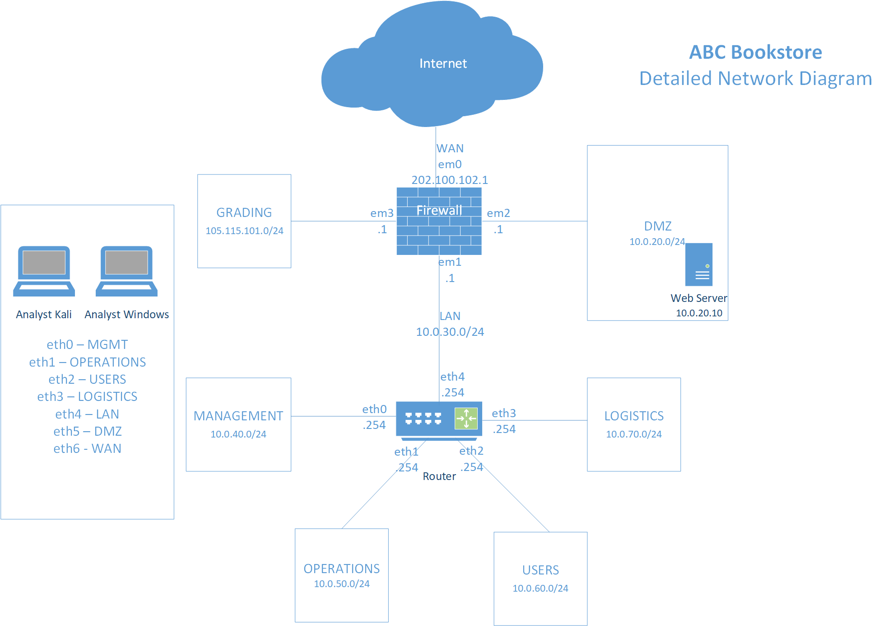

# Disconnected

Troubleshoot network issues. 

**NICE Work Role:** 

- [Network Operations Specialist](https://niccs.cisa.gov/workforce-development/nice-framework/workroles?name=Network+Operations+Specialist&id=All) 

**NICE Tasks:**

- [T0081](https://niccs.cisa.gov/workforce-development/nice-framework/tasks?id=T0081&description=All) - Diagnose network connectivity problem.
- [T0129](https://niccs.cisa.gov/workforce-development/nice-framework/tasks?id=T0129&description=All) - Integrate new systems into existing network architecture.
- [T0153](https://niccs.cisa.gov/workforce-development/nice-framework/tasks?id=T0153&description=All) - Monitor network capacity and performance.

## IMPORTANT

This challenge does not have any downloadable artifacts. You may complete this challenge in the hosted environment. 

## Background

You all are a group of Network Operations specialists working for ABC Bookstore. A couple of issues have been identified in the network, and your goal is to fix all the issues to fully solve this challenge.

## Getting Started

You are provided access to VyOS router, pfSense firewall, Ubuntu web server in DMZ, and two analyst workstations - kali, and windows. The analyst workstations have interfaces in all the subnets, and can be used for troubleshooting network issues. You are also provided access to a Windows 10 system named `results` dedicated for accessing grading results. 

Please review the network topology diagram for ABC Bookstore, and also review the configurations on different systems in the network.

The issues identified in the network are as follows - 

1. Customers on the internet are not able to access the company's website (hosted in the DMZ)
2. Users in the USERS subnet are not able to access the company's website (hosted in the DMZ) 
3. Users in the OPERATIONS subnet are not connected to the network -- they unable to acquire DHCP leases from the router
4. Users in the LOGISTICS subnet are streaming/downloading a lot of content from the internet and thereby impacting the overall network performance 
5. Users in the MANAGEMENT subnet are not able to access internet

## Submission Format

Your end goal is to analyze the network issues and implement the configurations in the network that will allow you to pass the following five grading checks. Each successful grading check will yield a 8-character hexadecimal string for submission.

| Grading Check # | Grading Check Description                                    | Weight |
| :-------------: | ------------------------------------------------------------ | :-------: |
|        1        | Customers on the internet should be able to access company's website hosted at `www.abc.com` |    20%    |
|        2        | Users in the USERS subnet should be able to access company's website hosted at `www.abc.com` |    20%    |
|        3        | Users in the OPERATIONS subnet should be able to acquire DHCP leases from the router |    20%    |
|        4        | Bandwidth limit for users in the LOGISTICS subnet should be set to 100KB/s (To test your configurations, you can try downloading `www.squid.com/squid.deb`) |    20%    |
|        5        | Users in the MANAGEMENT subnet should be able to access the internet (To test your configurations, you can try accessing `www.squid.com`) |    20%    |

The grading results can be accessed at `http://challenge.us` from the `results` system. 

## Things to keep in mind

- The underlying networking (layer 1 and layer 2) is in place. The network adapters for all the systems are connected to the proper/correct networks.

- There are two DNS resolvers setup in the environment. The pfsense firewall resolves DNS for systems inside the ABC network. The other resolver is setup on a system  on the internet (202.100.102.200) and can be used as the DNS server for systems on the WAN subnet . Both DNS resolvers are serving DNS requests for `www.abc.com`, `www.squid.com`, and `challenge.us`. 
 The DNS mappings are as follows - 
 `www.abc.com` - 10.0.20.10 (internal), 202.100.102.1 (external)
 `www.squid.com` - 202.100.102.200
 `challenge.us` - 105.115.101.210
- Every subnet in the network is a /24 subnet. For subnets that have a DHCP server, acquire IPs through DHCP. For subnets that do not have a DHCP server, assign IP addresses such that the last octet is between **.100** and **.150**. 
- The pfSense web console (`http://10.0.30.1`) is accessible from LAN subnet (10.0.30.0/24)
- The grading VM is in its own subnet. The URL to the grading application is `http://challenge.us`, and is accessible from the `results` VM. 
- The grading VM is performing checks using IP addresses and not domain names.
- Grading can take up to 3 minutes.
- **Live traffic analysis is possible using the in-built tool(s) present on the router and firewall.**
- **Do *NOT* configure bridging on any of the systems as that will result in losing access to the VMs and the Gamespace.**

## System and Tool Credentials

| system/tool | username | password |
|-------------|----------|----------|
| Firewall Web Console  | user     | tartans  |
| router    | user    | tartans |
| webserver      | user     | tartans  |
| analyst-kali   |   user    |  tartans  |
| analyst-win10     |   user    |   tartans |
| results | user | tartans |

## Note
Attacking or unauthorized access to challenge.us (10.5.5.5) is forbidden. You may only use the provided web page to view challenge progress and download any challenge artifacts that are provided.
