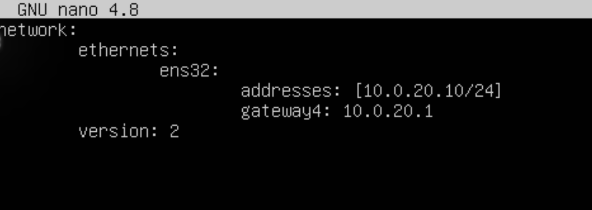
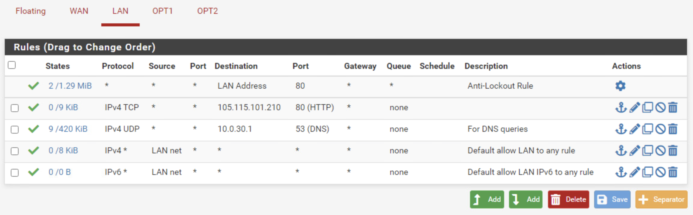
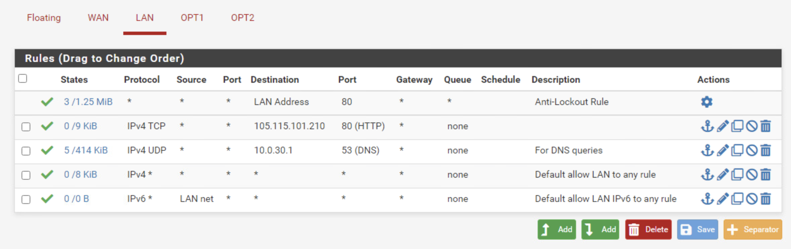
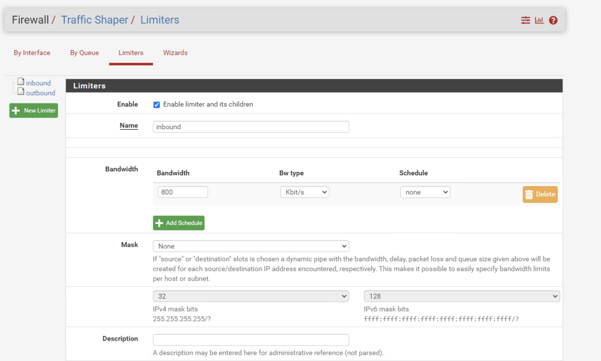
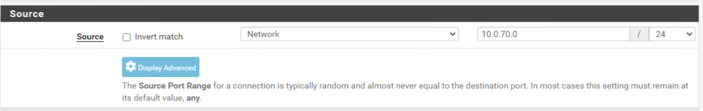
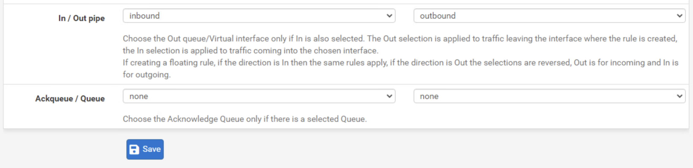
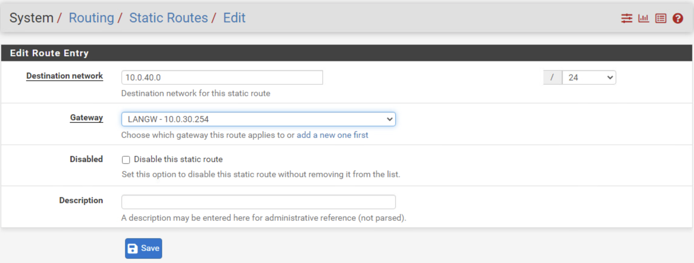

# Disconnected Solution

**Please note** - This challenge does not include any downloadable artifacts. This challenge can only be completed in the hosted environment.

The best tool for this challenge is `tcpdump`. It can show you where the connectivity is breaking. It is present on the router and the firewall.

### Grading Check 1

For this check, we need to make sure that the users on the WAN subnet can access the website (`www.abc.com`) hosted in the DMZ.

1. Login to the analyst-kali VM.

2. Disable NetworkManager. You may use Network Manager if you'd like, but this guide works off of the assumption that the service is disabled.

   ```
   sudo systemctl stop NetworkManager
   sudo systemctl disable NetworkManager
   ```

3. Disable all interfaces except the WAN interface `eth6`, replacing the `#` in the command below with the number of the interface. 

   ````
   sudo ifconfig eth# down
   ````

4. Give an IP to the WAN interface. Choose the IP such that the last octet is between `.100` and `.150`, as mentioned in the challenge description. The network address for the WAN interface is `202.100.102.0/24`. 

    ```
    IP - 202.100.102.150
    Subnet mask - 255.255.255.0
    Gateway - 202.100.102.1
    DNS - 202.100.102.200
    ```


   ```
   sudo ifconfig eth6 202.100.102.150 netmask 255.255.255.0 up
   sudo route add default gw 202.100.102.1
   ```

   Replace the contents of `/etc/resolv.conf` with the following to specify the DNS server.

   ```
   nameserver 202.100.102.200
   ```

5. Now, the kali system is configured on the WAN interface, but you'll notice the website `www.abc.com` is still not accessible.

6. Perform a nslookup for `www.abc.com` to ensure that DNS is not an issue.

   ```
   nslookup www.abc.com
   ```

   You'll see that `www.abc.com` translates to the WAN interface of the firewall.

7. Run `tcpdump` on the WAN interface of the firewall to see if traffic is reaching it. 

   Type `8` on the firewall console to get a shell.

   Then enter the following to run tcpdump:

   ```
   tcpdump -i em0 host 202.100.102.150
   ```

   `em0` is the WAN interface of the firewall. 

   `202.100.102.150` is the IP of the kali machine, from where the request is originating.

8. On the kali machine, browse to `www.abc.com` again.

9. On the firewall console, you'll notice a lot of SYN requests (Flag [S] set) but no response from the web server.

10. Stop the packet capture by pressing `Ctrl+C`.

11. Next, run a capture on the DMZ interface of the firewall. 

    ```
    tcpdump -i em2 host 202.100.102.150
    ```

12. Browse the website `www.abc.com` again on kali VM to generate traffic.

13. Look at the firewall console, and you'll notice that there are no packets captured on the DMZ interface. This is to say that the traffic is being blocked at the firewall. 

14. Next login to the analyst-win10 workstation to access the web console of the firewall. 

15. Disable all network interfaces except the LAN interface, `Ethernet4`.

16. Give `Ethernet4` the following settings:
    ```
    IP address - 10.0.30.150
    Netmask - 255.255.255.0
    Gateway - 10.0.30.1
    DNS - 10.0.30.1
    ```

17. Browse to the web console of the firewall at `http://10.0.30.1`.

18. Login to the web console.
    
    For this grading check, we need to make sure that there is port forwarding setup. It will redirect http traffic hitting the WAN interface to the web server in the DMZ.

19. On the firewall web console, navigate to `Firewall` -> `NAT` -> `Port Forward`.

20. There are no port forwarding rules setup currently. Click `Add` to add a port forwarding rule.

21. Configure the following settings:  

    Set the `Destination port range` to **HTTP** for both `From port` and `To port`.

    `Redirect target IP` - **10.0.20.10**

    `Redirect target port` - **HTTP**

22. Click `Save` and then `Apply Changes`.

23. Retry steps 11 and 12.

    You'll notice that SYN traffic now shows up on the DMZ interface, but there is no response from the webserver.

24. Next login to the webserver console.

25. Verify that the IP is setup.

    ```
    ip addr
    ```

26. Verify that gateway is setup.

    ```
    ip route
    ```

    You'll notice that the system does not have a default gateway setup.

27. Edit the following file to add the default gateway:

    ```
    sudo nano /etc/netplan/50-cloud-init.yaml
    ```

28. Add the following line to make the edited file looks like the picture below. Note: you must use spaces instead of tabs.
    ```
    gateway4: 10.0.20.1
    ```

    

29. Next, apply the configurations.

    ```
    sudo netplan apply
    ```

30. Try accessing `www.abc.com` from the analyst-kali console. It should work this time.

31. Access the `challenge.us` site from the results system to obtain the token for this Grading check.


For the following Grading checks, you can use `tcpdump` between the source and the destination interfaces to see where connectivity is breaking. However, this guide will only outline how to fix the issues.

### Grading Check 2

For this check, the firewall is configured to allow traffic inbound from only the LAN subnet and not other subnets. It needs to accept traffic from other subnets including the USERS subnet.

32. Login to the analyst-kali VM. 

33. Disable the WAN interface `eth6`.

    ```
    sudo ifconfig eth6 down
    ```

34. Enable and IP USERS interface `eth2`.

    ```
    sudo dhclient eth2
    ```

35. Try browsing to `www.abc.com`, and you'll notice that it does not load.

36. Go back to the firewall's web console on the analyst-win10 VM.

37. Navigate to `Firewall` -> `Rules`.

38. Click on `LAN` interface.

39. Change the second to last rule that says allow `LAN net` to allow `*` (`any` source).

    

    After the change the GUI should look like this.

    

40. Click on `Apply Changes`.

    This rule will allow the USERS subnet to browse `www.abc.com`.

### Grading Check 3

For this check, the issue is that the DHCP server is not configured for the OPERATIONS subnet. 

41. Login to the router console.

42. Review the configurations. 

    ```
    cat /config/config.boot
    ```

    You'll notice that DHCP is configured for the USERS, LOGISTICS, and MANAGEMENT subnets, but not for the OPERATIONS subnet. Also, the IP address for the OPERATIONS interface is not configured.

43. Type the following commands to configure the the OPERATIONS interface and DHCP for the subnet. 

    ```
    configure
    set interfaces ethernet eth1 address 10.0.50.254/24
    set service dhcp-server shared-network-name OPS subnet 10.0.50.0/24 default-router '10.0.50.254'
    set service dhcp-server shared-network-name OPS subnet 10.0.50.0/24 dns-server '10.0.30.1'
    set service dhcp-server shared-network-name OPS subnet 10.0.50.0/24 range 0 start '10.0.50.1'
    set service dhcp-server shared-network-name OPS subnet 10.0.50.0/24 range 0 stop '10.0.50.200'
    commit
    save
    exit
    ```

44. Reboot the system for the configuration to take effect.
    ```
    shutdown -r
    ```

### Grading Check 4

45. Disable all interfaces on the analyst-kali VM, replacing the `#` symbol in the command below with the number of the interface.

    ```
    sudo ifconfig eth# down
    ```

46. Enable the LOGISTICS interface.

    ```
    sudo dhclient eth3
    ```

47. Try downloading `www.squid.com/squid.deb`.

    ```
    wget http://www.squid.com/squid.deb
    ```

    You'll notice that the speed is somewhere in MB/s.

    We have to reduce this speed so that it is less than 100KB/s.

48. Login to firewall's web console from the analyst-win10 system.

49. Navigate to `Firewall` ->`Traffic Shaper`.

50. Click on the `Limiters` tab, and then click on `New Limiter`.

51. In the `Limiters` tab, configure the following settings. 

    1. Check `Enable limiter and its children`
    2. Give it a name - `inbound`
    3. Set the bandwidth as `800` and Bw type as `Kbit/s`, which is equal to 100KB/s
    4. Click `Save`

    

52.  Create another limiter with the same bandwidth settings as the `inbound` limiter, but name it `outbound`.

53. Click `Apply Changes`.

54. Next we will create a firewall rule to apply these bandwidth setting. Navigate to `Firewall` -> `Rules` -> `LAN`.

55. Click `Add` to add a new rule.

56. Change the source to `Network` and enter the network range `10.0.70.0/24`.

    

57. Within the Extra Options section, click on `Display Advanced`.

58. Scroll to the bottom of the page.

59. Within the In/Out pipe section, select `inbound` and `outbound` respectively.

    

60. Click `Save` and then `Apply Changes`.

    Make sure the newly created rule is the first rule in the list, as rule order matters. There will be a default Anti-Lockout Rule above your newly created rule.

61. Now re-verify downloading `squid.deb` from the analyst-kali VM. You'll notice the speed will be less than 100KB/s.

### Grading Check 5

62. On the analyst-kali console, once again disable all the interfaces, replacing the `#` symbol with the number of the interface.

    ```
    sudo ifconfig eth# down
    ```


63. Configure the interface `eth0`, the MANAGEMENT subnet interface, to use DHCP. 

    ```
    sudo dhclient eth0
    ```

64. Try browsing to `www.squid.com`, and you'll notice that it fails. The issue is that the static route for the MANAGEMENT subnet is missing on the firewall.

65. Go back to the firewall web console on the analyst-win10 machine.

66. Navigate to `System` -> `Routing` -> `Static Routes`.

67. Click `Add` to add a new static route.

68. Set the destination network to `10.0.40.0/24` and choose the gateway to be `LANGW - 10.0.30.254`.

    

69. Click `Save` and then `Apply Changes`.

70. Verify that you can browse to `www.squid.com` from the analyst-kali system.

71. On the results console, browse to `challenge.us` to obtain the tokens. 

## Answers

Grading Check 1 - randomly generated 8 characters hex value

Grading Check 2 - randomly generated 8 characters hex value

Grading Check 3 - randomly generated 8 characters hex value

Grading Check 4 - randomly generated 8 characters hex value

Grading Check 5 - randomly generated 8 characters hex value