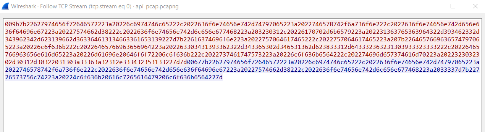
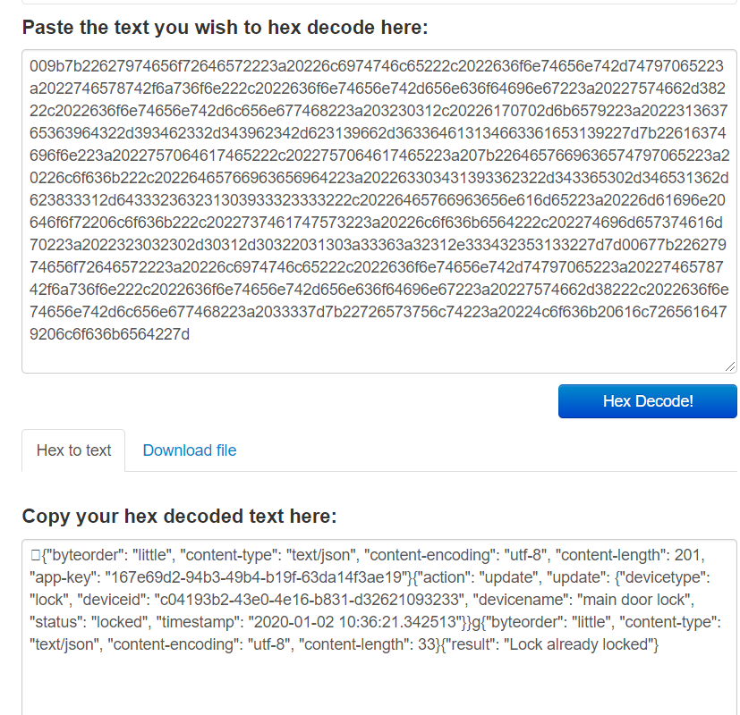

# IoT API? Oh My.

In this challenge, you are given a pcap that shows interactions with an IoT device API. You must determine how to interact with the API, then interact with it to cause effects to IoT devices. 

Throughout this guide, you will see code snippets. The full program is also included alongside this guide. 

1. Open the pcap file and isolate the TCP packets to/from `127.0.0.1:12345`

2. Right click on a packet and select `Follow TCP Stream` to view a TCP conversation with the API.



3. The bytes in the TCP Stream are hex encoded. Copy/paste the ASCII data in the TCP Stream and decode from hex encoding. You can do this on a number of websites [like this one](https://www.convertstring.com/EncodeDecode/HexDecode).  The decoded TCP Stream for the TCP Stream 0 contains the following data:
```
›{"byteorder": "little", "content-type": "text/json", "content-encoding": "utf-8", "content-length": 201, "app-key": "167e69d2-94b3-49b4-b19f-63da14f3ae19"}{"action": "update", "update": {"devicetype": "lock", "deviceid": "c04193b2-43e0-4e16-b831-d32621093233", "devicename": "main door lock", "status": "locked", "timestamp": "2020-01-02 10:36:21.342513"}}g{"byteorder": "little", "content-type": "text/json", "content-encoding": "utf-8", "content-length": 33}{"result": "Lock already locked"}
```


4. Follow the same process to decode each of the TCP Streams. You can apply a Wireshark display filter like `tcp.stream eq #`  where `#` is replaced by the stream number.  Keep track of all of the decoded json conversations between the client and the API server. 

5. TCP Stream 5 shows the API registration conversation. The contents are below. 
To further break down this conversation:
The first json blob is the header that is required with each interaction. The header contains basic information including the app-key, message size and other fields.  The second json blob, immediately following the header is the application request - the client is requesting registration with the API. The conversation uses a generic/default app-key of `1234567890`. This is the required key for the registration command.  The server replies with a UUID - this is the new API key for the newly registered client. Further interactions with the API should use a registered app-key
```
{"byteorder": "little", "content-type": "text/json", "content-encoding": "utf-8", "content-length": 22, "app-key": "1234567890"}{"action": "register"}g{"byteorder": "little", "content-type": "text/json", "content-encoding": "utf-8", "content-length": 50}{"result": "682181fb-ff7a-494c-a962-ce48b68b96a2"}
```

6. Write a program that will interact with the API to register and receive a new API key. An example of this is shown below. 

The provided python script uses the Python socket package to interact with the IoT API over TCP.  The code interacts with the API server and performs the following actions: register, get device uuids, unlock door, put camera in standby mode, turn camera power off.

