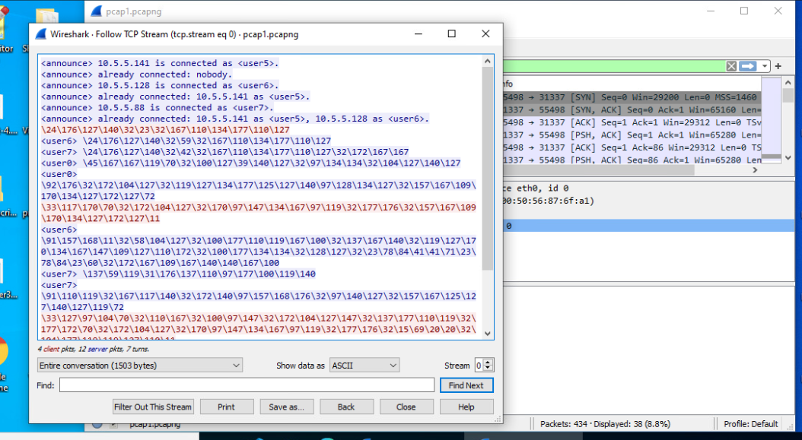
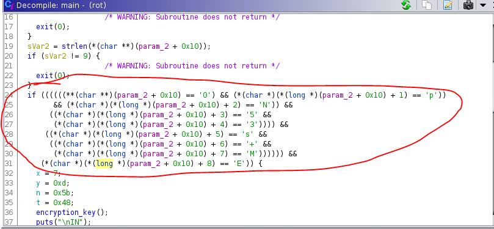
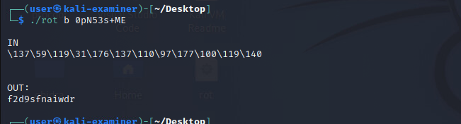
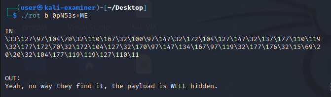
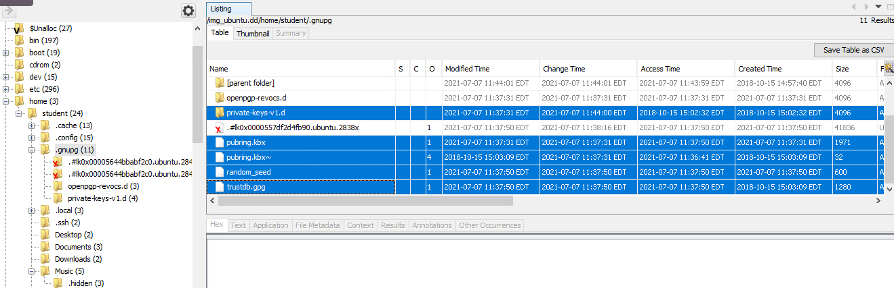
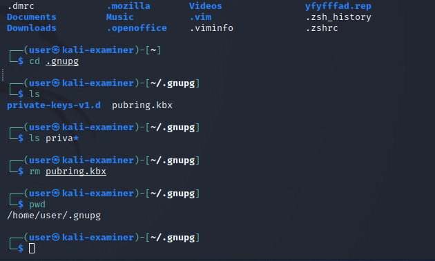

# Bad Dogs NCats Solution

## 1. **Wireshark & Autopsy**  
Step 1a: Open traffic.pcapng in Wireshark  
Step 2a: Use the `Follow TCP Stream` option to find encrypted byte string data

  

 Step 1b: Open Autopsy and add ubuntu.dd as a data source    
- Open a new case  
- Name it   
- Choose a base directory   
- Press next   
- Give it a case number   
- Press finish  
        
 Step 2b: Search for suspicious files or folders on `ubuntu.dd`. The first of which can be found in: `ubuntu.dd/home/student/Documents/rot`  
 Step 3b: The second suspicious item is a folder: `/home/student/Music/.hidden`. This will be addressed in section 6.

## 2. **Export the `rot` file**

## 3. **Running Ghidra**
Step 1: Analyze rot using Ghidra.   
 - Copy rot to working directory  
 - 'chmod +x' rot if necessary  
 - Launch Ghidra, navigate to `File > New Project, File > Import File > rot`

Step 2: Open `rot` file. Press yes to analyze.   
Step 3: Search for the source code. The easiest way to find it is to: 
- open `symbol tree -> Functions -> main`.   

Step 4: Identify parameters and find the password in the code. `Var 1` must be `a` or `b`. `Var 2` is the password.   


## 4. **Testing ./rot**
Step 1: Run the rot program to see what it does. Open a terminal, navigate to the working directory, and type the command:
```
./rot [a/b] "password"
```  
Step 2: notice `rot [a]` takes in an ASCII string and outputs a byte string, while `rot [b]` takes in a byte string and outputs an ASCII string.   

## 5. **Decrypting the pcap**
Step 1: Decrypt the pcapng's byte strings using `rot` 
- The most effective method is to copy/paste the TCP Stream into a text file, then copy/paste each byte string into the terminal  

Step 2: Find the flag within the decrypted byte string  
Step 3: Continue decrypting the rest of the byte strings to find a clue about a *WELL hidden* folder.  



## 6. **Cracking the gpg folder**
Step 1: The second suspicious item on `ubuntu.dd` is `home/student/Music/.hidden/well.tar.gz.gpg`  

Step 2: Extract `tar.gz.gpg`, and put it in your working directory  
Step 3: Because `well.tar.gz.gpg` is a gpg file, we need the gpg keys to decrypt it      
- gpg keys are stored in home/student/.gnupg 
- Export the private keys and public keys
  
  
<br></br>

Step 4: Copy the Ubuntu gpg environment (replace the .gnupg files with their Ubuntu counterparts)
- This will require stripping `##-` from the start of the filenames for most of the exported files  


<br></br>

```bash
cp ./45-trustdb.gpg trustdb.gpg
cp ./45-trustdb.gpg pubring.kbx
rm private-keys-v1.d/*
sudo cp -a ./21-private-keys-v1.d/. ./.gnupg/private-keys-v1.d/
``` 

Step 5: Write a script to crack gpg using the provided wordlist. An example named `crack.bat` is available in this solution folder.  

Step 6: After gpg has been successfully cracked, use tar to unpack the archive:
```
tar xzf well.tar.gz
```
Step 7: Print final flag:
```
cat well/token.txt
```
## Tokens

The challenge has three answer tokens.
- Token 1 is the second argument to `rot` (9 characters long)
  - 0pN53s+ME
  
- Token 2 is embedded in the wireshark file, and must be decrypted from a byte string (12 characters)
  - f2d9sfnaiwdr

- Token 3 is in `token.txt` inside `well.tar.gz.gpg` (12 characters)
  - oVMzKMnzRU5y
