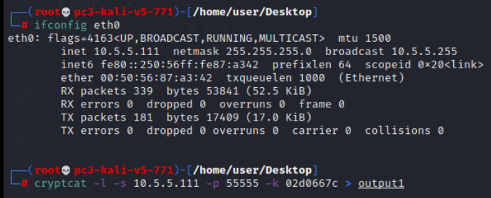

# Reconstruction Junction Solution

Each pcap will be labeled with the department the file came from--IT MGMT(`it-mgmt.pcapng`), Customer Service(`cust-svc.pcapng`), and Sales(`procurement.pcapng`)--and these
references will be used to compare answers with the `answers.txt` file.

For each part, there is some outlier traffic that should seem atypical from the rest of the traffic. Look at the
packet captures holistically first to discover what might make one
different from another, as each exfiltration traffic type is unique.

# Part 1 - ICMP Exfiltrated Data

Discovering the traffic type in use here will be the tricky part. It
should be noted that of the 3 packet captures, the capture for part 1 is
the only one to contain ICMP messages due to it being part of the mgmt network.


It might be of note to look at protocol statistics. Of the
overall capture, over 1% of traffic is considered neither TCP or UDP,
meaning it is something else.

Filter for "not udp and not tcp" to see this traffic:


This will show that the non-TCP and non-UDP traffic is largely ICMP
messages.

ICMP is a popular method for sending plaintext data so let's start
there. Filter for "icmp" and then check conversations under 'Statistics'
in Wireshark. This will show who was sending pings, how many were sent,
and to whom. Remember to check the box to limit to the current display
filter.


When sorting by packets or bytes there is a clear outlier. In this
example, 10.9.8.190 has sent 135 ICMP packets to 126.39.21.98 totaling
27kb of data.

Go back and filter for these IPs: 
```
"ip.src == 10.9.8.190 and ip.dst == 126.39.21.98 and icmp
``` 
Alternatively, right-click on the conversation
in the above window, and choose a filter that is one directional.

Looking at the payload of the ICMP packets will display what looks like plaintext readable words, as if there is some sort of message. There is also a reference to a MSGID value of 1, 2, or 3. This
MSGID will come in handy later.


Reading each message will be tedious but at least one message in each
conversation will have something that stands out.


There is a clear call to point someone to this snippet of a code.

Rather than continuing to peruse the remaining messages, searching for the string "here" will produce results.


Look at each of these results and take note of the MSGID value for each; some may be repeated.

After finding all three parts, put them together in order of their respective MSGID value, 1 through 3.

# Part 2 -- DNScat Exfiltrated Data

Identify the suspicious DNS traffic

Again, figuring out what is anomalous or unusual is going to be the
first major step. Analyze stats and other points of interest to progress. One method would be while viewing DNS traffic to see the various DNS servers in use via Statistics -\>
Conversations, and then look at IPv4 conversations for only DNS (limit to
just display filter).


There are four main DNS servers shown, but one that seems to have been used only once for a small number of packets when compared to the others--`94.127.203.127`.

Looking at just these DNS requests would show a series of very long and
very odd looking hostname lookups, with some displaying what appears to
be a message. The lengths are also much longer than any other DNS
requests.


The message refers to a few details to be mindful of:

1.  The file is going to also come over DNS

2.  The file is chunked in 57 byte fragments

3.  It is going to use Base64 encoding

4.  A password will be required to open the file -- in this case `5a7d7298`

Within the lookups are also references to a `code.zip` file.


Looking at the following packets of DNS traffic show a clear pattern of
57 character/byte length "chunks" with 4 chunks per packet. The text of the hostname lookup also appears to be allowable Base64 encoded
characters.

To recover the file, copy out all of the packet byte data, clean it up to include ONLY the base64 chunks of 57 bytes, and put
them all together in one file in the order they were sent/received.


It should become something like:


Next, decode this text to get the plaintext/hex/binary value
of the file. Either use an online resource or the built-in "base64
-d" decode option in Kali.


The resulting plaintext/hex/binary starts to resemble something more
like an actual file. If the hex of the file is present, it can be rebuilt using xxd.

Again, the method for rebuilding the file is optional. One method would
be to echo each line through "xxd -r" and write the result to a file.


If successful, the resulting file will be the rebuilt zip file and the
contents will be visible, though still locked behind the password.


Use the previously found password `5a7d7298` to extract the file and read the token for submission.

# Part 3 -- Cryptcat Exfiltrated Data

First, identify the covert chat channel set up by the perpetrators

This part simply takes some luck and reading the comment in the guide about the use of covert communication channels; nfiltering for IRC or port 6667 will display this traffic.


Within the messages, there will be a password and mention to cryptcat being used to send the data.


Next, identify the traffic and conversations/streams in question.

Based on the IRC traffic above, multiple pieces of information are known: 
1. the file is a document with a key on page 100
2. cryptcat was used to send/receive the file 
3. the password to decrypt it is `02d0667c` 
4. it was chunked and sent over the same port each time.

A very easy way to isolate this traffic is to think about the above facts and knowing that cryptcat traffic is limited to TCP. Look for three conversations or streams using the same source IP,
destination IP, and destination port, most likely on a non-standard port. There are only three conversations that take place above port 445
and all three have the same source, destination, and destination port. This is likely the traffic.


In this example, the source is 10.9.7.248, the destination is
73.211.102.165, and the port used was 20925.

Follow and then export/save each of these streams off as individual raw data files.


Remember to save each one individually. Take note that one of these data files is smaller than the other two.

The way to decrypt the data is simple, but may take some research to discover. Any type of replay mechanism will not work due to the inability to restructure any TCP sequencing. However, with the encrypted raw data, all that's needed is to decrypt it in transit. Do this by sending the raw encrypted data via netcat to a crypcat
listener using the same password found in the IRC chat--`02d0667c`.

Set up a cryptcat listener on one kali machine using the source IP of your interface, or the interface on another machine that will send the
file over netcat:



On the same machine, or a second machine, send the data files over netcat:


Afterwards, verify that the output file has data and is different from the original--meaning it was decrypted--and repeat for the other two
files.

Most likely, one of the files will appear with a pdf icon due to the pdf header in the file's binary being readable. There's a good chance
this file is in fact a pdf, since pages were mentioned. The other two files have different sizes. As the file was chunked, odds are the
smaller of the two is the last piece of the overall file. Even without this guess, there is a 50/50 chance and only two options using trial and
error.


Use cat to recombine the files into one:


Finally, check the final file to see if it can be opened with Adobe, and check page 100 of the resulting file for the token:


# Verify Answers
The answers to each section can be found in the `answers.txt` file within the solution folder.
