# Reverse Popcorn Stitch Solution

In this challenge you are given a machine named "WinAdmin'. You need to use this machine to remote into 5 Window's machine and respond to a malware attack.

 Your response will include finding out which machines are affected and analyzing each of these machines.

 You will be required to reverse engineer the malware in order to find a token and to find a location that the malware is writing to. You will have to deter this attack from occurring again by closing the attack vector. 

 Throughout this guide, you will see snippets that will help with completion of the challenge.

1. Open the 'WinAdmin' VM and SSH into your Windows machines, `ssh win10a` (a-e) 

2. Since we know the malware is an executable, we will run `get-process -name popcorn` on each Windows device to see if there is an executable "popcorn.exe" running on these machines.

    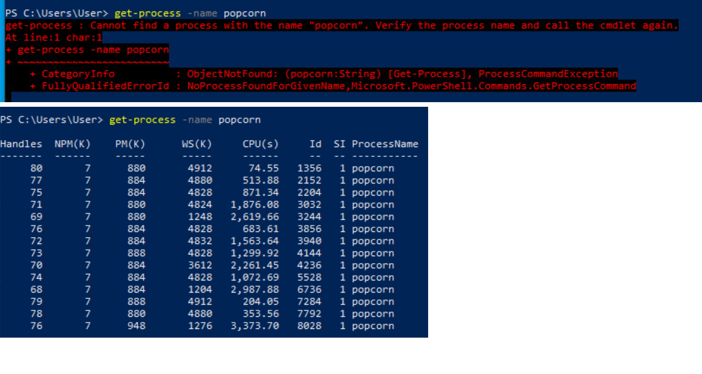

    In the above screenshot, you can see an example of output when popcorn is not running on a machine, followed by an example where it is running on the machine. There are 3 devices that are affected (have popcorn running), but they will change with each deployment.

3. After you find which devices are affected, you have to find the file location in order to download and analyze the malware. Do this by running the command "Get-Process -name popcorn -FileVersionInfo. This will give you the file path that you can use to download the executable. 

    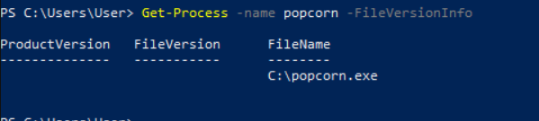

4. To download the file onto your own machine, open up a new powershell windows, Use scp to access an affected machine and grab the file. "scp user@win10c:/popcorn.exe C:\Users\User" (win10c can be any of the machines that are affected)

    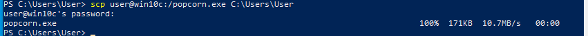

5.  Using Ghidra:

    Open Ghidra file location, Right click on Ghidra application and Run as Administrator, Once inside Ghidra, Go to File -> New Project -> Non-Shared Project -> Name the Project Anything. Next, click on the emblem that looks like a green dragon. 
    
    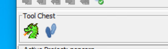

    Once you get to the CodeBrowser page, go to File -> Import File -> Import the popcorn.exe file that you downloaded from the affected machine (You can import with default settings). Once imported it will ask if you want to Analyze, click yes and use default settings.

    On the left side under Symbol Tree go to Functions, Scroll down to the folder with the "m" and click on "main".

    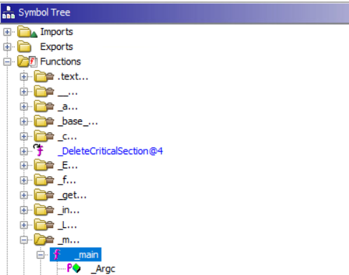

    Once you click on main, you will be able to see de-compiled source code on the right side of your screen, this is where you will see the file location that the malware is writing to. 

    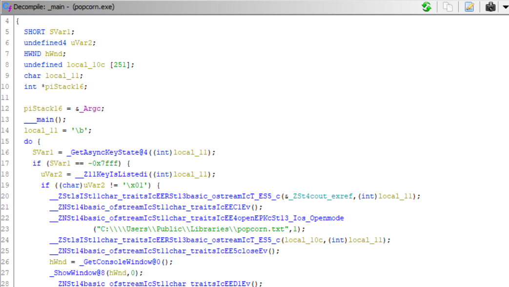

    Now we will look for the token stored in a global variable that the challenge description told us. Since global variables have to be initialized, we will use Ghidra's search bar to search "initialization". We will look for something being initialized in functions.

    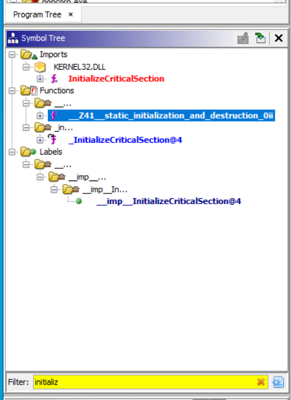

    Click on that and you will see the de-compiled source code, you will see the token in that area as shown below.

    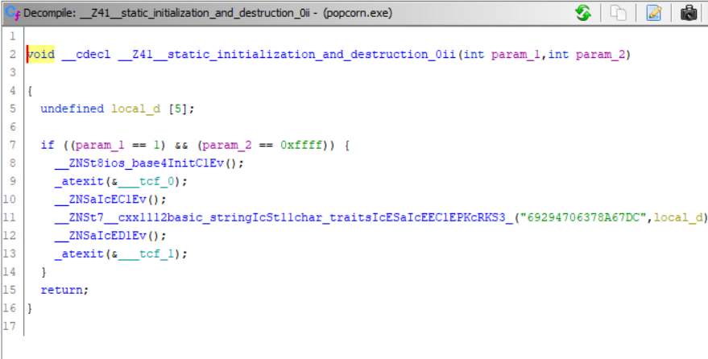

    Using Ida:

    Open Ida and run as administrator. Click new and find the location of the popcorn.exe malware that you downloaded. Load the file with default settings.

    Once the file is loaded, you will see a function window. You want to click on main.

    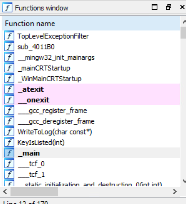

    You will see a portion of the file location, if you double click on it it will open up and you will see the full path that the malware is writing to. 

    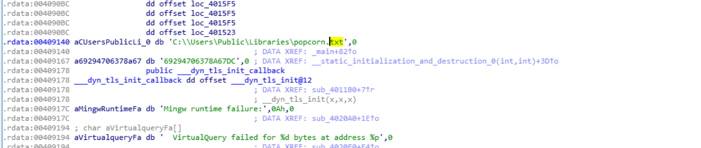

    In the functions window, you will see "static initialization and destruction". This will be the location of the token. 

    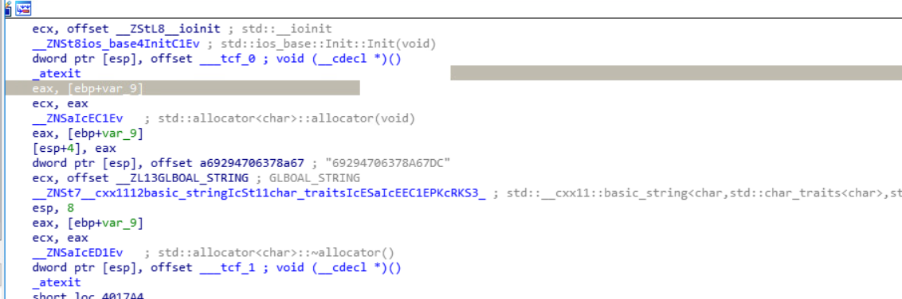

6. In order from deterring this attack again, you are provided with a registry key and location that you have to implement onto ALL (5) machines. Logon to each machine and open up powershell. First command: "New-Item -Path 'Registry::HKEY_LOCAL_MACHINE\SOFTWARE\Policies\Microsoft\Windows NT' -Name "Printers"

    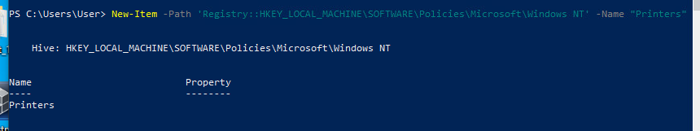

    The first command creates the folder "Printers" in your registry. The second command is "New-ItemProperty -Path 'Registry::HKEY_LOCAL_MACHINE\SOFTWARE\Policies\Microsoft\Windows NT\Printers' -Name RegisterSpoolerRemoteRpcEndPoint -PropertyType DWord -Value 2"

    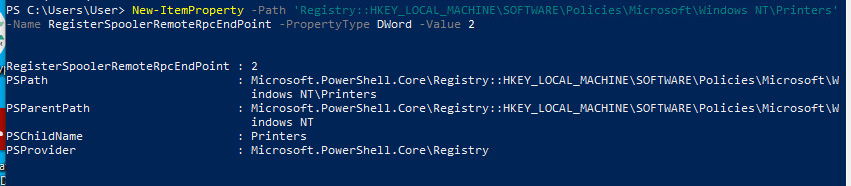

    This command creates the registry key under the "Printers" folder and sets its value to 2.

