# Stacked and Hopefully Not Hacked Solution

## IMPORTANT

This challenge does not have any downloadable artifacts. You may complete this challenge in the hosted environment.

## Server/Client Setup

 In order to configure and set up the various systems follow the steps in the challenge guide exactly. Token codes will be made available once these tasks are complete, as outlined in the guide, and are available at the grading site in game at http://10.5.5.5.

Log analysis/Answering the questions
------------------------------------

Once all machines have their respective log shippers installed and feeding data to Elasticsearch/Kibana you can answer the following three questions about the events of June 7th and 8th. Note that ingesting of all logs can take some time, but shouldn't take longer than 10 minutes.

Ultimately, there is nothing preventing a team from using the native client tools such as Event Viewer or parsing the log files directly from the Ubuntu clients to solve the questions. The intent is that setting up the shippers will only make that analysis easier and aid in quicker correlation.

Student note - For the sake of this challenge "named users" consist of users with English first and last names and do not include the standard user/student or any admin, root, or system accounts.

Variant specific details will be included in each question since each variant includes the same question overall, but each variant involves different systems.

**Question 1:** How many named users were created on June 7th on clients \[(var1 -- Pronghorn and Reindeer), (var2 -- Caribou and Reindeer), (var3 -- Pronghorn and Moose), (var4 -- Caribou and Moose)\] combined? (15%)

var1: 12

var2: 10

var3: 11

var4: 9

There are many ways to approach this in the logs. Each variation requires looking at one Windows client and one Ubuntu client and teams will need to think about the specifics of how each log presents itself.

For the windows clients, you might filter for an event code of "4720" and by the specific host.

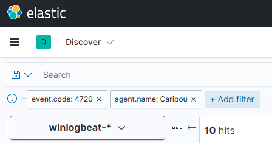

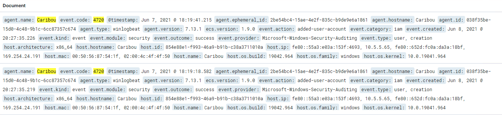

For Ubuntu, you might filter for the specific host, the log.file.path of /var/log/auth.log only (where user related events are stored), and the string "create".

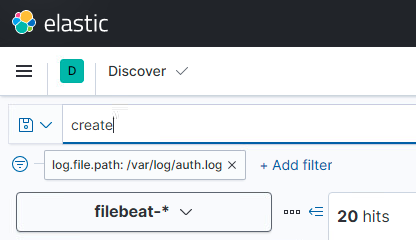

Remember to check the message date as the time of occurrence, not the timestamp that the log was reported.

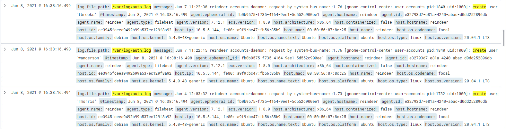

Using these methods, you can discover that:

3 users were created on June 7th on Caribou

5 users were created on June 7th on Pronghorn

7 users were created on June 7th on Reindeer

6 users were created on June 7th on Moose

***Note that questions 2 and 3 and questions 4 and 5 will ask for the same information for each variant, but for different systems. The analysis methods for all will be outlined for each system type below.***

**Question 2/3:** Which named user on \[(var1 -- Pronghorn and Reindeer), (var2 --Reindeer and Caribou), (var3 --Moose and Pronghorn), (var4 -- Caribou and Moose)\] has likely been the victim of a brute force password attack after hours? (10% each)

Var1 -- Carol Phillips \| Teresa Brooks (tbrooks)

Var2 -- Teresa Brooks (tbrooks) \| Edward Martinez

Var3 -- Kelly Garcia (kgarcia) \| Carol Phillips

Var4 -- Edward Martinez \| Kelly Garcia (kgarcia)

For this question you will be looking at failed login events for the systems in question. For windows this is super easy, as there is a dashboard that gives you this data.

Under Dashboards you can search for "Failed" and choose either "Failed and Blocked Accounts" Dashboard to view the data.

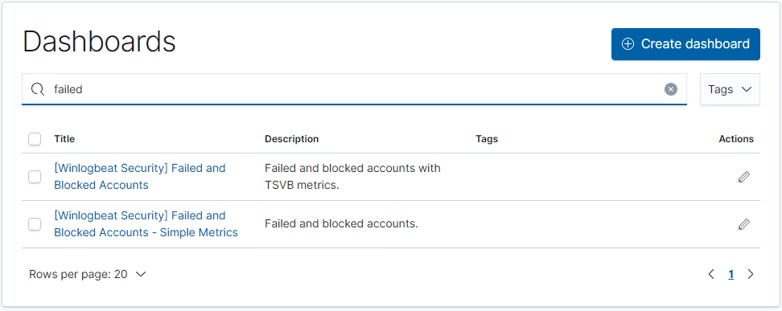

The dashboard should immediately call out which two users have the most failed logins, far surpassing any other user.

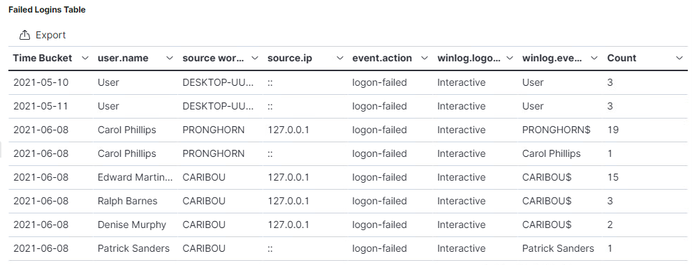

You will see these events occur in very quick succession during what would be "off hours" from the usual workday.

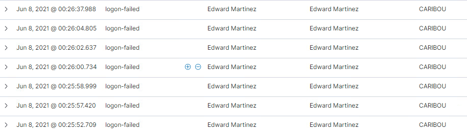

The two Windows users in question would be Carol Phillips on Pronghorn and Edward Martinez on Caribou.

Alternatively, you could search for event for strings like "failed" to see what the event log looks like, then further search for events similar to this, such as searching for the string "An account failed to log on".

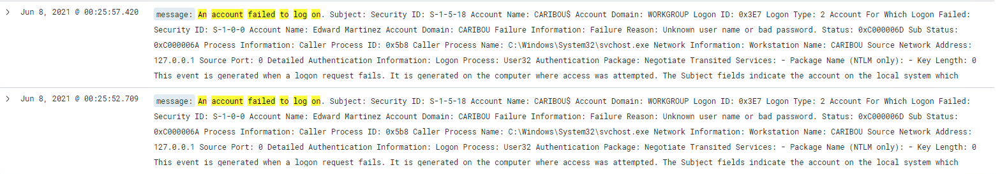

You could search for all events with ID 4625, but this will not tell you the specific username.

The Ubuntu logs will not be as easy to search through, since there is no easy dashboard to view data from.

However, similar to the Windows process above, you can search for what failed login logs look like for Ubuntu and then looking in the right place. Again we would be looking at auth.log and the string to look for is "failure" or "authentication failure". This will filter all authlog events for only authentication failures.

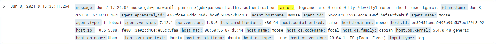

Once filtering for these logs, simply find the user with the most failed login attempts in short succession on the system in question.

The two Ubuntu users in question would be kgarcia or Kelly Garcia on Moose and tbrooks or Teresa Brooks on Reindeer.

**Question 4/5:** Which named user on \[(var1 --Moose and Caribou), (var2 -- Pronghorn and Moose), (var3 -- Caribou and Reindeer), (var4 -- Reindeer and Pronghorn)\] failed to change their password by the noon June 8th deadline? (10% each)

Var1 -- Joseph Brown (jbrown) \| Marie Stewart

Var2 -- Sean Jones \| Joseph Brown (jbrown)

Var3 -- Marie Stewart \| Rachel Perez (rperez)

Var4 -- Rachel Perez (rperez) \| Sean Jones \|

While the time deadline provides context, there is no trickery to the timing of these events. The users in question have not changed their passwords period, and you can simply look for which user has failed to do so on the date in question.

This time we will start by looking at the Ubuntu client log events. This is actually fairly easy. Again , we will be looking at events within the auth.log file and you can simply search for the string "changed" to narrow down your results and then further to "password changed".

Finding the results is easy, but then you must verify the dates on those that have changed their password on June 8^th^ between \~9:00 AM and 12:00 PM EDT and then figure out which user is missing by correlating the users on each system.

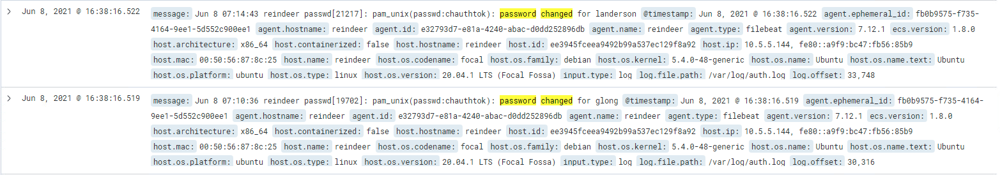

For Reindeer, the user missing is Rachel Perez or rperez. For Moose, the missing user is Joseph Brown.

The Windows password changes are easier due to the dashboard that is created by default when adding the Winlogbeat index.

Under the Dashboard list, find either "User Management Events" dashboard to open it.

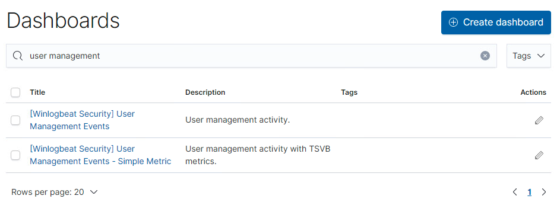

While viewing the main dashboard, locate the 'Password Changes' panel, and then you could click on the three dot icon to maximize the panel to the full screen.

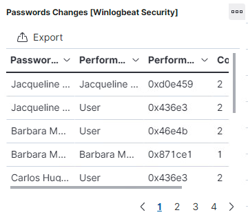

Once maximized, you will see the list of users who have changed their password and then can deduce which user is missing for the system in question. Then filtering by agent.name or host would be helpful.

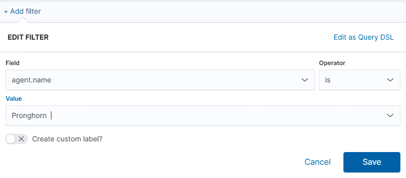

You will notice, however, that these logs do not display a timestamp by default. So, there is an extra step of deduction to take, and only look at events where the user themselves changed the password. Any events or logs that list "user" in the "Performed By" column would not be up for consideration.

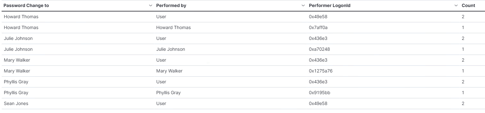

Alternatively, you could look for events of ID type 4724, but again, this does not display the specific user and there would have to be some further correlation to determine which specific user did not change their password.

Additionally, the "Actions performed over Users" panel will show exactly who has and has not changed their password in one view, if teams happen to realize the data that is presented within.

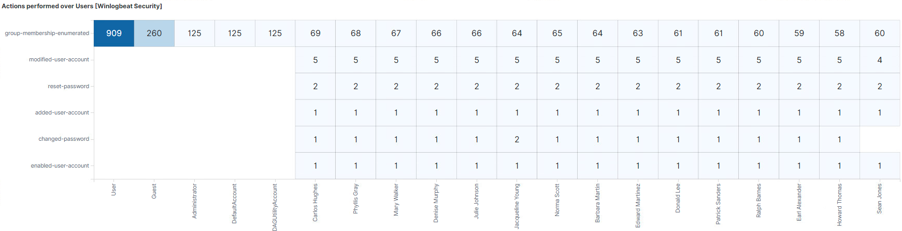
