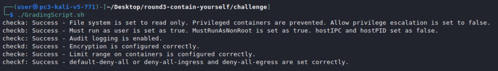

# Contain Yourself Solution

1. Open up the `psp.yaml` file in a text editor.

2. Make changes to this file to match the steps for hardening the cluster. Follow the changes provided in the solution.yaml to pass all checks.

3. Once those changes are made, run `GradingScript.sh` to check the results.

