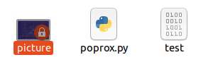

# Getting Away with It - Solution Guide

### Ransomware

Note that the following screenshots show the steps to recover the
token/flag using the challenge server directly. Player's will not have
access to this system but can perform the exact same steps using their
Kali systems.

All instances of a key or token in this example will be randomized
during actual testing/competition rounds.

Begin by downloading the locked_files.zip file from the challenge server
at `challenge.us/files` or `10.5.5.5/files`.

Extract the files to a directory of your choice. You should have 9 pairs
of similarly named files.

Notice that two of the file pairs are different than the others. One can
be read in plaintext, the other appears to be part of a zip. Viewing the
two readable text files finds two 32-character hexadecimal strings. We
know that a 256 bit key was used. Therefore, it is likely that these
files contain the key. We can also assume that since one is named
.rocksaa and the other is named .rocksab that the files were chunked
using split, or a similar function, and that the aa file comes first.

We can use cat to reassemble these two files pairs, repeating the same
for the .zip file.

The .zip file should now be accessible and a single file is contained
with named poprox.py. Extract this file from the zip and investigate it
further.

The file appears to be python code, and more specifically the ransomware
code itself accidentally left behind.

The hint is the single reference to "encrypted xor string". Analysis of
the code will reveal that the ransomware isn't encrypting the files per
say, but is simply xor'ing them against a known key value of k.

Since the XOR process is reversible, all players must do is copy the key
in to the python code and rerun it against the encrypted files.

The code takes two arguments, the input file and the output file names.

However, this will fail to produce legible results depending on the file
type. If the file is a plaintext file, which only one is, it will be
legible but still have its contents in the wrong order. If the file is a
binary file, then the resulting file will be unreadable.

Teams should try to reverse the order of operations, as there is only a
50/50 chance that the files were xor'd and then chunked or chunked and
then xor'd. It appears from trial and error that the former is the case.

Repeat this process for the remaining files. At the end you should have
four files identified as images, one file that appears to be plaintext
and a .csv type, one that appears to be a .pdf, and one that appears to
be an Excel worksheet (.xlsx). Note that you may have to manually add
extensions to allow the files to work with their default viewing
applications. Otherwise, specify the application by the type of file
beforehand.

At this stage, players should investigate the files in question. The pdf
contains text alluding to it being a Technical Manual. The csv appears
to be a list of employees while the xlsx appears to be customer data.
The image files appears to be blueprints. None of this information would
be good in the hands of attackers, but the .pdf is the file to review to
find the stolen password.

Under the Administration section of the Technical Manual, a backdoor
root set of credentials is listed. The password listed is the token or
flag to find for this part of the challenge.

### SQL Injection

Based on the web/IIS logs provided the attackers ran a Nikto scan
followed by a sqlmap scan, as=evidenced by the user agent strings found
in the logs.

These logs provide information that the players will need.

The IP of the web server is now known to be 155.6.4.14.

Players should browse to the site to find that it has login fields and
uses http.

The very first sqlmap command simply uses the uname and pwd fields, and
while the exact string for the url may not be known for initial testing,
you can enter a uname and password of your own into the web site to find
the structure of the URL yourself.

Therefore, we can confidently expect that the URL to test our injection
against is `https://155.6.4.14/auth1.asp?uname=user&pwd=1` based on the
first sql injection log and the output above.

Additionally, teams should investigate the provided auth1.asp page
contents to find that the database in use is named "Challenge". Because
this database is an application database, not a system database, sqlmap
will fail to find it during its scan, but you can still
interact/enumerate it with sqlmap.

Note that the methods for using sqlmap can vary greatly. Teams could be
a direct and loud as possible or they may use the default options if
they are unfamiliar with sqlmap. The time it takes to dump the final
table can vary due to the method and options used. Additionally, piping
"Y" to each prompt will allow the scans to run unattended, e.g. "Y \|
sqlmap ...". Additionally, sqlmap will keep track of past data found. If
you end a scan or attempt in the middle, sqlmap should pick up where it
left off unless you manually delete the results files.

Afterwards, you might want to find out what tables exists in this
database:

`Y | sqlmap -u https://155.6.4.14?uname=uname&pwd=1 -D Challenge
--tables`

After this you can dump the table data, which can take a while with the
default/slowest settings.

`Y | sqlmap -u https://155.6.4.14?uname=uname&pwd=1 -D Challenge -T
dbo.Users --dump`

You can gauge the progress due to the command telling you how many users
were found. As it dumps each row, you'll know how many are left at most
to retrieve the token.

Some options might help speed up the process but it can still take a
while:\
`Y | sqlmap -u https://155.6.4.14?uname=uname&pwd=1 -D Challenge -T
dbo.Users --dump --threads 10 --level 5 --risk 3`

After dumping this table, players will see the 'token' user with a
password of a random 12-char/6-byte hex code.

### Forensics Analysis (Local data exfiltration)

In this scenario, the malicious actor has attached a storage/thumb drive
to the local system and copied some files out. Afterwards, the actor
deleted all of the invoice files from the system. Players are expected
to analyze the hard drive image and/or timeline file found attached via
ISO to the Windows 10 system.

The first step is to find the occurrence of the drive being attached.
Since we do not yet know how the data/files were exfiltrated, this is
the best starting point that leads to all other events. The timeline
file provides this information, though the disk image can demonstrate
this as well. The timeline is easier to parse.

The timeline file can be viewed in Timeline Explorer on the Desktop.
Simply open the timeline.csv file with the tool and it will take a few
minutes to ingest the data.

You can further filter only for events occurring on or around September
13, 2021, which was the date of the incident.

To find the occurrence of the drive being plugged in players may search
for things like "storage" "drive" "volume" or even try individual drive
letters like "E:". "Volume" "drive" and "E:" will actually help in this
case. Alternatively, players may know that plugging in and accessing a
drive creates a .lnk file being created, and search for any occurrences
of that.

Now that we have a User involved, Bob, we can narrow the search for
events and actions made by him. Players can view the timeline or view
the disk image in autopsy (which they will need to do at some point to
recover the deleted files)

To add the image to Autopsy, start a new case and fill out the new case
details. Then choose "Disk Image" and point to the win10.001 file on the
attached ISO. You may select or deselect as many ingest/analysis options
as you like, as these should not impact your ability to analyze the
drive. Autopsy will take a few moments to load the image data.

Since we know Bob is likely the user in question, we can expend Bob's
system data, and look into his recent files. Or, more simply, look at
the Recent Documents section in autopsy.

The drive was plugged in at approximately 05:10 PST8PDT on September
13^th^, therefore we can focus our analysis on events that occurred
around or after that time.

The questions asks what the PO number was for the 1^st^, 2^nd^, 3^rd^,
or 4^th^ file viewed by the malicious actor. The four corresponding
files are Invoice \#013, \#007, \#023, and \#019 respectively.

Now that we have a name, we need to search for copies of these
elsewhere. Autopsy can do a keyword search by name, or you can search
the timeline to see where they might be.

(\*note it may actually be easier to search from Notepad rather than use
Timeline Explorer)

The current location of these files alludes that they were deleted, or
rather, put in the recycling bin by either Alice or Charlie at some
point in the past along with other invoice files, making them
recoverable. Between the two users, each of the 25 invoices is still in
the recycle bin, it's just a matter of which one deleted it that
determines the final location. Take note of the exact path and filename
in the location field, as the file will no longer have its original
name. Also, not that you are looking for the filename that begins with
\$R, not \$I. This is the file that will be viewable.

Find the Recycle Bin path that matches the ID of the user and the
obfuscated filename. Then right-click and extract/export the file out of
autopsy for viewing, or if able, view the file preview directly in
Autopsy.

Open the file to view the contents and retrieve the PO number/token from
the file.

Take the PO Number from the invoice in question, and submit the string
as the flag or token for this part of the challenge.

### SMB Exploit

Begin by opening the `audit.log` file and analyze what was occurring. Within the log there will be multiple sessions represented. The logs track most events/commands that occur on the SMB server along with the history of authentication (successful/failure)

You should then get to the section where there is a lot of failed authentication attempts within a short period of time that leads to a successful one at the end. Considering the timeframe of the logins plus the result of finally accessing it should show that a brute-force attack was executed and appeared to be successful. This will need to be mimicked in order to gain access.

Before that, the challenger will need to enumerate the SMB server and gather any information they can. They can do this by using `smbclient` command to determine what is publicly available on the server. 

Run the command `smbclient -L //kali-samba/` to list the shares that are visible to the public. They will find that there is a share called `public`. They can then log into it with `smbclient  //kali-samba/public`. 

Once done they will find that the share allows anonymous login. They will see a file called `note` and multiple directories leading to reports of other things going on. They can download the file with the command `get note`, where it will be transferred to their local machine.

The note will explain how the user/person `alfred` maintains the private share but is out this week for personal reasons. This should then be a hint at whose account was attacked via the brute force attack in the logs. 

Next step is to then try and grab any other information they can from the server. They will need to run the command `enum4linux -USP kali-samba`. This will attempt to grab any information it can about the users, shares, and password policy of the server. 

Once complete, you will see that there is a user named `alfred` that has a note attached to his account that explains that his password was reset to a default password concatenated with his private pin, `robinRules####`, where the '#' each is a digit that is only known to alfred. 

With this you should have enough information to form the brute force attack. It can be created by taking the following steps:

1. Create word list of all possibilities for the pin, can be done with command `crunch 14 14 -t robinRules%%%% -o passwordList.txt`
2. use list in dictionary attack, can be done with command `medusa -u alfred -P passwordList.txt -h *IP of kali-samba* -M smbnt`

If done correctly you will get the password of alfred and be able to view his share. This can be done with `smbclient -L //kali-samba/ -U alfred`, followed by his password. This will show the share `a1fr3d` which was the share the attackers got access too. 

You can now log into `a1fr3d` share and find out what was accessed. You will find a file called `smb.conf.bak` that is a backup of the current configuration, download it with the `get` command.

If you analyze it you will see the configuration being used for each share, along with security settings in place for each one. The line that should stand out is the one under the `public` share that says `include = /etc/samba/alfred.%U.conf`, which should give a hint that the user `alfred` has special permissions for the public share. 

You should then login to the public share with alfred's credentials and you will see there was a file now accessible that wasn't there previously called `.backup`. You can now download this file, and within it is the credentials needed to access the `private` share. 

Log into the private share and there will be the file `flag.txt` which will contain the submission for this challenge.
