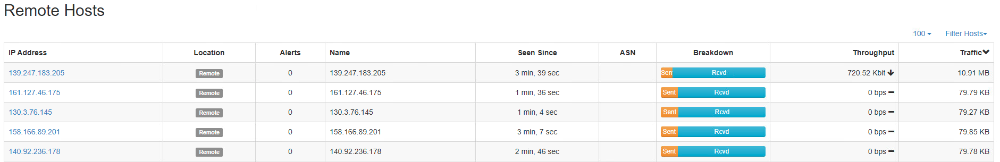

## Under Siege Solution

The bulk of the work for this challenge will take place between writing
firewall rules and monitoring the ntop or pftop output. Both tools can
be accessed via the firewall web GUIs. It is recommended that the team
split up the work of monitoring the firewalls individually, but it is
possible for one person to try and watch all 3 from one Windows10
system.

During the actual competition, a time component will be added within the
gameboard. Teams that complete the entire challenge within certain time
thresholds will be awarded additional points based on their total time.
While the overall difficulty is not high for this challenge, the teams
that coordinate and complete the challenge quickly and accurately will
receive more points for time.

The time thresholds are:
- One hour or less - four time tokens worth 10% each
- Between 60 and 70 minutes - three time tokens worth 10% each
- Between 70 and 80 minutes - two time tokens worth 10% each
- Between 80 and 90 minutes - one time token worth 10%
- 90 minutes or more - no time tokens awarded

## Getting Started

To prepare for the challenge, first launch each firewall web GUI by
browsing to 10.0.11.1, 10.0.12.1, and 10.0.13.1 and using the creds
admin\|tartans for each.

Teams may use any firewall or traffic sniffing tools available from the
firewall web GUIs, but the idea is that the teams will mainly stick to
Ntop, as it is explicitly mentioned in the guide.

Ntop can be accessed by browsing to Diagnostics -\> ntopng from the
pfsense web gui. It is recommended to open this in its own tab. You may
also browse directly to https://\[fw-ip\]:3000 as well. The Ntop
credentials are also admin\|tartans for each instance.

Teams can watch the traffic live on Ntop, but may wish to check in on
the hosts option from time to time to see how the amount of traffic is
changing. You can view each individual host's traffic use by clicking on the Hosts menu.

This is a screenshot of Ntop when viewing Hosts info (note that this view does
not update live and will need to be refreshed):

You can also filter for Remote Hosts only and sort by total traffic or throughput.

Before beginning, note the following two events and one reminder:

Chaff traffic will constantly be hitting the web sites at random. You
cannot block this traffic or else you will not be able to move past the
current level. If you block the chaff traffic you wil be warned on the grading site.

Additionally, if you block the entire subnet instead of the correct IP
or range of IPs, you will be warned on the grading site. The challenge will not move forward until corrected.

Lastly, all rules MUST remain in place throughout the duration of the
challenge. You must keep the blocks in place for all previous levels as
you go.

Teams can use trial and error to create blocks, but this may cost them
time and therefore points towards their score.

As the traffic ramps up in each level, you will see more and more valid
traffic hosts, but one host in particular should accumulate more traffic
than the others. This is the host to be mindful of and block at each
level. Additionally, anomalous traffic will look different statistically.

As the challenge goes on, depending on how fast the team is, it
may get harder and harder to keep track of the newly arriving "top
talking" hosts from the mix. The longer you allow them to send their
traffic, the easier they will be to spot, but this also increases the
time spent on this challenge. The ultimate goal is to complete the
challenge as quickly and accurately as possible.

## Level 1

An example of a bad traffic host in level 1 will look like this:

The 147.166.1.131 host is creating far more traffic than any other host,
making 147.166.1.131 the outlier or anomaly here. The traffic is
categorized as HTTP and are web requests of the site.

After identifying the hosts, you should write a specific firewall rule
to block this host in the future.

Once the traffic has been blocked a new bad traffic host will start up.
This will repeat until all bad hosts have been blocked for the level.
Level 1 will send curl requests in bulk to the target from a random
source.

## Level 2

Level 2 will begin once Level 1 is passed. Sources will send hping traffic over port 80. Again the traffic is noticeable as the highest usage host, though it takes longer to build up than in level 1. Sent packets versus received packets will also be greater or anomalous when compared to other valid traffic
hosts. Using this knowledge, you can view the breakdown column to find
the next offenders faster.

Example of more traffic being sent than received before it becomes the highest
traffic source.

The traffic arriving comes in and shows up as HTTP. This is suspicious as most web traffic is made up of requests, which typically receive a lot more
packets/data than they send.

Again, create a simple firewall rule to block the source over the
default TCP option.

The traffic generator will repeat this two more times against random targets to complete level
2.

## Level 3

Level 3 will simulate level 2, but this time through standard ICMP packets on any port. The ramp up on this one will
take a little longer but grow as time goes on and remain constant. The
key here will be for the teams to ID this traffic as ICMP. They may have
gotten used to writing TCP-based rules and if they do not change their
rules to specifically block ICMP, the rule will fail to stop the
traffic. Also, if the team blocks TCP, the script will warn them that
they have blocked too much.

A bad source will look like the following with a nearly equal amount of
sent/received byte amounts. Similar to level 2, the giveaway is the
breakdown on future sources for this level.

If not spotted until the source is the highest bandwidth source it will
look like this.

Additionally, teams must review the protocol to know that it is
specifically ICMP.

Again, create three unique rules on the corresponding firewall to block
ICMP specifically from those hosts.

## Level 4

Level 4 will throw a few web application scans at the targets. The scans
are slowed down so they are not quite so obvious and will ramp up as in
other levels. The traffic will quickly outgrow and outpace the others.
Again, this traffic can be blocked by writing rules to block the default
TCP option for these three sources.

Also, note that for the scanning traffic, the sent breakdown is smaller
than usual. Due to the scan continuing to try after being blocked, it is
normal for teams to see a slightly longer pause in between scans than
with the previous levels of traffic.

## Level 5

Level 5 will combine traffic types from levels 1-3 all at once across
all three target web sites/servers. In this level, a new confounder is
added. Traffic comes in across a range of IP's, requiring the
team to monitor for the pattern of sources and write a rule that
either blocks all hosts individually or the range of IP's. Ranges will
be sequential in nature, e.g. 10.0.10.100-10.0.10.105. Teams must still
be as specific as possible when it comes to the source blocks.

One target will receive web requests as in level 1, another will receive
hping packets over port 80 as in level 2, the third will receive pings
as in level 3.

**Hping ICMP example**

**Hping over port 80 example**

**Curl example**

Teams must block each IP with its own rule or create an alias to
designate these IPs and block the alias.

Fundamentally, the process is no different than in levels 1-3 with the
exception of now needing to ID the range of addresses used and block
them as a range/alias or each one individually.

## Grading Site

Once any or all levels are passed, you can retrieve your tokens from the
grading site and submit them to the gameboard. The grading site is available in-game at challenge.us or 10.5.5.5.

The grading provides for a 5 minute grace period following boot before traffic will start.

The grading site messaging includes three states: Running; Success; Traffic running, Failed last check.

"Running" means that the traffic for this level is currently underway.
"Success", with a token in the adjacent column, means that this level has been passed successfully.
"Traffic running, Failed last check" means that the level is running, but some rule has prevented legitimate traffic.

Once level 5 has been passed, all of your previous rules will be re-verified and your time will be calculated. The table will change to tell you which level is being rechecked. If the check hangs on a specific level, you should go back and make sure all of your previous rules are still in place.
If you happened to remove or alter a prior rule, the traffic matching that rule should be visible again in NTOP to re-add or fix the current rule set.

At the end of the final checks, if time awards were received, the table will update to reflect this. 

