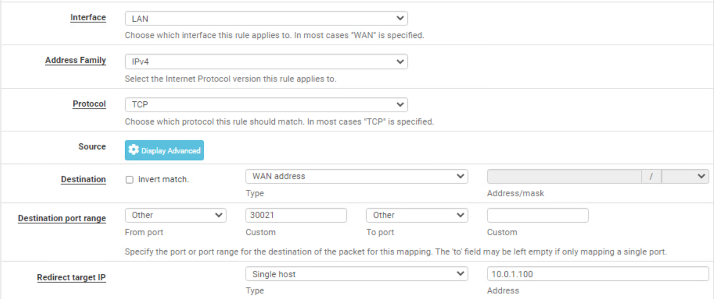
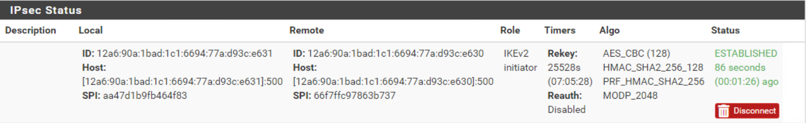

# Never Say SORry Solution

## Securing Datasite1

The recommendation doc is aimed mainly at hardening the FTP service and locking it down to specific ports/accounts.The service also requires port forwarding the FTP traffic through any firewalls over a
standard agreed upon port of 30021 in order to help obfuscate it from
cursory scans. This task is the easiest task to solve, as it is meant to be done first and is the one to be graded first. This should allow teams to test how to verify traffic from their LAN before moving on to more complex tasks.

To begin, the checks that are unknown to the players will verify the following:

1.  Verify that the data record on datasite1 cannot be retrieved
    remotely via FTP with anonymous login

2.  Verify that the data record on datasite1 cannot be retrieved over the standard FTP port of `21`

3.  Verify that the data record on datasite 1 CAN be retrieved with a
    valid and authenticated user via FTP over port `30021`

4.  Verify that the retrieved file has not been altered though integrity
    checks


To prevent the anonymous FTP login, SSH to the datasite1 system at
`10.0.1.100` from any Win10-MGMT or Kali-MGMT system.

Then, simply change the line in the vsftpd config (found at
/etc/vsftpd.conf) that reads "anonymous_login=YES" to
"anonymous_login=NO".


This will prevent check number 1 from succeeding once the service is restarted.

To guarantee that the PASV NAT rule works properly, teams can simply edit the vsftpd config settings to match what is in the NAT rule or vice versa. Editing the config while here is probably easier.

To alter the port forwarding rules, edit the NAT rule listed by clicking
the pencil icon. Then change the 'Destination' port value from 'FTP' to
'Other' and add a value of `30021`.


This should be enough to pass all four checks assuming players have not
moved or modified the data record file located on `10.0.1.100` at
`/home/ftp/storageloc1`.

Players can verify the above steps are working by duplicating the port
forwarding rules and changing the 'Interface' to the 'LAN', keeping all
other settings the same. You will need to change the 'Destination' back to
the 'WAN' address after changing the 'Interface' to 'LAN', as this is
automatic by pfsense.



Repeat the above step for the other port forwarding rule for the PASV
data transfer ports as well by duplicating the rule and then only
changing the 'Interface' to 'LAN'.

*You can repeat this process for any future forwarding rules applied to
the firewall for testing purposes.*

With the above done, players should be able to verify the three
conditions from any Windows10 system by attempting to connect over SSH
(user/tartans) to `10.0.4.1`, attempting to connect via FTP to
`10.0.4.1` without providing credentials, and by successfully connecting
via FTP to `10.0.4.1` with valid credentials (user/tartans). For the
latter two steps, it is recommended to use WinSCP on Windows or FileZilla
on Kali, as this will provide a GUI and allow you to change ports and
protocols easily. Once connected, players should verify that they can
grab the storageloc1 file in the /home/ftp/ directory.


## Securing Datasite2

The team must deploy and configure a new firewall to allow site-to-site
VPN access only between datasite3 and the original firewall. The recommendation guide also specifies changing the SSH port to obfuscate the service similar to datasite1 with FTP.

For this site alone, teams have been provided with access to an internal
system in order to configure the new remote firewall. This firewall can
be accessed from Win10-Site2 via the browser at `http://10.0.2.1`. The
original firewall is still available from any other Win10-MGMT or Kali-MGMT system via
`http://10.0.4.1`.

On the LAN/MGMT FW side (interface at `10.0.2.1`), click on VPN -\> IPSec to perform the initial
configuration. Then click on the green button for "Add P1".

On the following screen, you must configure the following at a minimum:

1. Change the Internet Protocol to 'IPv6'. This is because the remote
gateway is using IPv6.

2. Change the Interface to OPT2 because we are connecting specifically to
site 2.

3. Point the Remote Gateway to `12a6:090a:1bad:01c1:6694:077a:d93c:e631`
    - this is found by looking on the remote fw's interface settings or in the instructions/network map

{width="6.5in" height="2.15625in"}

Teams should generate their own, new pre-shared key. Checks will verify
the key is at least 56-characters in length and the default will match
this requirement.

{width="6.5in" height="0.7430555555555556in"}

Teams must record this key to use on the opposite firewall.

Leave the remaining defaults, click 'Save' at the bottom of the page, and
then apply the changes.

Click the blue "Show Phase 2 Entries" button and then the green "Add P2"
button.

Here's where it can be a little tricky. While the firewalls are using
IPv6 on their interfaces, we are still tunneling traffic between
`129.1.1.1/1` and `10.0.2.0/24`. Therefore, the tunnel mode for the remote
network and the local network must still be set to IPv4. If these do not
match, an error will occur when saving the entry. Since the remote
networks are IPv4, the failure to commit the changes when set to use IPv6
should be a giveaway.

Change the 'Local Network' to 'WAN Subnet' (129.1.1.1/1) and the 'Remote
Network' should be `10.0.2.0/24`.


All other settings can be left as is. Again, Save and Apply the changes.

Next, repeat the steps on Win10-Site2 for the remote firewall at
`http://10.0.2.1`.

Keep in mind the following settings differences:

1.  The Interface for the P1 setting is WAN

2.  The remote gateway is now `12a6:090a:1bad:01c1:6694:077a:d93c:e630`

3.  The pre-shared key must be exactly what was used on the original firewall

4.  The local network for the P2 entry should be LAN subnet

5.  The remote network for the P2 entry should be `129.1.1.1/1`

Assuming you have set up the VPN correctly, on either firewall's web
GUI, browse to Services -\> IPSec.

Then click the green 'Connect VPN' button. The connection should show as
'Established'. Click again if it does not display on the first try. This seems to occur only if done immediately after
finishing the configurations tasks, as they may still be being applied
in the background.



Possible reasons for the VPN to fail are:

1.  The gateway v6 addresses are incorrect or were flipped. 
    - The remote gateway IP is the IP of the opposite firewall

2.  The pre-shared keys do not match

3.  The P2 local or remote networks are not set properly. 
    - The local P2 network is always the remote network for the opposite firewall. 
    - The Protocol must be IPv4.

Once the VPN is established, teams must configure at least two
additional rules on the firewalls. On the original shared firewall,
teams must add the new NAT/forwarding rule for SSH.

Click on Firewall -\> NAT and add a new rule.

Leave all settings as they are except for the following changes:


This will create the forwarding from the WAN-side address to datasite2's
server.

In the new remote site 2 firewall web GUI, add a new rule under the
newly created IPSec heading.

Allow anything to access `10.0.2.100` over SSH. The only traffic that
could be coming in over the IPSec tunnel is traffic we have already
explicitly allowed through the VPN from the other side. 
- NOTE: *The IP in
the following screenshot should read `10.0.2.100`, not `10.0.3.100`*


Teams must also ensure that the SSH access to `129.1.1.1` is not cut off
for grading. SSH is running by default on the original firewall via port
`55555` and is earmarked for grading and not to be touched.


The grading check will first verify that the VPN is established, uses the same
IPv6 addresses as it should, and the pre-shared key is at least 56
characters in length. Next, the grading checks will pull down the file via SSH/SCP over port `22222` with a valid user and verify that the file has not been modified.

## Securing Datasite3

The hosted website about oranges is susceptible to directory traversal in its current
state. The admin(user) has mistakenly made his home directory the
Directory Root for Apache, thus making all of his files accessible over
the web.

The intel tipper will provide logs to this effect. Teams should
investigate the site themselves to see what is doable and what
information might have been inadvertently leaked.

One of the things in user's Documents directory is a backup of the
smb.conf file. Logs would confirm that this directory was accessed by the
aliens.


The conf file provides SMB creds and information on the samba share.


Teams must revert the page back to running from the `/home/user` directory
by replacing the Directory Roots with `/var/www/html` or anywhere else of
their choosing that does not expose this data. This maintains
accessibility to the site, while preventing the traversal attack in the
future. The first grading check performed will verify that traversals
cannot access the storageloc file at `/home/user/share` over port `80`.

SSH into the web server at `10.0.3.100` with user/tartans

You can change the Directory Root by commenting out the `/home/user`
section in `/etc/apache2/apache.conf` and more likely by changing the
paths in `/etc/apache2/sites-available/default-ssl.conf` and
`/etc/apache2/sites-available/000-default.conf`.


Afterwards, restart Apache with the command: 
```
sudo service apache2 restart
```
Verify that the site still comes up when hitting `10.0.3.100` internally, but
that any traversals beyond the page itself result in a 404 message.


Next, teams should change the SMB password for the user account that was
exposed in the leaked `smb.conf` backup file. It does not matter what they
change it to, as long as they know for themselves.

A simple command will take care of it: 
```
smbpasswd user
```  
Remember it is the SMB password that must be changed, not the standard Linux account password.

The next grading check is for the aliens to attempt to get into the SMB
share with the creds they previously recovered, so assuming the password is changed, this will also fail.

Lastly, teams must limit the number of failed logon attempts via SMB to three. This can be done with the pbdedit tool and the following command:
```
pdbedit -P "bad lockout attempt" -C 3
```

Though not required, you could also set the timeout for locked accounts
to something greater than 1 hour for the sake of the exercise, though
the grading script will not check again after the initial brute force
attempt.

When the grading check attempts to login with a valid user, it will try
the wrong password three times and then the correct password on the fourth
attempt. If the above configuration is set, the fourth attempt will
fail as expected. This simulates the aliens brute forcing the password
for that user.

The last check will validate that a different valid user can use `smbget` to retrieve the file
from the WAN and that the file integrity has not been altered.
