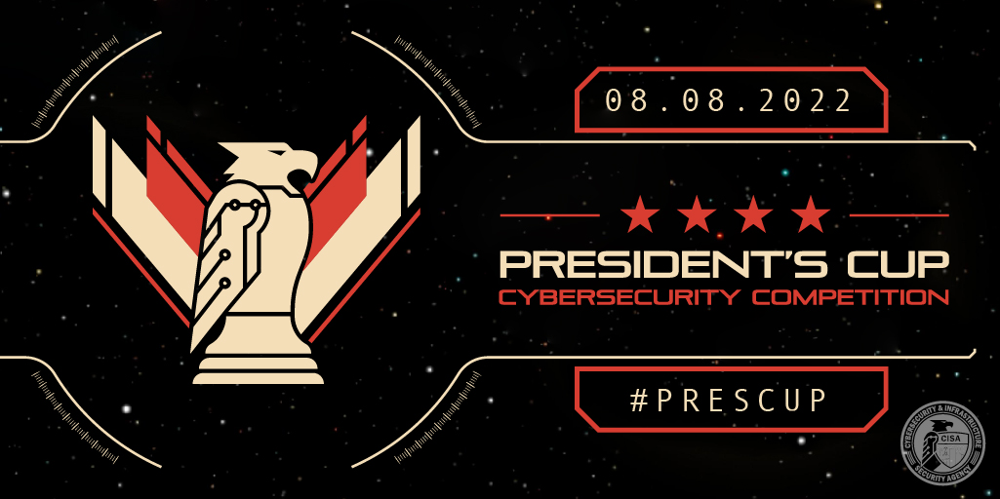

# President's Cup Cybersecurity Competition 2022 Content (Season 4)

## Summary

This directory contains challenge content developed for the 2022 President's Cup Cybersecurity Competition.

## Layout

### `/demo`
The `/demo` directory contains practice challenges designed to introduce competitors to the hosted environment.

### `/{track}`

Competition challenge content can be found in the `/individual-a`, `/individual-b`, and `/team` directories, each mapping to the respective track. Challenge sub-directories in each track follow this format:

```
{round}-{challenge-name}
```

#### `round`
The individuals and teams competitions each contained three successive rounds, with the first round being an open to Federal employees and members of the U.S. military. Each successive round downselected to ultimately determine a winner.

#### `challenge-name`
The challenge name in kebab-case is the final part of the directory name.

### `/vm`
Virtual machine builds for competitor-facing systems can be found in the `/vm` directory.

## License
Copyright 2023 Carnegie Mellon University.  
Released under a MIT (SEI)-style license, please see LICENSE.md in the project root or contact permission@sei.cmu.edu for full terms.
