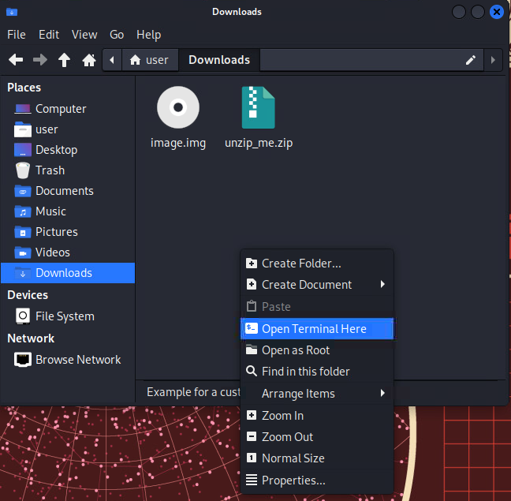
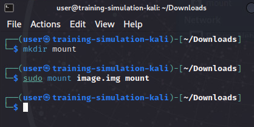
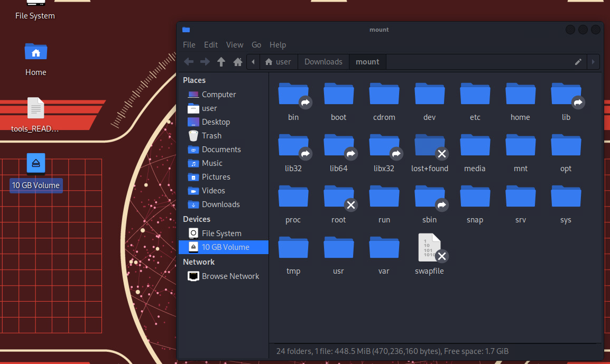
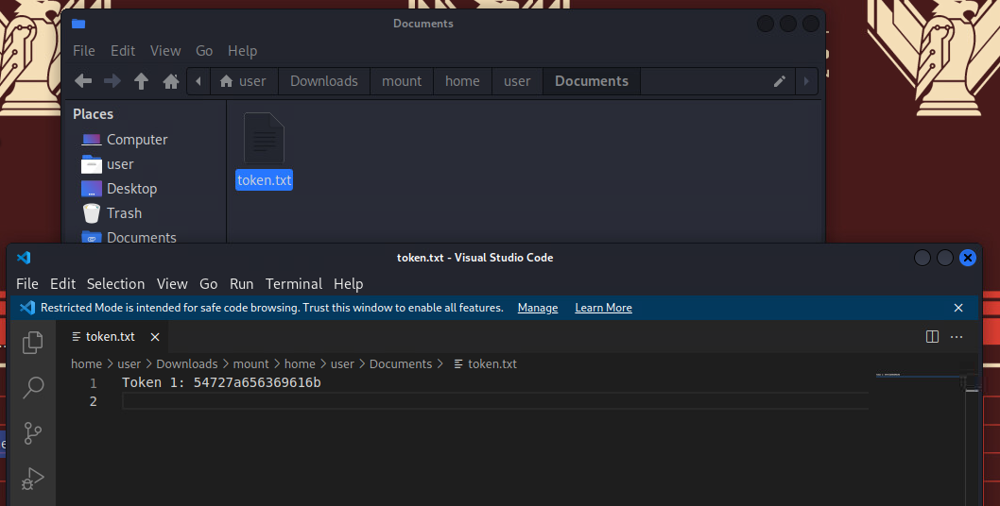
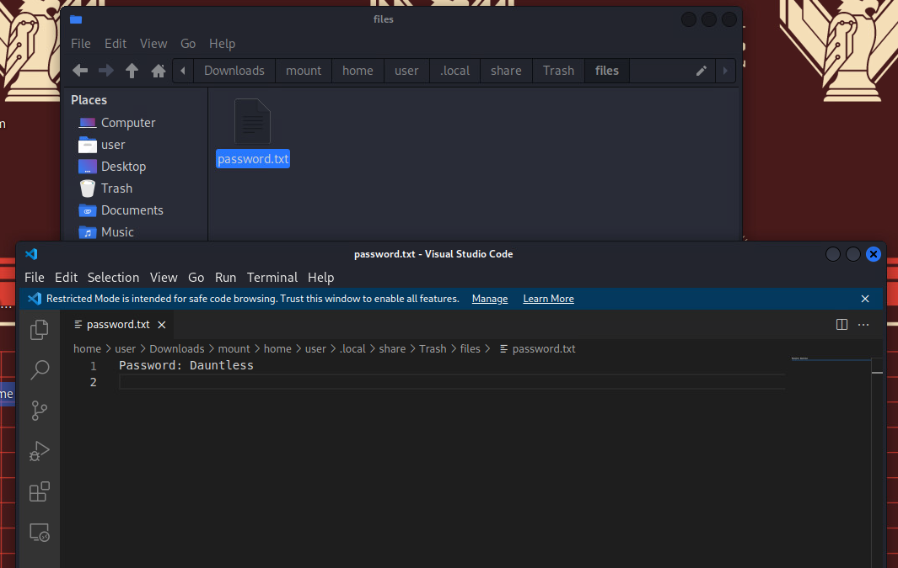
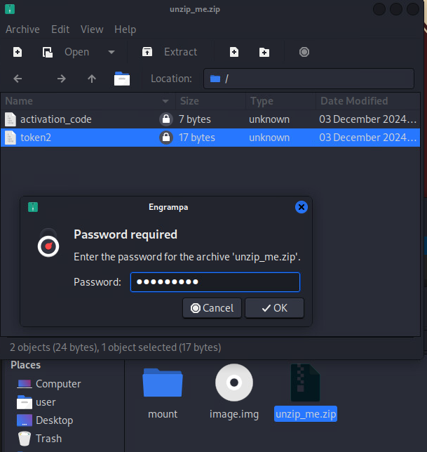
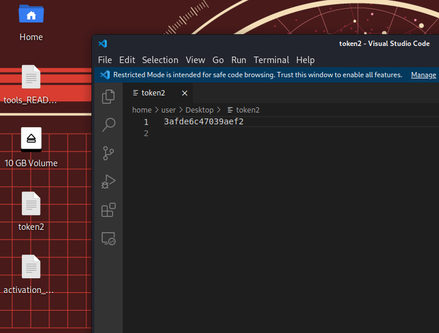
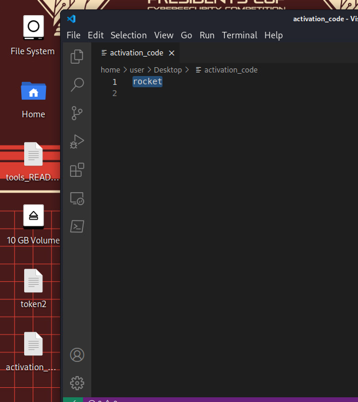
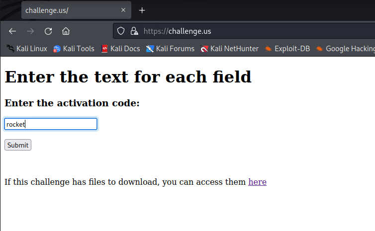
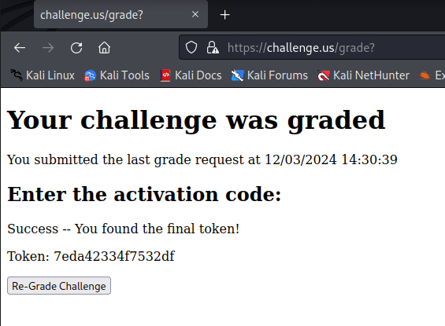

# Pre-launch Training

_Solution_

## Overview
This is a forensic challenge which requires users to find tokens within a forensic image of a virtual machine.

## Question 1

What is the token found within the image file?

- A password protected zip file, `unzip_me.zip`, and a forensic image file, `image.img` are provided.

- After the downloads finish, navigate to the Downloads folder in your file browser. Right click and Open Terminal Here

- Open the image file by running `mkdir mount` followed by `sudo mount image.img mount`.

- A new drive should appear on the desktop named `10 GB Volume`. Double click the drive icon to open it.

- Navigate to `/home/user/Documents` from within that drive's directory.

- The token will be found in a file named `token.txt`. This file contains **Token 1**: `54727a656369616b`.

## Question 2

What is the token found within the zip file?

- Still within the drive used in Question 1, navigate to `/home/user/.local/share/Trash/files` and locate a file named `password.txt`

- Copy the password from `password.txt` and use it to unzip the `unzip_me.zip` file, found on the desktop of the `training-simulation` machine.

- The token file will be found inside of the folder that was just unzipped.

## Question 3

What is the token found on `https://challenge.us`?

- Within the zip file used in Question 2, there is a file named `activation_code.txt`, open the file and copy the text.

- Open Firefox and navigate to `https://challenge.us`.

- Paste the word from `activation_code.txt` in the given text box. This will provide you with **Token 3**.

