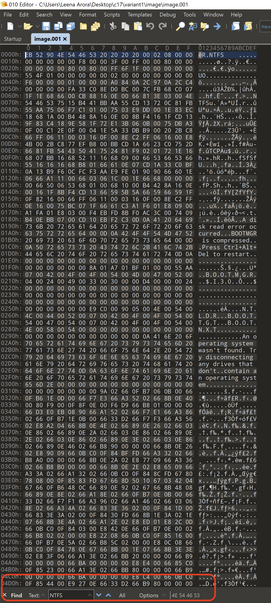
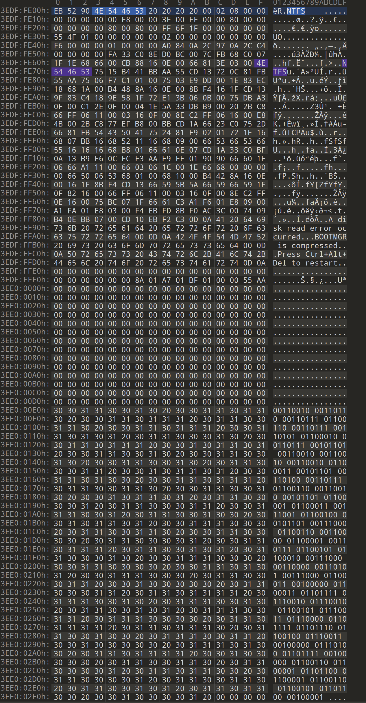
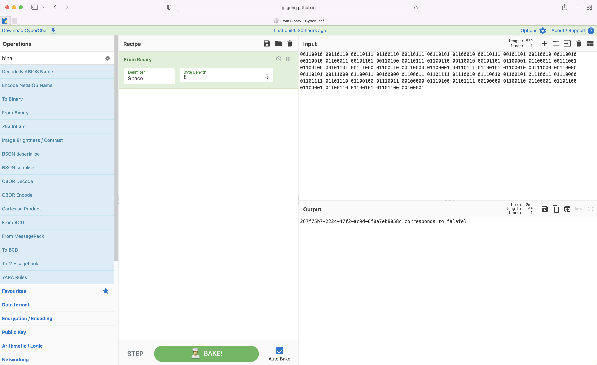
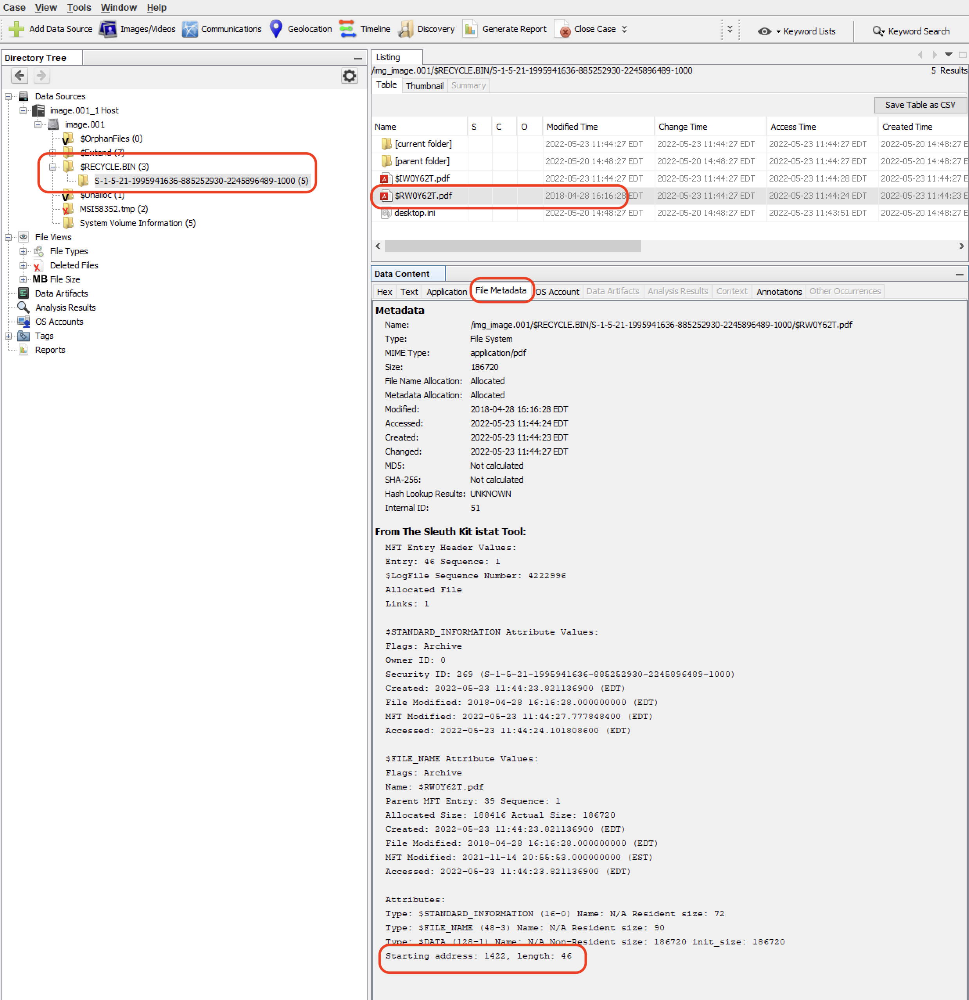
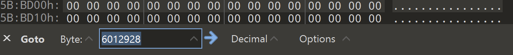
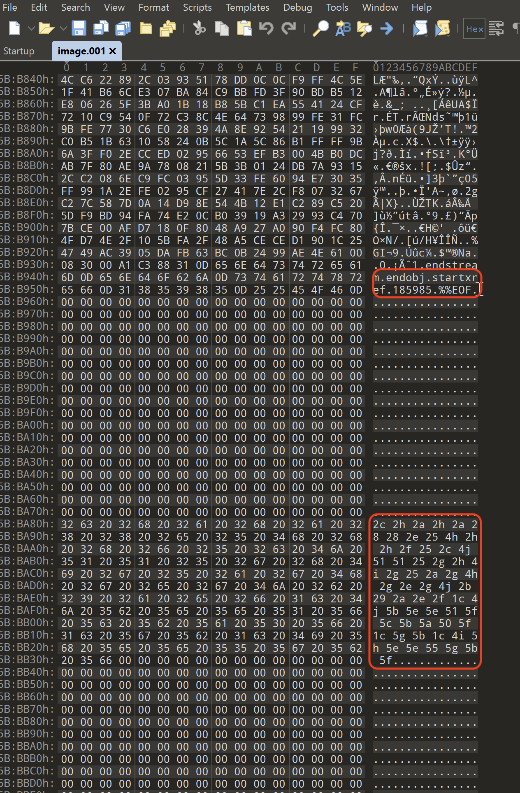
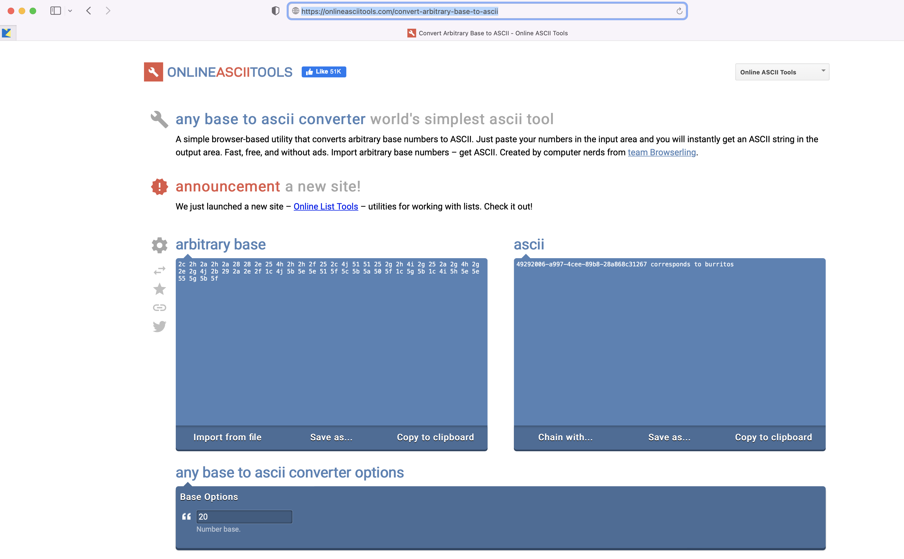
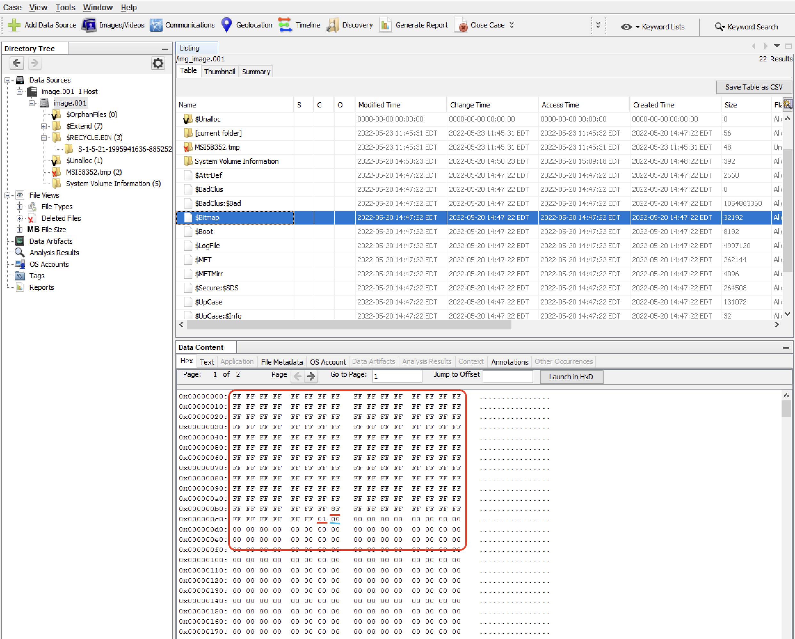
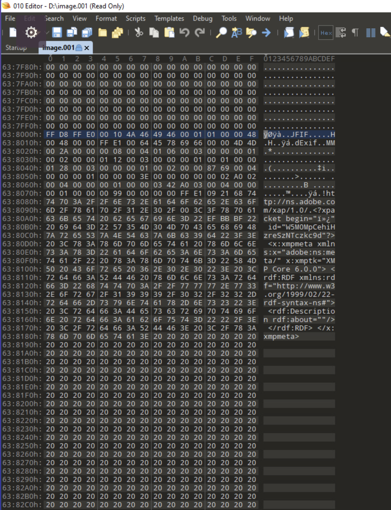
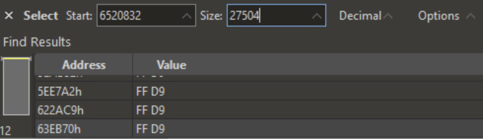

# Hide and Seek

_Solution Guide_

# Overview

For this challenge, you will have to perform forensic analysis on the file system. There are four possible variants for this challenge. This solution guide covers the walk-through for variant #1, organized by submission question. The steps used to solve all variants will be similar, but the answers will vary.

To get started with the challenge, do the following:

1. Open the ISO image in Autopsy.
2. Open the ISO image in 010 hex editor.

## Question 1

_What item corresponds to 267f75b7-222c-47f2-ac9d-8f0a7eb8058c? It is stored next to backup volume boot record._

As the image is opened in Autopsy, you'll notice that it has NTFS file system. The volume boot record should have the word `NTFS` in its first few bytes. 

1. Let's search for `NTFS` in 010 hex editor. Click`Search` > `Find`.
2. In the search bar at the bottom left, search for `NTFS` as a text string.

The results will show five occurrences of NTFS keyboard. The first two are linked to volume boot record and the last two are linked to backup volume boot record. 

3. Click the fourth occurrence. This is the start of backup volume boot record.
4. Scroll down. You'll notice some data in binary after the volume boot record. 

5. Copy that binary data out of the VM.
6. Open CyberChef on your host machine (https://gchq.github.io/CyberChef/)
7. Paste the binary data in the `Input` section. 
8. Select `From Binary` as the recipe. If `Auto Bake` is selected at the bottom, it is going to automatically convert that binary value to text. That's the answer to question 1.

## Question 2

_What item corresponds to 49292006-a997-4cee-89b8-28a868c31267? It is stored in the slack space of deleted pdf file present on the USB._

1. Let's examine the image in Autopsy. Navigate to $RECYCLE.BIN -> S-1-5-21....
2. Click $R....pdf 
3. Review the file metadata in the bottom pane.

4. Note the starting cluster address and length in file metadata section. (1422+46 = 1468)
5. Multiply that by 4096 bytes (1468*4096 = 6012928)
6. Let's navigate to byte offset 6012928. Go back to 010 hex editor. Click `Search` > `Goto`.
7. Type in the byte offset and select `dec` from the drop down for decimal. 

8. This byte offset marks the end of the file. Scroll a bit up. You'll notice the end of the file and some text after it. 

9. Copy the text out. You'll notice it is base20 encoded. 
10. Use an online base20 to ascii converter https://onlineasciitools.com/convert-arbitrary-base-to-ascii

## Question 3

_What item corresponds to c8dea1c0-faba-4aaf-8aae-fc11ea68cbc3? It is stored at the beginning of the 11th unallocated cluster on the image._

To find the 11th unallocated cluster on the image, we need to analyze $BITMAP file present in the root folder. Either we can analyze this file within Autopsy or export it out of Autopsy and open with 010 hex editor.

1. Let's analyze it in Autopsy. 
    

Each bit in the content represents a cluster. If the bit is assigned 1, that means that cluster is allocated. If a bit is assigned 0, it means the cluster is unallocated. Byte 0 is FF which in binary is 11111111. This means clusters 0 - 7 are allocated. All bytes until byte offset 183 (0x0b7) are allocated. Byte offset 183 (highlighted in red) is 8F which is equivalent to 10001111. This means it represents three unallocated clusters. Next, few bytes are again FF until byte offset 198 (0x0c6). Byte offset 198 is also highlighted in red and the value is 01 which is equivalent to 00000001. This means that this byte represents 7 unallocated clusters. The questions is asking for 11th unallocated cluster, so that is represented by byte offset 199 highlighted in blue. To find the cluster number of the 11th unallocated cluster, multiply 199 by 8, which is equal to 1592. To find the byte offset on the disk, multiply 1592 by 4096 (1 cluster = 8 sectors, 1 sector = 512 bytes), which is equal to 6520832. 

2. Navigate to byte offset 6520832 in 010 Editor.

As you would notice that byte offset represents the start of a JPEG file. The JPEG file starts with `FF D8 FF`, has the word `JFIF` in the first few bytes.

Now, we need to find the end of this file. Question says that the file footer/trailer might be missing, but it provides the file size. The file starts at byte offset 6520832. The size of the file is 27506 bytes.

3. To extract this file, click `Edit` -> `Select Range`. Enter start byte offset and the size of the file and make sure to select `Decimal` from the drop down.

 

4. Click Enter. 
5. Right-click the highlighted content, and select `Copy`.
6. Click `File` -> `New` -> `New Hex File`.
7. Paste the highlighted data in this new file. 
8. Save the file as `image.jpeg` on the Desktop.
9. Browse to Desktop and open the file. The answer will be displayed in the picture.
