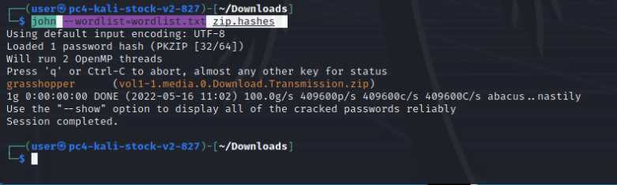

# The Droid You're Looking For 

_Solution Guide_

## Overview
There are four possible variants for this challenge. This solution guide covers the walk-through for variant #1, organized by submission question. The steps used to solve all variants will be similar, but the answers will vary.
To begin the challenge, open the Kali Linux box, then open the image file on the desktop. This guide uses Autopsy to open and analyze the file, but other tools can be used to complete this challenge.
This challenge demonstrates a forensic examination of an Android device using a disk image.

## Answer Quick Reference for Variant #1

The correct answers for variant 1 are:
1. Saint Petersburg
2. Travis Awcock
3. 46674ed225e22efe2c2b04438ef72a40
4. Aishaisp AE-T c3-7
5. brandonrickel56@gmail.com
6. 1088118927580774400
7. 2022-05-27 15:32

## Loading the image into Autopsy on Kali

1. Run Autopsy (Autopsy Forensic Browser) in Kali 
2. Open a web browser and go to: `http://localhost:9999/autopsy`.
3. Select **New Case** and fill in the **Case Name**, **Description**, and **Investigator Names** fields. Select **New Case**, then **Add Host**. In the **Add a New Host** screen, complete the fields if you want to. 
4. Select **Add Host** again, then select **Add Image File**.
   - **Location:** `/home/user/Desktop/andrew.dd`
   - **Type:** Partition
   - **Import Method:** Symlink
5. Select **Next**.
6. Select **Calculate**, then click the **Add** button; all other values can use defaults. 
7. Select **OK**. Then, select **Analyze**.
8. Choose the **Keyword Search** tab. To make searches easier, use the **Extract Strings** and **Extract Unallocated** features. It takes a few minutes, but it indexes all the of the searches so they take less time.

## Question 1 

_There is a photo taken on 12-19-2021.  What city was this taken in?_

1. From the Image Details screen, select **Analyze**. To see photos, select **File Analysis** at the top of the Autopsy screen. Next, we will locate the photo.
2. Navigate to `/media/0/DCIM/Camera`.   You will see a list of photos.
3. Select the **Written** column to sort by date.  Find and select the photo for the date in question.

4. In the pane above the image, select **ASCII Strings display**. This shows the metadata for the file. About nine lines down will be a city name.
 

## Question 2

_What is the full name of the person who texted the device asking "do you have lunch plans?"_

1. Locate **mmssms.db**. In the Android platform, sms messages are stored in **mmssms.db**. You can:
   - perform a file search for this file, 
   - navigate to it at `/user_de/0/com.android.providers.telephony/databases/mmssms.db`, 
   - or try a keyword search for the contents of the message you are looking for. "lunch" for example.
   
   

2. Selecting **ASCII display** on the first result shows the fragment in an unformatted view.

3. Selecting **ASCII Strings display** shows a more readable view. The message referenced in the question is at the bottom of the list of strings.  You can see the phone number is shown above the message: 2562691796.

4. You now need to see whose phone number that is in the contacts list by exporting the database  located at: `/data/com.google.android.gms/databases/icing_contacts.db`.
   - Click **Export**, then **Save File**. 
5. Open the database in **SQLite database browser**.  - You can double click it or right click and select "open with" it should be associated with the correct program
6. Right-click the **contacts** table and select **Browse Table**.  Look in the **phone_numbers** column. You will find that the 256-269-1796 phone number belongs to Travis Awcock.

## Question 3

_What is the MD5 hash of the browser tab that searched for "antiforensic & phone"?_

1. Chrome tabs are located at: `/data/com.android.chrome/app_tabs/0/`. Browse to that directory, then open the different `tab` files. Select **ASCII Strings display**. You can see the `tab3` file contains the Google search we are looking for.
   
   >( You could also do a Keyword Search.)
   
2. Click the inode link (`172749`) for the browser tab file under the **Meta** column:

3. You can get the MD5 hash for the browser tab from this screen.

## Question 4

_The stolen data is the "Ship ports.xlsx file."  What is the system number 7 on the "Ship ports.xlsx" file? (Use entire cell)_

1. The first step is to search using the **Keyword Search** for the file name, You won't see the file if you try to list or sort them as it's inside a zip archive. Click one of the results (**Hex** or **ASCII** does not matter).

   

2. Click one of the **report** links and you'll see the file is located in: `/media/0/Download/Transmission.zip`.

3. Using **File Analysis**, navigate to the file, click on it, and select **Export**. This will allow you to save the file. You can browse to it, unzip it, then try to open it, but it is password protected--so the next step is to crack it with John the Ripper. 
4. Open a terminal window and go to the directory where you downloaded the file.
5. Using John the Ripper, collect hashes from the zip file by running:
`zip2john vol1-1.media.0.Download.Transmission.zip > zip.hashes`
6. Using the provided **wordlist.txt**, crack the **zip.hashes** file by running: 
`john --wordlist=<PATH TO>\wordlist.txt zip.hashes`. This displays the password for the zip file: `grasshopper`.

7. Now, you can open the **.xlsx** file in Kali's included LibreOffice Calc to get the answer.

## Question 5

_The user texted one Dauntless crew mate.  There is one other contact from the same organization. What is the email address of the Dauntless crew mate that was not texted from this device?_

1. To answer Question #5, we'll have to go back to the **icing_contacts.db** and look at the **organization** column in the **contacts** table. 

## Question 6

_The user has an interest in Roblox and searches the topic using various apps. What is the topic_id (from a local application database) for Roblox?_

You can perform a keyword search for the topic of interest. The search should show us a lot of results from Twitter.

1. The database we're interested in is `/data/com.twitter.android/databases/1527673755387953153-61.db`. Extract it, then open it in **DB Browser for SQLite**.
2. You will see a table called **interest_topic**. Right-click and **Browse Table**.  In this table, you can see topics that are being followed via the **is_following** field.

3. Set the **is_following** field filter to `1` and get the **topic_id** for the topic of interest.

## Question 7

_What is the timestamp from when the stolen information was sent to another person in YYYY-MM-DD HH:MM format? (24-hour format UTC -0400)_

1. We can search for the file we know is the stolen data in a keyword search ("Ship ports").  This returns four occurrences.  Click on the **Ascii** link for each to see more information.
2. Aside from the location where **Transmission.zip** file was previously located on the phone in the Download directory, there is a file containing the Ships ports.xlsx located here: `/data/com.fsck.k9/cache/attachment8797437045310624752.tmp`.  Checking the hashes will show it matches the transmission.zip file.

3. Since the file is located in the /data/ directory where other application data is stored, you'll want to check what com.fsck.k9 is. A Google search reveals that K9 is a mail client. In order to find the information about this file you will have to extract and examine the mail client databases located at `/data/com.fsck.k9/databases/`. Export databases and view in DB Browser for SQLite. You can examine both of the .db files, but you'll find the answer is located in the largest database, as there are only a couple spam messages in the other database file.  A good step would be to sort on the **attachment_count** column. 

4. Opening the **.db** in the DB Browser for SQLite shows a list of tables --  one is named **messages**. Right click on it and select **Browse Data**.
5. The message which shows a **subject** of  "Here is the schedule" looks promising.  Additionally, if you have checked the text messages and the phone numbers attached to the user contacts, you will see this user involved in suspicious text exchange.
6. Looking at the columns in the table for this message will show it is a **multipart/mixed** message and it also has an attachment. The **message_part_id** is 64. 

7. You can verify on the **message_parts** table that the messages with the **id** of 64 was sent on Fri, 27 May 2022 15:32 -0400 and the fourth part of the message (looking at lines with the **root** value of 64) is the Transmission.zip attachment file containing the route spreadsheet. 

