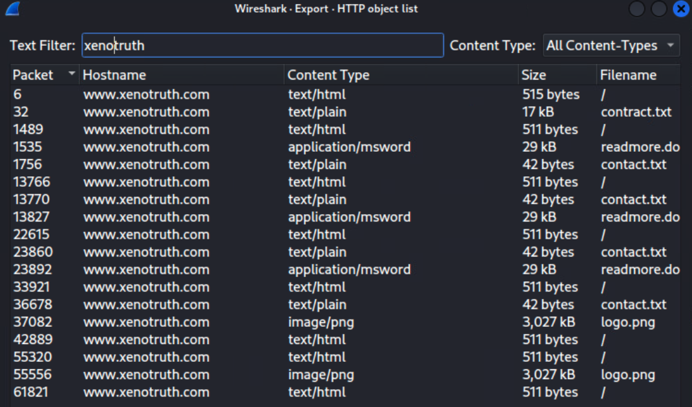

# The Threat Is Coming From Inside The Ship

_Solution Guide_

## Overview

In this challenge, competitors will analyze a packet capture to find downloaded malware, hash it, and then search the file system for a match. Once that is done, they will use an IOC matrix to identify the threat actor involved in the attack. An answer key that lists file variations for the challenge is provided at the end of this solution guide.

## Question 1
_What domain hosted the malware file that was downloaded to the system?_

This question is solved by analyzing the provided packet capture and finding the malware in it, and then identifying the domain the malware was downloaded from.

The challenge guide lists the potentially malicious domains, though only 10 of them will be present in the packet capture. The others are listed simply to expand the possible search area and reduce the likelihood that a player can guess without at least looking at the pcap file.

There are several ways to search for the domain traffic.

-   You can filter the pcap for something like "http.host contains
    \[domainname\]" to see all traffic related to that domain or site.

-   You can view the HTTP objects by going to File -\> Export Objects
    -\> HTTP and then add the domain name into the Text Filter field

-   You may notice that all of the traffic going to the potentially
    malicious domains also comes from the IP 10.0.20.231 and could
    filter just for this IP and then cross filter with each domain

Regardless of how you decide to filter and look at the traffic, the ultimate goal is to find the one file that is accessed or downloaded that is also different or suspicious when compared to the others from these domains. There are three types of files downloaded from these sites: a text file named contact, txt, a doc file named readmore.doc (which are chapters of the second half of War of the Worlds), and a png file named logo.png (which is the President's Cup wallpaper).

One of the files from one of these domains will be named differently and also be a binary at about 17KB in size. The name is slightly obfuscated so it can be tricky to spot, which is intentional.

In the above screengrab, the file of note is "contract.txt". After finding this file you can click Save when looking at it from the view of the HTTP objects.

Note that you can attempt to extract the file from the TCP stream, though this tends to not produce the file itself which would complicate the next part of the challenge. HTTP objects is the way to go and much easier.

However, to answer the first question, all you need to verify is the domain that the malware was downloaded from, which in this case is xenotruth.com. The submission field will accept `xenotruth`, `www.xenotruth.com`, or `xenotruth.com`.

## Question 2
_What is the obfuscated name of the malware file as it exists on the compromised system (extension is not required)?_

The malware file used in part 1 will also be placed on the compromised insider system at challenge start. Players must be careful to extract the file correctly from the packet capture and then figure out the hash, though they may have to think through the process of using the hash to find the file on the system.

It is not necessary to try to reverse of view the contents of the malware unless performing a content search is preferable to a hash search. For the purpose of this guide, it is assumed players will search for the file by hash, similar to how AntiVirus operates, though there may be other ways of finding it. It should be noted that the compromised system is air-gapped, so you cannot copy the extracted malware file to the system to attempt some sort of "find file like this one". A comparison of strings output is another possibility, but likely more time/resource consuming.

Players should investigate this file, but will find it is an executable and cannot be read and that strings output is not helpful either.

In this example, we'll assume the hash of the malware from the pcap is `fe6a2374ab188c9269a8bf9c5395602277817e9a` using sha1 (though you can use any hashing algorithm you like).

Next, players can write a script like the below script to search the filesystem for the matching file. If the results take some time, players can move on to review the IOCs below, but will need to find the malware to verify the calling card image. Hence, while determining which calling card exists cuts the possible threat actors in half, it is entirely dependent on players solving the second part of the challenge first to be sure which exists.

The following is an example script from SuperUser by Kamil Maciorowski:

`hash='fe6a2374ab188c9269a8bf9c5395602277817e9a'`
`find . -type f -exec sh -c '`
`sha1sum "$2" | cut -f 1 -d " " | sed "s|\\\\||" | grep -Eqi "$1"`
`' find-sh "$hash" {} \; -print`

There are other example scripts to be found and used online, or players may write their own.

Once run the file should be found by hash. Keep in mind that the script will need to be run from a top level directory like "/usr/" and may need to be run with sudo permissions. One instance during the solution writing process took roughly 5 minutes to find the file.

In this example, the malware was placed in the /usr/ directory. Depending on where you run the script from, it may take longer to find the file, as the file will not be placed in one of the local user's directories in the production challenge.

In this case, the filename is `ddafc6cce77f.x` and either the full filename with extension or just `ddafc6cce77f` will be accepted. Note that the filename is randomized on each instance, and the directory location is chosen from a list of 10 potential directories at random for each instance. Players can always hash this file separately to be sure it does in fact match.

## Question 3
_Which threat actor is responsible for the malware based on the IOC matrix?_

Players are provided with a Threat Actor Matrix (TAM) as part of the challenge files. This table is represented as a web page where the names are randomly assigned from a list of 50 potential candidates. Ultimately, it does not matter what names appear in the matrix, as long as players identify and submit the corresponding actor to the IOCs found on the system.

The various IOCs in the challenge revolve around items left behind in the same directory as the above discovered malware, checking for specific open ports, and enumerating against a few actions the malware may have taken.

Notably these actions are:

- Deleting the contents of the Document folder
- XOR encrypting the contents of the home folder (text files only to reduce risk of harm to the challenge system)
- Zipping/encrypting the contents of the Pictures directory
- Creating a backup admin user account

To verify whether Documents contents have been deleted simply browse to the directory and check if files persist.

If the folder is empty than this must be true. If the contents were not deleted, the Document folder will look like the following.

To validate whether the home directory contents have been XOR encrypted, simply view the directory and its contents.

In the example above, two .txt files have been XOR'd and are no longer legible. Notice that any non .txt files are left unaltered and legible.

If the files were not altered the contents will look like the following:

To validate whether files in the Pictures directory were zipped, simply look in the directory for the presence of a password protected zip file containing image files.

If the files are not zipped, the directory will look like the following:

To validate whether the backup account was created you can check the shadow file at /etc/shadow for evidence of a new user.

Note that the value of 19132 denotes the number of days since Jan 1, 1970 that this account was created. As this is the most recently created account and looks suspicious by name this is evidence that the malware did create the account.

To validate the presence of the calling card, you must have found the malware location. Alongside the malware will be one of two image files -- one showing oranges, the other showing xenos. This check is a good binary option to weed out half of the possible actors right off the bat.

To validate the open ports simply run \`ss -ano \| grep \[port\#\]\` to see if that port is open. Note that if you do not specify the \`a\` and \`n\` options together you are not going to see results. The fact that one of these ports must be open should tip players off that they may not be using the correct command, or they may use other methods to enumerate this.

Finally, after working through each of these possible IOCs, or after simply eliminating options from the TAM table until only one actor is possible, you can submit the corresponding threat actor's name as the answer.

## Answer Key

| Index value (unknown to player) | Expected Domain to Find | Malware Hash (SHA1)                      | Threat Actor Row |
| :-----------------------------: | :---------------------- | :--------------------------------------- | :--------------: |
|                1                | plentyofxenos.com       | fb9f45ff7e834016fad8bc4bae6d256bb5536fc4 |        1         |
|                2                | xenosdaily.com          | 800867cff2f5a8437f5a9924ee32834301b8a9aa |        3         |
|                3                | xenoliving.com          | 2e34a2cf1567bb34fe55460d6c3539bb3e2da418 |        4         |
|                4                | xenobook.com            | 9a2ffac852c6155cbc9cad09e9cc60aaa044fd6a |        5         |
|                5                | orangeparadise.com      | 0746b204cf225dfd17597385b04347e323191955 |        7         |
|                6                | xenorealty.com          | ce922a23a92bfc6bb8318ca7c8a88ced4ca02b4d |        8         |
|                7                | xenotruth.com           | fe6a2374ab188c9269a8bf9c5395602277817e9a |        10         |
|                8                | justxenos.com           | 6bf4dfd2c7d36ddb2bdd1dd66f8f6d83d152c4a0 |        12         |
|                9                | xenosamongus.com        | 8aa5a5e621b3e1ca30c2932583d65dd251655415 |        13         |
|               10                | xenomingle.com          | 8d3824054130a59a7624a914bde279bf7f75dbcf |        15        |

The **Threat Actor** row above is subject to change as additional chaff rows might be added.

The **Malware** filename will always be randomized.

The malware file is contained in one of these directories at random:

/usr/bin
/usr/sbin
/usr/share/color
/usr/share/dict
/usr/share/fonts
/usr/lib/apt
/usr/lib/Bluetooth
/usr/lib/gcc
/usr/lib/grub
/usr/share/bug
