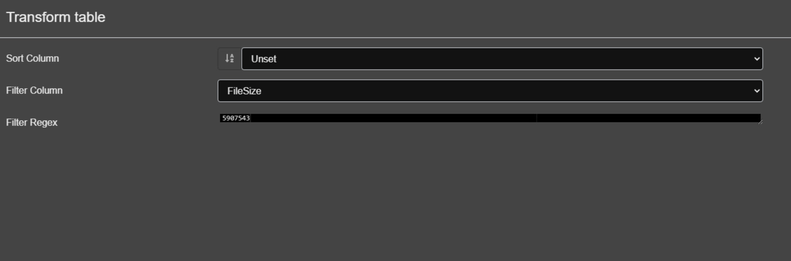

# Velociraptors are Not That Scary

_Solution Guide_

## Overview

For this challenge, you will be using the Velociraptor forensic tool in order to look into a system for specific network traffic/host information. There are four possible variants for this challenge. This solution guide covers the walk-through for variant #1, organized by submission question. The steps used to solve all variants will be similar, but the answers will vary. The following steps will get you started on the challenge. 

1. Login to the `analyst` VM and browse to velociraptor console at https://192.168.1.100:8889.
2. Login as `user/tartans`.
3. Click the drop down menu in the top left corner and select `Show All`.


You'll notice one client system shows up in the list. That is the system that needs to be investigated.

4. Click the Client ID for that system.


Here we can see information about the client system such as the IP of the system, OS, and much more. 

## Question 1

_There is suspicious UDP traffic originating from the system under investigation and destined to port 4444. What is the destination IP for those UDP packets?_

To answer this question, we will need to run a packet capture on the client system. 

1. Click `Collected` in the top left corner.


2. Click the `+` icon to create a new flow.


3. Search for the keyword `packet` in order to look for all artifacts associated with packet capture.

4. Select the `Windows.Network.PacketCapture` artifact as we know our client system is running the Windows operating system. On the right side you'll notice some information about that artifact. Review that information to learn more about this artifact. 


5. Review the different tabs at the bottom and then click `Launch`. This will start the packet capture on the client system. 

6. Review the flow that was just created. You'll notice the flow finished in a few seconds.


It gives the info about the file on the client system to which the traffic/packets are being written. Copy that entire string (path+filename).


7. Let's stop the packet capture. In order to do so, create the same `Windows.Network.PacketCapture` flow again and this time under `Configure Parameters`, uncheck `StartTrace` and provide it with the `TraceFile` that was copied in the previous step. 


8. Click `Launch`. This will start the flow. This flow will stop the packet capture and convert the .etl file to .pcapng and make both files available for us to download.

9. Once the flow is complete, click `Uploaded Files`. You'll notice both the files available for download. 


10. Download both .pcapng and .etl files. Open the .pcapng file with Wireshark present on the `analyst` VM.

11. Search the .pcapng file for `udp && udp.dstport==4444`.


12. Congratulations! The answer to question 1 is `174.216.176.42`.

## Question 2

_Provide the name of the file being exfiltrated in those UDP packets._

To find the answer to this question we need to look for data in the UDP packets and then search for the file on the client system that contains that data. 

1. Select any UDP packet, preferably one with more data bytes in it.

2. Copy the data bytes `as Printable Text`


3. Paste it in notepad or some place on the system. Make sure to get rid of any extra characters that are copied over.

4. Now, you'll create a custom artifact. From the menu located in the top left, click `View Artifacts`.


5. Click the `+` icon to add an artifact.

6. Edit the artifact content to look like the contents below where $a is the string to be searched
```
name: Custom.Artifact.SearchFileContent
description: |
   Search all files for specific SearchFileContent
   
# Can be CLIENT, CLIENT_EVENT, SERVER, SERVER_EVENT
type: CLIENT

sources:
  - precondition:
      SELECT OS From info() where OS = 'windows' 
      
    query: |
      LET YaraRule = '''
      rule string {
          strings: $a = "As you can easily notice the second block of text looks more realistic"
          condition: any of them
      }
      '''
      
      SELECT * FROM foreach(
      row={
          SELECT FullPath FROM glob(globs='''C:\**''')
      }, query={
          SELECT str(str=Strings.Data) AS Hit,
                 String.Offset As Offset,
                 FileName
          FROM yara(files=FullPath, rules=YaraRule)
      })
```

7. Click Save.

8. Now run this artifact on the client system. (Create a flow, select `Custom.Artifact.SearchFileContent` artifact, click Launch)

9. Wait for results to start showing up. This may take a few minutes. The artifact is searching the entire file system for a file that may contain the string that you are searching for. 

10. There will be one file that will show up in the Results tab. That is the answer to this question 2. Congrats!
    
## Question 3

_Provide the name of the executable that is causing data exfiltration._

For this question, we'll analyze the .etl file downloaded earlier using a tool called Perfview, which is present on the Desktop of the `Analyst` VM.

1. Open PerfView.exe from the Desktop of the `Analyst` VM.

2. From the drop down, select the location of the .etl file.


3. Double-click NetTrace.etl file. 

4. Double-click `Events`.


5. In the resultant window, double-click `Microsoft-Windows-NDIS-PacketCapture/PacketFragment`


6. On the right side of the window, search for the event associated with data exfiltration based on the IP addresses we know. Find the processID associated with that event. In this case the process ID is 7692. (It might be different for you)


7. Go back to velociraptor interface, and run the artifact `Windows.System.Pslist` against the client machine.

8.  Search for the process associated with process ID 7692.


Congratulations! You are now able to answer question 3.

## Question 4

_Another copy of the same executable (different filename) is also present on the system. Provide the name of the executable._

In order to answer this question, we need to know the size of the file.  

1. Using Virtual File System, navigate to `C:\ProgramData\Oracle\Java` 

> Note: if nothing appears, refresh the directory. It should then populate with data.

2. Click `javaupdate.exe`, and then click `Collect from the client`. You'll notice that the file is `5907543` bytes in size.


3. Launch the `Windows.NTFS.MFT` artifact against the client system.

4. Filter the results for the file size. Click the filter button.


5. Select `File Column` as `FileSize`, and `Filter Regex` as `5907543`



6. Click Save. You'll notice that one more file shows up. This is the answer to this question. 


Congratulations! You are now able to answer question 4.

## Question 5

_The executable identified in the previous question was renamed on the system. Provide the previous filename of the executable._

For this question, we need to analyze the NTFS USN journal. 

1. Launch the `Windows.Forensics.Usn` artifact against the client system.

2. Filter the results for `mozilla.exe`. (Filter Column as Filename, and Filter Regex as mozilla.exe)

3. Note the MFTId and ParentMFTId for the file. Looks like the MFTID is 132793 and ParentMFTID is 5104.


4. Filter the `Windows.Forensics.Usn` artifact results again, this time for MFTID as 132793.


5. Focus on the enteries where ParentMFTID is 5104.


The previous name is program-v15.exe.

Congratulations! You are now able to complete question 5.
