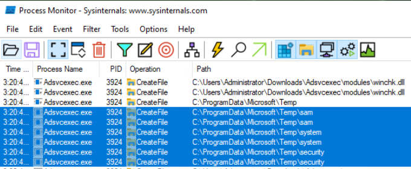
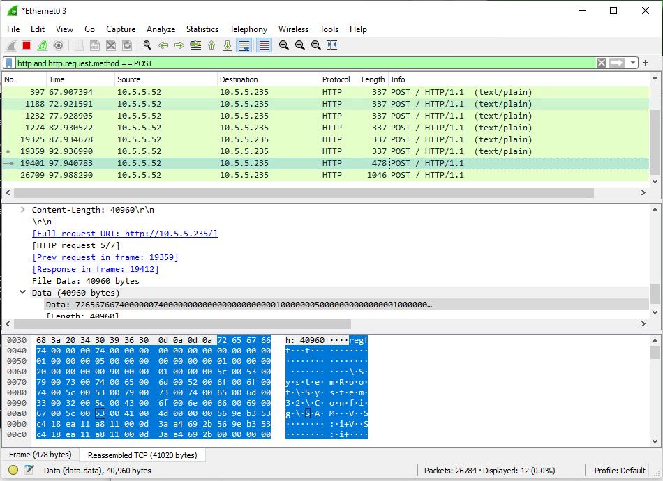

# Yara Ready For This?

_Solution Guide_

## Overview

This solution guide covers the walk-through for _Yara Ready For This?_, organized by submission question. The steps used to solve all challenge instances will be similar, but the answers will vary.

To start the challenge:
1. Open the Windows10 VM.
2. Open the CDROM to find the mounted ISO containing the files needed to perform your analysis.
3. Download the Adsvcexec.zip, SysinternalsSuite.zip and yara-v4.2.2-2012-win64.zip files.
4. Extract them into their own directories. 

Before making any changes it is always a good idea to document the system state before executing an application. Make registry backups, document open ports, existing firewall rules, etc. The first time you execute the Adsvcexec.exe application you will be prompted to allow a firewall change. You should document this change because it will be important later in the challenge.

## Question 1
_What is the filename of the .dll that is downloaded but not used at runtime?_

The **Adsvcexec.exe** application appears to be downloading .dlls to alter its behavior. Not all of the .dlls that it downloads are used. Provide the name of the .dll that gets downloaded, but does not get loaded at runtime.

1. Go to the **Sysinternals** tools folder. Start Process Explorer (procexp64.exe). Take note of the Adsvcexec folder. You are told in the challenge description that it will download DLLs. Keep at eye on the modules folder.
2. Click **View DLLs** button located under the **Process** menu.

3. Start Wireshark. Select the **Ethernet0 3** interface, then begin the packet capture.

4. Browse to folder where you extracted the Adsvcexec application. Start the app by running Adsvcexec.exe from the command line. 
5. Switching back to Wireshark, you will see some HTTP traffic. Set the display filter to **http**. You will notice a list of .dlls that are downloaded. 

6. A search for one of these files will lead you to the modules folder where the Adsvcexec.exe is running.

7. Switch back to Process Explorer and highlight the Adsvcexec.exe so that .dlls are displayed in the lower half of the window.

You will notice that only the following .dlls are shown in Process Explorer: **dnlton.dll**, **eugnxt.dll**, **nxtproc.dll**, **udrvrs.dll**, **winchk.dll**, and **xp32drv.dll**. rstnop.dll was downloaded into the modules folder, but never loaded by the application. **rstnop.dll** is the correct answer.

## Question 2
_What is the 16-character token value of the decryption key?_  

A decryption key is downloaded and stored on the machine at runtime. Provide the 16-character token value. To find the answer to this question use the **Sysinternals Process Monitor (Procmon64.exe)** to watch for registry changes.

1. Start **Procmon64.exe**.
2. Click the filters button (the funnel icon under Tools menu) and add the following three filters:
   - Process Name contains Adsvcexec Include
   - Event Class is Registry Include
   - Operation is RegSetValue Include
   

3. Click **OK**. This should clear any existing events and start the capture. Verify that that events are being captured by making sure that the sqare icon under the **Event** menu is highlighted in blue.
4. Run **Adsvcexec.exe** from the command line.
5. You will notice a value set in **HKCU\SOFTWARE\Microsoft\Fax\UserInfo\runcount**. A quick online search will verify that this key is not normally here.

6. Open Registry Editor and navigate to this key. You will see the runcount value.

7. Run Adsvcexec.exe from the command line again. Refresh the Registry Editor view and note the runcount value will be incremented by 1.
8. Why is this runcount important? Run the app a third time. It looks like our potential malware doesn't give up all of its secrets after just one execution.
9. Once the runcount value is greater than or equal to three (3) we will see an additional value added at: **HKLM\SOFTWARE\Microsoft\Setup\Adsvcexec\decryptionkey**

10. Navigate to the this key in registry editor to retrieve the value of the **decryptionkey**.

The value of **decryptionkey** is the answer to Question 2. Save this value because you will need to use it to decrypt a file discovered later in the challenge.

## Question 3
_Enter the token after decrypting a collection of encrypted files._

A collection of encrypted files are downloaded at runtime. You will need to:
- Find the encrypted files that were downloaded.
- Find the app used to encrypt/decrypt the files.
- Use the decryption key found in Question 2 to decrypt the files and find the token.  

1. Start Wireshark. Select the **Ethernet0 3** interface then begin the packet capture.

2. Run the **Adsvcexec.exe** from the command line. 
3. Switching back to Wireshark, you will see some HTTP traffic. Set the display filter to **http**. You will notice a list of files with a .encrypted extension are downloaded.

4. Search for files with the .encrypted file extension in Windows Explorer. You will find the files in **C:\ProgramData\Windows10\Storage\Data\Temp**, but the contents are encrypted.

5. To decrypt these files you will need to find an application that can help. If you look in Wireshark you will see the directory where these files were downloaded from. Open that directory with a browser: http://10.5.5.173/xkBr34mn0/. 

6. You will see the **EncryptFileContents.zip** file. Download it and extract it. If you run the EncryptFileContents.exe from the command line it will explain the usage.

7. You need to use the decryption key from the registry as part of this solution. While there are multiple files, the **personal.txt.encrypted** file contains the token. Use this command to decrypt the file, replacing `abcd1234abcd1234` with the value of the **decryptionkey** from the registry:
`EncryptFileContents.exe -d C:\ProgramData\Windows10\Storage\Data\Temp\personal.txt.encrypted abcd1234abcd1234`

8. Open the file and retrieve the token.

## Question 4
_Enter a pipe-separated list of the three (3) filenames created as the malware tries to steal password hashes._

We suspect the application is trying to steal Windows password hashes. Provide a pipe-separated list of the names of the three files that are created as part of this effort.

A common method to retrieve password hashes is to start by obtaining a copy of the SAM file. You can use commands such as: **reg save HKLM\SAM**, **reg save HKLM\SYSTEM**, and **reg save HKLM\SECURITY** to backup these keys from the registry, with SAM being an important keyword. Use the **Sysinternals Process Monitor** (Procmon64.exe) to watch for file system changes.  

1. Start **Procmon64.exe**.
2. Click the **filters** button and add the following three filters:
   - Process Name contains Adsvcexec Include
   - Event Class is File System
   - Operation is CreateFile Include

Click **OK**. This should clear any existing events and start the capture. Verify that events are being captured by making sure that the square icon under the Event menu item is highlighted in blue.

3. Run Adsvcexec.exe from the command line. Searching Process Monitor for "SAM" or "sam" will take you to the first result.
  
4. Open Windows Explorer and navigate to the path displayed in Process Monitor (C:\ProgramData\Microsoft\Temp\). Here you will see the three files you are looking for.
  - C:\ProgramData\Microsoft\Temp\sam7576
  - C:\ProgramData\Microsoft\Temp\system7576
  - C:\ProgramData\Microsoft\Temp\security7576
    
5. Additional evidence can been seen in Wireshark when some of the data is posted to http://10.5.5.235.
  

The answer to this question is: `sam7576 | system7576 | security7576`.

The order of the files does not matter; however, you must provide all three file names in a pipe-separated list.

## Question 5 
_What is the port number associated with the firewall rule that the application creates?_  

A firewall rule is created and a port is opened for inbound traffic by one of the application's modules. Confirm this activity and provide the port number.

1. During the first exection of Adsvcexec.exe you will be asked to allow a new firewall rule. Allowing the change to be made is ok because you want to study the functionality of the application.

2. Notice it is asking to allow ncat.exe. If you look at Process Explorer (procexp64.exe) while Adsvcexec.exe is running you will see that it loaded ncat.exe. 

3. Running the `netstat -anob` command will show ncat.exe running and listening on a random port in the 4100 to 4200 range.

4. There is an intentional bug in Adsvcexec.exe that will add another instance of the same firewall rule with the name Network Security Monitor each time it is executed.

5. If you search the windows settings you will see one or more instances of the Network Security Monitor rule with a local port number that matches the port of the ncat.exe listener started by Adsvcexec.exe.

The port number is the answer to this question.

## Question 6
_What is the token that was echoed to a file?_

There is a token that gets echoed to a file. Find the file, open it, and retrieve the token value. Not all file activity is picked up by all tools, even Process Monitor. You can try adding Filters for CreateFile and WriteFile operations, but this one will not show up.

1. Start the Sysinternals Process Monitor (Procmon64.exe).
2. Here we need to create a filter for:
   - Process Name is **cmd.exe**
   - Operation is **Process Start**
   

3. Clear all events, then start Adsvcexec.exe.
4. While Adsvcexec.exe is running review the results.
5. You will see an event with a Detail value similar to the following:
`Parent PID: 5555, Command line: "cmd.exe" /c echo a1b2c3d4 > C:\ProgramData\Microsoft\Search\Data\Applications\Windows\a1b2c3d4.txt`

6. The name of the file is the token with a `.txt` extension.

## Question 7
_Enter the token given by the grading server after your YARA rule has been verified._  

Write a YARA rule to detect the Adsvcexec.exe executable. We will test your rule to make sure it successfully detects this executable without returning false positives. From the gamespace, submit the rule for verification at http://challenge.us. If the rule works, you will be given the final token. You can test multiple submissions as you adjust your rule. Provide the rule as a single line string. Do not include newline characters. 

For example: `rule MyRule { strings: $testString = "suspicious" condition: $testString }`

1. Use the yara64.exe file you downloaded from http://challenge.us/files and extracted from yara-v4.2.2-2012-win64.zip to test your YARA rule. While you can test your rule against the Adsvcexec.exe executable on your local machine you have no way to know what sample files it will be compared with. This indicates that you should use mutltiple values in your comparison or fewer longer runs of hex bytes that will likely differ between executables.
2. You need to create a single rule that can detect the Ansvcexec.exe file without returning true when testing against a collection of unknown sample file.
3. For example, providing this rule will fail because it will return true for both Adsvcexec.exe and one or more sample files.

`rule test_for_Adsvcexec_exe { strings: $string1 = {00 00 00} condition: $string1 }`

Providing this rule will pass because it will return true only for Adsvcexec.exe.

`rule MyRule { strings: $test1 = {48 83 F8 02 72 25 48 8D 47 02 48 89 45 B7 48 8D 45 A7 48 83 FB 10 48 0F 43 45 A7} $test2 = {15 69 83 01 00 48 89 05 9A 34 02 00 48 83 C4 28 C3 CC CC CC CC CC 48 83 EC 28 48 8D 0D 5D 34 02 00} $test3 = {74 0D BA 18 00 00 00 48 8B CF E8 2C 1F 01 00 48 8B 5C 24 30 48 8B C7 48 83 C4 20 5F C3 CC CC CC CC
} condition: $test1 and $test2 and $test3 }`

4. In the gamespace, submit your rule as a single-line string to http://challenge.us to retrieve the final token.
