# For the Memory of a Lifetime

_Solution Guide_

## Overview

This is a memory and registry examination forensic challenge to identify actions taken by users. There are several tools you can use in the challenge but the guide uses **Volatility 3** and **Eric Zimmerman's tools**. Evidence files are found in the Evidence folder. For the purposes of this solution guide, PowerShell is used. 

## Answer Quick Reference

1. dquaid
2. Milena
3. 3
4. DEVICE12
5. Kuato

## Question 1

*Which user was using the Chrome browser when the capture was made?*

To find out who is using Chrome, look at the sessions in the memory dump using Volatility. In a PowerShell prompt, navigate to the volatility3 folder and run this command:

```
.\vol -f C:\Users\Administrator\Desktop\Evidence\memdump.raw windows.sessions |Select-String chrome
```

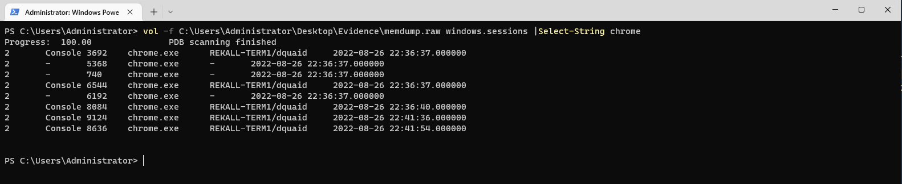

You see that chrome.exe is running under local account dquaid

## Question 2

*Which user visited the Wikipedia page for Methane?*

For this answer, we want the history files.  Since they aren't in the files in the `C:\` folder under "Evidence", we must attempt to pull them from the RAM capture using Volatility.

First, find the process ID (PID) for Chrome. In the volatility folder, run this Powershell command.

```
 .\vol -f C:\Users\Administrator\Desktop\Evidence\memdump.raw windows.pslist |Select-String chrome
```

The results show you that the the PID for Chrome is `3692` and all child processes are spawned from this PID.  In the screen capture below, the furthest number to the left is the PID and the next number is the parent process ID of each instance. 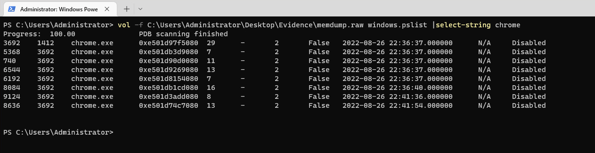

Next, find the handles Chrome is using. The Volatility **windows.handles plugin** will show all the file handles used by Chrome.  To find the history file, we want to filter the results with `Select-String`.

```
.\vol -f C:\Users\Administrator\Desktop\Evidence\memdump.raw windows.handles --pid 3692 |Select-String chrome |Select-String file |Select-String history
```

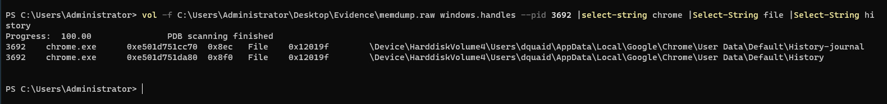

The output shows the memory address.  We'll use the **dump plugin** to pull the file.

Make a place to dump the files to:
```
mkdir C:\users\administrator\desktop\files
```
And, dump the file to that location:

```
 .\vol -f C:\Users\Administrator\Desktop\Evidence\memdump.raw -o "C:\Users\Administrator\Desktop\files\" windows.dumpfile --pid 3692 --virtaddr 0xe501d751da80
```

This puts a file in the folder we just created. 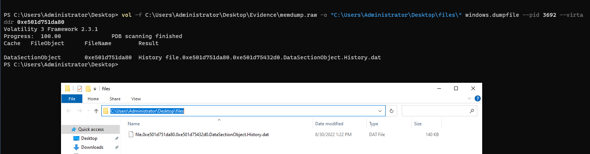

 Open the file in **Notepad** or just run a `findstr` against it using `Methane`.

 ```
 findstr Methane ./file.0xe501d751da80.0xe501d75432d0.DataSectionObject.History.dat
 ```

The site isn't there, so repeat the steps above to try pulling Firefox information from the memory dump, looking for the `places.sqlite` file. The PID is 5572. 
 ```
 .\vol -f C:\Users\Administrator\Desktop\Evidence\memdump.raw windows.handles --pid 5572 |Select-String firefox |Select-String file |Select-String places.sqlite
 ```
 ```
 .\vol -f C:\Users\Administrator\Desktop\Evidence\memdump.raw -o "C:\Users\Administrator\Desktop\files\" windows.dumpfile --pid 5572 --virtaddr 0xe501d9905ed0
 ```
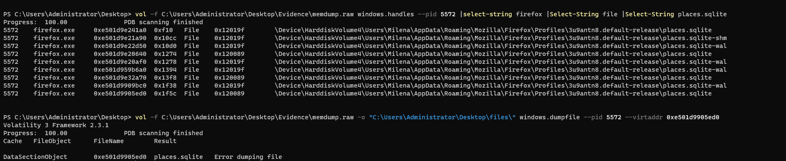

 The command will say there's an `Error dumping file`, but the file can still be opened and read. 
 ```
 findstr Methane C:\Users\Administrator\Desktop\files\file.0xe501d9905ed0.0xe501d9e8e4d0.DataSectionObject.places.sqlite.dat
 ```
 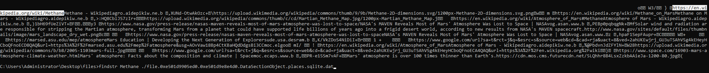

 Using the windows.sessions volatility command from the previous question, you will see Milena was using Firefox.

 ```
 .\vol -f C:\Users\Administrator\Desktop\Evidence\memdump.raw windows.sessions |Select-String Firefox
 ```

## Question 3

*How many USB storage devices have been connected to this machine?*

The number of USB objects connected to this machine is stored in the Windows Registry system hive. Open the **Registry Explorer** app in the **Eric Zimmerman tools\RegistryExplorer** folder on the Desktop.

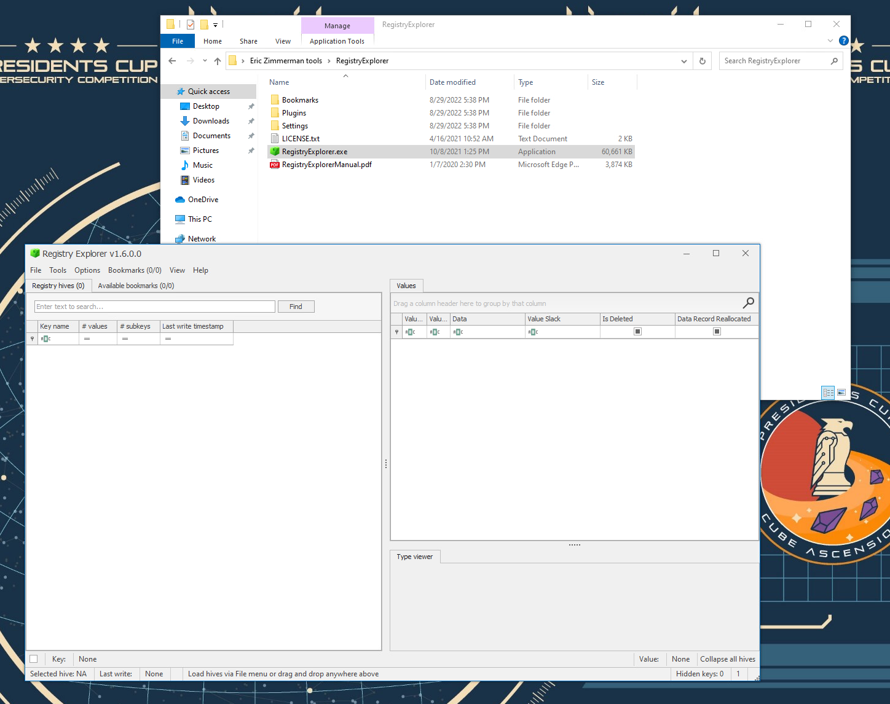

In Registry Explorer, go to **File**, **Load hive**. Browse to and open: 

**C:\Users\Administrator\Desktop\Evidence\2022-08-26T231928_Rekallterm1\C\Windows\System32\config\SYSTEM**

You will get a **Dirty hive detected!** message. Click **Yes**, then **OK**. 

In the next window, select **SYSTEM.LOG1** and **SYSTEM.LOG2** and click **Open**.  

Click **OK**, then choose a place to save the cleaned file: **SYSTEM.clean**.

Select **Yes** to load the updated hive, then **No** to load the dirty hive.

In Registry hives, navigate to **ROOT\ControlSet001\Enum\USBSTOR**. Notice the three drives under the key.  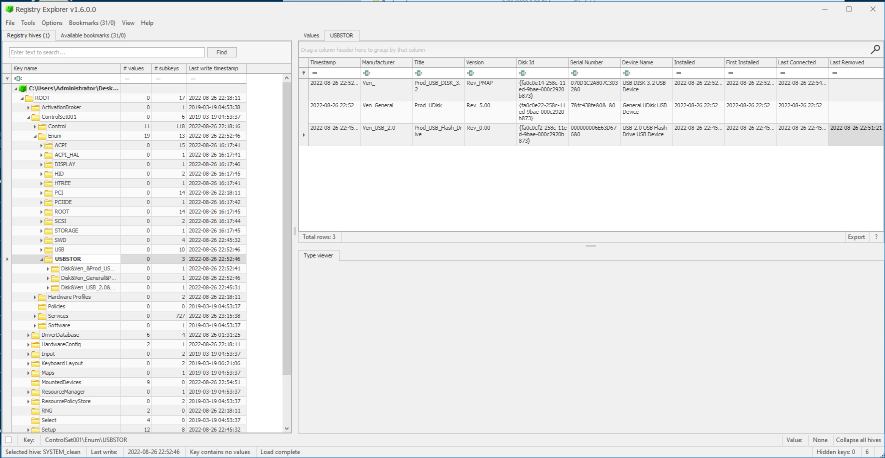

## Question 4

 *What is the volume friendly name of the first USB storage device attached to the machine?*

Select the USBSTOR key and look to the first installed time in the right pane:

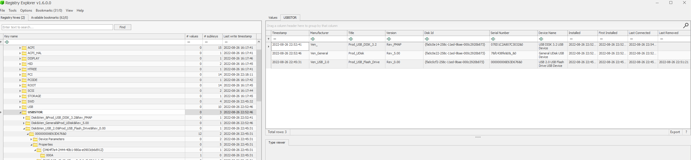

Take note of the **Disk Id** value: **{FA0C0CF2-258C-11ED-9BAE-000C2920B873}**

Next, load the **SOFTWARE** hive following the same procedure as you did for **Question 3** above. 

In the **SOFTWARE** hive, navigate to the **ROOT\Microsoft\Windows Portable Devices\Devices** key and select the key with the matching Disk Id in the name: SWD#WPDBUSENUM#{FA0C0CF2-258C-11ED-9BAE-000C2920B873}#0000000000007E00.

The right pane shows you the **FriendlyName**: DEVICE12.

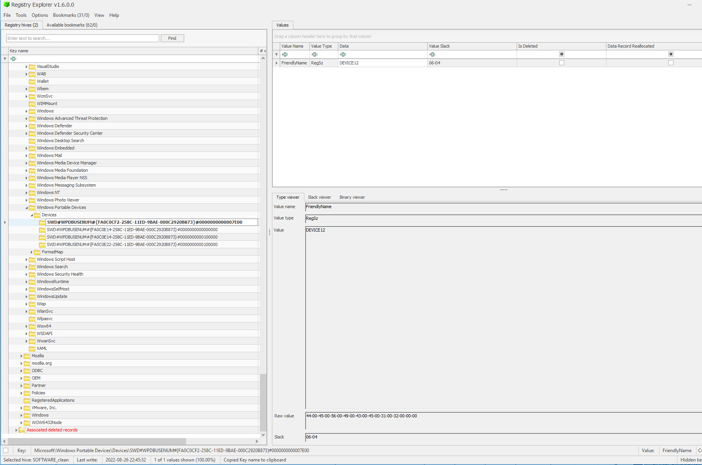

## Question 5

*Which user had connected the first USB storage device?*

In Registry Explorer, load all users' **NTUSER.DAT** files by following the same steps as **Question 3**.  <!--You maye want to flesh this out a little more; not sure though.-->

The users' recent Documents located at: **ROOT\Software\Microsoft\Windows\CurrentVersion\Explorer\RecentDocs** will show that the user "Kuato" is the only account that has accessed DEVICE12.

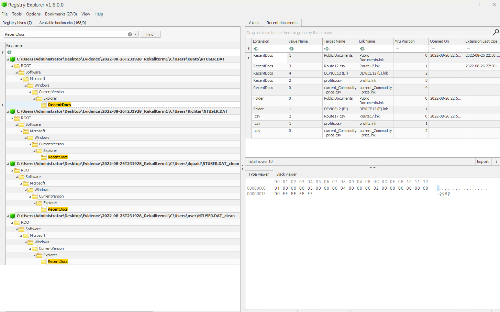
