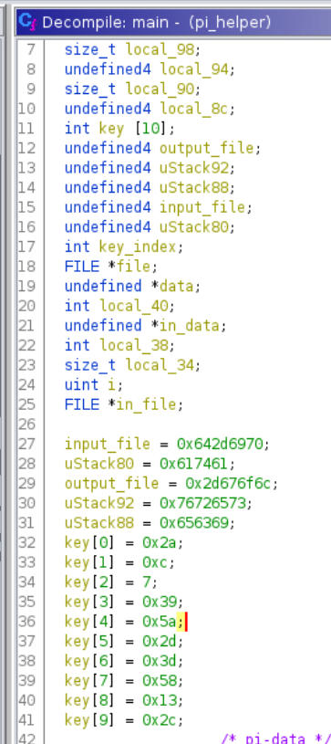

# Night of the Living Raspberries

_Solution Guide_

## Overview

This challenge entails reverse engineering malware in order to answer questions about what it does. There are four possible variants for this challenge. This solution guide covers the walk-through for variant #1, organized by submission question. The steps used to solve all variants will be similar, but the answers will vary. 

To get started, access the malware on the Raspberry Pi. We can ssh into it with the provided credentials, and see that there are two malicious files: `pi-data` and `pi_helper`. If we check the file types, we can see that `pi-data` seems to be garbage data, and `pi_helper` is an ARM binary. If we run the binary, we see that it prints some phrases (and likely does malicious activities in the background).

## Question 1

_What is the full path of the named pipe that the malware makes?_

1. The first step to this challenge is to reverse engineer the `pi_helper` binary. We recommend that a combination of static and dynamic analysis is used. 

2. When running the malware binary on the pi manually, we can see that a few errors are output to the console. These errors indicate that a few files already exist, including one about the inability to create a fifo \[pipe] at a location similar to `/tmp/log-15478/orange-51722`. This is the answer to the first question (remember, there are multiple variants of this challenge, so the answer may be slightly different). This also indicates that the malware has already been run on the system.

## Question 2

_What are the first 4 bytes of the key that the pi_helper binary uses to decode the pi-data?_

1. Next, static analysis is needed to analyze the malware further. Copy the file to the kali machine with `scp pi@raspberry:./pi_helper .` and open the file in Ghidra.

2. Navigating to the `main` function, we can see a lot of strange looking code followed by a file write, execution bit set, and running a program. The `pi_helper` binary is a stager which decrypts the main payload and executes it! We don't see the final `log-service` binary on the pi though, so we can assume it deletes itself to avoid detection.

3. After a bit of careful analysis, we can see that this is simply XORing the `pi-data` file with a fixed key.

With a bit more re-typing and looking at the assembly, we can find the key:

This gives us the solution to the second question. In this case, `0x2a, 0xc, 0x7, 0x39, 0x5a`.

## Question 3

_What port does the malware scan for?_

1. Next, we have a few options to proceed. We can either:
- write a decryptor for the malware with the key, or
- patch the `./pi_helper` binary and remove the line that executes the malware.

In this guide, we'll go with the second option.

2. We can see that the `system` call that executes the malware is at 0x10808. 

>Note: Ghidra adds 0x10000 to addresses by default as the typical base adderess for ELF files in memory is 0x10000.

3. Next, we'll open the binary in a hex editor using `hexeditor ./pi_helper` and navigating to 0x808:

4. We'll change this to a NOP instruction. In ARM, there is no `nop` instruction like x86, but the conventional replacement is `mov r0, r0`, which is represented as opcode `0xe1a00000`. 

5. Save and exit the editor, then scp the binary back to the pi and execute it:

`scp ./pi_helper_patched pi@raspberry:.`

### log-service

6. Running `strings` on the `log-service` binary doesn't seem to yield any useful results, so they are probably obfuscated somehow. Looks like this binary will be much more difficult already...

7. Put the binary into Ghidra. Looking at the function list in Ghidra (or by running `file ./log-service`) we can see that this binary has had its symbols stripped.

8. Find the `main` function by going to `entry` and double clicking on the first parameter of `__libc_start_main`:

9. Looks like there's some obfuscation that make Ghidra unable to automatically find main. Click on the first instruction in the function and either right click and select "Disassemble" or press "d" on your keyboard.

Ah. Looks like there were invalid instructions inserted into the binary that mess with Ghidra. This can still run because of the signal handler at the start of the function. The specifics of this function aren't important to complete the challenge, but it simply handles `SIGILL` signals and skips the instruction, allowing control flow to proceed while confusing decompilers and some debuggers (such as Radare2). 

10. There are a few ways to go forward with this:
- Manually disassemble each block of code (not recommended, as the decompiler will be useless here)
- Write a program to change these invalid instructions into NOPs

We will go with option two here since it will make the rest of the challenge much easier.

Pwntools has the ability to read and edit ELF files directly. We'll use this to de-obfuscate this binary. The completed script used can be found in [deobfuscate.py](./deobfuscate.py)

11. To make ghidra behave better, you can select the entire function in assembly, right click, and click "create function". Most of this main function isn't actually useful for now, but we can still look at this later in the debugger. 

12. At this point, there's a lot of different paths to go down, but a simple way is to look at the use of the SSH functions. In the symbol tree, go into "Imports" and "<EXTERNAL>". You can see that there is a bunch of LibSSH functions used. By looking at the references to these functions, the usages can be found, which helps skipping the numerous rabbit holes in the binary.

13. Looking at `ssh_connect` can help find a function that is connecting to a host via SSH. With a bit of reading the code and the [SSH docs](https://api.libssh.org/master/), you can find the port, which answers Question 3.

### Dynamic Analysis

14. Next, if the connection succeeds, the malware runs some commands on the attacked device.

This is a place we can use dyanmic analysis to get the commands found.

## Question 5

_What 5 passwords does the malware try to log in with? Submit the passwords in a pipe-delimited ("|") list (order does not matter)_

1. Next, we can find where this test_ssh function is used. Right click the name of the function and click "find references" and "show references to test_ssh".

After cleaning up this function, we can clearly see this is where the different passwords are tried. Another place to look at with dynamic analysis later.

Static analysis could be continued at this point, but we have all of the components needed to begin dynamic analysis to decrypt the passwords.

2. Now that we know what to look at while doing dynamic analysis, we can upload our patched binary to the pi and open it in GDB.

3. Break at the start of main (no debugging symbols, so use the addresses from Ghidra!), run the binary, and continue when you reach the SIGILL error. To make it easier to see what's going on, `layout asm` will let you see the assembly code as you debug the program. Since we know exactly where to look, we can make GDB jump to the code segments we want and run the decryption code individually. This can be done with `set $pc = 0xaddress`.

4. Set a breakpoint in the brute_ssh function right when try_ssh is called and then set the `pc` register to the start of the `brute_ssh` function. Run `x/20s $r3` to print out the memory that the passwords are stored in, which provides `password, pass, raspberry, admin, tartans`, which is the solution to Question 5.

## Question 4 

_What is the domain that the malware downloads itself from?_

1. Similarly, for the obfuscated commands, we make a break point right before the commands are used and then set the `pc` register to the start of the `if` statement seen before.

2. Then, run `x/s $r1` to get the final command, containing the domain, which is the answer to Question 4.
